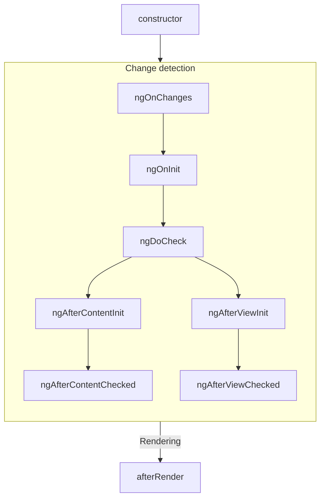
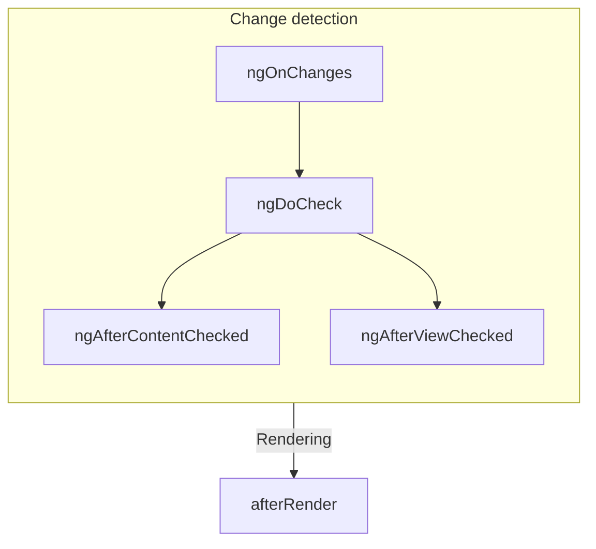

# Component Lifecycle

This guide assumes you've already read the Essentials Guide. Read that first if you're new to Angular.

A component's **lifecycle** is the sequence of steps that occur between its creation and destruction. Each step represents a part of Angular's process for rendering components and checking for updates.

You can implement **lifecycle hooks** in your components to run code during these steps. Lifecycle hooks related to a specific component instance are methods on your component class, while those related to the Angular application as a whole are functions that accept a callback.

Angular checks your components for changes by traversing the application tree from top to bottom, checking template bindings. The lifecycle hooks described below run during this traversal, which visits each component exactly once. Avoid making further state changes during this process.

## Summary

| Phase              | Method                     | Summary                                                                                          |
|--------------------|---------------------------|--------------------------------------------------------------------------------------------------|
| Creation           | constructor               | Standard JavaScript class constructor. Runs when Angular instantiates the component.           |
| Change Detection    | ngOnInit                  | Runs once after Angular has initialized all the component's inputs.                            |
|                    | ngOnChanges               | Runs every time the component's inputs have changed.                                           |
|                    | ngDoCheck                 | Runs every time this component is checked for changes.                                         |
|                    | ngAfterContentInit        | Runs once after the component's content has been initialized.                                   |
|                    | ngAfterContentChecked      | Runs every time this component content has been checked for changes.                            |
|                    | ngAfterViewInit           | Runs once after the component's view has been initialized.                                      |
|                    | ngAfterViewChecked         | Runs every time the component's view has been checked for changes.                              |
| Rendering          | afterNextRender           | Runs once the next time that all components have been rendered to the DOM.                      |
|                    | afterRender               | Runs every time all components have been rendered to the DOM.                                   |
| Destruction        | ngOnDestroy               | Runs once before the component is destroyed.                                                    |

### ngOnInit

The `ngOnInit` method runs after Angular initializes all component inputs with their initial values. It runs exactly once and occurs before the component's template is initialized, allowing you to update the component's state based on initial input values.

### ngOnChanges

The `ngOnChanges` method runs after any component inputs have changed, occurring before the component's template is checked. The first `ngOnChanges` runs before `ngOnInit` during initialization.

#### Inspecting changes

The `ngOnChanges` method accepts a `SimpleChanges` argument, a Record mapping each input name to a `SimpleChange` object, which contains the previous value, current value, and a flag for whether this is the first change.

```ts
@Component({
  /* ... */
})
export class UserProfile {
  @Input() name: string = '';

  ngOnChanges(changes: SimpleChanges) {
    for (const inputName in changes) {
      const inputValues = changes[inputName];
      console.log(`Previous ${inputName} == ${inputValues.previousValue}`);
      console.log(`Current ${inputName} == ${inputValues.currentValue}`);
      console.log(`Is first ${inputName} change == ${inputValues.firstChange}`);
    }
  }
}
```

### ngOnDestroy

The `ngOnDestroy` method runs once just before a component is destroyed, typically when it is no longer shown on the page.

#### DestroyRef

You can also use `DestroyRef` to register a callback for component destruction by calling the `onDestroy` method.

```ts
@Component({
  /* ... */
})
export class UserProfile {
  constructor(private destroyRef: DestroyRef) {
    destroyRef.onDestroy(() => {
      console.log('UserProfile destruction');
    });
  }
}
```

### ngDoCheck

The `ngDoCheck` method runs before every change detection check. Use this hook to manually check for state changes outside of Angular's normal change detection. It runs frequently and can impact performance, so use it sparingly.

### ngAfterContentInit

The `ngAfterContentInit` method runs once after all children nested inside the component have been initialized. You can read the results of content queries here, but changing state in this method results in an ExpressionChangedAfterItHasBeenCheckedError.

### ngAfterContentChecked

The `ngAfterContentChecked` method runs every time the children nested inside the component have been checked for changes. It runs frequently and can impact performance, so use it sparingly. Changing state in this method also results in an ExpressionChangedAfterItHasBeenCheckedError.

### ngAfterViewInit

The `ngAfterViewInit` method runs once after all children in the component's template have been initialized. You can read the results of view queries here, but changing state results in an ExpressionChangedAfterItHasBeenCheckedError.

### ngAfterViewChecked

The `ngAfterViewChecked` method runs every time the children in the component's template have been checked for changes. It runs frequently and can impact performance, so use it sparingly. Changing state in this method results in an ExpressionChangedAfterItHasBeenCheckedError.

### afterRender and afterNextRender

The `afterRender` and `afterNextRender` functions allow you to register a render callback after Angular has finished rendering all components into the DOM. These functions are standalone and must be called in an injection context, typically a component's constructor.

Render callbacks do not run during server-side rendering or build-time pre-rendering.

#### afterRender phases

You can split work into phases when using `afterRender` or `afterNextRender` to control the sequencing of DOM operations.

```ts
import {Component, ElementRef, afterNextRender} from '@angular/core';

@Component({...})
export class UserProfile {
  private prevPadding = 0;
  private elementHeight = 0;

  constructor(elementRef: ElementRef) {
    const nativeElement = elementRef.nativeElement;

    afterNextRender({
      write: () => {
        const padding = computePadding();
        const changed = padding !== prevPadding;
        if (changed) {
          nativeElement.style.padding = padding;
        }
        return changed;
      },
      read: (didWrite) => {
        if (didWrite) {
          this.elementHeight = nativeElement.getBoundingClientRect().height;
        }
      }
    });
  }
}
```

There are four phases:

- `earlyRead`: Read layout-affecting properties and styles.
- `mixedReadWrite`: Default phase for operations needing both read and write.
- `write`: Write layout-affecting properties and styles.
- `read`: Read layout-affecting properties.

## Lifecycle interfaces

Angular provides TypeScript interfaces for each lifecycle method. You can import and implement these interfaces to ensure correct implementation.

```ts
@Component({
  /* ... */
})
export class UserProfile implements OnInit {
  ngOnInit() {
    /* ... */
  }
}
```

## Execution order

### During initialization



### Subsequent updates



### Ordering with directives

When using directives on the same element as a component, the framework does not guarantee any ordering of lifecycle hooks between the component and directives. Avoid depending on observed ordering, as it may change in future Angular versions.