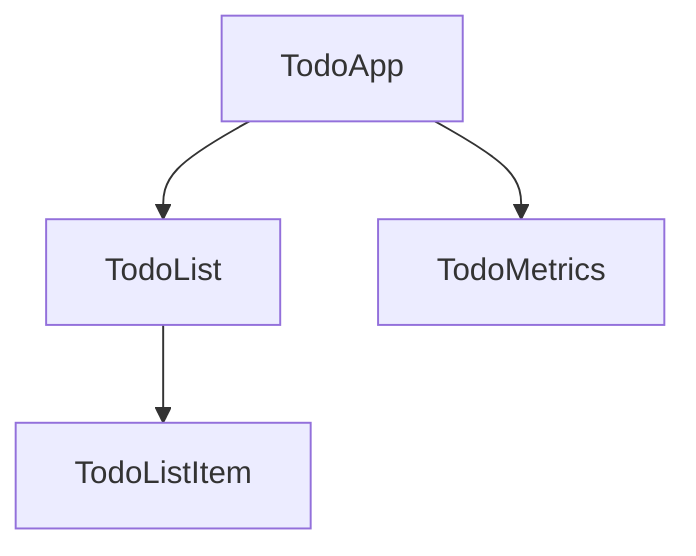

# Components

The fundamental building block for creating applications in Angular. Components provide structure for organizing your project into easy-to-understand parts with clear responsibilities, ensuring maintainable and scalable code.

## Example Component Structure

A Todo application can be broken down into a tree of components:



## Defining a Component

Every component has the following core properties:

1. A `@Component` decorator that contains configuration.
2. An HTML template that controls rendering into the DOM.
3. A CSS selector that defines how the component is used in HTML.
4. A TypeScript class for behaviors like managing state, handling user input, or fetching data.

### Example: TodoListItem Component

```angular-ts
// todo-list-item.component.ts
@Component({
  selector: 'todo-list-item',
  template: `
    <li>(TODO) Read Angular Essentials Guide</li>
  `,
})
export class TodoListItem {
  /* Component behavior is defined here */
}
```

### Additional Metadata

- `standalone: true` — Streamlines the authoring experience of components.
- `styles` — A string or array of strings for CSS styles applied to the component.

### Updated TodoListItem Component

```angular-ts
// todo-list-item.component.ts
@Component({
  standalone: true,
  selector: 'todo-list-item',
  template: `
    <li>(TODO) Read Angular Essentials Guide</li>
  `,
  styles: `
    li {
      color: red;
      font-weight: 300;
    }
  `,
})
export class TodoListItem {
  /* Component behavior is defined here */
}
```

### Separating HTML and CSS

For teams preferring separate files for HTML and CSS, use `templateUrl` and `styleUrl`.

```angular-ts
// todo-list-item.component.ts
@Component({
  standalone: true,
  selector: 'todo-list-item',
  templateUrl: './todo-list-item.component.html',
  styleUrl: './todo-list-item.component.css',
})
export class TodoListItem {
  /* Component behavior is defined here */
}
```

```angular-html
<!-- todo-list-item.component.html -->
<li>(TODO) Read Angular Essentials Guide</li>
```

```css
/* todo-list-item.component.css */
li {
  color: red;
  font-weight: 300;
}
```

## Using a Component

Component architecture allows modular applications. To use a component:

1. Import the component into the file.
2. Add it to the component's `imports` array.
3. Use the component's selector in the `template`.

### Example: TodoList Component

```angular-ts
// todo-list.component.ts
import {TodoListItem} from './todo-list-item.component.ts';

@Component({
  standalone: true,
  imports: [TodoListItem],
  template: `
    <ul>
      <todo-list-item></todo-list-item>
    </ul>
  `,
})
export class TodoList {}
```

## Next Step

Now that you know how components work in Angular, learn how to add and manage dynamic data in your application.

Managing Dynamic Data: essentials/managing-dynamic-data