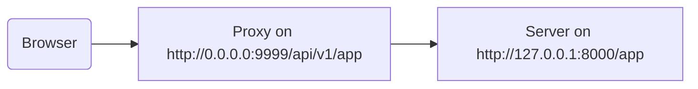

# Behind a Proxy

In some situations, you might need to use a proxy server like Traefik or Nginx with a configuration that adds an extra path prefix that is not seen by your application. In these cases, you can use `root_path` to configure your application.

The `root_path` is a mechanism provided by the ASGI specification (that FastAPI is built on, through Starlette) and is used to handle these specific cases. It is also used internally when mounting sub-applications.

## Proxy with a Stripped Path Prefix

Having a proxy with a stripped path prefix means that you could declare a path at `/app` in your code, but then add a layer on top (the proxy) that would put your FastAPI application under a path like `/api/v1`. In this case, the original path `/app` would actually be served at `/api/v1/app`, even though all your code is written assuming there's just `/app`.

The proxy would be "stripping" the path prefix on the fly before transmitting the request to the app server (probably Uvicorn via FastAPI CLI), keeping your application convinced that it is being served at `/app`, so you don't have to update all your code to include the prefix `/api/v1`.

However, when you open the integrated docs UI, it would expect to get the OpenAPI schema at `/openapi.json`, instead of `/api/v1/openapi.json`. The frontend needs to fetch the OpenAPI schema at `/api/v1/openapi.json`.



The IP `0.0.0.0` is commonly used to mean that the program listens on all the IPs available in that machine/server.

The docs UI would also need the OpenAPI schema to declare that this API server is located at `/api/v1`. For example:

```json
{
    "openapi": "3.1.0",
    "servers": [
        {
            "url": "/api/v1"
        }
    ],
    "paths": {
        // More stuff here
    }
}
```

In this example, the "Proxy" could be something like Traefik, and the server would be something like FastAPI CLI with Uvicorn, running your FastAPI application.

### Providing the `root_path`

To achieve this, you can use the command line option `--root-path`:

```console
$ fastapi run main.py --root-path /api/v1
INFO:     Uvicorn running on http://127.0.0.1:8000 (Press CTRL+C to quit)
```

If you use Hypercorn, it also has the option `--root-path`.

### Checking the Current `root_path`

You can get the current `root_path` used by your application for each request; it is part of the `scope` dictionary (that's part of the ASGI spec). Here we are including it in the message just for demonstration purposes.

```Python
{!../../docs_src/behind_a_proxy/tutorial001.py!}
```

If you start Uvicorn with:

```console
$ fastapi run main.py --root-path /api/v1
INFO:     Uvicorn running on http://127.0.0.1:8000 (Press CTRL+C to quit)
```

The response would be something like:

```json
{
    "message": "Hello World",
    "root_path": "/api/v1"
}
```

### Setting the `root_path` in the FastAPI App

Alternatively, if you don't have a way to provide a command line option like `--root-path`, you can set the `root_path` parameter when creating your FastAPI app:

```Python
{!../../docs_src/behind_a_proxy/tutorial002.py!}
```

Passing the `root_path` to FastAPI would be equivalent to passing the `--root-path` command line option to Uvicorn or Hypercorn.

### About `root_path`

Keep in mind that the server (Uvicorn) won't use that `root_path` for anything else than passing it to the app. If you go to http://127.0.0.1:8000/app, you will see the normal response:

```json
{
    "message": "Hello World",
    "root_path": "/api/v1"
}
```

Uvicorn will expect the proxy to access it at http://127.0.0.1:8000/app, and then it would be the proxy's responsibility to add the extra `/api/v1` prefix on top.

## About Proxies with a Stripped Path Prefix

A proxy with a stripped path prefix is only one of the ways to configure it. In many cases, the default will be that the proxy doesn't have a stripped path prefix. In such a case, the proxy would listen on something like `https://myawesomeapp.com`, and if the browser goes to `https://myawesomeapp.com/api/v1/app`, the proxy (without a stripped path prefix) would access Uvicorn at the same path: `http://127.0.0.1:8000/api/v1/app`.

## Testing Locally with Traefik

You can easily run the experiment locally with Traefik. Download Traefik, it's a single binary; you can extract the compressed file and run it directly from the terminal. Then create a file `traefik.toml` with:

```toml
[entryPoints]
  [entryPoints.http]
    address = ":9999"

[providers]
  [providers.file]
    filename = "routes.toml"
```

This tells Traefik to listen on port 9999 and to use another file `routes.toml`.

Now create that other file `routes.toml`:

```toml
[http]
  [http.middlewares]
    [http.middlewares.api-stripprefix.stripPrefix]
      prefixes = ["/api/v1"]

  [http.routers]
    [http.routers.app-http]
      entryPoints = ["http"]
      service = "app"
      rule = "PathPrefix(`/api/v1`)"
      middlewares = ["api-stripprefix"]

  [http.services]
    [http.services.app]
      [http.services.app.loadBalancer]
        [[http.services.app.loadBalancer.servers]]
          url = "http://127.0.0.1:8000"
```

This file configures Traefik to use the path prefix `/api/v1`. Traefik will redirect its requests to your Uvicorn running on `http://127.0.0.1:8000`.

Now start Traefik:

```console
$ ./traefik --configFile=traefik.toml
INFO[0000] Configuration loaded from file: /home/user/awesomeapi/traefik.toml
```

And now start your app, using the `--root-path` option:

```console
$ fastapi run main.py --root-path /api/v1
INFO:     Uvicorn running on http://127.0.0.1:8000 (Press CTRL+C to quit)
```

### Check the Responses

Now, if you go to the URL with the port for Uvicorn: http://127.0.0.1:8000/app, you will see the normal response:

```json
{
    "message": "Hello World",
    "root_path": "/api/v1"
}
```

Notice that even though you are accessing it at `http://127.0.0.1:8000/app`, it shows the `root_path` of `/api/v1`, taken from the option `--root-path`.

Now open the URL with the port for Traefik, including the path prefix: http://127.0.0.1:9999/api/v1/app. You get the same response:

```json
{
    "message": "Hello World",
    "root_path": "/api/v1"
}
```

The idea is that everyone would access the app through the proxy, so the version with the path prefix `/api/v1` is the "correct" one. The version without the path prefix (http://127.0.0.1:8000/app) is exclusively for the proxy (Traefik) to access it.

### Check the Docs UI

The "official" way to access the app would be through the proxy with the path prefix. If you try the docs UI served by Uvicorn directly, without the path prefix in the URL, it won't work, because it expects to be accessed through the proxy. 

You can check it at http://127.0.0.1:8000/docs. 

But if you access the docs UI at the "official" URL using the proxy with port `9999`, at `/api/v1/docs`, it works correctly!

This is because FastAPI uses this `root_path` to create the default `server` in OpenAPI with the URL provided by `root_path`.

## Additional Servers

By default, FastAPI will create a `server` in the OpenAPI schema with the URL for the `root_path`. You can also provide other alternative `servers`, for example, if you want the same docs UI to interact with both a staging and a production environment. If you pass a custom list of `servers` and there's a `root_path`, FastAPI will insert a "server" with this `root_path` at the beginning of the list.

```Python
{!../../docs_src/behind_a_proxy/tutorial003.py!}
```

Will generate an OpenAPI schema like:

```json
{
    "openapi": "3.1.0",
    "servers": [
        {
            "url": "/api/v1"
        },
        {
            "url": "https://stag.example.com",
            "description": "Staging environment"
        },
        {
            "url": "https://prod.example.com",
            "description": "Production environment"
        }
    ],
    "paths": {
        // More stuff here
    }
}
```

In the docs UI at http://127.0.0.1:9999/api/v1/docs, it would show the auto-generated server with a `url` value of `/api/v1`, taken from the `root_path`.

### Disable Automatic Server from `root_path`

If you don't want FastAPI to include an automatic server using the `root_path`, you can use the parameter `root_path_in_servers=False`:

```Python
{!../../docs_src/behind_a_proxy/tutorial004.py!}
```

And then it won't include it in the OpenAPI schema.

## Mounting a Sub-Application

If you need to mount a sub-application while also using a proxy with `root_path`, you can do it normally, as you would expect. FastAPI will internally use the `root_path` smartly, so it will just work.