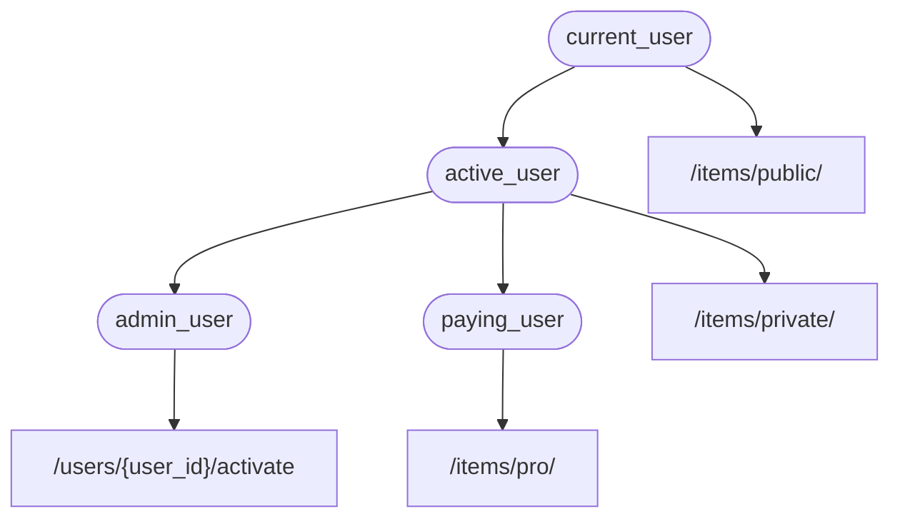

# Dependencies

**FastAPI** features a powerful and intuitive **Dependency Injection** system, designed for easy integration of components.

## What is "Dependency Injection"

"Dependency Injection" allows your code (specifically, your *path operation functions*) to declare required dependencies. **FastAPI** manages the provision of these dependencies, which is useful for:

- Shared logic
- Database connections
- Security and authentication
- Minimizing code repetition

## First Steps

### Create a Dependency

A dependency is a function that accepts parameters similar to a *path operation function*.

```Python
# Example for Python 3.10+
def common_parameters(q: str = None, skip: int = 0, limit: int = 100):
    return {"q": q, "skip": skip, "limit": limit}
```

This dependency expects:
- An optional query parameter `q` (type `str`)
- An optional query parameter `skip` (type `int`, default `0`)
- An optional query parameter `limit` (type `int`, default `100`)

It returns a `dict` with these values.

**Note:** FastAPI added support for `Annotated` in version 0.95.0. Upgrade to at least 0.95.1 to use `Annotated`.

### Import `Depends`

```Python
from fastapi import Depends
```

### Declare the Dependency

Use `Depends` in your *path operation function* parameters:

```Python
@app.get("/items/")
async def read_items(commons: dict = Depends(common_parameters)):
    return commons
```

**FastAPI** will:
- Call the dependency function with the correct parameters
- Assign the result to the parameter in your *path operation function*

## Share `Annotated` Dependencies

To reduce code duplication, you can store `Annotated` values in a variable:

```Python
from fastapi import Depends
from typing import Annotated

Commons = Annotated[dict, Depends(common_parameters)]
```

This preserves type information for autocompletion and inline errors.

## To `async` or Not to `async`

You can define dependencies using either `async def` or `def`. **FastAPI** handles both seamlessly.

## Integrated with OpenAPI

All request declarations, validations, and requirements of your dependencies are integrated into the OpenAPI schema, enhancing interactive documentation.

## Simple Usage

*Path operation functions* are called by **FastAPI** when a matching path and operation occur. With Dependency Injection, you can specify additional dependencies that **FastAPI** will execute before your function.

## **FastAPI** Plug-ins

Integrations can be built using the Dependency Injection system, allowing for numerous interactions with minimal code.

## **FastAPI** Compatibility

The simplicity of the dependency injection system ensures compatibility with:
- Relational databases
- NoSQL databases
- External packages and APIs
- Authentication and authorization systems
- Monitoring systems
- Response data injection systems

## Simple and Powerful

The hierarchical dependency injection system is simple yet powerful, allowing for dependencies to define their own dependencies. **FastAPI** resolves all dependencies and sub-dependencies automatically.

For example, different permission requirements can be added to various API endpoints using dependencies:



## Integrated with **OpenAPI**

Dependencies add parameters and validations to your *path operations*, which **FastAPI** incorporates into the OpenAPI schema for interactive documentation.