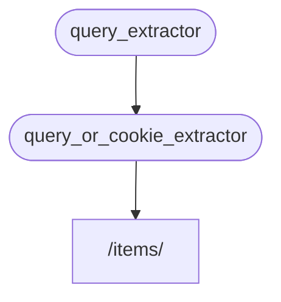

# Sub-dependencies

You can create dependencies that have sub-dependencies, which can be as deep as needed. FastAPI will handle resolving them.

## First Dependency: "dependable"

You can create a first dependency ("dependable") as follows:

**Python 3.10+**
```Python
{!> ../../docs_src/dependencies/tutorial005_an_py310.py!}
```

**Python 3.9+**
```Python
{!> ../../docs_src/dependencies/tutorial005_an_py39.py!}
```

**Python 3.8+**
```Python
{!> ../../docs_src/dependencies/tutorial005_an.py!}
```

**Python 3.10 non-Annotated**
> Prefer to use the `Annotated` version if possible.
```Python
{!> ../../docs_src/dependencies/tutorial005_py310.py!}
```

**Python 3.8 non-Annotated**
> Prefer to use the `Annotated` version if possible.
```Python
{!> ../../docs_src/dependencies/tutorial005.py!}
```

This dependency declares an optional query parameter `q` as a `str` and returns it. This example is simple but illustrates how sub-dependencies work.

## Second Dependency: "dependable" and "dependant"

You can create another dependency function (a "dependable") that also declares its own dependency (making it a "dependant"):

**Python 3.10+**
```Python
{!> ../../docs_src/dependencies/tutorial005_an_py310.py!}
```

**Python 3.9+**
```Python
{!> ../../docs_src/dependencies/tutorial005_an_py39.py!}
```

**Python 3.8+**
```Python
{!> ../../docs_src/dependencies/tutorial005_an.py!}
```

**Python 3.10 non-Annotated**
> Prefer to use the `Annotated` version if possible.
```Python
{!> ../../docs_src/dependencies/tutorial005_py310.py!}
```

**Python 3.8 non-Annotated**
> Prefer to use the `Annotated` version if possible.
```Python
{!> ../../docs_src/dependencies/tutorial005.py!}
```

Parameters declared:
- This function is a dependency ("dependable") and also declares another dependency, depending on `query_extractor` and assigning its value to `q`.
- It declares an optional `last_query` cookie as a `str`. If no query `q` is provided, it uses the last query saved in a cookie.

## Use the Dependency

You can use the dependency as follows:

**Python 3.10+**
```Python
{!> ../../docs_src/dependencies/tutorial005_an_py310.py!}
```

**Python 3.9+**
```Python
{!> ../../docs_src/dependencies/tutorial005_an_py39.py!}
```

**Python 3.8+**
```Python
{!> ../../docs_src/dependencies/tutorial005_an.py!}
```

**Python 3.10 non-Annotated**
> Prefer to use the `Annotated` version if possible.
```Python
{!> ../../docs_src/dependencies/tutorial005_py310.py!}
```

**Python 3.8 non-Annotated**
> Prefer to use the `Annotated` version if possible.
```Python
{!> ../../docs_src/dependencies/tutorial005.py!}
```

Notice that only one dependency is declared in the path operation function, `query_or_cookie_extractor`. FastAPI will resolve `query_extractor` first and pass its results to `query_or_cookie_extractor`.



## Using the Same Dependency Multiple Times

If a dependency is declared multiple times for the same path operation, FastAPI will call that sub-dependency only once per request. It will cache the returned value and pass it to all dependants needing it in that request. 

To call the dependency at every step in the same request instead of using the cached value, set `use_cache=False` when using `Depends`:

**Python 3.8+**
```Python
async def needy_dependency(fresh_value: Annotated[str, Depends(get_value, use_cache=False)]):
    return {"fresh_value": fresh_value}
```

**Python 3.8+ non-Annotated**
> Prefer to use the `Annotated` version if possible.
```Python
async def needy_dependency(fresh_value: str = Depends(get_value, use_cache=False)):
    return {"fresh_value": fresh_value}
```

## Recap

The Dependency Injection system is simple, consisting of functions similar to path operation functions. It allows for arbitrarily deeply nested dependency graphs. 

This may seem less useful with simple examples, but its utility will become apparent in chapters about security and the code it can save.