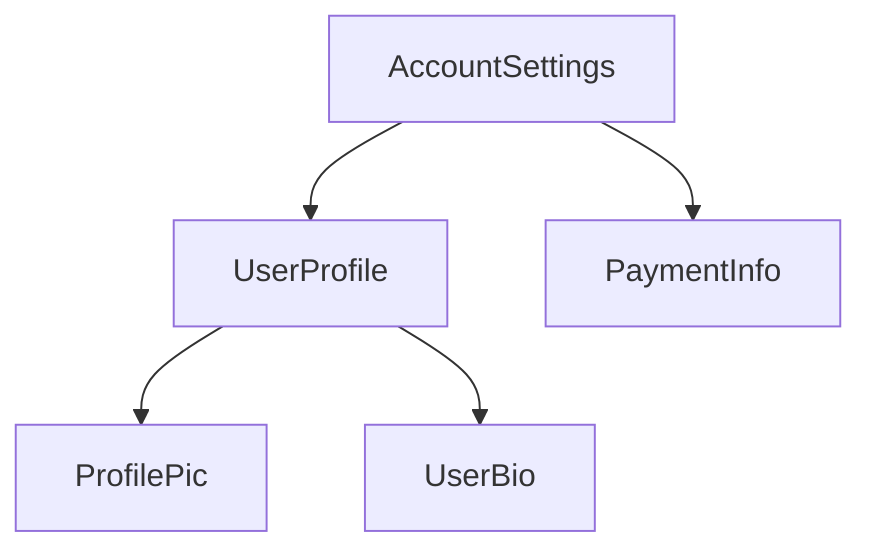
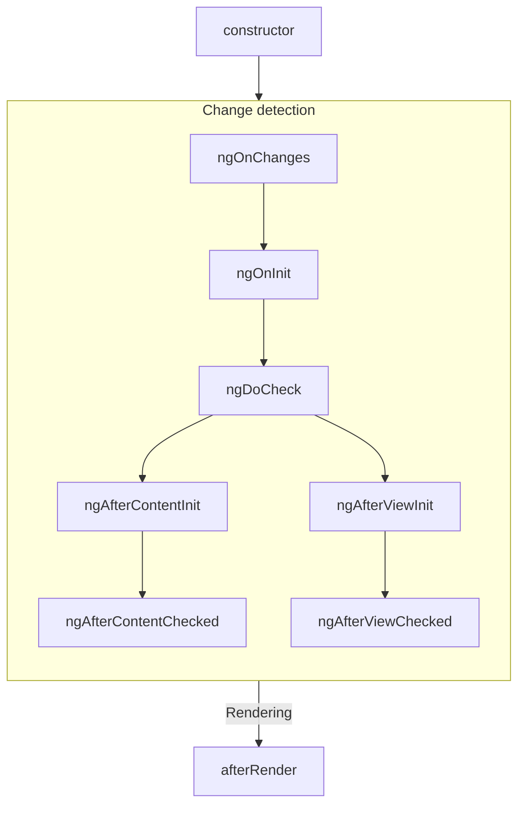
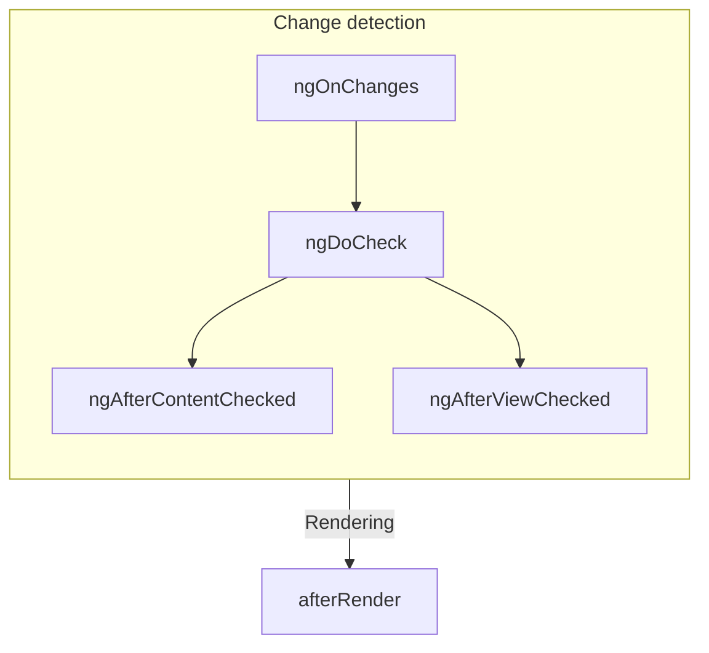
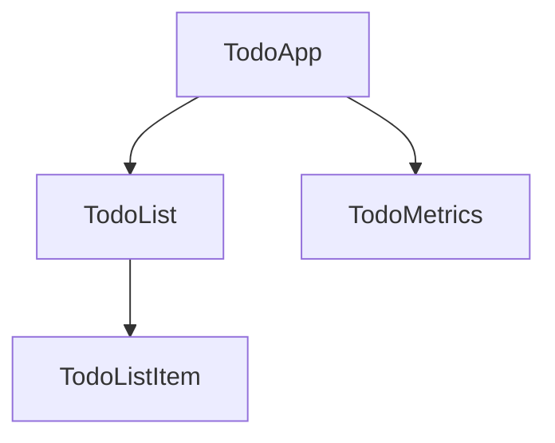

# Complex animation sequences

Angular allows for coordinated animation sequences, enabling animations for entire grids or lists of elements as they enter and leave a page. You can run multiple animations in parallel or sequentially.

## Functions for Complex Animations

- **`query()`**: Finds one or more inner HTML elements.
- **`stagger()`**: Applies a cascading delay to animations for multiple elements.
- **`group()`**: Runs multiple animation steps in parallel.
- **`sequence()`**: Runs animation steps one after another.

## The `query()` Function

The `query()` function is essential for complex animations, allowing you to find child elements and apply animations. Examples include:

- `query()` followed by `animate()`: Queries simple HTML elements and applies animations.
- `query()` followed by `animateChild()`: Queries child elements with their own animation metadata.

The first argument of `query()` is a CSS selector string, which can include Angular-specific tokens:

- `:enter`, `:leave`: For entering/leaving elements.
- `:animating`: For elements currently animating.
- `@*`, `@triggerName`: For elements with any or a specific trigger.
- `:self`: The animating element itself.

**Note**: Not all child elements are considered entering/leaving. For more information, refer to the query API docs.

## Animate Multiple Elements with `query()` and `stagger()`

Use `query()` to find elements entering the page and `stagger()` to define a timing gap between animations. For example:

- Query elements entering the page.
- Set initial styles (transparent, transformed).
- Use `stagger()` to delay each animation by 30 milliseconds.
- Animate each element for 0.5 seconds with a custom easing curve.

## Parallel Animation with `group()`

To animate multiple properties of the same element in parallel, use the `group()` function. This function groups animation steps rather than elements. For example, apply two independent animations to the same element using `group()` for both `:enter` and `:leave`.

## Sequential vs. Parallel Animations

To create animations that occur one after the other, use the `sequence()` function. Within `sequence()`, use:

- `style()`: Applies styling data immediately.
- `animate()`: Applies styling data over a time interval.

## Filter Animation Example

In the example page under the Filter/Stagger tab, entering text in the **Search Heroes** box filters the list in real time. The `filterAnimation` trigger in the HTML template contains three transitions, performing the following tasks:

- Skips animations on initial page load.
- Filters heroes based on search input.
- Hides elements leaving the DOM by setting opacity and width to 0.
- Animates elements entering the DOM over 300 milliseconds with a staggered delay of 50 milliseconds.

## Animating Items in a Reordering List

To animate items in an `*ngFor` list when their order changes, assign a `TrackByFunction` to the `NgForOf` directive. This ensures Angular tracks elements correctly, allowing for proper animations.

## Animations and Component View Encapsulation

Angular animations do not directly consider View Encapsulation. Components using `ViewEncapsulation.Emulated` behave as if using `ViewEncapsulation.None`. However, `ViewEncapsulation.ShadowDom` can interfere with animations due to its DOM structure. Avoid applying animations to views with ShadowDom encapsulation.

## Animation Sequence Summary

Angular animations start with `query()` to find inner elements, followed by `stagger()`, `group()`, and `sequence()` to control animation steps.

## More on Angular Animations

You might also be interested in:

- Introduction to Angular animations
- Transition and triggers
- Reusable animations
- Route transition animations

# Introduction to Angular animations

Animation provides the illusion of motion by changing the styling of HTML elements over time. Well-designed animations enhance user experience by:

- Preventing abrupt transitions between web pages
- Allowing users to perceive application responses to their actions
- Intuitively directing user attention where needed

Animations typically involve multiple style transformations, such as moving, changing color, growing or shrinking, fading, or sliding elements. Angular's animation system leverages CSS functionality, enabling animation of any animatable property, including positions, sizes, transforms, and colors. A list of animatable properties can be found on the W3C's CSS Transitions page.

## About this guide

This guide introduces basic Angular animation features to help you integrate animations into your project.

## Getting started

The primary Angular modules for animations are `@angular/animations` and `@angular/platform-browser`. To add animations to your project, import the necessary modules along with standard Angular functionality.

### Enabling the animations module

Import `provideAnimationsAsync` from `@angular/platform-browser/animations/async` and add it to the providers list in the `bootstrapApplication` function call.

```typescript
bootstrapApplication(AppComponent, {
  providers: [
    provideAnimationsAsync(),
  ]
});
```

**Important:** For immediate animations upon application load, use `provideAnimations` from `@angular/platform-browser/animations` instead of `provideAnimationsAsync`.

For `NgModule` based applications, import `BrowserAnimationsModule` to introduce animation capabilities into your Angular root application module.

### Importing animation functions into component files

If you plan to use specific animation functions in component files, import them from `@angular/animations`.

See all available animation functions at the end of this guide.

### Adding the animation metadata property

In the component file, add a metadata property called `animations:` within the `@Component()` decorator to define the animation trigger.

### Animating a transition

To animate a transition, specify that a button displays either **Open** or **Closed** based on user actions. For example, in the `open` state, the button is visible and yellow, while in the `closed` state, it is translucent and blue.

Use the `style()` function to specify CSS styles for animations, collecting styles in an animation state with names like `open` or `closed`.

**Helpful:** Create a new `open-close` component to animate with simple transitions by running:

```shell
ng g component open-close
```

### Animation state and styles

Use Angular's `state()` function to define different states for transitions. This function takes a unique name and a `style()` function to define styles associated with that state.

### Transitions and timing

Define an animation *transition* to specify changes between states over time using the `transition()` function, which accepts two arguments: a direction expression and one or more `animate()` steps.

The `animate()` function defines the length, delay, and easing of a transition, and can include `keyframes()` for multi-step animations.

#### Animation metadata: duration, delay, and easing

The `animate()` function accepts `timings` and `styles` input parameters. The `timings` parameter can be a number or a string defined in three parts:

```typescript
animate (duration)
```

or

```typescript
animate ('duration delay easing')
```

The first part, `duration`, is required and can be expressed in milliseconds or seconds. The second argument, `delay`, has the same syntax as `duration`. The third argument, `easing`, controls the animation's acceleration and deceleration.

**Helpful:** See the Material Design website's topic on Natural easing curves for general information on easing curves.

### Triggering the animation

An animation requires a *trigger* to know when to start. The `trigger()` function collects states and transitions, giving the animation a name to attach to the triggering element in the HTML template.

### Defining animations and attaching them to the HTML template

Define animations in the component's metadata under the `animations:` property within the `@Component()` decorator. Attach the trigger to an element in the template using Angular property binding syntax.

```typescript
<div [@triggerName]="expression">…</div>;
```

The animation executes when the expression value changes to a new state.

**Helpful:** Use `*ngIf` with the animation trigger in the HTML template for conditional animations.

### Code review

Here are the code files discussed in the transition example.

### Summary

You learned to add animation to a transition between two states using `style()` and `state()` along with `animate()` for timing. Explore more advanced features in Angular animations under the Animation section.

## Animations API summary

The `@angular/animations` module provides a domain-specific language (DSL) for creating and controlling animations in Angular applications. See the API reference for a complete listing and syntax details of core functions.

| Function name                     | Description                                                                                                                                                                                                |
|:---                               |:---                                                                                                                                                                                                         |
| `trigger()`                       | Initiates the animation and serves as a container for other animation function calls. Binds to `triggerName` in the HTML template. Uses array syntax. |
| `style()`                         | Defines one or more CSS styles for animations. Controls visual appearance during animations. Uses object syntax.                                                                 |
| `state()`                         | Creates a named set of CSS styles for successful transition to a given state. The state can be referenced by name in other animation functions.                              |
| `animate()`                       | Specifies timing information for a transition, with optional values for `delay` and `easing`. Can include `style()` calls.                                                                            |
| `transition()`                    | Defines the animation sequence between two named states. Uses array syntax.                                                                                                                                 |
| `keyframes()`                     | Allows sequential style changes within a specified time interval. Use within `animate()`. Can include multiple `style()` calls within each `keyframe()`.                       |
| `group()`                         | Specifies a group of animation steps to run in parallel. Continues only after all inner animation steps complete. Used within `sequence()` or `transition()`.     |
| `query()`                         | Finds one or more inner HTML elements within the current element.                                                                                                                                           |
| `sequence()`                      | Specifies a list of animation steps that run sequentially.                                                                                                                                  |
| `stagger()`                       | Staggers the starting time for animations for multiple elements.                                                                                                                                            |
| `animation()`                     | Produces a reusable animation that can be invoked from elsewhere. Used with `useAnimation()`.                                                                                                      |
| `useAnimation()`                  | Activates a reusable animation. Used with `animation()`.                                                                                                                                                    |
| `animateChild()`                  | Allows animations on child components to run within the same timeframe as the parent.                                                                                                                    |

## More on Angular animations

**Helpful:** Check out this presentation shown at the AngularConnect conference in November 2017, and the accompanying source code.

You might also be interested in the following:

- Transition and triggers
- Complex animation sequences
- Reusable animations
- Route transition animations

# Reusable animations

This topic provides examples of creating reusable animations.

## Create reusable animations

To create a reusable animation, use the `animation()` function to define an animation in a separate `.ts` file and declare this animation definition as a `const` export variable. You can then import and reuse this animation in any of your application components using the `useAnimation()` function.

In the code snippet, `transitionAnimation` is made reusable by declaring it as an export variable.

**Helpful:** The `height`, `opacity`, `backgroundColor`, and `time` inputs are replaced during runtime.

You can also export a part of an animation. For example, the following snippet exports the animation `trigger`.

From this point, you can import reusable animation variables in your component class. For example, the following code snippet imports the `transitionAnimation` variable and uses it via the `useAnimation()` function.

## More on Angular animations

You might also be interested in the following resources:

- Introduction to Angular animations (guide/animations)
- Transition and triggers (guide/animations/transition-and-triggers)
- Complex animation sequences (guide/animations/complex-sequences)
- Route transition animations (guide/animations/route-animations)

# Route transition animations

When a user navigates from one route to another, the Angular Router maps the URL path to the relevant component and displays its view. Animating this route transition can greatly enhance the user experience. The Router has support for the View Transitions API when navigating between routes in Chrome/Chromium browsers.

HELPFUL: The Router's native View Transitions integraiton is currently in [developer preview](/reference/releases#developer-preview). Native View Transitions are also a relatively new feature so there may be limited support in some browsers.

## How View Transitions work

The native browser method that’s used for view transitions is `document.startViewTransition`. When `startViewTransition()` is called, the browser captures the current state of the page which includes taking a screenshot. The method takes a callback that updates the DOM and this function can be asynchronous. The new state is captured and the transition begins in the next animation frame when the promise returned by the callback resolves.

Here’s an example of the startViewTransition api:

```ts
document.startViewTransition(async () => {
  await updateTheDOMSomehow();
});
```

If you’re curious to read more about the details of the browser API, the [Chrome Explainer](https://developer.chrome.com/docs/web-platform/view-transitions) is an invaluable resource.

## How the Router uses view transitions

Several things happen after navigation starts in the router: route matching, loading lazy routes and components, executing guards and resolvers to name a few. Once these have completed successfully, the new routes are ready to be activated. This route activation is the DOM update that we want to perform as part of the view transition.

When the view transition feature is enabled, navigation “pauses” and a call is made to the browser’s `startViewTransition` method. Once the `startViewTransition` callback executes (this happens asynchronously, as outlined in the spec here), navigation “resumes”. The remaining steps for the router navigation include updating the browser URL and activating or deactivating the matched routes (the DOM update).

Finally, the callback passed to `startViewTransition` returns a Promise that resolves once Angular has finished rendering. As described above, this indicates to the browser that the new DOM state should be captured and the transition should begin.

View transitions are a [progressive enhancement](https://developer.mozilla.org/en-US/docs/Glossary/Progressive_Enhancement). If the browser does not support the API, the Router will perform the DOM updates without calling `startViewTransition` and the navigation will not be animated.

## Enabling View Transitions in the Router

To enable this feature, simply add `withViewTransitions` to the `provideRouter` or set `enableViewTransitions: true` in `RouterModule.forRoot`:

```ts
// Standalone bootstrap
bootstrapApplication(MyApp, {providers: [
  provideRouter(ROUTES, withViewTransitions()),
]});

// NgModule bootstrap
@NgModule({
  imports: [RouterModule.forRoot(routes, {enableViewTransitions: true})]
})
export class AppRouting {}
```

[Try the “count” example on StackBlitz](https://stackblitz.com/edit/stackblitz-starters-2dnvtm?file=src%2Fmain.ts)

This example uses the counter application from the Chrome explainer and replaces the direct call to startViewTransition when the counter increments with a router navigation.

## Using CSS to customize transitions

View transitions can be customized with CSS. We can also instruct the browser to create separate elements for the transition by setting a view-transition-name. We can expand the first example by adding view-transition-name: count to the .count style in the Counter component. Then, in the global styles, we can define a custom animation for this view transition:

```css
/* Custom transition */
@keyframes rotate-out {
 to {
   transform: rotate(90deg);
 }
}
@keyframes rotate-in {
 from {
   transform: rotate(-90deg);
 }
}
::view-transition-old(count),
::view-transition-new(count) {
 animation-duration: 200ms;
 animation-name: -ua-view-transition-fade-in, rotate-in;
}
::view-transition-old(count) {
 animation-name: -ua-view-transition-fade-out, rotate-out;
}
```

It is important that the view transition animations are defined in a global style file. They cannot be defined in the component styles because the default view encapsulation will scope the styles to the component.

[Try the updated “count” example on StackBlitz](https://stackblitz.com/edit/stackblitz-starters-fwn4i7?file=src%2Fmain.ts)

## Controlling transitions with onViewTransitionCreated

The `withViewTransitions` router feature can also be called with an options object that includes an `onViewTransitionCreated` callback. This callback is run in an [injection context](/guide/di/dependency-injection-context#run-within-an-injection-context) and receives a [ViewTransitionInfo](/api/router/ViewTransitionInfo) object that includes the `ViewTransition` returned from `startViewTransition`, as well as the `ActivatedRouteSnapshot` that the navigation is transitioning from and the new one that it is transitioning to.

This callback can be used for any number of customizations. For example, you might want to skip transitions under certain conditions. We use this on the new angular.dev docs site:

```ts
withViewTransitions({
 onViewTransitionCreated: ({transition}) => {
   const router = inject(Router);
   const targetUrl = router.getCurrentNavigation()!.finalUrl!;
   // Skip the transition if the only thing 
   // changing is the fragment and queryParams
   const config = { 
     paths: 'exact', 
     matrixParams: 'exact',
     fragment: 'ignored',
     queryParams: 'ignored',
   };

   if (router.isActive(targetUrl, config)) {
     transition.skipTransition();
   }
 },
}),
```

In this code snippet, we create a `UrlTree` from the `ActivatedRouteSnapshot` the navigation is going to. We then check with the Router to see if this `UrlTree` is already active, ignoring any differences in the fragment or query parameters. If it is already active, we call skipTransition which will skip the animation portion of the view transition. This is the case when clicking on an anchor link that will only scroll to another location in the same document.

## Examples from the Chrome explainer adapted to Angular

We’ve recreated some of the great examples from the Chrome Team in Angular for you to explore.

### Transitioning elements don’t need to be the same DOM element

* [Chrome Explainer](https://developer.chrome.com/docs/web-platform/view-transitions/same-document#transitioning_elements_dont_need_to_be_the_same_dom_element)
* [Angular Example on StackBlitz](https://stackblitz.com/edit/stackblitz-starters-dh8npr?file=src%2Fmain.ts)

### Custom entry and exit animations

* [Chrome Explainer](https://developer.chrome.com/docs/web-platform/view-transitions/same-document#custom_entry_and_exit_transitions)
* [Angular Example on StackBlitz](https://stackblitz.com/edit/stackblitz-starters-8kly3o)

### Async DOM updates and waiting for content

* [Chrome Explainer](https://developer.chrome.com/docs/web-platform/view-transitions/same-document#async_dom_updates_and_waiting_for_content)

> During this time, the page is frozen, so delays here should be kept to a minimum…in some cases it’s better to avoid the delay altogether, and use the content you already have.

The view transition feature in the Angular router does not provide a way to delay the animation. For the moment, our stance is that it’s always better to use the content you have rather than making the page non-interactive for any additional amount of time.

### Handle multiple view transition styles with view transition types

* [Chrome Explainer](https://developer.chrome.com/docs/web-platform/view-transitions/same-document#view-transition-types)
* [Angular Example on StackBlitz](https://stackblitz.com/edit/stackblitz-starters-vxzcam)

### Handle multiple view transition styles with a class name on the view transition root (deprecated)

* [Chrome Explainer](https://developer.chrome.com/docs/web-platform/view-transitions/same-document#changing-on-navigation-type)
* [Angular Example on StackBlitz](https://stackblitz.com/edit/stackblitz-starters-nmnzzg?file=src%2Fmain.ts)

### Transitioning without freezing other animations

* [Chrome Explainer](https://developer.chrome.com/docs/web-platform/view-transitions/same-document#transitioning-without-freezing)
* [Angular Example on StackBlitz](https://stackblitz.com/edit/stackblitz-starters-76kgww)

### Animating with Javascript

* [Chrome Explainer](https://developer.chrome.com/docs/web-platform/view-transitions/same-document#animating-with-javascript)
* [Angular Example on StackBlitz](https://stackblitz.com/edit/stackblitz-starters-cklnkm)

## Native View Transitions Alternative

Animating the transition between routes can also be done with the `@angular/animations` package. 
The animation [triggers and transitions](/guide/animations/transition-and-triggers)
can be derived from the router state, such as the current URL or `ActivatedRoute`.


# Animation transitions and triggers

This guide covers special transition states like the `*` wildcard and `void`, detailing their use for elements entering and leaving a view. It also explores multiple animation triggers, callbacks, and sequence-based animations using keyframes.

## Predefined states and wildcard matching

In Angular, transition states can be defined using the `state()` function or the predefined `*` wildcard and `void` states.

### Wildcard state

The `*` wildcard matches any animation state, useful for defining transitions that apply regardless of the element's start or end state. For example, a transition of `open => *` applies when the element's state changes from open to anything else.

The following code sample demonstrates using the wildcard state with `open` and `closed` states, allowing transitions to be defined without specifying each state-to-state pair.

Use double arrow syntax for state-to-state transitions in both directions.

### Use wildcard state with multiple transition states

In cases with multiple potential states, wildcard states reduce coding. For example, if a button can change from `open` to `closed` or `inProgress`, using a wildcard state simplifies the transitions.

The `* => *` transition applies to any change between two states, and transitions are matched in the order defined. More specific transitions should be listed before `* => *`.

### Use wildcards with styles

The wildcard `*` can be used with a style to animate with the current style value, serving as a fallback if the state isn't declared within the trigger.

### Void state

The `void` state configures transitions for elements entering or leaving a page. 

### Combine wildcard and void states

Combining wildcard and void states triggers animations for entering and leaving:

- `* => void` applies when the element leaves a view.
- `void => *` applies when the element enters a view.
- The wildcard `*` matches any state, including `void`.

## Animate entering and leaving a view

To animate elements entering or leaving a page, you can add behaviors such as having a hero fly onto the page from the left when added and fly out to the right when removed.

The `void` state is applied when the HTML element isn't attached to a view.

## Aliases :enter and :leave

`:enter` and `:leave` are aliases for `void => *` and `* => void` transitions, used by several animation functions. 

Use these aliases to target elements that are inserted or removed from a view.

### Use `*ngIf` and `*ngFor` with :enter and :leave

The `:enter` transition runs when `*ngIf` or `*ngFor` views are added, and `:leave` runs when they are removed. 

As a rule, any element added to the DOM by Angular passes via the `:enter` transition, while only elements directly removed pass via the `:leave` transition.

## Transition :increment and :decrement

The `transition()` function can take `:increment` and `:decrement` to trigger transitions when a numeric value increases or decreases.

## Boolean values in transitions

A trigger with a Boolean binding can be matched using a `transition()` expression comparing `true` and `false`. This pattern is an alternative to creating two named states.

## Multiple animation triggers

You can define multiple animation triggers for a component. Parent animations take priority, blocking child animations unless the parent queries them using the `animateChild()` function.

### Disable an animation on an HTML element

Use the `@.disabled` binding to turn off animations on an element and its nested elements. 

To disable all animations for an Angular application, place the `@.disabled` binding on the topmost component.

## Animation callbacks

The `trigger()` function emits callbacks when animations start and finish. These can be used for various purposes, such as indicating progress during slow operations.

## Keyframes

Use `keyframes()` to create animations with multiple steps. The `offset` defines when each style change occurs, and specifying offsets is optional.

### Keyframes with a pulsation

Keyframes can create a pulse effect by defining styles at specific offsets throughout the animation.

### Animatable properties and units

Angular animations support animating any property considered animatable by the browser. For properties with numeric values, define a unit by providing the value as a string with the appropriate suffix.

### Automatic property calculation with wildcards

Use the wildcard `*` under `style()` for properties whose values are unknown until runtime, allowing for dynamic animations.

### Keyframes summary

The `keyframes()` function allows specifying multiple interim styles within a single transition, with optional offsets for style changes.

## More on Angular animations

You might also be interested in:

- Introduction to Angular animations
- Complex animation sequences
- Reusable animations
- Route transition animations

# Advanced component configuration

Tip: This guide assumes you've already read the Essentials Guide. Read that first if you're new to Angular.

## ChangeDetectionStrategy

The `@Component` decorator accepts a `changeDetection` option that controls the component's **change detection mode**. There are two options:

- **`ChangeDetectionStrategy.Default`**: The default strategy where Angular checks for DOM updates whenever any application-wide activity occurs, such as user interaction, network responses, or timers.

- **`ChangeDetectionStrategy.OnPush`**: An optional mode that reduces the amount of checking. Angular only checks for DOM updates when:
  - A component input changes due to a binding in a template.
  - An event listener in the component runs.
  - The component is explicitly marked for check using `ChangeDetectorRef.markForCheck` or similar methods like `AsyncPipe`.

When an OnPush component is checked, Angular also checks all of its ancestor components.

## PreserveWhitespaces

By default, Angular removes and collapses unnecessary whitespace in templates. You can change this by setting `preserveWhitespaces` to `true` in a component's metadata.

## Custom element schemas

By default, Angular throws an error for unknown HTML elements. To disable this behavior, include `CUSTOM_ELEMENTS_SCHEMA` in the `schemas` property of your component metadata.

```angular-ts
import {Component, CUSTOM_ELEMENTS_SCHEMA} from '@angular/core';

@Component({
  ...,
  schemas: [CUSTOM_ELEMENTS_SCHEMA],
  template: '<some-unknown-component></some-unknown-component>'
})
export class ComponentWithCustomElements { }
```

Angular does not support any other schemas at this time.

# Anatomy of a component

Tip: This guide assumes you've already read the Essentials Guide. Read that first if you're new to Angular.

Every component must have:

- A TypeScript class with behaviors such as handling user input and fetching data from a server.
- An HTML template that controls what renders into the DOM.
- A CSS selector that defines how the component is used in HTML.

You provide Angular-specific information for a component by adding a `@Component` decorator on top of the TypeScript class:

```typescript
@Component({
  selector: 'profile-photo',
  template: ``,
})
export class ProfilePhoto { }
```

For full details on writing Angular templates, see the Templates guide.

The object passed to the `@Component` decorator is called the component's **metadata**. This includes the `selector`, `template`, and other properties described throughout this guide.

Components can optionally include a list of CSS styles that apply to that component's DOM:

```typescript
@Component({
  selector: 'profile-photo',
  template: ``,
  styles: `img { border-radius: 50%; }`,
})
export class ProfilePhoto { }
```

By default, a component's styles only affect elements defined in that component's template. See Styling Components for details on Angular's approach to styling.

You can alternatively choose to write your template and styles in separate files:

```typescript
@Component({
  selector: 'profile-photo',
  templateUrl: 'profile-photo.html',
  styleUrl: 'profile-photo.css',
})
export class ProfilePhoto { }
```

This can help separate the concerns of presentation from behavior in your project. You can choose one approach for your entire project or decide which to use for each component.

Both `templateUrl` and `styleUrl` are relative to the directory in which the component resides.

## Using components

Every component defines a CSS selector:

```typescript
@Component({
  selector: 'profile-photo',
  ...
})
export class ProfilePhoto { }
```

See Component Selectors for details about which types of selectors Angular supports and guidance on choosing a selector.

You use a component by creating a matching HTML element in the template of other components:

```typescript
@Component({
  selector: 'user-profile',
  template: `
    <profile-photo />
    <button>Upload a new profile photo</button>`,
  ...,
})
export class UserProfile { }
```

See Importing and using components for details on how to reference and use other components in your template.

Angular creates an instance of the component for every matching HTML element it encounters. The DOM element that matches a component's selector is referred to as that component's **host element**. The contents of a component's template are rendered inside its host element.

The DOM rendered by a component, corresponding to that component's template, is called that component's **view**.

In composing components in this way, you can think of your Angular application as a tree of components.



This tree structure is important to understanding several other Angular concepts, including dependency injection and child queries.

# Content projection with ng-content

Tip: This guide assumes you've already read the Essentials Guide. Read that first if you're new to Angular.

You often need to create components that act as containers for different types of content. For example, you may want to create a custom card component:

```angular-ts
@Component({
  selector: 'custom-card',
  template: '<div class="card-shadow"> <!-- card content goes here --> </div>',
})
export class CustomCard {/* ... */}
```

You can use the `<ng-content>` element as a placeholder to mark where content should go:

```angular-ts
@Component({
  selector: 'custom-card',
  template: '<div class="card-shadow"> <ng-content></ng-content> </div>',
})
export class CustomCard {/* ... */}
```

Tip: `<ng-content>` works similarly to the native `<slot>` element, but with some Angular-specific functionality.

When you use a component with `<ng-content>`, any children of the component host element are rendered, or projected, at the location of that `<ng-content>`:

```angular-ts
@Component({
  selector: 'custom-card',
  template: `
    <div class="card-shadow">
      <ng-content />
    </div>
  `,
})
export class CustomCard {/* ... */}
```

```angular-html
<!-- Using the component -->
<custom-card>
  <p>This is the projected content</p>
</custom-card>
```

```angular-html
<!-- The rendered DOM -->
<custom-card>
  <div class="card-shadow">
    <p>This is the projected content</p>
  </div>
</custom-card>
```

Angular refers to any children of a component passed this way as that component's content. This is distinct from the component's view, which refers to the elements defined in the component's template.

The `<ng-content>` element is neither a component nor a DOM element. Instead, it is a special placeholder that tells Angular where to render content. Angular's compiler processes all `<ng-content>` elements at build-time. You cannot insert, remove, or modify `<ng-content>` at runtime. You cannot add directives, styles, or arbitrary attributes to `<ng-content>`.

You should not conditionally include `<ng-content>` with `@if`, `@for`, or `@switch`. Angular always instantiates and creates DOM nodes for content rendered to a `<ng-content>` placeholder, even if that `<ng-content>` placeholder is hidden. For conditional rendering of component content, see Template fragments.

## Multiple content placeholders

Angular supports projecting multiple different elements into different `<ng-content>` placeholders based on CSS selector. Expanding the card example, you could create two placeholders for a card title and a card body by using the `select` attribute:

```angular-html
<!-- Component template -->
<div class="card-shadow">
  <ng-content select="card-title"></ng-content>
  <div class="card-divider"></div>
  <ng-content select="card-body"></ng-content>
</div>
```

```angular-html
<!-- Using the component -->
<custom-card>
  <card-title>Hello</card-title>
  <card-body>Welcome to the example</card-body>
</custom-card>
```

```angular-html
<!-- Rendered DOM -->
<custom-card>
  <div class="card-shadow">
    <card-title>Hello</card-title>
    <div class="card-divider"></div>
    <card-body>Welcome to the example</card-body>
  </div>
</custom-card>
```

The `<ng-content>` placeholder supports the same CSS selectors as component selectors.

If you include one or more `<ng-content>` placeholders with a `select` attribute and one `<ng-content>` placeholder without a `select` attribute, the latter captures all elements that did not match a `select` attribute:

```angular-html
<!-- Component template -->
<div class="card-shadow">
  <ng-content select="card-title"></ng-content>
  <div class="card-divider"></div>
  <ng-content></ng-content>
</div>
```

```angular-html
<!-- Using the component -->
<custom-card>
  <card-title>Hello</card-title>
  
  <p>Welcome to the example</p>
</custom-card>
```

```angular-html
<!-- Rendered DOM -->
<custom-card>
  <div class="card-shadow">
    <card-title>Hello</card-title>
    <div class="card-divider"></div>
    
    <p>Welcome to the example</p>
  </div>
</custom-card>
```

If a component does not include an `<ng-content>` placeholder without a `select` attribute, any elements that don't match one of the component's placeholders do not render into the DOM.

## Fallback content

Angular can show fallback content for a component's `<ng-content>` placeholder if that component doesn't have any matching child content. You can specify fallback content by adding child content to the `<ng-content>` element itself.

```angular-html
<!-- Component template -->
<div class="card-shadow">
  <ng-content select="card-title">Default Title</ng-content>
  <div class="card-divider"></div>
  <ng-content select="card-body">Default Body</ng-content>
</div>
```

```angular-html
<!-- Using the component -->
<custom-card>
  <card-title>Hello</card-title>
  <!-- No card-body provided -->
</custom-card>
```

```angular-html
<!-- Rendered DOM -->
<custom-card>
  <div class="card-shadow">
    Hello
    <div class="card-divider"></div>
    Default Body
  </div>
</custom-card>
```

## Aliasing content for projection

Angular supports a special attribute, `ngProjectAs`, that allows you to specify a CSS selector on any element. Whenever an element with `ngProjectAs` is checked against an `<ng-content>` placeholder, Angular compares against the `ngProjectAs` value instead of the element's identity:

```angular-html
<!-- Component template -->
<div class="card-shadow">
  <ng-content select="card-title"></ng-content>
  <div class="card-divider"></div>
  <ng-content></ng-content>
</div>
```

```angular-html
<!-- Using the component -->
<custom-card>
  <h3 ngProjectAs="card-title">Hello</h3>
  <p>Welcome to the example</p>
</custom-card>
```

```angular-html
<!-- Rendered DOM -->
<custom-card>
  <div class="card-shadow">
    <h3>Hello</h3>
    <div class="card-divider"></div>
    <p>Welcome to the example</p>
  </div>
</custom-card>
```

`ngProjectAs` supports only static values and cannot be bound to dynamic expressions.

# Using DOM APIs

Tip: This guide assumes you've already read the [Essentials Guide](essentials). Read that first if you're new to Angular.

Angular handles most DOM creation, updates, and removals for you. However, you might rarely need to
directly interact with a component's DOM. Components can inject ElementRef to get a reference to the
component's host element:

```ts
@Component({...})
export class ProfilePhoto {
  constructor(elementRef: ElementRef) {
    console.log(elementRef.nativeElement);
  }
}
```

The `nativeElement` property references the
host [Element](https://developer.mozilla.org/docs/Web/API/Element) instance.

You can use Angular's `afterRender` and `afterNextRender` functions to register a **render
callback** that runs when Angular has finished rendering the page.

```ts
@Component({...})
export class ProfilePhoto {
  constructor(elementRef: ElementRef) {
    afterRender(() => {
      // Focus the first input element in this component.
      elementRef.nativeElement.querySelector('input')?.focus();
    });
  }
}
```

`afterRender` and `afterNextRender` must be called in an _injection context_, typically a
component's constructor.

**Avoid direct DOM manipulation whenever possible.** Always prefer expressing your DOM's structure
in component templates and updating that DOM with bindings.

**Render callbacks never run during server-side rendering or build-time pre-rendering.**

**Never directly manipulate the DOM inside of other Angular lifecycle hooks**. Angular does not
guarantee that a component's DOM is fully rendered at any point other than in render callbacks.
Further, reading or modifying the DOM during other lifecycle hooks can negatively impact page
performance by
causing [layout thrashing](https://web.dev/avoid-large-complex-layouts-and-layout-thrashing).

## Using a component's renderer

Components can inject an instance of `Renderer2` to perform certain DOM manipulations that are tied
to other Angular features.

Any DOM elements created by a component's `Renderer2` participate in that
component's [style encapsulation](guide/components/styling#style-scoping).

Certain `Renderer2` APIs also tie into Angular's animation system. You can use the `setProperty`
method to update synthetic animation properties and the `listen` method to add event listeners for
synthetic animation events. See the [Animations](guide/animations) guide for details.

Aside from these two narrow use-cases, there is no difference between using `Renderer2` and native
DOM APIs. `Renderer2` APIs do not support DOM manipulation in server-side rendering or build-time
pre-rendering contexts.

## When to use DOM APIs

While Angular handles most rendering concerns, some behaviors may still require using DOM APIs. Some
common use cases include:

- Managing element focus
- Measuring element geometry, such as with `getBoundingClientRect`
- Reading an element's text content
- Setting up native observers such
  as [`MutationObserver`](https://developer.mozilla.org/docs/Web/API/MutationObserver),
  [`ResizeObserver`](https://developer.mozilla.org/docs/Web/API/ResizeObserver), or
  [`IntersectionObserver`](https://developer.mozilla.org/docs/Web/API/Intersection_Observer_API).

Avoid inserting, removing, and modifying DOM elements. In particular, **never directly set an
element's `innerHTML` property**, which can make your application vulnerable
to [cross-site scripting (XSS) exploits](https://developer.mozilla.org/docs/Glossary/Cross-site_scripting).
Angular's template bindings, including bindings for `innerHTML`, include safeguards that help
protect against XSS attacks. See the [Security guide](best-practices/security) for details.


# Component host elements

This guide assumes you've already read the Essentials Guide. Read that first if you're new to Angular.

Angular creates an instance of a component for every HTML element that matches the component's selector. The DOM element that matches a component's selector is that component's **host element**. The contents of a component's template are rendered inside its host element.

```angular-ts
// Component source
@Component({
  selector: 'profile-photo',
  template: `
    
  `,
})
export class ProfilePhoto {}
```

```angular-html
<!-- Using the component -->
<h3>Your profile photo</h3>
<profile-photo />
<button>Upload a new profile photo</button>
```

```angular-html
<!-- Rendered DOM -->
<h3>Your profile photo</h3>
<profile-photo>
  
</profile-photo>
<button>Upload a new profile photo</button>
```

In the above example, `<profile-photo>` is the host element of the `ProfilePhoto` component.

## Binding to the host element

A component can bind properties, attributes, and events to its host element. This behaves identically to bindings on elements inside the component's template, but is defined with the `host` property in the `@Component` decorator:

```angular-ts
@Component({
  ...,
  host: {
    'role': 'slider',
    '[attr.aria-valuenow]': 'value',
    '[class.active]': 'isActive()',
    '[tabIndex]': 'disabled ? -1 : 0',
    '(keydown)': 'updateValue($event)',
  },
})
export class CustomSlider {
  value: number = 0;
  disabled: boolean = false;
  isActive = signal(false);
  updateValue(event: KeyboardEvent) { /* ... */ }
}
```

## The `@HostBinding` and `@HostListener` decorators

You can alternatively bind to the host element by applying the `@HostBinding` and `@HostListener` decorators to class members.

`@HostBinding` lets you bind host properties and attributes to properties and methods:

```angular-ts
@Component({
  /* ... */
})
export class CustomSlider {
  @HostBinding('attr.aria-valuenow')
  value: number = 0;

  @HostBinding('tabIndex')
  getTabIndex() {
    return this.disabled ? -1 : 0;
  }

  /* ... */
}
```

`@HostListener` lets you bind event listeners to the host element. The decorator accepts an event name and an optional array of arguments:

```ts
export class CustomSlider {
  @HostListener('keydown', ['$event'])
  updateValue(event: KeyboardEvent) {
    /* ... */
  }
}
```

**Always prefer using the `host` property over `@HostBinding` and `@HostListener`.** These decorators exist exclusively for backwards compatibility.

## Binding collisions

When you use a component in a template, you can add bindings to that component instance's element. The component may also define host bindings for the same properties or attributes.

```angular-ts
@Component({
  ...,
  host: {
    'role': 'presentation',
    '[id]': 'id',
  }
})
export class ProfilePhoto { /* ... */ }
```

```angular-html
<profile-photo role="group" [id]="otherId" />
```

In cases like this, the following rules determine which value wins:

- If both values are static, the instance binding wins.
- If one value is static and the other dynamic, the dynamic value wins.
- If both values are dynamic, the component's host binding wins.

# Importing and using components

Tip: This guide assumes you've already read the Essentials Guide. Read that first if you're new to Angular.

Angular supports two ways of making a component available to other components: as a standalone component or in an NgModule.

## Standalone components

A **standalone component** is a component that sets `standalone: true` in its component metadata. Standalone components directly import other components, directives, and pipes used in their templates:

```typescript
@Component({
  standalone: true,
  selector: 'profile-photo',
})
export class ProfilePhoto { }

@Component({
  standalone: true,
  imports: [ProfilePhoto],
  template: `<profile-photo />`
})
export class UserProfile { }
```

Standalone components are directly importable into other standalone components. The Angular team recommends using standalone components for all new development.

## NgModules

Angular code that predates standalone components uses `NgModule` as a mechanism for importing and using other components. See the full NgModule guide for details.

# Inheritance

Tip: This guide assumes you've already read the [Essentials Guide](essentials). Read that first if you're new to Angular.

Angular components are TypeScript classes and participate in standard JavaScript inheritance
semantics.

A component can extend any base class:

```ts
export class ListboxBase {
  value: string;
}

@Component({ ... })
export class CustomListbox extends ListboxBase {
  // CustomListbox inherits the `value` property.
}
```

## Extending other components and directives

When a component extends another component or a directive, it inherits all the metadata defined in
the base class's decorator and the base class's decorated members. This includes the selector,
template, styles, host bindings, inputs, outputs, lifecycle methods, and any other settings.

```angular-ts
@Component({
  selector: 'base-listbox',
  template: `
    ...
  `,
  host: {
    '(keydown)': 'handleKey($event)',
  },
})
export class ListboxBase {
  @Input() value: string;
  handleKey(event: KeyboardEvent) {
    /* ... */
  }
}

@Component({
  selector: 'custom-listbox',
  template: `
    ...
  `,
  host: {
    '(click)': 'focusActiveOption()',
  },
})
export class CustomListbox extends ListboxBase {
  @Input() disabled = false;
  focusActiveOption() {
    /* ... */
  }
}
```

In the example above, `CustomListbox` inherits all the information associated with `ListboxBase`,
overriding the selector and template with its own values. `CustomListbox` has two inputs (`value`
and `disabled`) and two event listeners (`keydown` and `click`).

Child classes end up with the _union_ of all of their ancestors' inputs, outputs, and host bindings
and their own.

### Forwarding injected dependencies

If a base class relies on dependency injection, the child class must explicitly pass these
dependencies to `super`.

```ts
@Component({ ... })
export class ListboxBase {
  constructor(private element: ElementRef) { }
}

@Component({ ... })
export class CustomListbox extends ListboxBase {
  constructor(element: ElementRef) {
    super(element);
  }
}
```

### Overriding lifecycle methods

If a base class defines a lifecycle method, such as `ngOnInit`, a child class that also
implements `ngOnInit` _overrides_ the base class's implementation. If you want to preserve the base
class's lifecycle method, explicitly call the method with `super`:

```ts
@Component({ ... })
export class ListboxBase {
  protected isInitialized = false;
  ngOnInit() {
    this.isInitialized = true;
  }
}

@Component({ ... })
export class CustomListbox extends ListboxBase {
  override ngOnInit() {
    super.ngOnInit();
    /* ... */
  }
}
```


# Accepting data with input properties

This guide assumes you've already read the Essentials Guide. Read that first if you're new to Angular.

If you're familiar with other web frameworks, input properties are similar to _props_.

When creating a component, you can mark specific class properties as **bindable** by adding the `@Input` decorator:

```typescript
@Component({...})
export class CustomSlider {
  @Input() value = 0;
}
```

This allows you to bind to the property in a template:

```angular-html
<custom-slider [value]="50" />
```

Angular refers to properties marked with the `@Input` decorator as **inputs**. You pass data to a component by setting its inputs.

**Angular records inputs statically at compile-time**. Inputs cannot be added or removed at run-time.

When extending a component class, **inputs are inherited by the child class**.

**Input names are case-sensitive.**

## Customizing inputs

The `@Input` decorator accepts a config object to change the input's behavior.

### Required inputs

Specify the `required` option to enforce that an input must always have a value:

```typescript
@Component({...})
export class CustomSlider {
  @Input({required: true}) value = 0;
}
```

If a component is used without all required inputs, Angular reports an error at build-time.

### Input transforms

You can specify a `transform` function to change the value of an input when set by Angular:

```typescript
@Component({
  selector: 'custom-slider',
  ...
})
export class CustomSlider {
  @Input({transform: trimString}) label = '';
}

function trimString(value: string | undefined) {
  return value?.trim() ?? '';
}
```

In this example, whenever `systemVolume` changes, Angular runs `trimString` and sets `label` to the result.

**Input transform functions must be statically analyzable at build-time**. They cannot be set conditionally or as the result of an expression evaluation.

**Input transform functions should always be pure functions**. Relying on external state can lead to unpredictable behavior.

#### Type checking

The type of the transform function's parameter determines the types of values that can be set to the input:

```typescript
@Component({...})
export class CustomSlider {
  @Input({transform: appendPx}) widthPx: string = '';
}

function appendPx(value: number) {
  return `${value}px`;
}
```

Here, `widthPx` accepts a `number` while the property is a `string`.

#### Built-in transformations

Angular includes two built-in transform functions for common scenarios: coercing values to boolean and numbers:

```typescript
import {Component, Input, booleanAttribute, numberAttribute} from '@angular/core';

@Component({...})
export class CustomSlider {
  @Input({transform: booleanAttribute}) disabled = false;
  @Input({transform: numberAttribute}) number = 0;
}
```

`booleanAttribute` treats the presence of the attribute as a "true" value, while `numberAttribute` attempts to parse the value to a number.

### Input aliases

You can specify the `alias` option to change the name of an input in templates:

```typescript
@Component({...})
export class CustomSlider {
  @Input({alias: 'sliderValue'}) value = 0;
}
```

```angular-html
<custom-slider [sliderValue]="50" />
```

This alias does not affect usage in TypeScript code. Avoid aliasing inputs unless necessary.

The `@Input` decorator also accepts the alias as its first parameter.

## Inputs with getters and setters

A property with a getter and setter can be an input:

```typescript
export class CustomSlider {
  @Input()
  get value(): number {
    return this.internalValue;
  }

  set value(newValue: number) {
    this.internalValue = newValue;
  }

  private internalValue = 0;
}
```

You can create a _write-only_ input by only defining a public setter:

```typescript
export class CustomSlider {
  @Input()
  set value(newValue: number) {
    this.internalValue = newValue;
  }

  private internalValue = 0;
}
```

Prefer using input transforms instead of getters and setters if possible. Avoid complex or costly getters and setters, as Angular may invoke an input's setter multiple times.

## Specify inputs in the `@Component` decorator

You can specify a component's inputs with the `inputs` property in the `@Component` decorator, useful for inherited properties:

```typescript
@Component({
  ...,
  inputs: ['disabled'],
})
export class CustomSlider extends BaseSlider { }
```

You can specify an input alias in the `inputs` list:

```typescript
@Component({
  ...,
  inputs: ['disabled: sliderDisabled'],
})
export class CustomSlider extends BaseSlider { }
```

## Choosing input names

Avoid input names that collide with properties on DOM elements. Name collisions can confuse whether the bound property belongs to the component or the DOM element.

Avoid adding prefixes for component inputs, as any custom properties can be assumed to belong to the component.

# Component Lifecycle

This guide assumes you've already read the Essentials Guide. Read that first if you're new to Angular.

A component's **lifecycle** is the sequence of steps that occur between its creation and destruction. Each step represents a part of Angular's process for rendering components and checking for updates.

You can implement **lifecycle hooks** in your components to run code during these steps. Lifecycle hooks related to a specific component instance are methods on your component class, while those related to the Angular application as a whole are functions that accept a callback.

Angular checks your components for changes by traversing the application tree from top to bottom, checking template bindings. The lifecycle hooks described below run during this traversal, which visits each component exactly once. Avoid making further state changes during this process.

## Summary

| Phase              | Method                     | Summary                                                                                          |
|--------------------|---------------------------|--------------------------------------------------------------------------------------------------|
| Creation           | constructor               | Standard JavaScript class constructor. Runs when Angular instantiates the component.           |
| Change Detection    | ngOnInit                  | Runs once after Angular has initialized all the component's inputs.                            |
|                    | ngOnChanges               | Runs every time the component's inputs have changed.                                           |
|                    | ngDoCheck                 | Runs every time this component is checked for changes.                                         |
|                    | ngAfterContentInit        | Runs once after the component's content has been initialized.                                   |
|                    | ngAfterContentChecked      | Runs every time this component content has been checked for changes.                            |
|                    | ngAfterViewInit           | Runs once after the component's view has been initialized.                                      |
|                    | ngAfterViewChecked         | Runs every time the component's view has been checked for changes.                              |
| Rendering          | afterNextRender           | Runs once the next time that all components have been rendered to the DOM.                      |
|                    | afterRender               | Runs every time all components have been rendered to the DOM.                                   |
| Destruction        | ngOnDestroy               | Runs once before the component is destroyed.                                                    |

### ngOnInit

The `ngOnInit` method runs after Angular initializes all component inputs with their initial values. It runs exactly once and occurs before the component's template is initialized, allowing you to update the component's state based on initial input values.

### ngOnChanges

The `ngOnChanges` method runs after any component inputs have changed, occurring before the component's template is checked. The first `ngOnChanges` runs before `ngOnInit` during initialization.

#### Inspecting changes

The `ngOnChanges` method accepts a `SimpleChanges` argument, a Record mapping each input name to a `SimpleChange` object, which contains the previous value, current value, and a flag for whether this is the first change.

```ts
@Component({
  /* ... */
})
export class UserProfile {
  @Input() name: string = '';

  ngOnChanges(changes: SimpleChanges) {
    for (const inputName in changes) {
      const inputValues = changes[inputName];
      console.log(`Previous ${inputName} == ${inputValues.previousValue}`);
      console.log(`Current ${inputName} == ${inputValues.currentValue}`);
      console.log(`Is first ${inputName} change == ${inputValues.firstChange}`);
    }
  }
}
```

### ngOnDestroy

The `ngOnDestroy` method runs once just before a component is destroyed, typically when it is no longer shown on the page.

#### DestroyRef

You can also use `DestroyRef` to register a callback for component destruction by calling the `onDestroy` method.

```ts
@Component({
  /* ... */
})
export class UserProfile {
  constructor(private destroyRef: DestroyRef) {
    destroyRef.onDestroy(() => {
      console.log('UserProfile destruction');
    });
  }
}
```

### ngDoCheck

The `ngDoCheck` method runs before every change detection check. Use this hook to manually check for state changes outside of Angular's normal change detection. It runs frequently and can impact performance, so use it sparingly.

### ngAfterContentInit

The `ngAfterContentInit` method runs once after all children nested inside the component have been initialized. You can read the results of content queries here, but changing state in this method results in an ExpressionChangedAfterItHasBeenCheckedError.

### ngAfterContentChecked

The `ngAfterContentChecked` method runs every time the children nested inside the component have been checked for changes. It runs frequently and can impact performance, so use it sparingly. Changing state in this method also results in an ExpressionChangedAfterItHasBeenCheckedError.

### ngAfterViewInit

The `ngAfterViewInit` method runs once after all children in the component's template have been initialized. You can read the results of view queries here, but changing state results in an ExpressionChangedAfterItHasBeenCheckedError.

### ngAfterViewChecked

The `ngAfterViewChecked` method runs every time the children in the component's template have been checked for changes. It runs frequently and can impact performance, so use it sparingly. Changing state in this method results in an ExpressionChangedAfterItHasBeenCheckedError.

### afterRender and afterNextRender

The `afterRender` and `afterNextRender` functions allow you to register a render callback after Angular has finished rendering all components into the DOM. These functions are standalone and must be called in an injection context, typically a component's constructor.

Render callbacks do not run during server-side rendering or build-time pre-rendering.

#### afterRender phases

You can split work into phases when using `afterRender` or `afterNextRender` to control the sequencing of DOM operations.

```ts
import {Component, ElementRef, afterNextRender} from '@angular/core';

@Component({...})
export class UserProfile {
  private prevPadding = 0;
  private elementHeight = 0;

  constructor(elementRef: ElementRef) {
    const nativeElement = elementRef.nativeElement;

    afterNextRender({
      write: () => {
        const padding = computePadding();
        const changed = padding !== prevPadding;
        if (changed) {
          nativeElement.style.padding = padding;
        }
        return changed;
      },
      read: (didWrite) => {
        if (didWrite) {
          this.elementHeight = nativeElement.getBoundingClientRect().height;
        }
      }
    });
  }
}
```

There are four phases:

- `earlyRead`: Read layout-affecting properties and styles.
- `mixedReadWrite`: Default phase for operations needing both read and write.
- `write`: Write layout-affecting properties and styles.
- `read`: Read layout-affecting properties.

## Lifecycle interfaces

Angular provides TypeScript interfaces for each lifecycle method. You can import and implement these interfaces to ensure correct implementation.

```ts
@Component({
  /* ... */
})
export class UserProfile implements OnInit {
  ngOnInit() {
    /* ... */
  }
}
```

## Execution order

### During initialization



### Subsequent updates



### Ordering with directives

When using directives on the same element as a component, the framework does not guarantee any ordering of lifecycle hooks between the component and directives. Avoid depending on observed ordering, as it may change in future Angular versions.

# Function-based outputs

The `output()` function declares an output in a directive or component, allowing you to emit values to parent components.

```typescript
import {Component, output} from '@angular/core';

@Component({...})
export class MyComp {
  nameChange = output<string>(); // OutputEmitterRef<string>

  setNewName(newName: string) {
    this.nameChange.emit(newName);
  }
}
```

Outputs are recognized by Angular when using the `output` function as a class member initializer. Parent components can listen to outputs in templates using event binding syntax.

```angular-html
<my-comp (nameChange)="showNewName($event)" />
```

## Aliasing an output

You can alias outputs to change their public name.

```typescript
class MyComp {
  nameChange = output({alias: 'ngxNameChange'});
}
```

Users can bind to your output using `(ngxNameChange)`, while you access the emitter with `this.nameChange`.

## Subscribing programmatically

Consumers can create your component dynamically with a `ComponentRef`. Parents can subscribe to outputs by accessing the property of type `OutputRef`.

```typescript
const myComp = viewContainerRef.createComponent(...);

myComp.instance.nameChange.subscribe(newName => {
  console.log(newName);
});
```

Angular cleans up the subscription when `myComp` is destroyed. An object with a function to unsubscribe earlier is also returned.

## Using RxJS observables as source

You can emit output values based on RxJS observables using the `outputFromObservable` function.

```typescript
import {Directive} from '@angular/core';
import {outputFromObservable} from '@angular/core/rxjs-interop';

@Directive(...)
class MyDir {
  nameChange$ = this.dataService.get(); // Observable<Data>
  nameChange = outputFromObservable(this.nameChange$);
}
```

Subscriptions to the observable are forwarded, but stop when the owning directive is destroyed.

## Converting an output to an observable

You can subscribe to outputs by calling `.subscribe` on `OutputRef`. Angular provides a helper function to convert an `OutputRef` to an observable.

```typescript
import {outputToObservable} from '@angular/core/rxjs-interop';

@Component(...)
class MyComp {
  nameChange = output<string>();
}

// Instance reference to `MyComp`.
const myComp: MyComp;

outputToObservable(this.myComp.instance.nameChange) // Observable<string>
  .pipe(...)
  .subscribe(...);
```

## Why you should use `output()` over decorator-based `@Output()`?

The `output()` function offers several benefits over decorator-based `@Output` and `EventEmitter`:

1. Simpler mental model and API:
   - No error or completion channels from RxJS.
   - Outputs are simple emitters; values can be emitted using `.emit`.

2. More accurate types:
   - `OutputEmitterRef.emit(value)` is correctly typed, while `EventEmitter` can cause runtime errors.

# Custom events with outputs

Tip: This guide assumes you've already read the Essentials Guide. Read that first if you're new to Angular.

Angular components can define custom events by assigning a property to a new `EventEmitter` and adding the `@Output` decorator:

```typescript
@Component({...})
export class ExpandablePanel {
  @Output() panelClosed = new EventEmitter<void>();
}
```

```angular-html
<expandable-panel (panelClosed)="savePanelState()" />
```

You can emit an event by calling the `emit` method on the `EventEmitter`:

```typescript
this.panelClosed.emit();
```

Angular refers to properties marked with the `@Output` decorator as **outputs**. Outputs can pass data to other components, similar to native browser events like `click`.

**Angular custom events do not bubble up the DOM.**

**Output names are case-sensitive.**

When extending a component class, **outputs are inherited by the child class.**

## Emitting event data

You can pass event data when calling `emit`:

```typescript
// Emit primitive values.
this.valueChanged.emit(7);

// Emit custom event objects
this.thumbDropped.emit({
  pointerX: 123,
  pointerY: 456,
});
```

In a template, access the event data from the `$event` variable:

```angular-html
<custom-slider (valueChanged)="logValue($event)" />
```

## Customizing output names

The `@Output` decorator accepts a parameter to specify a different name for the event in a template:

```typescript
@Component({...})
export class CustomSlider {
  @Output('valueChanged') changed = new EventEmitter<number>();
}
```

```angular-html
<custom-slider (valueChanged)="saveVolume()" />
```

This alias does not affect usage of the property in TypeScript code. Avoid aliasing outputs for components unless necessary to preserve an alias for the original name or to avoid collisions with native DOM events.

## Specify outputs in the `@Component` decorator

You can specify a component's outputs with the `outputs` property in the `@Component` decorator, useful when inheriting a property from a base class:

```typescript
// `CustomSlider` inherits the `valueChanged` property from `BaseSlider`.
@Component({
  ...,
  outputs: ['valueChanged'],
})
export class CustomSlider extends BaseSlider {}
```

You can specify an output alias in the `outputs` list by using a colon:

```typescript
// `CustomSlider` inherits the `valueChanged` property from `BaseSlider`.
@Component({
  ...,
  outputs: ['valueChanged: volumeChanged'],
})
export class CustomSlider extends BaseSlider {}
```

## Choosing event names

Avoid output names that collide with events on DOM elements like HTMLElement to prevent confusion. 

Do not add prefixes for component outputs, as any custom properties can be assumed to belong to the component.

Always use camelCase output names and avoid prefixing output names with "on".

# Programmatically rendering components

Tip: This guide assumes you've already read the Essentials Guide. Read that first if you're new to Angular.

In addition to using a component directly in a template, you can also dynamically render components. There are two main ways to dynamically render a component: in a template with `NgComponentOutlet`, or in your TypeScript code with `ViewContainerRef`.

## Using NgComponentOutlet

`NgComponentOutlet` is a structural directive that dynamically renders a given component in a template.

```angular-ts
@Component({ ... })
export class AdminBio { /* ... */ }

@Component({ ... })
export class StandardBio { /* ... */ }

@Component({
  ...,
  template: `
    <p>Profile for {{user.name}}</p>
    <ng-container *ngComponentOutlet="getBioComponent()" /> `
})
export class CustomDialog {
  @Input() user: User;

  getBioComponent() {
    return this.user.isAdmin ? AdminBio : StandardBio;
  }
}
```

See the NgComponentOutlet API reference for more information on the directive's capabilities.

## Using ViewContainerRef

A **view container** is a node in Angular's component tree that can contain content. Any component or directive can inject `ViewContainerRef` to get a reference to a view container corresponding to that component or directive's location in the DOM.

You can use the `createComponent` method on `ViewContainerRef` to dynamically create and render a component. When you create a new component with a `ViewContainerRef`, Angular appends it into the DOM as the next sibling of the component or directive that injected the `ViewContainerRef`.

```angular-ts
@Component({
  selector: 'leaf-content',
  template: `
    This is the leaf content
  `,
})
export class LeafContent {}

@Component({
  selector: 'outer-container',
  template: `
    <p>This is the start of the outer container</p>
    <inner-item />
    <p>This is the end of the outer container</p>
  `,
})
export class OuterContainer {}

@Component({
  selector: 'inner-item',
  template: `
    <button (click)="loadContent()">Load content</button>
  `,
})
export class InnerItem {
  constructor(private viewContainer: ViewContainerRef) {}

  loadContent() {
    this.viewContainer.createComponent(LeafContent);
  }
}
```

In the example above, clicking the "Load content" button results in the following DOM structure:

```angular-html
<outer-container>
  <p>This is the start of the outer container</p>
  <inner-item>
    <button>Load content</button>
  </inner-item>
  <leaf-content>This is the leaf content</leaf-content>
  <p>This is the end of the outer container</p>
</outer-container>
```

## Lazy-loading components

You can use both of the approaches described above, `NgComponentOutlet` and `ViewContainerRef`, to render components that are lazy-loaded with a standard JavaScript dynamic import.

```angular-ts
@Component({
  ...,
  template: `
    <section>
      <h2>Basic settings</h2>
      <basic-settings />
    </section>
    <section>
      <h2>Advanced settings</h2>
      <button (click)="loadAdvanced()" *ngIf="!advancedSettings">
        Load advanced settings
      </button>
      <ng-container *ngComponentOutlet="advancedSettings" />
    </section>
  `
})
export class AdminSettings {
  advancedSettings: {new(): AdminSettings} | undefined;

  async loadAdvanced() {
    this.advancedSettings = await import('path/to/advanced_settings.js');
  }
}
```

The example above loads and displays the `AdvancedSettings` upon receiving a button click.

# Referencing component children with queries

Tip: This guide assumes you've already read the Essentials Guide. Read that first if you're new to Angular.

A component can define **queries** to find child elements and read values from their injectors. Queries are commonly used to retrieve references to child components, directives, DOM elements, and more. There are two categories of queries: **view queries** and **content queries**.

## View queries

View queries retrieve results from the elements in the component's _view_ — the elements defined in the component's own template. Use the `@ViewChild` decorator for a single result.

```angular-ts
@Component({
  selector: 'custom-card-header',
  ...
})
export class CustomCardHeader {
  text: string;
}

@Component({
  selector: 'custom-card',
  template: '<custom-card-header>Visit sunny California!</custom-card-header>',
})
export class CustomCard {
  @ViewChild(CustomCardHeader) header: CustomCardHeader;

  ngAfterViewInit() {
    console.log(this.header.text);
  }
}
```

In this example, `CustomCard` queries for a child `CustomCardHeader` and accesses the result in `ngAfterViewInit`. If the query does not find a result, its value is `undefined`, which may occur if the target element is hidden by `NgIf`. Angular keeps the result of `@ViewChild` up to date as your application state changes.

**View query results become available in the `ngAfterViewInit` lifecycle method**. Before this point, the value is `undefined.** 

You can also query for multiple results with the `@ViewChildren` decorator.

```angular-ts
@Component({
  selector: 'custom-card-action',
  ...,
})
export class CustomCardAction {
  text: string;
}

@Component({
  selector: 'custom-card',
  template: `
    <custom-card-action>Save</custom-card-action>
    <custom-card-action>Cancel</custom-card-action>
  `,
})
export class CustomCard {
  @ViewChildren(CustomCardAction) actions: QueryList<CustomCardAction>;

  ngAfterViewInit() {
    this.actions.forEach(action => {
      console.log(action.text);
    });
  }
}
```

`@ViewChildren` creates a `QueryList` object containing the query results. You can subscribe to changes via the `changes` property.

**Queries never pierce through component boundaries.** View queries can only retrieve results from the component's template.

## Content queries

Content queries retrieve results from the elements in the component's _content_— the elements nested inside the component in the template where it's used. Use the `@ContentChild` decorator for a single result.

```angular-ts
@Component({
  selector: 'custom-toggle',
  ...
})
export class CustomToggle {
  text: string;
}

@Component({
  selector: 'custom-expando',
  ...
})
export class CustomExpando {
  @ContentChild(CustomToggle) toggle: CustomToggle;

  ngAfterContentInit() {
    console.log(this.toggle.text);
  }
}

@Component({
  selector: 'user-profile',
  template: `
    <custom-expando>
      <custom-toggle>Show</custom-toggle>
    </custom-expando>
  `
})
export class UserProfile { }
```

In this example, `CustomExpando` queries for a child `CustomToggle` and accesses the result in `ngAfterContentInit`. If the query does not find a result, its value is `undefined`. By default, content queries find only _direct_ children of the component.

**Content query results become available in the `ngAfterContentInit` lifecycle method**. 

You can also query for multiple results with the `@ContentChildren` decorator.

```angular-ts
@Component({
  selector: 'custom-menu-item',
  ...
})
export class CustomMenuItem {
  text: string;
}

@Component({
  selector: 'custom-menu',
  ...,
})
export class CustomMenu {
  @ContentChildren(CustomMenuItem) items: QueryList<CustomMenuItem>;

  ngAfterContentInit() {
    this.items.forEach(item => {
      console.log(item.text);
    });
  }
}

@Component({
  selector: 'user-profile',
  template: `
    <custom-menu>
      <custom-menu-item>Cheese</custom-menu-item>
      <custom-menu-item>Tomato</custom-menu-item>
    </custom-menu>
  `
})
export class UserProfile { }
```

`@ContentChildren` creates a `QueryList` object containing the query results. 

**Queries never pierce through component boundaries.** Content queries can only retrieve results from the same template as the component itself.

## Query locators

The first parameter for each query decorator is its **locator**. Most of the time, you want to use a component or directive as your locator. You can alternatively specify a string locator corresponding to a template reference variable.

```angular-ts
@Component({
  ...,
  template: `
    <button #save>Save</button>
    <button #cancel>Cancel</button>
  `
})
export class ActionBar {
  @ViewChild('save') saveButton: ElementRef<HTMLButtonElement>;
}
```

If more than one element defines the same template reference variable, the query retrieves the first matching element. Angular does not support CSS selectors as query locators.

### Queries and the injector tree

For advanced cases, you can use any `ProviderToken` as a locator. This allows you to locate elements based on component and directive providers.

```angular-ts
const SUB_ITEM = new InjectionToken<string>('sub-item');

@Component({
  ...,
  providers: [{provide: SUB_ITEM, useValue: 'special-item'}],
})
export class SpecialItem { }

@Component({...})
export class CustomList {
  @ContentChild(SUB_ITEM) subItemType: string;
}
```

## Query options

All query decorators accept an options object as a second parameter, controlling how the query finds its results.

### Static queries

`@ViewChild` and `@ContentChild` queries accept the `static` option.

```angular-ts
@Component({
  selector: 'custom-card',
  template: '<custom-card-header>Visit sunny California!</custom-card-header>',
})
export class CustomCard {
  @ViewChild(CustomCardHeader, {static: true}) header: CustomCardHeader;

  ngOnInit() {
    console.log(this.header.text);
  }
}
```

Setting `static: true` guarantees that the target of this query is _always_ present, making the result available earlier in the `ngOnInit` lifecycle method. Static query results do not update after initialization.

The `static` option is not available for `@ViewChildren` and `@ContentChildren` queries.

### Content descendants

By default, content queries find only _direct_ children of the component. 

```angular-ts
@Component({
  selector: 'custom-expando',
  ...
})
export class CustomExpando {
  @ContentChild(CustomToggle) toggle: CustomToggle;
}

@Component({
  selector: 'user-profile',
  template: `
    <custom-expando>
      <some-other-component>
        <custom-toggle>Show</custom-toggle>
      </some-other-component>
    </custom-expando>
  `
})
export class UserProfile { }
```

In this example, `CustomExpando` cannot find `<custom-toggle>` because it is not a direct child. By setting `descendants: true`, you configure the query to traverse all descendants in the same template. Queries never pierce into components to traverse elements in other templates.

View queries do not have this option because they always traverse into descendants.

### Reading specific values from an element's injector

You can specify the `read` option to retrieve a different value from the element matched by the locator.

```ts
@Component({...})
export class CustomExpando {
  @ContentChild(ExpandoContent, {read: TemplateRef}) toggle: TemplateRef;
}
```

Developers commonly use `read` to retrieve `ElementRef` and `TemplateRef`.

## Using QueryList

`@ViewChildren` and `@ContentChildren` provide a `QueryList` object containing a list of results. `QueryList` offers convenience APIs for working with results, such as `map`, `reduce`, and `forEach`. You can get an array of the current results by calling `toArray`. You can subscribe to the `changes` property to respond to any changes in the results.

## Common query pitfalls

When using queries, common pitfalls can make your code harder to understand and maintain. 

- Maintain a single source of truth for state shared between multiple components to avoid out-of-sync issues.
- Avoid directly writing state to child components to prevent brittle code and potential errors.
- Never directly write state to parent or ancestor components to maintain code clarity and prevent errors.

# Component selectors

Tip: This guide assumes you've already read the Essentials Guide. Read that first if you're new to Angular.

Every component defines a CSS selector that determines how the component is used:

```typescript
@Component({
  selector: 'profile-photo',
  ...
})
export class ProfilePhoto { }
```

You use a component by creating a matching HTML element in the templates of other components:

```typescript
@Component({
  template: `
    <profile-photo />
    <button>Upload a new profile photo</button>`,
  ...,
})
export class UserProfile { }
```

**Angular matches selectors statically at compile-time.** Changing the DOM at run-time does not affect the components rendered.

**An element can match exactly one component selector.** If multiple component selectors match a single element, Angular reports an error.

**Component selectors are case-sensitive.**

## Types of selectors

Angular supports a limited subset of basic CSS selector types in component selectors:

- **Type selector**: Matches elements based on their HTML tag name. Example: `profile-photo`
- **Attribute selector**: Matches elements based on the presence of an HTML attribute. Example: `[dropzone]`, `[type="reset"]`
- **Class selector**: Matches elements based on the presence of a CSS class. Example: `.menu-item`

For attribute values, Angular supports matching an exact attribute value with the equals (`=`) operator. Other attribute value operators are not supported.

Angular component selectors do not support combinators or specifying namespaces.

### The `:not` pseudo-class

Angular supports the `:not` pseudo-class. You can append this pseudo-class to any other selector to narrow which elements a component's selector matches. For example:

```typescript
@Component({
  selector: '[dropzone]:not(textarea)',
  ...
})
export class DropZone { }
```

Angular does not support any other pseudo-classes or pseudo-elements in component selectors.

### Combining selectors

You can combine multiple selectors by concatenating them. For example:

```typescript
@Component({
  selector: 'button[type="reset"]',
  ...
})
export class ResetButton { }
```

You can also define multiple selectors with a comma-separated list:

```typescript
@Component({
  selector: 'drop-zone, [dropzone]',
  ...
})
export class DropZone { }
```

Angular creates a component for each element that matches any of the selectors in the list.

## Choosing a selector

The majority of components should use a custom element name as their selector. All custom element names should include a hyphen as described by the HTML specification. Angular reports an error if it encounters a custom tag name that does not match any available components.

See Advanced component configuration for details on using native custom elements in Angular templates.

### Selector prefixes

The Angular team recommends using a short, consistent prefix for all custom components defined inside your project. For example, if you were to build YouTube with Angular, you might prefix your components with `yt-`, resulting in components like `yt-menu`, `yt-player`, etc. By default, the Angular CLI uses `app-`.

Angular uses the `ng` selector prefix for its own framework APIs. Never use `ng` as a selector prefix for your own custom components.

### When to use an attribute selector

Consider an attribute selector when you want to create a component on a standard native element. For example:

```typescript
@Component({
  selector: 'button[yt-upload]',
  ...
})
export class YouTubeUploadButton { }
```

This approach allows consumers of the component to directly use all the element's standard APIs without extra work, which is especially valuable for ARIA attributes such as `aria-label`.

Angular does not report errors when it encounters custom attributes that don't match an available component. When using components with attribute selectors, consumers may forget to import the component or its NgModule, resulting in the component not rendering. See Importing and using components for more information.

Components that define attribute selectors should use lowercase, dash-case attributes, following the same prefixing recommendation described above.

# Styling components

Tip: This guide assumes you've already read the Essentials Guide. Read that first if you're new to Angular.

Components can optionally include CSS styles that apply to that component's DOM:

```typescript
@Component({
  selector: 'profile-photo',
  template: ``,
  styles: ` img { border-radius: 50%; } `,
})
export class ProfilePhoto { }
```

You can also write your styles in separate files:

```typescript
@Component({
  selector: 'profile-photo',
  templateUrl: 'profile-photo.html',
  styleUrl: 'profile-photo.css',
})
export class ProfilePhoto { }
```

When Angular compiles your component, these styles are emitted with your component's JavaScript output. This means that component styles participate in the JavaScript module system. When you render an Angular component, the framework automatically includes its associated styles, even when lazy-loading a component.

Angular works with any tool that outputs CSS, including Sass, Less, and Stylus.

## Style scoping

Every component has a **view encapsulation** setting that determines how the framework scopes a component's styles. There are three view encapsulation modes: `Emulated`, `ShadowDom`, and `None`. You can specify the mode in the `@Component` decorator:

```typescript
@Component({
  ...,
  encapsulation: ViewEncapsulation.None,
})
export class ProfilePhoto { }
```

### ViewEncapsulation.Emulated

By default, Angular uses emulated encapsulation so that a component's styles only apply to elements defined in that component's template. The framework generates a unique HTML attribute for each component instance, adds that attribute to elements in the component's template, and inserts that attribute into the CSS selectors defined in your component's styles.

This mode ensures that a component's styles do not leak out and affect other components. However, global styles defined outside of a component may still affect elements inside a component with emulated encapsulation.

In emulated mode, Angular supports the `:host` and `:host-context()` pseudo classes without using Shadow DOM. During compilation, the framework transforms these pseudo classes into attributes, which does not comply with native pseudo classes' rules at runtime. Angular's emulated encapsulation mode does not support any other pseudo classes related to Shadow DOM, such as `::shadow` or `::part`.

#### `::ng-deep`

Angular's emulated encapsulation mode supports a custom pseudo class, `::ng-deep`. Applying this pseudo class to a CSS rule disables encapsulation for that rule, effectively turning it into a global style. The Angular team strongly discourages new use of `::ng-deep`. These APIs remain exclusively for backwards compatibility.

### ViewEncapsulation.ShadowDom

This mode scopes styles within a component by using the web standard Shadow DOM API. When enabling this mode, Angular attaches a shadow root to the component's host element and renders the component's template and styles into the corresponding shadow tree.

This mode strictly guarantees that only that component's styles apply to elements in the component's template. Global styles cannot affect elements in a shadow tree, and styles inside the shadow tree cannot affect elements outside of that shadow tree.

Enabling `ShadowDom` encapsulation impacts more than style scoping. Rendering the component in a shadow tree affects event propagation, interaction with the `<slot>` API, and how browser developer tools show elements. Always understand the full implications of using Shadow DOM in your application before enabling this option.

### ViewEncapsulation.None

This mode disables all style encapsulation for the component. Any styles associated with the component behave as global styles.

## Defining styles in templates

You can use the `<style>` element in a component's template to define additional styles. The component's view encapsulation mode applies to styles defined this way. Angular does not support bindings inside of style elements.

## Referencing external style files

Component templates can use the `<link>` element to reference CSS files. Additionally, your CSS may use the `@import` at-rule to reference CSS files. Angular treats these references as external styles. External styles are not affected by emulated view encapsulation.

# Deferrable Views

## Overview

Deferrable views allow you to defer the loading of specific dependencies in a component template, including components, directives, pipes, and associated CSS. Use the `@defer` block to specify loading conditions.

Deferrable views support triggers, prefetching, and sub-blocks for managing placeholder, loading, and error states. Custom conditions can be created with `when` and `prefetch when`.

```angular-html
@defer {
  <large-component />
}
```

## Why use Deferrable Views?

Deferrable views reduce the initial bundle size and defer heavy components, leading to faster initial loads and improved Core Web Vitals (CWV), particularly Largest Contentful Paint (LCP) and Time to First Byte (TTFB). Components that may cause layout shifts should be deferred if they are not visible to the user.

## Which dependencies are defer-loadable?

Dependencies in a `@defer` block must be:

1. Standalone (non-standalone dependencies cannot be deferred).
2. Not directly referenced outside of `@defer` blocks (including ViewChild queries).

Transitive dependencies can be standalone or NgModule-based and will still be deferred.

## Blocks

### `@defer`

The main `@defer` block lazily loads content, which appears once the specified trigger or `when` condition is met. By default, it triggers when the browser state is idle.

### `@placeholder`

The `@placeholder` block shows content before the `@defer` block is triggered. It can include any content, but its dependencies are eagerly loaded. A `minimum` parameter can be specified to prevent flickering.

```angular-html
@defer {
  <large-component />
} @placeholder (minimum 500ms) {
  <p>Placeholder content</p>
}
```

### `@loading`

The `@loading` block displays content during the loading of deferred dependencies. It can show a loading spinner and accepts `minimum` and `after` parameters to manage display timing.

```angular-html
@defer {
  <large-component />
} @loading (after 100ms; minimum 1s) {
  
}
```

### `@error`

The `@error` block shows content if deferred loading fails. Its dependencies are eagerly loaded.

```angular-html
@defer {
  <calendar-cmp />
} @error {
  <p>Failed to load the calendar</p>
}
```

## Triggers

Triggers determine when a `@defer` block is activated. Use `on` for event-based triggers and `when` for boolean expressions.

### `on`

Specifies trigger conditions (e.g., interaction, viewport). Multiple triggers are OR conditions.

```angular-html
@defer (on viewport; on timer(5s)) {
  <calendar-cmp />
} @placeholder {
  
}
```

### `when`

Specifies a boolean condition for triggering the swap from placeholder to lazy-loaded content.

```angular-html
@defer (when cond) {
  <calendar-cmp />
}
```

### Trigger Types

- **on idle**: Triggers when the browser is idle.
- **on viewport**: Triggers when content enters the viewport.
- **on interaction**: Triggers on user interaction (click, keydown).
- **on hover**: Triggers on mouse hover.
- **on immediate**: Triggers immediately after rendering.
- **on timer**: Triggers after a specified duration.

## Prefetching

Use `prefetch` to specify conditions for prefetching dependencies. This allows resources to be fetched before the user interacts with the defer block.

```angular-html
@defer (on interaction; prefetch on idle) {
  <calendar-cmp />
} @placeholder {
  
}
```

## Testing

Angular's TestBed APIs simplify testing `@defer` blocks. You can configure the behavior to start in a "paused" state for manual control.

```typescript
it('should render a defer block in different states', async () => {
  TestBed.configureTestingModule({deferBlockBehavior: DeferBlockBehavior.Manual});

  @Component({
    template: `
      @defer {
        <large-component />
      } @placeholder {
        Placeholder
      } @loading {
        Loading...
      }
    `
  })
  class ComponentA {}

  const componentFixture = TestBed.createComponent(ComponentA);
  const deferBlockFixture = (await componentFixture.getDeferBlocks())[0];

  expect(componentFixture.nativeElement.innerHTML).toContain('Placeholder');
  await deferBlockFixture.render(DeferBlockState.Loading);
  expect(componentFixture.nativeElement.innerHTML).toContain('Loading');
  await deferBlockFixture.render(DeferBlockState.Complete);
  expect(componentFixture.nativeElement.innerHTML).toContain('large works!');
});
```

## Behavior with Server-side Rendering (SSR) and Static Site Generation (SSG)

In SSR or SSG, defer blocks render their `@placeholder`, ignoring triggers.

## Behavior with `NgModule`

`@defer` blocks can be used in both standalone and NgModule-based components. Only standalone dependencies can be deferred.

## Nested `@defer` blocks

Avoid cascading requests by ensuring nested `@defer` blocks have different conditions.

## Avoiding Layout Shifts

Do not defer components visible in the user's viewport on initial load to prevent increased cumulative layout shift (CLS). Avoid immediate, timer, viewport, and custom conditions that load content during the initial render.

# Creating an injectable service

A service is a class with a narrow, well-defined purpose, providing any value, function, or feature that an application needs. Angular distinguishes components from services to enhance modularity and reusability. Components should focus on user experience, while services handle tasks like data fetching, input validation, and logging.

Angular facilitates the separation of application logic into services, making them available to components through Dependency Injection (DI).

## Service examples

Example of a simple logging service:

```typescript
export class Logger {
  log(msg: unknown) { console.log(msg); }
  error(msg: unknown) { console.error(msg); }
  warn(msg: unknown) { console.warn(msg); }
}
```

A `HeroService` that depends on the `Logger` and `BackendService`:

```typescript
export class HeroService {
  private heroes: Hero[] = [];

  constructor(
    private backend: BackendService,
    private logger: Logger) {}

  async getHeroes() {
    this.heroes = await this.backend.getAll(Hero);
    this.logger.log(`Fetched ${this.heroes.length} heroes.`);
    return this.heroes;
  }
}
```

## Creating an injectable service

Use the Angular CLI to create a new service. For example, to generate a `HeroService` in the `src/app/heroes` folder, run:

```sh
ng generate service heroes/hero
```

This creates a default `HeroService`:

```typescript
import { Injectable } from '@angular/core';

@Injectable({
  providedIn: 'root',
})
export class HeroService {}
```

The `@Injectable()` decorator allows Angular to use this class in the DI system. The `providedIn: 'root'` metadata means the service is available throughout the application.

Add a `getHeroes()` method to return heroes from `mock.heroes.ts`:

```typescript
import { Injectable } from '@angular/core';
import { HEROES } from './mock-heroes';

@Injectable({
  providedIn: 'root',
})
export class HeroService {
  getHeroes() {
    return HEROES;
  }
}
```

Define components and services in separate files for clarity and maintainability.

## Injecting services

To inject a service into a component, use the component's `constructor()`:

```typescript
constructor(heroService: HeroService)
```

## Injecting services in other services

When a service depends on another service, use the same injection pattern. For example, `HeroService` using `Logger`:

```typescript
import { Injectable } from '@angular/core';
import { HEROES } from './mock-heroes';
import { Logger } from '../logger.service';

@Injectable({
  providedIn: 'root',
})
export class HeroService {
  constructor(private logger: Logger) {}

  getHeroes() {
    this.logger.log('Getting heroes.');
    return HEROES;
  }
}
```

## What's next

- Configuring dependency providers: https://angular.io/guide/di/dependency-injection-providers
- `InjectionTokens`: https://angular.io/guide/di/dependency-injection-providers#using-an-injectiontoken-object

# Injection context

The dependency injection (DI) system relies on a runtime context where the current injector is available. Injectors function only when code is executed in this context.

The injection context is available in the following situations:

- During the construction of a class instantiated by the DI system, such as an `@Injectable` or `@Component`.
- In the initializer for fields of such classes.
- In the factory function specified for `useFactory` of a `Provider` or an `@Injectable`.
- In the `factory` function specified for an `InjectionToken`.
- Within a stack frame that runs in an injection context.

Understanding when you are in an injection context allows you to use the `inject` function to inject instances.

## Class constructors

The DI system instantiates a class in an injection context, allowing the injection of a token using the `inject` function.

```typescript
class MyComponent {
  private service1: Service1;
  private service2: Service2 = inject(Service2); // In context

  constructor() {
    this.service1 = inject(Service1); // In context
  }
}
```

## Stack frame in context

Some APIs, like router guards, are designed to run in an injection context, enabling the use of `inject` within the guard function to access a service.

Example for `CanActivateFn`:

```typescript
const canActivateTeam: CanActivateFn =
    (route: ActivatedRouteSnapshot, state: RouterStateSnapshot) => {
      return inject(PermissionsService).canActivate(inject(UserToken), route.params.id);
    };
```

## Run within an injection context

To run a function in an injection context without being in one, use `runInInjectionContext`. This requires access to an injector, such as the `EnvironmentInjector`.

```typescript
@Injectable({
  providedIn: 'root',
})
export class HeroService {
  private environmentInjector = inject(EnvironmentInjector);

  someMethod() {
    runInInjectionContext(this.environmentInjector, () => {
      inject(SomeService); // Use the injected service as needed
    });
  }
}
```

Note that `inject` will return an instance only if the injector can resolve the required token.

## Asserts the context

Angular provides the `assertInInjectionContext` helper function to confirm that the current context is an injection context.

## Using DI outside of a context

Calling `inject` or `assertInInjectionContext` outside of an injection context will throw error NG0203.

# Configuring dependency providers

The previous sections described how to use class instances as dependencies. You can also use values like `boolean`, `string`, `Date`, and objects as dependencies. Angular provides APIs to make dependency configuration flexible.

## Specifying a provider token

When you specify the service class as the provider token, the injector instantiates that class using the `new` operator. For example, the app component provides a `Logger` instance:

```typescript
providers: [Logger],
```

You can configure DI to associate the `Logger` provider token with a different class or value. The class provider syntax expands into a provider configuration defined by the `Provider` interface:

```typescript
[{ provide: Logger, useClass: Logger }]
```

The expanded provider configuration includes:

- `provide`: The token that serves as the key for consuming the dependency value.
- Provider definition object, which can be:
  - `useClass`: Instantiate a provided class.
  - `useExisting`: Alias a token to reference an existing one.
  - `useFactory`: Define a function that constructs a dependency.
  - `useValue`: Provide a static value as a dependency.

### Class providers: useClass

The `useClass` provider key creates and returns a new instance of the specified class. This allows you to substitute an alternative implementation for a common class. For example:

```typescript
[{ provide: Logger, useClass: BetterLogger }]
```

If the alternative class has its own dependencies, specify both in the providers metadata:

```typescript
[
  UserService, // dependency needed in `EvenBetterLogger`.
  { provide: Logger, useClass: EvenBetterLogger },
]
```

Example of `EvenBetterLogger`:

```typescript
@Injectable()
export class EvenBetterLogger extends Logger {
  constructor(private userService: UserService) {}

  override log(message: string) {
    const name = this.userService.user.name;
    super.log(`Message to ${name}: ${message}`);
  }
}
```

### Alias providers: useExisting

The `useExisting` provider key maps one token to another, creating an alias. For example:

```typescript
[
  NewLogger,
  { provide: OldLogger, useExisting: NewLogger },
]
```

### Factory providers: useFactory

The `useFactory` provider key creates a dependency object by calling a factory function. This allows for dynamic values based on information available in DI. For example, to control the display of secret heroes in `HeroService`:

```typescript
class HeroService {
  constructor(private logger: Logger, private isAuthorized: boolean) { }

  getHeroes() {
    const auth = this.isAuthorized ? 'authorized' : 'unauthorized';
    this.logger.log(`Getting heroes for ${auth} user.`);
    return HEROES.filter(hero => this.isAuthorized || !hero.isSecret);
  }
}
```

Factory function example:

```typescript
const heroServiceFactory = (logger: Logger, userService: UserService) =>
  new HeroService(logger, userService.user.isAuthorized);
```

Factory provider:

```typescript
export const heroServiceProvider = {
  provide: HeroService,
  useFactory: heroServiceFactory,
  deps: [Logger, UserService]
};
```

### Value providers: useValue

The `useValue` key associates a static value with a DI token. This is useful for runtime configuration constants or mock data in tests.

## Using an `InjectionToken` object

Use an `InjectionToken` object for non-class dependencies. Example of defining a token:

```typescript
import { InjectionToken } from '@angular/core';

export interface AppConfig {
  title: string;
}

export const APP_CONFIG = new InjectionToken<AppConfig>('app.config description');
```

Register the dependency provider:

```typescript
const MY_APP_CONFIG_VARIABLE: AppConfig = {
  title: 'Hello',
};

providers: [{ provide: APP_CONFIG, useValue: MY_APP_CONFIG_VARIABLE }]
```

Inject the configuration object:

```typescript
export class AppComponent {
  constructor(@Inject(APP_CONFIG) config: AppConfig) {
    this.title = config.title;
  }
}
```

### Interfaces and DI

The TypeScript `AppConfig` interface supports typing but has no role in DI. Interfaces are design-time artifacts and do not exist at runtime. Therefore, you cannot use an interface as a provider token or inject it:

```typescript
// Can't use interface as provider token
[{ provide: AppConfig, useValue: MY_APP_CONFIG_VARIABLE }]
```

```typescript
export class AppComponent {
  // Can't inject using the interface as the parameter type
  constructor(private config: AppConfig) {}
}
```

# Understanding dependency injection

Dependency injection (DI) is a core concept in Angular, allowing classes with Angular decorators (Components, Directives, Pipes, Injectables) to configure their dependencies.

## Roles in DI System

- **Dependency Consumer**: The class that requires a dependency.
- **Dependency Provider**: The class that provides the dependency.

Angular uses an `Injector` to manage these interactions. When a dependency is requested, the injector checks its registry for an existing instance. If none exists, it creates a new instance. The application-wide injector is created during the bootstrap process.

For more information, see Dependency providers.

## Providing a Dependency

### HeroService Example

To use `HeroService` as a dependency:

1. Add the `@Injectable` decorator:

```typescript
@Injectable()
class HeroService {}
```

2. Provide the service in various locations:

- **Preferred**: At the application root level using `providedIn`.
- At the Component level.
- At the application root level using `ApplicationConfig`.
- In `NgModule` based applications.

### Preferred: At the Application Root Level Using `providedIn`

Using `providedIn: 'root'` allows the service to be injected into all classes and enables tree-shaking:

```typescript
@Injectable({
  providedIn: 'root'
})
class HeroService {}
```

### At the Component Level

Services can be provided at the `@Component` level using the `providers` field:

```typescript
@Component({
  standalone: true,
  selector: 'hero-list',
  template: '...',
  providers: [HeroService]
})
class HeroListComponent {}
```

This creates a new instance of the service for each component instance.

### At the Application Root Level Using `ApplicationConfig`

You can provide a service at the application level using `ApplicationConfig`:

```typescript
export const appConfig: ApplicationConfig = {
    providers: [
      { provide: HeroService },
    ]
};
```

In `main.ts`:

```typescript
bootstrapApplication(AppComponent, appConfig)
```

### `NgModule` Based Applications

In `@NgModule` applications, use the `providers` field of the `@NgModule` decorator:

Services provided in a module are available to all declarations of that module or any modules sharing the same `ModuleInjector`.

## Injecting/Consuming a Dependency

To inject a dependency, declare it in the class constructor:

```typescript
@Component({ … })
class HeroListComponent {
  constructor(private service: HeroService) {}
}
```

Alternatively, use the `inject` method:

```typescript
@Component({ … })
class HeroListComponent {
  private service = inject(HeroService);
}
```

Angular checks the injector for existing instances of the service. If none exist, it creates one using the registered provider.

## What's Next

For further reading, see Creating an injectable service.

# DI in action

This guide explores additional features of dependency injection in Angular.

## Custom providers with `@Inject`

Using a custom provider allows you to provide a concrete implementation for implicit dependencies, such as built-in browser APIs. The following example uses an `InjectionToken` to provide the localStorage browser API as a dependency in the `BrowserStorageService`:

```typescript
import { Inject, Injectable, InjectionToken } from '@angular/core';

export const BROWSER_STORAGE = new InjectionToken<Storage>('Browser Storage', {
  providedIn: 'root',
  factory: () => localStorage
});

@Injectable({
  providedIn: 'root'
})
export class BrowserStorageService {
  constructor(@Inject(BROWSER_STORAGE) public storage: Storage) {}

  get(key: string) {
    return this.storage.getItem(key);
  }

  set(key: string, value: string) {
    this.storage.setItem(key, value);
  }
}
```

The `factory` function returns the `localStorage` property attached to the browser's window object. The `Inject` decorator specifies a custom provider for the dependency, which can be overridden during testing with a mock API of `localStorage`.

## Inject the component's DOM element

Some visual effects and third-party tools require direct DOM access. Angular exposes the underlying element of a `@Component` or `@Directive` via injection using the `ElementRef` injection token:

```typescript
import { Directive, ElementRef } from '@angular/core';

@Directive({
  selector: '[appHighlight]'
})
export class HighlightDirective {
  constructor(private element: ElementRef) {}

  update() {
    this.element.nativeElement.style.color = 'red';
  }
}
```

## Resolve circular dependencies with a forward reference

The order of class declaration matters in TypeScript. You can't refer directly to a class until it's defined. Circular references can occur when class 'A' refers to class 'B' and vice versa. The Angular `forwardRef()` function creates an indirect reference that Angular can resolve later.

You may also face issues when a class references itself in its `providers` array. You can break such circular references by using `forwardRef`.

```typescript
providers: [
  {
    provide: PARENT_MENU_ITEM,
    useExisting: forwardRef(() => MenuItem),
  },
],
```

# Hierarchical injectors

Injectors in Angular allow you to manage the visibility of injectables in your applications. By understanding the rules of injectors, you can decide where to declare a provider—at the application level, in a Component, or in a Directive.

Angular applications can grow large, and a common strategy to manage complexity is to structure the application into a tree of components. Some sections of your application may operate independently, requiring their own local copies of services and dependencies. These services may be shared with other parts of the application or kept private.

Hierarchical dependency injection enables you to isolate sections of the application, allowing for private dependencies or shared dependencies between parent and child components.

## Types of injector hierarchies

Angular has two injector hierarchies:

- **EnvironmentInjector hierarchy**: Configured using `@Injectable()` or the `providers` array in `ApplicationConfig`.
- **ElementInjector hierarchy**: Created implicitly at each DOM element and is empty by default unless configured in the `providers` property on `@Directive()` or `@Component()`.

**Note**: For `NgModule` based applications, you can provide dependencies using the `ModuleInjector` hierarchy with `@NgModule()` or `@Injectable()`.

### EnvironmentInjector

The `EnvironmentInjector` can be configured using:

- The `@Injectable()` `providedIn` property to refer to `root` or `platform`.
- The `ApplicationConfig` `providers` array.

Using the `@Injectable()` `providedIn` property is preferable as it allows for tree-shaking, optimizing bundle sizes by removing unused services.

Example of providing a service in the root `EnvironmentInjector`:

```typescript
import { Injectable } from '@angular/core';

@Injectable({
  providedIn: 'root'  // Provides this service in the root EnvironmentInjector
})
export class ItemService {
  name = 'telephone';
}
```

### ModuleInjector

In `NgModule` based applications, the `ModuleInjector` can be configured using:

- The `@Injectable()` `providedIn` property.
- The `@NgModule()` `providers` array.

`ModuleInjector` is a flattening of all providers arrays reachable through `NgModule.imports`. Child `ModuleInjector` hierarchies are created when lazy loading other `@NgModules`.

### Platform injector

The platform injector is configured by the `ApplicationConfig` instance during application bootstrap. The `bootstrapApplication()` method creates a child injector of the platform injector.

The `NullInjector()` is the top of the tree. If a service is not found, an error is thrown unless `@Optional()` is used.

### ElementInjector

Angular creates `ElementInjector` hierarchies for each DOM element. Providing a service in the `@Component()` decorator using its `providers` or `viewProviders` property configures an `ElementInjector`.

Example of configuring an `ElementInjector`:

```typescript
@Component({
  providers: [{ provide: ItemService, useValue: { name: 'lamp' } }]
})
export class TestComponent {}
```

### Resolution rules

When resolving a token for a component/directive, Angular resolves it in two phases:

1. Against its parents in the `ElementInjector` hierarchy.
2. Against its parents in the `EnvironmentInjector` hierarchy.

If a provider is registered at different levels, the first one encountered is used. If not found, an error is thrown.

### Resolution modifiers

Angular's resolution behavior can be modified with `@Optional()`, `@Self()`, `@SkipSelf()`, and `@Host()`. These modifiers change where the injector starts and stops looking for a service.

- **@Optional()**: Makes a service optional; returns `null` if not found.
- **@Self()**: Limits the search to the current `ElementInjector`.
- **@SkipSelf()**: Starts the search in the parent `ElementInjector`.
- **@Host()**: Stops the search at the current component.

### Example: Providing services in `@Component()`

Services can be provided in two ways:

- With a `providers` array: `@Component({ providers: [SomeService] })`
- With a `viewProviders` array: `@Component({ viewProviders: [SomeService] })`

### Visibility of provided tokens

Visibility decorators influence where the search for the injection token begins and ends. Place them at the point of injection (constructor) rather than at declaration.

### Example: `ElementInjector` use cases

- **Service isolation**: Provide a service in a specific component to restrict its access.
- **Multiple edit sessions**: Use component-level providers to manage separate instances of a service.
- **Specialized providers**: Substitute a more specialized implementation of a service deeper in the component tree.

## More on dependency injection

For further information, refer to the DI Providers documentation.

# Optimizing client application size with lightweight injection tokens

This document provides an overview of a dependency injection technique for library developers aimed at optimizing the bundle size of client applications through *lightweight injection tokens*.

Using tree-shakable providers allows you to manage the dependency structure among components and injectable services, ensuring that unused components or services can be removed from the bundle. However, Angular's storage of injection tokens may lead to unused components or services remaining in the bundle. This document outlines a design pattern that supports proper tree-shaking with lightweight injection tokens.

The lightweight injection token pattern is crucial for library developers, as it ensures that when an application utilizes only some features of the library, the unused code can be eliminated from the client's application bundle. It is the library developer's responsibility to prevent the retention of unused components.

## When tokens are retained

Consider a library providing a library-card component with an optional header:

```html
<lib-card>
  <lib-header>…</lib-header>
</lib-card>
```

In this implementation, the `<lib-card>` component uses `@ContentChild()` to access `<lib-header>`:

```typescript
@Component({
  selector: 'lib-header',
  …,
})
class LibHeaderComponent {}

@Component({
  selector: 'lib-card',
  …,
})
class LibCardComponent {
  @ContentChild(LibHeaderComponent) header: LibHeaderComponent|null = null;
}
```

Even if `<lib-header>` is not used, it may not be tree-shaken due to two references to `LibHeaderComponent`:

- One in the *type position*: `header: LibHeaderComponent;`
- One in the *value position*: `@ContentChild(LibHeaderComponent)`

The compiler treats these references differently:

- *Type position* references are erased after TypeScript conversion, having no impact on tree-shaking.
- *Value position* references must be retained at runtime, preventing tree-shaking.

Thus, the `LibHeaderComponent` token is retained, increasing the client application's size unnecessarily.

## When to use the lightweight injection token pattern

The tree-shaking issue arises when a component is used as an injection token, particularly in two scenarios:

- As a value position in a content query.
- As a type specifier for constructor injection.

For example:

```typescript
class MyComponent {
  constructor(@Optional() other: OtherComponent) {}

  @ContentChild(OtherComponent) other: OtherComponent|null;
}
```

Tokens used as type specifiers are removed during conversion, but those used for dependency injection remain needed at runtime, causing retention.

**Helpful Tip**: Libraries should use tree-shakable providers for all services, providing dependencies at the root level rather than in components or modules.

## Using lightweight injection tokens

The lightweight injection token pattern involves using a small abstract class as an injection token, with the actual implementation provided later. The abstract class is retained but has minimal impact on application size.

Example for `LibHeaderComponent`:

```typescript
abstract class LibHeaderToken {}

@Component({
  selector: 'lib-header',
  providers: [
    {provide: LibHeaderToken, useExisting: LibHeaderComponent}
  ],
  …,
})
class LibHeaderComponent extends LibHeaderToken {}

@Component({
  selector: 'lib-card',
  …,
})
class LibCardComponent {
  @ContentChild(LibHeaderToken) header: LibHeaderToken|null = null;
}
```

In this case, `LibCardComponent` does not reference `LibHeaderComponent` directly, allowing for full tree-shaking. The `LibHeaderToken` is retained as a small class declaration.

### Use the lightweight injection token for API definition

When a component injects a lightweight injection token, it may need to invoke a method in the injected class. The token is an abstract class, and the injectable component implements that class, allowing for type-safe communication.

Example:

```typescript
abstract class LibHeaderToken {
  abstract doSomething(): void;
}

@Component({
  selector: 'lib-header',
  providers: [
    {provide: LibHeaderToken, useExisting: LibHeaderComponent}
  ],
  …,
})
class LibHeaderComponent extends LibHeaderToken {
  doSomething(): void {
    // Implementation of `doSomething`
  }
}

@Component({
  selector: 'lib-card',
  …,
})
class LibCardComponent implements AfterContentInit {
  @ContentChild(LibHeaderToken) header: LibHeaderToken|null = null;

  ngAfterContentInit(): void {
    if (this.header !== null) {
      this.header?.doSomething();
    }
  }
}
```

The parent queries the token to get the child component and checks for its presence before invoking methods, ensuring no runtime reference exists if the child has been tree-shaken.

### Naming your lightweight injection token

Lightweight injection tokens are useful with components. The Angular style guide recommends naming components with the "Component" suffix. Maintain the relationship between the component and its token while distinguishing them by using the component base name with the suffix "Token" for lightweight injection tokens, e.g., "LibHeaderToken."

# Dependency injection in Angular

"DI" is a design pattern and mechanism for creating and delivering parts of an app to other parts that require them.

Tip: Check out Angular's Essentials at essentials/sharing-logic before diving into this comprehensive guide.

When developing a smaller part of your system, like a module or class, you may need features from other classes, such as an HTTP service for backend calls. Dependency Injection (DI) increases flexibility and modularity in Angular applications.

In Angular, dependencies are typically services but can also be values like strings or functions. An injector, created automatically during bootstrap, instantiates dependencies when needed using a configured provider.

## Learn about Angular dependency injection

- **Understanding dependency injection**: Learn basic principles of dependency injection in Angular.
- **Creating and injecting service**: Describes how to create a service and inject it into other services and components.
- **Configuring dependency providers**: Explains how to configure dependencies using the providers field on the @Component and @NgModule decorators. Also covers using InjectionToken for providing and injecting non-class values.
- **Injection context**: Describes what an injection context is and how to use the DI system where needed.
- **Hierarchical injectors**: Enables sharing dependencies between different parts of the application only when necessary; this is an advanced topic.

# Attribute directives

Change the appearance or behavior of DOM elements and Angular components with attribute directives.

## Building an attribute directive

Create a highlight directive that sets the background color of the host element to yellow.

1. Use the CLI command `ng generate directive highlight`. This creates `src/app/highlight.directive.ts` and `src/app/highlight.directive.spec.ts`.

   The `@Directive()` decorator's configuration property specifies the directive's CSS attribute selector, `[appHighlight]`.

2. Import `ElementRef` from `@angular/core` to access the host DOM element via its `nativeElement` property.

3. Inject `ElementRef` in the directive's `constructor()` to reference the host DOM element.

4. Add logic to the `HighlightDirective` class to set the background to yellow.

Directives do not support namespaces.

## Applying an attribute directive

To use the `HighlightDirective`, add a `<p>` element to the HTML template with the directive as an attribute. Angular creates an instance of the `HighlightDirective` class and injects a reference to the `<p>` element, setting its background style to yellow.

## Handling user events

Detect when a user mouses into or out of the element and respond by setting or clearing the highlight color.

1. Import `HostListener` from `@angular/core`.

2. Add two event handlers with the `@HostListener()` decorator for mouse enter and leave events.

The handlers delegate to a helper method, `highlight()`, that sets the color on the host DOM element.

The complete directive is as follows:

The background color appears when the pointer hovers over the paragraph element and disappears when the pointer moves out.

## Passing values into an attribute directive

Set the highlight color while applying the `HighlightDirective`.

1. In `highlight.directive.ts`, import `Input` from `@angular/core`.

2. Add an `appHighlight` `@Input()` property to make it available for binding.

3. In `app.component.ts`, add a `color` property to the `AppComponent`.

4. Use property binding with the `appHighlight` directive selector to set the color.

The `[appHighlight]` attribute binding applies the highlighting directive and sets the highlight color.

### Setting the value with user input

Add radio buttons to bind your color choice to the `appHighlight` directive.

1. Add markup for choosing a color in `app.component.html`.

2. Revise the `AppComponent.color` to have no initial value.

3. In `highlight.directive.ts`, revise the `onMouseEnter` method to highlight with `appHighlight` or fall back to `red`.

4. Serve your application to verify that the user can choose the color with the radio buttons.

## Binding to a second property

Configure your application to allow setting a default color.

1. Add a second `Input()` property called `defaultColor` to `HighlightDirective`.

2. Revise the directive's `onMouseEnter` to highlight with `appHighlight`, then `defaultColor`, and fall back to `red`.

3. Bind to the `AppComponent.color` and set "violet" as the default color.

The default color is red if there is no default color binding. When the user chooses a color, it becomes the active highlight color.

## Deactivating Angular processing with `NgNonBindable`

To prevent expression evaluation, add `ngNonBindable` to the host element. This deactivates interpolation, directives, and binding in templates.

Applying `ngNonBindable` to an element stops binding for that element's child elements but allows directives to work on the element where `ngNonBindable` is applied. If applied to a parent element, Angular disables interpolation and binding for the element's children.

# Directive composition API

Angular directives encapsulate reusable behaviors, allowing the application of attributes, CSS classes, and event listeners to elements. The *directive composition API* enables the application of directives to a component's host element from within the component's TypeScript class.

## Adding directives to a component

To apply directives, add a `hostDirectives` property to the component's decorator, referred to as *host directives*.

Example:

```typescript
@Component({
  standalone: true,
  selector: 'admin-menu',
  template: 'admin-menu.html',
  hostDirectives: [MenuBehavior],
})
export class AdminMenu { }
```

When rendering a component, Angular creates instances of each host directive, applying their host bindings to the component's host element. By default, host directive inputs and outputs are not part of the component's public API. For more information, see "Including inputs and outputs."

**Note:**
- Host directives are applied statically at compile time; they cannot be added dynamically at runtime.
- Directives in `hostDirectives` must be `standalone: true`.
- Angular ignores the `selector` of directives in `hostDirectives`.

## Including inputs and outputs

By default, inputs and outputs from host directives are not included in the component's API. You can explicitly include them by expanding the entry in `hostDirectives`:

```typescript
@Component({
  standalone: true,
  selector: 'admin-menu',
  template: 'admin-menu.html',
  hostDirectives: [{
    directive: MenuBehavior,
    inputs: ['menuId'],
    outputs: ['menuClosed'],
  }],
})
export class AdminMenu { }
```

This allows consumers to bind them in a template:

```angular-html
<admin-menu menuId="top-menu" (menuClosed)="logMenuClosed()">
```

You can also alias inputs and outputs:

```typescript
@Component({
  standalone: true,
  selector: 'admin-menu',
  template: 'admin-menu.html',
  hostDirectives: [{
    directive: MenuBehavior,
    inputs: ['menuId: id'],
    outputs: ['menuClosed: closed'],
  }],
})
export class AdminMenu { }
```

```angular-html
<admin-menu id="top-menu" (closed)="logMenuClosed()">
```

## Adding directives to another directive

You can add `hostDirectives` to other directives, enabling transitive aggregation of behaviors. 

Example:

```typescript
@Directive({...})
export class Menu { }

@Directive({...})
export class Tooltip { }

@Directive({
  standalone: true,
  hostDirectives: [Tooltip, Menu],
})
export class MenuWithTooltip { }

@Directive({
  standalone: true,
  hostDirectives: [MenuWithTooltip],
})
export class SpecializedMenuWithTooltip { }
```

## Host directive semantics

### Directive execution order

Host directives execute their constructor, lifecycle hooks, and bindings before the component or directive they are applied to.

Example:

```typescript
@Component({
  standalone: true,
  selector: 'admin-menu',
  template: 'admin-menu.html',
  hostDirectives: [MenuBehavior],
})
export class AdminMenu { }
```

Execution order:

1. `MenuBehavior` instantiated
2. `AdminMenu` instantiated
3. `MenuBehavior` receives inputs (`ngOnInit`)
4. `AdminMenu` receives inputs (`ngOnInit`)
5. `MenuBehavior` applies host bindings
6. `AdminMenu` applies host bindings

Components with `hostDirectives` can override host bindings specified by host directives.

This order extends to nested chains of host directives:

```typescript
@Directive({...})
export class Tooltip { }

@Directive({
  standalone: true,
  hostDirectives: [Tooltip],
})
export class CustomTooltip { }

@Directive({
  standalone: true,
  hostDirectives: [CustomTooltip],
})
export class EvenMoreCustomTooltip { }
```

Execution order:

1. `Tooltip` instantiated
2. `CustomTooltip` instantiated
3. `EvenMoreCustomTooltip` instantiated
4. `Tooltip` receives inputs (`ngOnInit`)
5. `CustomTooltip` receives inputs (`ngOnInit`)
6. `EvenMoreCustomTooltip` receives inputs (`ngOnInit`)
7. `Tooltip` applies host bindings
8. `CustomTooltip` applies host bindings
9. `EvenMoreCustomTooltip` applies host bindings

### Dependency injection

A component or directive specifying `hostDirectives` can inject instances of those host directives and vice versa. Both can define providers.

If both the component (with `hostDirectives`) and the host directives provide the same injection token, the component's providers take precedence.

# Built-in directives

Directives are classes that add additional behavior to elements in your Angular applications. Use Angular's built-in directives to manage forms, lists, styles, and what users see.

## Directive Types

- **Components**: Used with a template; the most common directive type.
- **Attribute directives**: Change the appearance or behavior of an element, component, or another directive.
- **Structural directives**: Change the DOM layout by adding and removing DOM elements.

This guide covers built-in attribute directives and structural directives.

## Built-in Attribute Directives

Attribute directives listen to and modify the behavior of other HTML elements, attributes, properties, and components. Common attribute directives include:

- **NgClass**: Adds and removes a set of CSS classes.
- **NgStyle**: Adds and removes a set of HTML styles.
- **NgModel**: Adds two-way data binding to an HTML form element.

### Adding and Removing Classes with NgClass

To use `NgClass`, import it into the component's `imports` list. Use `[ngClass]` on the element to style, setting it equal to an expression or method.

### Setting Inline Styles with NgStyle

To use `NgStyle`, import it into the component's `imports` list. Use `ngStyle` to set multiple inline styles based on the component's state.

### Displaying and Updating Properties with NgModel

To use `NgModel`, import `FormsModule` into the component's `imports` list. Use `[(ngModel)]` binding on an HTML form element to display and update a data property.

## Built-in Structural Directives

Structural directives are responsible for HTML layout, typically by adding, removing, and manipulating host elements. Common built-in structural directives include:

- **NgIf**: Conditionally creates or disposes of subviews from the template.
- **NgFor**: Repeats a node for each item in a list.
- **NgSwitch**: Switches among alternative views based on a condition.

### Adding or Removing an Element with NgIf

To use `NgIf`, import it into the component's `imports` list. Bind `*ngIf` to a condition expression to add or remove an element.

### Listing Items with NgFor

To use `NgFor`, import it into the component's `imports` list. Define a block of HTML for rendering a single item and use `*ngFor` with `let item of items`.

### Switching Cases with NgSwitch

To use `NgSwitch`, import it into the component's `imports` list. Add `[ngSwitch]` to an element bound to a switch value, and use `*ngSwitchCase` and `*ngSwitchDefault` for the cases.

## Helpful Links

- For more information on attribute directives, visit: guide/directives/attribute-directives
- For structural directives, visit: guide/directives/structural-directives
- For directive composition API, visit: guide/directives/directive-composition-api

# Structural directives

Structural directives are applied to an `<ng-template>` element to conditionally or repeatedly render its content.

## Example use case

You will create a structural directive called `SelectDirective`, which fetches data from a specified data source and renders its template when the data is available. The directive uses an attribute selector `[select]` and has an input named `selectFrom`.

Example usage:

```angular-html
<ng-template select let-data [selectFrom]="source">
  <p>The data is: {{ data }}</p>
</ng-template>
```

The directive waits for the data to become available before rendering the `<ng-template>`. Note that `<ng-template>` does not render anything by default unless a structural directive is applied.

For more information, see the ng-template API documentation.

## Structural directive shorthand

Angular supports shorthand syntax for structural directives, allowing you to apply them directly on an element by prefixing the directive attribute with an asterisk (`*`), such as `*select`.

Example:

```angular-html
<p *select="let data from source">The data is: {{data}}</p>
```

This shorthand syntax is flexible and allows for additional attributes on the element to remain intact. For example:

```angular-html
<p class="data-view" *select="let data from source">The data is: {{data}}</p>
```

is equivalent to:

```angular-html
<ng-template select let-data [selectFrom]="source">
  <p class="data-view">The data is: {{data}}</p>
</ng-template>
```

## One structural directive per element

Only one structural directive can be applied per element using shorthand syntax. To apply multiple directives, use `<ng-container>` to create wrapper layers.

## Creating a structural directive

Follow these steps to create the `SelectDirective`:

1. **Generate the directive**:
   Run the command:
   ```shell
   ng generate directive select
   ```

2. **Make the directive structural**:
   Import `TemplateRef` and `ViewContainerRef`, and inject them in the constructor:
   ```ts
   import {Directive, TemplateRef, ViewContainerRef} from '@angular/core';

   @Directive({
     standalone: true,
     selector: '[select]',
   })
   export class SelectDirective {
     constructor(private templateRef: TemplateRef, private viewContainerRef: ViewContainerRef) {}
   }
   ```

3. **Add the 'selectFrom' input**:
   Add a `selectFrom` `@Input()` property:
   ```ts
   export class SelectDirective {
     @Input({required: true}) selectFrom!: DataSource;
   }
   ```

4. **Add the business logic**:
   Implement the logic to fetch data and render the template:
   ```ts
   export class SelectDirective {
     async ngOnInit() {
       const data = await this.selectFrom.load();
       this.viewContainerRef.createEmbeddedView(this.templateRef, {
         $implicit: data,
       });
     }
   }
   ```

## Structural directive syntax reference

When writing structural directives, use the following syntax:

```
*:prefix="( :let | :expression ) (';' | ',')? ( :let | :as | :keyExp )*"
```

### Angular translation of shorthand

Angular translates shorthand into normal binding syntax as follows:

| Shorthand | Translation |
|:--- |:--- |
| `prefix` and naked `expression` | `[prefix]="expression"` |
| `keyExp` | `[prefixKey]="expression"` |
| `let local` | `let-local="export"` |

### Shorthand examples

| Shorthand | Interpretation |
|:--- |:--- |
| `*ngFor="let item of [1,2,3]"` | `<ng-template ngFor let-item [ngForOf]="[1, 2, 3]">` |
| `*ngIf="exp"` | `<ng-template [ngIf]="exp">` |

## Improving template type checking for custom directives

Enhance template type checking by adding template guards to your directive. Two types of guards are possible:

- `ngTemplateGuard_(input)` for narrowing input expressions.
- `ngTemplateContextGuard` for determining the context object type.

### Type narrowing with template guards

Example of narrowing input expression:

```ts
@Directive(...)
class ActorIsUser {
  @Input() actor: User|Robot;

  static ngTemplateGuard_actor(dir: ActorIsUser, expr: User|Robot): expr is User {
    return true;
  }
}
```

### Typing the directive's context

To type the context provided by a structural directive, implement a static `ngTemplateContextGuard`:

```ts
export interface SelectTemplateContext<T> {
  $implicit: T;
}

@Directive(...)
export class SelectDirective<T> {
  @Input({required: true}) selectFrom!: DataSource<T>;

  static ngTemplateContextGuard<T>(dir: SelectDirective<T>, ctx: any): ctx is SelectTemplateContext<T> {
    return true;
  }
}
```

# Angular elements overview

_Angular elements_ are Angular components packaged as _custom elements_ (Web Components), a web standard for defining new HTML elements in a framework-agnostic way.

Custom elements are a Web Platform feature available on all browsers supported by Angular. A custom element extends HTML by allowing you to define a tag whose content is created and controlled by JavaScript code. The browser maintains a `CustomElementRegistry` of defined custom elements, mapping an instantiable JavaScript class to an HTML tag.

The `@angular/elements` package exports a `createCustomElement()` API that bridges Angular's component interface and change detection functionality to the built-in DOM API. Transforming a component to a custom element makes all the required Angular infrastructure available to the browser, automatically connecting your component-defined view with change detection and data binding.

## Using custom elements

Custom elements bootstrap themselves when added to the DOM and are destroyed when removed. Once added, they behave like any other HTML element, requiring no special knowledge of Angular.

To add the `@angular/elements` package to your workspace, run:

```
npm install @angular/elements --save
```

### How it works

The `createCustomElement()` function converts a component into a class that can be registered with the browser as a custom element. After registration, use the new element like a built-in HTML element:

```html
<my-popup message="Use Angular!"></my-popup>
```

When placed on a page, the browser creates an instance of the registered class. The component's template, using Angular syntax, provides the content, and input properties correspond to input attributes for the element.

## Transforming components to custom elements

Angular provides the `createCustomElement()` function for converting a component and its dependencies to a custom element. This process implements the `NgElementConstructor` interface, creating a constructor class configured to produce a self-bootstrapping instance of your component.

Use the browser's `customElements.define()` function to register the configured constructor and its associated custom-element tag. Avoid using the component's selector as the custom element tag name to prevent unexpected behavior.

### Mapping

A custom element _hosts_ an Angular component, bridging the data and logic defined in the component with standard DOM APIs.

- The creation API parses the component for input properties, defining corresponding attributes for the custom element. Property names are transformed to be compatible with custom elements, resulting in dash-separated lowercase names (e.g., `my-input-prop` for `@Input('myInputProp') inputProp`).
  
- Component outputs are dispatched as HTML Custom Events, with the event name matching the output name (e.g., `valueChanged` for `@Output() valueChanged = new EventEmitter()`).

For more information, see Web Component documentation for Creating custom events.

## Example: A Popup Service

Using an Angular custom element simplifies adding components at runtime by providing all necessary infrastructure automatically. You still need to exclude the component from compilation if not used in your application.

The Popup Service example application defines a component that can be loaded dynamically or converted to a custom element.

- `popup.component.ts`: Defines a simple pop-up element displaying an input message with animation and styling.
- `popup.service.ts`: Creates an injectable service providing two ways to invoke the `PopupComponent`: as a dynamic component or as a custom element.
- `app.component.ts`: Defines the application's root component, using the `PopupService` to add the pop-up to the DOM at runtime.

The demo shows both methods, with one button adding the popup dynamically and the other using the custom element.

```typescript
// popup.component.ts
@Component(…)
class PopupComponent {
  @Input() message: string;
}

// popup.service.ts
@Injectable({ providedIn: 'root' })
export class PopupService {
  // Service methods for dynamic and custom element usage
}

// app.component.ts
@Component(…)
class AppComponent {
  constructor(private popupService: PopupService) {
    // Convert PopupComponent to a custom element
  }
}
```

## Typings for custom elements

Generic DOM APIs return an element type appropriate for specified arguments. For unknown elements, methods return a generic type (e.g., `HTMLElement` for custom elements).

Custom elements created with Angular extend `NgElement` (which extends `HTMLElement`). These custom elements have a property for each input of the corresponding component.

To get correct types for custom elements, cast the return value of DOM methods to the correct type using `NgElement` and `WithProperties`:

```typescript
const aDialog = document.createElement('my-dialog') as NgElement & WithProperties<{content: string}>;
aDialog.content = 'Hello, world!'; // TypeScript checks type
```

Alternatively, augment the `HTMLElementTagNameMap` to define each custom element's type once:

```typescript
declare global {
  interface HTMLElementTagNameMap {
    'my-dialog': NgElement & WithProperties<{content: string}>;
  }
}
```

Now, TypeScript can infer the correct type for custom elements:

```typescript
document.createElement('my-dialog'); //--> NgElement & WithProperties<{content: string}>
```

# Building dynamic forms

Many forms, such as questionnaires, can be similar in format and intent. To generate different versions of such forms quickly, create a dynamic form template based on metadata describing the business object model. This technique is useful for forms that need to change frequently due to business and regulatory requirements, such as questionnaires that vary based on context.

In this tutorial, you will build a dynamic form for an online application for heroes seeking employment. The agency can modify the application process without changing the application code by using dynamic forms.

## Steps to Build a Dynamic Form

1. Enable reactive forms for a project.
2. Establish a data model to represent form controls.
3. Populate the model with sample data.
4. Develop a component to create form controls dynamically.

The form will include input validation and styling to enhance user experience, with a Submit button enabled only when all user input is valid.

## Enable Reactive Forms for Your Project

Dynamic forms are based on reactive forms. Import `ReactiveFormsModule` from the `@angular/forms` library into the necessary components.

Example setup in the root module:
```typescript
// dynamic-form.component.ts
// dynamic-form-question.component.ts
```

## Create a Form Object Model

A dynamic form requires an object model to describe all scenarios needed by the form functionality. The example hero-application form consists of questions, where each control must ask a question and accept an answer.

The `DynamicFormQuestionComponent` defines a question as the fundamental object in the model. The `QuestionBase` class represents the question and its answer.

```typescript
// src/app/question-base.ts
```

### Define Control Classes

From the base class, derive `TextboxQuestion` and `DropdownQuestion` to represent different control types. The `TextboxQuestion` uses an `<input>` element, while the `DropdownQuestion` presents a list of choices in a select box.

```typescript
// question-textbox.ts
// question-dropdown.ts
```

### Compose Form Groups

A service creates grouped sets of input controls based on the form model. The `QuestionControlService` collects `FormGroup` instances that consume metadata from the question model, allowing for default values and validation rules.

```typescript
// src/app/question-control.service.ts
```

## Compose Dynamic Form Contents

The dynamic form is represented by a container component. Each question is represented in the form component's template by an `<app-question>` tag, which corresponds to an instance of `DynamicFormQuestionComponent`. This component renders individual questions based on the data-bound question object.

```html
<!-- dynamic-form-question.component.html -->
<!-- dynamic-form-question.component.ts -->
```

The `DynamicFormQuestionComponent` uses a `ngSwitch` statement to determine which type of question to display, utilizing directives with `formControlName` and `formGroup` selectors.

### Supply Data

Create the `QuestionService` to supply a specific set of questions from hard-coded sample data. In a real-world app, this service might fetch data from a backend system. The `QuestionService` provides an array of questions bound to `@Input()` questions.

```typescript
// src/app/question.service.ts
```

## Create a Dynamic Form Template

The `DynamicFormComponent` is the main container for the form, represented using `<app-dynamic-form>` in a template. It presents a list of questions by binding each to an `<app-question>` element.

```html
<!-- dynamic-form.component.html -->
<!-- dynamic-form.component.ts -->
```

### Display the Form

To display the dynamic form, the `AppComponent` passes the `questions` array from the `QuestionService` to the form container component.

```typescript
// app.component.ts
```

This separation of model and data allows repurposing components for any type of survey compatible with the question object model.

### Ensuring Valid Data

The form template uses dynamic data binding to render the form without hardcoded assumptions about specific questions. The _Save_ button is disabled until the form is valid. When valid, clicking _Save_ renders the current form values as JSON.

## Next Steps

- Validating form input: guide/forms/reactive-forms#validating-form-input
- Form validation guide: guide/forms/form-validation

# Validating form input

You can enhance data quality by validating user input for accuracy and completeness. This guide explains how to validate user input from the UI and display useful validation messages in both reactive and template-driven forms.

## Validating input in template-driven forms

To add validation to a template-driven form, use the same validation attributes as with native HTML form validation. Angular uses directives to match these attributes with validator functions.

When a form control's value changes, Angular runs validation, generating either a list of validation errors (resulting in an `INVALID` status) or null (resulting in a VALID status).

You can inspect the control's state by exporting `ngModel` to a local template variable. For example, export `NgModel` into a variable called `name`.

### Features of the example

- The `<input>` element includes HTML validation attributes: `required` and `minlength`, along with a custom validator directive, `forbiddenName`.
- `#name="ngModel"` exports `NgModel` into a variable called `name`, allowing you to check control states like `valid` and `dirty`.
- The `*ngIf` directive on the `<div>` element reveals nested message `divs` only if `name` is invalid and the control is either `dirty` or `touched`.
- Each nested `<div>` can present a custom message for validation errors such as `required`, `minlength`, and `forbiddenName`.

To prevent displaying errors before user interaction, check for `dirty` or `touched` states.

## Validating input in reactive forms

In reactive forms, the component class is the source of truth. Validators are added directly to the form control model in the component class, and Angular calls these functions whenever the control's value changes.

### Validator functions

Validator functions can be synchronous or asynchronous.

- **Sync validators**: Synchronous functions that take a control instance and return either a set of validation errors or null. Pass these as the second argument when instantiating a `FormControl`.
- **Async validators**: Asynchronous functions that take a control instance and return a Promise or Observable that emits validation errors or null. Pass these as the third argument when instantiating a `FormControl`.

Angular only runs async validators if all sync validators pass.

### Built-in validator functions

You can use Angular's built-in validators, such as `required` and `minlength`, as functions from the `Validators` class. For a full list, see the Validators API reference.

To update the actor form to be a reactive form, use built-in validators in function form.

### Custom validators

Custom validators are necessary when built-in validators do not meet your application's needs. For example, the `forbiddenNameValidator` function detects a specific forbidden name and returns a validator function.

### Adding custom validators

- **Reactive forms**: Pass the custom validator function directly to the `FormControl`.
- **Template-driven forms**: Create a directive that wraps the validator function and register it with the `NG_VALIDATORS` provider.

## Control status CSS classes

Angular mirrors control properties onto form control elements as CSS classes. Use these classes to style form controls based on their state:

- `.ng-valid`
- `.ng-invalid`
- `.ng-pending`
- `.ng-pristine`
- `.ng-dirty`
- `.ng-untouched`
- `.ng-touched`
- `.ng-submitted` (enclosing form element only)

## Cross-field validation

Cross-field validators compare values of different fields in a form. For example, they can ensure that actor names and roles do not match.

### Adding cross-validation

- **Reactive forms**: Add a validator to the `FormGroup` that compares sibling controls.
- **Template-driven forms**: Create a directive to wrap the validator function and register it at the highest level in the form.

## Creating asynchronous validators

Asynchronous validators implement the `AsyncValidatorFn` and `AsyncValidator` interfaces. They must return a Promise or an observable that completes.

### Implementing a custom async validator

Create a validator class that checks if a role is already taken by consulting a database. The validator should handle potential errors gracefully.

### Adding async validators

- **Reactive forms**: Inject the async validator into the component class and pass it to the `FormControl`.
- **Template-driven forms**: Create a directive and register the `NG_ASYNC_VALIDATORS` provider.

### Optimizing performance

To avoid performance issues with async validators, change the `updateOn` property from `change` (default) to `submit` or `blur`.

## Interaction with native HTML form validation

By default, Angular disables native HTML form validation by adding the `novalidate` attribute to the enclosing `<form>`. To use native validation alongside Angular validation, re-enable it with the `ngNativeValidate` directive.

# Forms in Angular

Handling user input with forms is the cornerstone of many common applications. Applications use forms to enable users to log in, update profiles, enter sensitive information, and perform various data-entry tasks.

Angular provides two approaches to handling user input through forms: reactive and template-driven. Both capture user input events, validate input, create a form model, and track changes.

This guide helps you decide which form type works best for your situation, introduces common building blocks, summarizes key differences, and demonstrates those differences in setup, data flow, and testing.

## Choosing an approach

Reactive forms and template-driven forms process and manage form data differently, each offering distinct advantages.

- **Reactive forms**: Provide direct access to the underlying form's object model. They are more robust, scalable, reusable, and testable. Use reactive forms if forms are central to your application or if you're using reactive patterns.
  
- **Template-driven forms**: Rely on directives in the template to create and manipulate the underlying object model. They are useful for simple forms but do not scale as well. Use template-driven forms for basic requirements managed solely in the template.

### Key differences

|                                                    | Reactive                             | Template-driven                 |
|:---                                                |:---                                  |:---                             |
| Setup of form model                                | Explicit, created in component class | Implicit, created by directives |
| Data model                                         | Structured and immutable             | Unstructured and mutable        |
| Data flow                                          | Synchronous                          | Asynchronous                    |
| Form validation                                    | Functions                            | Directives                      |

### Scalability

Reactive forms are more scalable, providing direct access to the form API and using synchronous data flow, making large-scale forms easier to create and test. Template-driven forms focus on simple scenarios and abstract the form API, leading to less reusability and more complex testing.

## Setting up the form model

Both reactive and template-driven forms track value changes between user input elements and the form data in your component model. They share underlying building blocks but differ in how they create and manage form-control instances.

### Common form foundation classes

| Base classes           | Details |
|:---                    |:---     |
| `FormControl`          | Tracks the value and validation status of an individual form control.               |
| `FormGroup`            | Tracks the same values and status for a collection of form controls.                |
| `FormArray`            | Tracks the same values and status for an array of form controls.                    |
| `ControlValueAccessor` | Bridges Angular `FormControl` instances and built-in DOM elements. |

### Setup in reactive forms

In reactive forms, define the form model directly in the component class. The `[formControl]` directive links the `FormControl` instance to a specific form element.

**Important**: In reactive forms, the form model is the source of truth, providing the value and status of the form element.

### Setup in template-driven forms

In template-driven forms, the form model is implicit. The `NgModel` directive creates and manages a `FormControl` instance for a given form element.

**Important**: In template-driven forms, the source of truth is the template, with `NgModel` managing the `FormControl` instance.

## Data flow in forms

Angular keeps the view in sync with the component model and vice versa. Reactive and template-driven forms differ in how they handle data flow.

### Data flow in reactive forms

In reactive forms, each form element is directly linked to the form model. Updates are synchronous.

**View-to-model flow**:
1. User types a value.
2. Input emits an "input" event.
3. `ControlValueAccessor` relays the new value to the `FormControl`.
4. `FormControl` emits the new value through `valueChanges`.

**Model-to-view flow**:
1. User calls `setValue()` on the `FormControl`.
2. `FormControl` emits the new value.
3. Control value accessor updates the input element.

### Data flow in template-driven forms

In template-driven forms, each form element is linked to a directive managing the form model.

**View-to-model flow**:
1. User types a value.
2. Input emits an "input" event.
3. Control value accessor triggers `setValue()` on the `FormControl`.
4. `FormControl` emits the new value through `valueChanges`.
5. `NgModel` emits an `ngModelChange` event, updating the component property.

**Model-to-view flow**:
1. Component updates the property.
2. Change detection triggers.
3. `NgModel` sets the `FormControl` value asynchronously.
4. Control value accessor updates the input element.

### Mutability of the data model

| Forms                 | Details |
|:---                   |:---     |
| Reactive forms        | Keep the data model pure and immutable, returning a new data model on changes. |
| Template-driven forms | Rely on mutability with two-way data binding, making change detection less efficient. |

## Form validation

Validation is crucial for managing forms. Angular provides built-in validators and allows custom validators.

| Forms                 | Details |
|:---                   |:---     |
| Reactive forms        | Define custom validators as functions.                                 |
| Template-driven forms | Tied to template directives, requiring custom validator directives. |

For more information, see Form Validation.

## Testing

Testing is essential for complex applications. Reactive and template-driven forms have different testing strategies.

### Testing reactive forms

Reactive forms allow straightforward testing without rendering the UI. Status and data are queried and manipulated directly.

**View-to-model test**:
1. Query the input element.
2. Dispatch an "input" event with a new value.
3. Assert the component's `favoriteColorControl` value.

**Model-to-view test**:
1. Set a new value on `favoriteColorControl`.
2. Query the input element.
3. Assert the input value matches the control value.

### Testing template-driven forms

Testing template-driven forms requires understanding the change detection process.

**View-to-model test**:
1. Query the input element.
2. Dispatch an "input" event with a new value.
3. Run change detection.
4. Assert the component property matches the input value.

**Model-to-view test**:
1. Set the component property value.
2. Run change detection.
3. Query the input element.
4. Assert the input value matches the component property.

## Next steps

To learn more about reactive forms, see:

- Reactive forms
- Form validation
- Dynamic forms

To learn more about template-driven forms, see:

- Template Driven Forms tutorial
- Form validation
- NgForm directive API reference

# Reactive forms

Reactive forms provide a model-driven approach to handling form inputs whose values change over time. This guide covers creating and updating a basic form control, using multiple controls in a group, validating form values, and creating dynamic forms.

## Overview of reactive forms

Reactive forms use an explicit and immutable approach to managing form state. Each change returns a new state, maintaining model integrity. Built around observable streams, reactive forms allow synchronous access to input values, ensuring data consistency and predictability.

Reactive forms differ from template-driven forms by providing synchronous data access, immutability with observable operators, and change tracking through observable streams. Template-driven forms rely on directives embedded in the template and mutable data.

## Adding a basic form control

### Steps to use form controls

1. Register the reactive forms module in your application.
2. Generate a new component and instantiate a new `FormControl`.
3. Register the `FormControl` in the template.

### Example: Adding a single form control

1. **Import the ReactiveFormsModule**: Import `ReactiveFormsModule` from `@angular/forms` and add it to your NgModule's `imports` array.
2. **Generate a new component**: Use `ng generate component` to create a component for the control.
3. **Register the control in the template**: Use the `formControl` binding provided by `FormControlDirective` to associate the control with a form element.

### Displaying a form control value

Display the value using:
- `valueChanges` observable with `AsyncPipe` or `subscribe()`.
- `value` property for a snapshot of the current value.

### Replacing a form control value

Use the `setValue()` method to update the control's value programmatically. This method validates the new value against the control's structure.

## Grouping form controls

Reactive forms allow grouping multiple related controls into a single input form using:
- **Form group**: Manages a fixed set of controls.
- **Form array**: Manages a dynamic set of controls.

### Example: Managing multiple form controls

1. Generate a `ProfileEditor` component and import `FormGroup` and `FormControl`.
2. Create a `FormGroup` instance and associate it with the view.
3. Save form data using the `ngSubmit` event.

### Creating nested form groups

Nested form groups allow for better organization of complex forms. Create a nested group by adding a child form group to the parent form group.

## Updating parts of the data model

Use `setValue()` to replace the entire value or `patchValue()` to update specific properties in the model.

## Using the FormBuilder service

The `FormBuilder` service simplifies creating form controls. Steps include:
1. Import `FormBuilder`.
2. Inject `FormBuilder` into the component.
3. Use `control()`, `group()`, and `array()` methods to generate controls.

## Validating form input

Form validation ensures user input is complete and correct. Steps to add validation:
1. Import a validator function.
2. Add the validator to the form field.
3. Handle validation status.

## Creating dynamic forms

`FormArray` manages unnamed controls, allowing dynamic insertion and removal. Steps include:
1. Import `FormArray`.
2. Define a `FormArray` control.
3. Access the control with a getter method.
4. Display the form array in a template.

## Reactive forms API summary

### Classes

- **AbstractControl**: Base class for `FormControl`, `FormGroup`, and `FormArray`.
- **FormControl**: Manages value and validity of an individual control.
- **FormGroup**: Manages value and validity of a group of controls.
- **FormArray**: Manages value and validity of an array of controls.
- **FormBuilder**: Service for creating control instances.
- **FormRecord**: Tracks value and validity of a collection of controls.

### Directives

- **FormControlDirective**: Syncs a standalone `FormControl` to a form element.
- **FormControlName**: Syncs `FormControl` in a `FormGroup` to a form element.
- **FormGroupDirective**: Syncs a `FormGroup` to a DOM element.
- **FormGroupName**: Syncs a nested `FormGroup` to a DOM element.
- **FormArrayName**: Syncs a nested `FormArray` to a DOM element.

# Building a template-driven form

This tutorial demonstrates how to create a template-driven form in Angular, where control elements are bound to data properties with input validation to maintain data integrity and enhance user experience.

Template-driven forms utilize two-way data binding to synchronize the data model in the component with changes made in the template.

**Template vs Reactive forms**: Angular supports two approaches for interactive forms. Template-driven forms use form-specific directives in the Angular template, while reactive forms offer a model-driven approach. Template-driven forms are ideal for small or simple forms, whereas reactive forms are better for complex forms. For more information, see "Choosing an approach".

You can create various forms with Angular templates, including login forms, contact forms, and business forms. You can creatively layout controls, bind them to data, specify validation rules, display validation errors, and provide visual feedback.

## Objectives

This tutorial covers how to:

- Build an Angular form with a component and template.
- Use `ngModel` for two-way data bindings to read and write input-control values.
- Provide visual feedback using CSS classes that track control states.
- Display validation errors and conditionally allow input based on form status.
- Share information across HTML elements using template reference variables.

## Build a template-driven form

Template-driven forms rely on directives defined in the `FormsModule`.

- **Directives**:
  - `NgModel`: Synchronizes value changes in the form element with the data model, enabling input validation and error handling.
  - `NgForm`: Creates a top-level `FormGroup` instance and binds it to a `<form>` element to track aggregated form value and validation status.
  - `NgModelGroup`: Creates and binds a `FormGroup` instance to a DOM element.

### Step overview

1. Build the basic form:
   - Define a sample data model.
   - Include the `FormsModule`.
2. Bind form controls to data properties using `ngModel` and two-way data-binding syntax.
3. Track input validity and control status using `ngModel`.
4. Respond to a button-click event by adding to the model data.
5. Handle form submission using the `ngSubmit` output property of the form.

## Build the form

1. Create the `Actor` class to define the data model.

2. Define the form layout in the `ActorFormComponent` class.

3. Create a new actor instance to show an example actor in the initial form.

4. Enable the Forms feature and register the form component.

5. Display the form in the application layout defined by the root component's template.

6. Use style classes from Twitter Bootstrap for styling.

7. Require that an actor's skill is chosen from a predefined list of `skills` using the `NgForOf` directive.

## Bind input controls to data properties

Bind input controls to the corresponding `Actor` properties with two-way data binding using the `ngModel` directive.

1. Edit the template file `actor-form.component.html`.
2. Add the `ngModel` directive to the `<input>` tag next to the **Name** label.

### Access the overall form status

Declare a template reference variable to access the `NgForm` directive instance.

1. Update the `<form>` tag with a template reference variable, `#actorForm`.

2. Run the app and observe the data flow between the input box and the model.

### Naming control elements

Define a `name` attribute for each element using `[(ngModel)]` to register the element with the `NgForm` directive.

1. Add `[(ngModel)]` bindings and `name` attributes to **Studio** and **Skill**.

## Track form states

Angular applies the `ng-submitted` class to form elements after submission, which can be used to change the form's style.

## Track control states

Adding the `NgModel` directive to a control adds class names that describe its state. The following classes are applied based on the control's state:

- `ng-touched` / `ng-untouched`
- `ng-dirty` / `ng-pristine`
- `ng-valid` / `ng-invalid`

### Create visual feedback for states

Define CSS classes for `ng-*` states in a new `forms.css` file and include it in the project.

### Show and hide validation error messages

Provide error messages for the **Name** input box when it is required and invalid.

1. Add a local reference to the input.
2. Add an error message `<div>`.
3. Make the error message conditional based on the control's state.

## Add a new actor

To allow users to add a new actor, add a **New Actor** button that responds to a click event.

1. Place a "New Actor" `<button>` at the bottom of the form.
2. Add the actor-creation method to the actor data model.
3. Bind the button's click event to the `newActor()` method.

## Submit the form with `ngSubmit`

To submit the form, bind the form's `ngSubmit` event property to the `onSubmit()` method.

1. Bind the disabled property of the **Submit** button to the form's validity.

### Respond to form submission

Wrap the form in a `<div>` and bind its `hidden` property to the `submitted` property.

1. Add HTML to show a read-only actor while the form is in the submitted state.
2. Test the Edit button to switch back to the editable form.

## Summary

The Angular form utilizes various framework features for data modification, validation, and more, including:

- Angular HTML form template
- Form component class with `@Component` decorator
- Handling form submission with `NgForm.ngSubmit`
- Template-reference variables
- `[(ngModel)]` syntax for two-way data binding
- `name` attributes for validation and tracking
- Controlling the **Submit** button's enabled state
- Custom CSS classes for visual feedback

Final code for the application includes:

- actor-form/actor-form.component.ts
- actor-form/actor-form.component.html
- actor.ts
- app.module.ts
- app.component.html
- app.component.ts
- main.ts
- forms.css

# Typed Forms

As of Angular 14, reactive forms are strictly typed by default. Familiarity with Angular Reactive Forms is recommended.

## Overview of Typed Forms

With Angular reactive forms, you explicitly specify a *form model*. For example, a basic user login form:

```ts
const login = new FormGroup({
  email: new FormControl(''),
  password: new FormControl(''),
});
```

Angular provides APIs for interacting with this `FormGroup`, such as `login.value`, `login.controls`, and `login.patchValue`. In previous versions, many APIs included `any`, making them not type-safe. For instance:

```ts
const emailDomain = login.value.email.domain; // Invalid in strict typing
```

Strictly typed reactive forms prevent such errors, enhancing safety, autocomplete in IDEs, and explicit form structure. These improvements apply only to reactive forms.

## Untyped Forms

Non-typed forms are still supported. To use them, import the `Untyped` symbols from `@angular/forms`:

```ts
const login = new UntypedFormGroup({
  email: new UntypedFormControl(''),
  password: new UntypedFormControl(''),
});
```

Each `Untyped` symbol retains the same semantics as in previous versions.

## `FormControl`: Getting Started

A simple form with a single control:

```ts
const email = new FormControl('angularrox@gmail.com');
```

This control is inferred as `FormControl<string|null>`. TypeScript enforces this type throughout the `FormControl` API.

### Nullability

The control type includes `null` because it can become `null` when reset:

```ts
email.reset(); // email.value is now null
```

To make the control non-nullable, use the `nonNullable` option:

```ts
const email = new FormControl('angularrox@gmail.com', {nonNullable: true});
email.reset(); // email.value remains 'angularrox@gmail.com'
```

### Specifying an Explicit Type

You can specify the type explicitly. For a control initialized to `null`:

```ts
const email = new FormControl<string|null>(null);
email.setValue('angularrox@gmail.com'); // No error
```

## `FormArray`: Dynamic, Homogenous Collections

A `FormArray` contains an open-ended list of controls:

```ts
const names = new FormArray([new FormControl('Alex')]);
names.push(new FormControl('Jess'));
```

The inner controls type is `FormControl<string|null>`. For different element types, use `UntypedFormArray`.

## `FormGroup` and `FormRecord`

`FormGroup` is for forms with a fixed set of keys, while `FormRecord` is for dynamic groups.

### Partial Values

For a login form:

```ts
const login = new FormGroup({
    email: new FormControl('', {nonNullable: true}),
    password: new FormControl('', {nonNullable: true}),
});
```

Disabling controls means `login.value` is `Partial<{email: string, password: string}>`, where each member might be undefined. Use `login.getRawValue()` to access values including disabled controls.

### Optional Controls and Dynamic Groups

Use optional fields for controls that may be present:

```ts
interface LoginForm {
  email: FormControl<string>;
  password?: FormControl<string>;
}

const login = new FormGroup<LoginForm>({
  email: new FormControl('', {nonNullable: true}),
  password: new FormControl('', {nonNullable: true}),
});

login.removeControl('password');
```

### `FormRecord`

For unknown keys, use `FormRecord`:

```ts
const addresses = new FormRecord<FormControl<string|null>>({});
addresses.addControl('Andrew', new FormControl('2340 Folsom St'));
```

For dynamic and heterogeneous controls, use `UntypedFormGroup`.

## `FormBuilder` and `NonNullableFormBuilder`

`FormBuilder` supports new types. The `NonNullableFormBuilder` type specifies `{nonNullable: true}` for every control, reducing boilerplate:

```ts
const fb = new FormBuilder();
const login = fb.nonNullable.group({
  email: '',
  password: '',
});
```

Both inner controls will be non-nullable. You can also inject it using the name `NonNullableFormBuilder`.

# Interceptors

`HttpClient` supports middleware known as _interceptors_.

**TLDR:** Interceptors abstract common patterns like retrying, caching, logging, and authentication from individual requests.

`HttpClient` supports two types of interceptors: functional and DI-based. Functional interceptors are recommended for their predictable behavior, especially in complex setups. This guide primarily uses functional interceptors, with a section on [DI-based interceptors](#di-based-interceptors) at the end.

## Interceptors Overview

Interceptors are functions that run for each request, affecting the contents and flow of requests and responses. Multiple interceptors can be installed, forming a chain where each processes the request or response before passing it to the next.

Common use cases for interceptors include:

- Adding authentication headers to requests.
- Retrying failed requests with exponential backoff.
- Caching responses temporarily or until invalidated.
- Customizing response parsing.
- Logging server response times.
- Managing UI elements like loading spinners during network operations.
- Collecting and batching requests within a timeframe.
- Automatically failing requests after a timeout.
- Polling the server and refreshing results.

## Defining an Interceptor

An interceptor is a function that receives an outgoing `HttpRequest` and a `next` function for the next step in the chain. 

Example of a `loggingInterceptor`:

```typescript
export function loggingInterceptor(req: HttpRequest<unknown>, next: HttpHandlerFn): Observable<HttpEvent<unknown>> {
  console.log(req.url);
  return next(req);
}
```

To use this interceptor, configure `HttpClient` to include it.

## Configuring Interceptors

Declare interceptors when configuring `HttpClient` through dependency injection using the `withInterceptors` feature:

```typescript
bootstrapApplication(AppComponent, {providers: [
  provideHttpClient(
    withInterceptors([loggingInterceptor, cachingInterceptor]),
  )
]});
```

Interceptors are processed in the order they are listed.

### Intercepting Response Events

An interceptor can transform the `Observable` stream of `HttpEvent`s returned by `next` to manipulate the response. Inspecting the `.type` of each event may be necessary to identify the final response object.

Example:

```typescript
export function loggingInterceptor(req: HttpRequest<unknown>, next: HttpHandlerFn): Observable<HttpEvent<unknown>> {
  return next(req).pipe(tap(event => {
    if (event.type === HttpEventType.Response) {
      console.log(req.url, 'returned a response with status', event.status);
    }
  }));
}
```

## Modifying Requests

`HttpRequest` and `HttpResponse` instances are _immutable_. Interceptors cannot modify them directly but can clone these objects using the `.clone()` method.

Example of adding a header:

```typescript
const reqWithHeader = req.clone({
  headers: req.headers.set('X-New-Header', 'new header value'),
});
```

**CRITICAL:** The body of a request or response is **not** protected from deep mutations. Handle body mutations carefully to avoid issues with retries.

## Dependency Injection in Interceptors

Interceptors run in the _injection context_ of the injector that registered them and can use Angular's `inject` API to retrieve dependencies.

Example using an `AuthService`:

```typescript
export function authInterceptor(req: HttpRequest<unknown>, next: HttpHandlerFn) {
  const authToken = inject(AuthService).getAuthToken();
  const newReq = req.clone({
    headers: req.headers.append('X-Authentication-Token', authToken),
  });
  return next(newReq);
}
```

## Request and Response Metadata

`HttpRequest`s have a `.context` object for storing metadata as an instance of `HttpContext`. This acts as a typed map with keys of type `HttpContextToken`.

### Defining Context Tokens

Define a new `HttpContextToken` to control caching:

```typescript
export const CACHING_ENABLED = new HttpContextToken<boolean>(() => true);
```

### Reading the Token in an Interceptor

An interceptor can read the token to apply caching logic:

```typescript
export function cachingInterceptor(req: HttpRequest<unknown>, next: HttpHandlerFn): Observable<HttpEvent<unknown>> {
  if (req.context.get(CACHING_ENABLED)) {
    // apply caching logic
    return ...;
  } else {
    return next(req);
  }
}
```

### Setting Context Tokens When Making a Request

Provide values for `HttpContextToken`s when making a request:

```typescript
const data$ = http.get('/sensitive/data', {
  context: new HttpContext().set(CACHING_ENABLED, false),
});
```

### The Request Context is Mutable

The `HttpContext` is _mutable_. Changes made by an interceptor will persist across retries.

## Synthetic Responses

Interceptors can construct responses without invoking `next`, using the `HttpResponse` constructor:

```typescript
const resp = new HttpResponse({
  body: 'response body',
});
```

## DI-based Interceptors

`HttpClient` also supports DI-based interceptors defined as injectable classes. They implement the `HttpInterceptor` interface:

```typescript
@Injectable()
export class LoggingInterceptor implements HttpInterceptor {
  intercept(req: HttpRequest<any>, handler: HttpHandler): Observable<HttpEvent<any>> {
    console.log('Request URL: ' + req.url);
    return handler.handle(req);
  }
}
```

Configure DI-based interceptors through a multi-provider:

```typescript
bootstrapApplication(AppComponent, {providers: [
  provideHttpClient(
    withInterceptorsFromDi(),
  ),
  {provide: HTTP_INTERCEPTORS, useClass: LoggingInterceptor, multi: true},
]});
```

DI-based interceptors run in the order of their registration, which can be complex in extensive DI configurations.

# Making HTTP requests

`HttpClient` provides methods for various HTTP verbs to load data and apply mutations on the server. Each method returns an RxJS `Observable`, which emits results upon server response. Observables can be subscribed to multiple times, triggering new backend requests for each subscription. Options can be adjusted through an options object.

## Fetching JSON data

Use the `HttpClient.get()` method to fetch data with a GET request. It takes the endpoint URL and an optional options object.

Example:
```typescript
http.get<Config>('/api/config').subscribe(config => {
  // process the configuration.
});
```
The generic type argument specifies the expected data type. If omitted, the type defaults to `any`. For unknown shapes, use `unknown` instead.

**CRITICAL:** The generic type is a type assertion; `HttpClient` does not verify the actual return data.

## Fetching other types of data

`HttpClient` defaults to JSON responses. Use the `responseType` option for non-JSON APIs.

| **`responseType` value** | **Returned response type** |
| - | - |
| `'json'` (default) | JSON data |
| `'text'` | string data |
| `'arraybuffer'` | ArrayBuffer containing raw bytes |
| `'blob'` | Blob instance |

Example for downloading a `.jpeg` image:
```typescript
http.get('/images/dog.jpg', {responseType: 'arraybuffer'}).subscribe(buffer => {
  console.log('The image is ' + buffer.byteLength + ' bytes large');
});
```

**IMPORTANT:** `responseType` must be a literal type.

## Mutating server state

Use the `HttpClient.post()` method for POST requests with a request body.

Example:
```typescript
http.post<Config>('/api/config', newConfig).subscribe(config => {
  console.log('Updated config:', config);
});
```

| **`body` type** | **Serialized as** |
| - | - |
| string | Plain text |
| number, boolean, array, or plain object | JSON |
| ArrayBuffer | raw data |
| Blob | raw data with content type |
| FormData | multipart/form-data |
| HttpParams or URLSearchParams | application/x-www-form-urlencoded |

**IMPORTANT:** Remember to `.subscribe()` to mutation request Observables.

## Setting URL parameters

Use the `params` option to specify request parameters.

Example:
```typescript
http.get('/api/config', {
  params: {filter: 'all'},
}).subscribe(config => {
  // ...
});
```

Alternatively, use `HttpParams` for more control. `HttpParams` is immutable; mutation methods return a new instance.

Example:
```typescript
const baseParams = new HttpParams().set('filter', 'all');
http.get('/api/config', {
  params: baseParams.set('details', 'enabled'),
}).subscribe(config => {
  // ...
});
```

## Setting request headers

Use the `headers` option to specify request headers.

Example:
```typescript
http.get('/api/config', {
  headers: {
    'X-Debug-Level': 'verbose',
  }
}).subscribe(config => {
  // ...
});
```

Alternatively, use `HttpHeaders`, which is also immutable.

Example:
```typescript
const baseHeaders = new HttpHeaders().set('X-Debug-Level', 'minimal');
http.get<Config>('/api/config', {
  headers: baseHeaders.set('X-Debug-Level', 'verbose'),
}).subscribe(config => {
  // ...
});
```

## Interacting with the server response events

To access the entire response, set the `observe` option to `'response'`.

Example:
```typescript
http.get<Config>('/api/config', {observe: 'response'}).subscribe(res => {
  console.log('Response status:', res.status);
  console.log('Body:', res.body);
});
```

**IMPORTANT:** `observe` must be a literal type.

## Receiving raw progress events

Enable progress events with the `reportProgress` option and set `observe` to `'events'`.

Example:
```typescript
http.post('/api/upload', myData, {
  reportProgress: true,
  observe: 'events',
}).subscribe(event => {
  switch (event.type) {
    case HttpEventType.UploadProgress:
      console.log('Uploaded ' + event.loaded + ' out of ' + event.total + ' bytes');
      break;
    case HttpEventType.Response:
      console.log('Finished uploading!');
      break;
  }
});
```

## Handling request failure

HTTP requests can fail due to network errors or backend processing errors. `HttpClient` captures these in an `HttpErrorResponse`.

Use the `catchError` operator for error handling. RxJS provides retry operators for transient errors.

## Http `Observable`s

`HttpClient` produces "cold" Observables; requests are dispatched only upon subscription. Unsubscribing aborts in-progress requests.

**TIP:** Use the `async` pipe or `toSignal` operation to ensure proper disposal of subscriptions.

## Best practices

Create reusable, injectable services for data access logic. Example `UserService`:

```typescript
@Injectable({providedIn: 'root'})
export class UserService {
  constructor(private http: HttpClient) {}

  getUser(id: string): Observable<User> {
    return this.http.get<User>(`/api/user/${id}`);
  }
}
```

In a component, use the `async` pipe to render UI after data loading:

```typescript
import { AsyncPipe } from '@angular/common';
@Component({
  standalone: true,
  imports: [AsyncPipe],
  template: `
    @if (user$ | async; as user) {
      <p>Name: {{ user.name }}</p>
      <p>Biography: {{ user.biography }}</p>
    }
  `,
})
export class UserProfileComponent {
  @Input() userId!: string;
  user$!: Observable<User>;

  constructor(private userService: UserService) {}

  ngOnInit(): void {
    this.user$ = this.userService.getUser(this.userId);
  }
}
```

# Understanding communicating with backend services using HTTP

Most front-end applications need to communicate with a server over the HTTP protocol to download or upload data and access other back-end services. Angular provides a client HTTP API for Angular applications, the `HttpClient` service class in `@angular/common/http`.

## HTTP client service features

The HTTP client service offers the following major features:

- Ability to request typed response values
- Streamlined error handling
- Request and response interception
- Robust testing utilities

## What's next

- Setting up HttpClient
- Making HTTP requests

# HttpClient security

`HttpClient` supports two common HTTP security mechanisms: XSSI protection and XSRF/CSRF protection.

Tip: Consider adopting a Content Security Policy for your APIs.

## XSSI protection

Cross-Site Script Inclusion (XSSI) is a type of Cross-Site Scripting attack where an attacker loads JSON data from your API endpoints as `<script>`s on a controlled page. To prevent XSSI, serve JSON responses with a "non-executable prefix," commonly `)]}',\n`. This prefix prevents the JSON from being interpreted as executable JavaScript. `HttpClient` automatically strips this prefix when parsing JSON from a response.

## XSRF/CSRF protection

Cross-Site Request Forgery (XSRF or CSRF) is an attack technique that tricks an authenticated user into executing actions on your website unknowingly. 

`HttpClient` supports a mechanism to prevent XSRF attacks by reading a token from a cookie (default `XSRF-TOKEN`) and setting it as an HTTP header (`X-XSRF-TOKEN`). This ensures that the request comes from your client application.

By default, the interceptor sends this header on all mutating requests (like `POST`) to relative URLs, but not on GET/HEAD requests or requests with an absolute URL.

**Why not protect GET requests?**  
CSRF protection is only needed for requests that can change state on the backend. The web's same-origin policy prevents an attacking page from retrieving results of authenticated GET requests.

Your server must set a token in a JavaScript-readable session cookie called `XSRF-TOKEN` on page load or the first GET request. The server verifies that the cookie matches the `X-XSRF-TOKEN` HTTP header. The token must be unique for each user and verifiable by the server. Use a digest of your site's authentication cookie with a salt for added security.

To avoid collisions in environments with multiple Angular apps sharing the same domain, assign each application a unique cookie name.

**HttpClient supports only the client half of the XSRF protection scheme**  
Your backend service must set the cookie for your page and verify that the header is present on eligible requests. Failing to do so renders Angular's default protection ineffective.

### Configure custom cookie/header names

If your backend uses different names for the XSRF token cookie or header, use `withXsrfConfiguration` to override the defaults:

```typescript
export const appConfig: ApplicationConfig = {
  providers: [
    provideHttpClient(
      withXsrfConfiguration({
        cookieName: 'CUSTOM_XSRF_TOKEN',
        headerName: 'X-Custom-Xsrf-Header',
      }),
    ),
  ]
};
```

### Disabling XSRF protection

To disable the built-in XSRF protection mechanism, use the `withNoXsrfProtection` feature:

```typescript
export const appConfig: ApplicationConfig = {
  providers: [
    provideHttpClient(
      withNoXsrfProtection(),
    ),
  ]
};
```

# Setting up `HttpClient`

Before using `HttpClient` in your app, configure it with dependency injection.

## Providing `HttpClient` through dependency injection

Use the `provideHttpClient` helper function in your application `providers` in `app.config.ts`:

```ts
export const appConfig: ApplicationConfig = {
  providers: [
    provideHttpClient(),
  ]
};
```

For NgModule-based bootstrap, include `provideHttpClient` in your app's NgModule providers:

```ts
@NgModule({
  providers: [
    provideHttpClient(),
  ],
  // ... other application configuration
})
export class AppModule {}
```

Inject the `HttpClient` service in your components, services, or other classes:

```ts
@Injectable({providedIn: 'root'})
export class ConfigService {
  constructor(private http: HttpClient) {
    // This service can now make HTTP requests via `this.http`.
  }
}
```

## Configuring features of `HttpClient`

`provideHttpClient` accepts optional feature configurations to modify client behavior.

### `withFetch`

```ts
export const appConfig: ApplicationConfig = {
  providers: [
    provideHttpClient(
      withFetch(),
    ),
  ]
};
```

By default, `HttpClient` uses the `XMLHttpRequest` API. The `withFetch` feature switches to the `fetch` API, which is more modern but has limitations like no upload progress events.

### `withInterceptors(...)`

Configures interceptor functions for processing requests. See the interceptor guide for more information.

### `withInterceptorsFromDi()`

Includes older class-based interceptors in the `HttpClient` configuration. See the interceptor guide for more information. 

Note: Functional interceptors (via `withInterceptors`) are recommended for predictable ordering.

### `withRequestsMadeViaParent()`

This option allows requests to pass to the parent injector's `HttpClient` instance after processing through local interceptors. Ensure an instance of `HttpClient` exists in the parent injector to avoid runtime errors.

### `withJsonpSupport()`

Enables the `.jsonp()` method for GET requests via the JSONP convention for cross-domain data loading. Prefer using CORS for cross-domain requests when possible.

### `withXsrfConfiguration(...)`

Customizes `HttpClient`'s built-in XSRF security functionality. See the security guide for more information.

### `withNoXsrfProtection()`

Disables `HttpClient`'s built-in XSRF security functionality. See the security guide for more information.

## `HttpClientModule`-based configuration

Some applications may configure `HttpClient` using the older NgModule API. The following table relates NgModules from `@angular/common/http` to provider configuration functions:

| **NgModule**                            | `provideHttpClient()` equivalent              |
| --------------------------------------- | --------------------------------------------- |
| `HttpClientModule`                      | `provideHttpClient(withInterceptorsFromDi())` |
| `HttpClientJsonpModule`                 | `withJsonpSupport()`                          |
| `HttpClientXsrfModule.withOptions(...)` | `withXsrfConfiguration(...)`                  |
| `HttpClientXsrfModule.disable()`        | `withNoXsrfProtection()`                      |

**Important:** Use caution when using `HttpClientModule` in multiple injectors. Behavior of interceptors can be poorly defined. Prefer `provideHttpClient` for multi-injector configurations for stable behavior.

# Test requests

To test external dependencies, mock the HTTP backend using the `@angular/common/http/testing` library. This allows you to simulate interactions with a remote server, capture requests, make assertions, and mock responses.

The testing library follows a pattern where the app executes code and makes requests first. The test then checks which requests were made, performs assertions, and provides responses by "flushing" each expected request. Finally, tests can verify that no unexpected requests were made.

## Setup for testing

Configure `TestBed` with `provideHttpClient()` and `provideHttpClientTesting()` in your test setup. This sets up `HttpClient` to use a test backend and provides `HttpTestingController` for interacting with it. Ensure `provideHttpClient()` is included **before** `provideHttpClientTesting()` to avoid breaking tests.

```typescript
TestBed.configureTestingModule({
  providers: [
    // ... other test providers
    provideHttpClient(),
    provideHttpClientTesting(),
  ],
});

const httpTesting = TestBed.inject(HttpTestingController);
```

Now, requests made in tests will hit the testing backend, allowing you to assert on those requests.

## Expecting and answering requests

You can write a test that expects a GET request and provides a mock response:

```typescript
TestBed.configureTestingModule({
  providers: [
    ConfigService,
    provideHttpClient(),
    provideHttpClientTesting(),
  ],
});

const httpTesting = TestBed.inject(HttpTestingController);
const service = TestBed.inject(ConfigService);
const config$ = this.configService.getConfig<Config>();
const configPromise = firstValueFrom(config$);

const req = httpTesting.expectOne('/api/config', 'Request to load the configuration');
expect(req.request.method).toBe('GET');
req.flush(DEFAULT_CONFIG);
expect(await configPromise).toEqual(DEFAULT_CONFIG);
httpTesting.verify();
```

Note: `expectOne` will fail if more than one matching request is made.

Alternatively, use an expanded form of `expectOne` to match the request method:

```typescript
const req = httpTesting.expectOne({
  method: 'GET',
  url: '/api/config',
}, 'Request to load the configuration');
```

The expectation APIs match against the full URL, including query parameters. Move the verification of outstanding requests into an `afterEach()` step:

```typescript
afterEach(() => {
  TestBed.inject(HttpTestingController).verify();
});
```

## Handling more than one request at once

To respond to duplicate requests, use the `match()` API, which returns an array of matching requests:

```typescript
const allGetRequests = httpTesting.match({method: 'GET'});
foreach (const req of allGetRequests) {
  // Handle responding to each request.
}
```

## Advanced matching

All matching functions accept a predicate function for custom matching logic:

```typescript
const requestsWithBody = httpTesting.expectOne(req => req.body !== null);
```

Use `expectNone` to assert that no requests match the given criteria:

```typescript
httpTesting.expectNone(req => req.method !== 'GET');
```

## Testing error handling

Test your app's responses to failed HTTP requests.

### Backend errors

To test backend error handling, flush requests with an error response:

```typescript
const req = httpTesting.expectOne('/api/config');
req.flush('Failed!', {status: 500, statusText: 'Internal Server Error'});
```

### Network errors

For network errors, use the `error()` method:

```typescript
const req = httpTesting.expectOne('/api/config');
req.error(new ProgressEvent('network error!'));
```

# Hydration

## What is hydration

Hydration restores the server-side rendered application on the client by reusing server-rendered DOM structures, persisting application state, and transferring already retrieved application data.

## Why is hydration important?

Hydration enhances application performance by avoiding the re-creation of DOM nodes. Angular matches existing DOM elements to the application structure at runtime, leading to performance improvements measurable by Core Web Vitals (CWV) statistics, such as First Input Delay (FID), Largest Contentful Paint (LCP), and Cumulative Layout Shift (CLS). Improved CWV metrics positively impact SEO performance.

Without hydration, server-side rendered Angular applications destroy and re-render the DOM, causing UI flicker and negatively affecting CWV metrics. Enabling hydration allows for DOM reuse and prevents flicker.

## How do you enable hydration in Angular

Hydration is enabled for server-side rendered (SSR) applications. Follow the Angular SSR Guide to enable SSR first.

### Using Angular CLI

If you used Angular CLI to enable SSR, the hydration code is already included in your application.

### Manual setup

For custom setups, import `provideClientHydration` from `@angular/platform-browser` in your main application component or module and add it to the bootstrapping providers list.

```typescript
import {
  bootstrapApplication,
  provideClientHydration,
} from '@angular/platform-browser';

bootstrapApplication(AppComponent, {
  providers: [provideClientHydration()]
});
```

For NgModules, add `provideClientHydration` to your root app module's provider list.

```typescript
import {provideClientHydration} from '@angular/platform-browser';
import {NgModule} from '@angular/core';

@NgModule({
  declarations: [AppComponent],
  exports: [AppComponent],
  bootstrap: [AppComponent],
  providers: [provideClientHydration()],
})
export class AppModule {}
```

IMPORTANT: Ensure `provideClientHydration()` is included in the server bootstrap configuration. In default project structures, adding it to the root `AppModule` is sufficient.

### Verify that hydration is enabled

After configuring hydration, load your application in the browser. You may need to fix instances of Direct DOM Manipulation for hydration to work fully. In development mode, check the console for hydration-related stats. Use the Angular DevTools browser extension to see the hydration status of components.

## Capturing and replaying events

Starting from v18, enable the Event Replay feature to capture events before hydration and replay them afterward using `withEventReplay()`.

```typescript
import {provideClientHydration, withEventReplay} from '@angular/platform-browser';

bootstrapApplication(App, {
  providers: [
    provideClientHydration(withEventReplay())
  ]
});
```

## Constraints

Hydration requires the same generated DOM structure on both the server and client, including whitespaces and comment nodes. The HTML produced by server-side rendering must not be altered.

### Direct DOM Manipulation

Components using native DOM APIs or `innerHTML`/`outerHTML` can cause hydration errors. Refactor components to avoid direct DOM manipulation or use `ngSkipHydration` as a temporary solution.

### Valid HTML structure

Invalid HTML structures can lead to DOM mismatch errors during hydration. Common issues include:

- `<table>` without `<tbody>`
- `<div>` inside `<p>`
- `<a>` inside `<h1>`
- `<a>` inside another `<a>`

Use a syntax validator to check HTML validity.

### Preserve Whitespaces Configuration

Use the default setting of `false` for `preserveWhitespaces`. Ensure consistent settings in `tsconfig.server.json` and `tsconfig.app.json` to avoid hydration issues.

### Custom or Noop Zone.js are not yet supported

Custom or "noop" Zone.js implementations may lead to timing issues with the "stable" event, affecting hydration. This configuration is not fully supported.

## Errors

Common hydration errors include node mismatches and invalid host nodes. Ensure valid HTML structure and avoid direct DOM manipulation to prevent these errors. For a full reference on hydration-related errors, visit the Errors Reference Guide.

## How to skip hydration for particular components

Use the `ngSkipHydration` attribute to skip hydration for components that may not work properly with hydration enabled.

```angular-html
<app-example ngSkipHydration />
```

Alternatively, set `ngSkipHydration` as a host binding.

```typescript
@Component({
  ...
  host: {ngSkipHydration: 'true'},
})
class ExampleComponent {}
```

Using `ngSkipHydration` means the component will behave as if hydration is not enabled, losing hydration benefits. Use this attribute cautiously, as it can disable hydration for the entire application if added to the root component.

## I18N

Support for internationalization with hydration is in developer preview. By default, Angular skips hydration for components using i18n blocks. To enable hydration for i18n blocks, add `withI18nSupport` to your `provideClientHydration` call.

```typescript
import {
  bootstrapApplication,
  provideClientHydration,
  withI18nSupport,
} from '@angular/platform-browser';

bootstrapApplication(AppComponent, {
  providers: [provideClientHydration(withI18nSupport())]
});
```

## Third Party Libraries with DOM Manipulation

Third-party libraries that manipulate the DOM may cause DOM mismatch errors when hydration is enabled. If you encounter such errors, add the `ngSkipHydration` attribute to the component using that library.

# Add the localize package

To utilize the localization features of Angular, use the Angular CLI to add the `@angular/localize` package to your project.

Run the following command to update the `package.json` and TypeScript configuration files:

<docs-code path="adev/src/content/examples/i18n/doc-files/commands.sh" visibleRegion="add-localize"/>

This command adds `types: ["@angular/localize"]` in the TypeScript configuration files and includes a reference to the type definition of `@angular/localize` at the top of the `main.ts` file.

For more information about `package.json` and `tsconfig.json` files, see Workspace npm dependencies and TypeScript Configuration.

If `@angular/localize` is not installed and you attempt to build a localized version of your project (e.g., using `i18n` attributes in templates), the Angular CLI will generate an error with steps to enable i18n for your project.

## Options

| OPTION           | DESCRIPTION | VALUE TYPE | DEFAULT VALUE |
|:---              |:---         |:---        |:---           |
| `--project`      | The name of the project. | `string` |  |
| `--use-at-runtime` | If set, `$localize` can be used at runtime. `@angular/localize` will be included in the `dependencies` section of `package.json` instead of `devDependencies`. | `boolean` | `false` |

For more available options, see `ng add` in Angular CLI.

## What's next

<docs-pill-row>
  <docs-pill href="guide/i18n/locale-id" title="Refer to locales by ID"/>
</docs-pill-row>

References:
- CLI Overview and Command Reference | Angular
- Workspace npm dependencies | Angular
- TypeScript Configuration: https://www.typescriptlang.org/docs/handbook/tsconfig-json.html

# Deploy multiple locales

To deploy different versions of your project for various locales, organize your distributable files in locale directories within the `myapp` directory. For instance, the French version is in `myapp/fr` and the Spanish version in `myapp/es`.

The HTML `base` tag with the `href` attribute sets the base URI for relative links. By setting the `"localize"` option in the `angular.json` workspace build configuration file to `true` or an array of locale IDs, the CLI modifies the base `href` for each application version. The locale is appended to the configured `"baseHref"`. Specify the `"baseHref"` for each locale in your `angular.json` file. 

Example of `"baseHref"` set to an empty string:

<docs-code header="angular.json" path="adev/src/content/examples/i18n/angular.json" visibleRegion="i18n-baseHref"/>

To declare the base `href` at compile time, use the CLI `--baseHref` option with `ng build`.

## Configure a server

For typical deployment, serve each language from a different subdirectory. Users are redirected based on the `Accept-Language` HTTP header. If no preferred language is set or available, the server defaults to the primary language. Users can switch languages by navigating to another subdirectory, often facilitated by an in-app menu.

For more information on deploying apps to a remote server, see Deployment.

### Nginx example

Example of an Nginx configuration:

<docs-code path="adev/src/content/examples/i18n/doc-files/nginx.conf" language="nginx"/>

### Apache example

Example of an Apache configuration:

<docs-code path="adev/src/content/examples/i18n/doc-files/apache2.conf" language="apache"/>

References:
- ng build | CLI | Angular
- Deployment | Angular
- Angular workspace configuration | Angular

# Example Angular Internationalization application

Explore the sample application with French translations used in the Angular Internationalization guide.

## `fr-CA` and `en-US` example

The following tabs display the example application and the associated translation files.

- **src/app/app.component.html**: Content of the main application component.
- **src/app/app.component.ts**: TypeScript file for the main application component.
- **src/main.ts**: Main entry point of the application.
- **src/locale/messages.fr.xlf**: Translation file for French language.

# Format data based on locale

Angular provides built-in data transformation pipes for formatting data based on locale rules.

**Data transformation pipes:**

- **DatePipe**: Formats a date value.
- **CurrencyPipe**: Transforms a number into a currency string.
- **DecimalPipe**: Transforms a number into a decimal number string.
- **PercentPipe**: Transforms a number into a percentage string.

## Use DatePipe to display the current date

To display the current date in the format for the current locale, use:

```typescript
{{ today | date }}
```

## Override current locale for CurrencyPipe

To override the current value of the `LOCALE_ID` token, add the `locale` parameter to the pipe. For American English (`en-US`), use:

```typescript
{{ amount | currency : 'en-US' }}
```

**Note**: The locale specified for the `CurrencyPipe` overrides the global `LOCALE_ID` token of your application.

## What's next

Prepare component for translation: guide/i18n/prepare

**References**:
- CurrencyPipe: api/common/CurrencyPipe
- DatePipe: api/common/DatePipe
- DecimalPipe: api/common/DecimalPipe
- PercentPipe: api/common/PercentPipe
- LOCALE_ID: api/core/LOCALE_ID

# Import global variants of the locale data

The Angular CLI automatically includes locale data when you run the `ng build` command with the `--localize` option.

```shell
ng build --localize
```

Note: The initial installation of Angular includes locale data for English in the United States (`en-US`). The Angular CLI sets the `LOCALE_ID` value automatically when using the `--localize` option with the `ng build` command.

The `@angular/common` package on npm contains the locale data files. Global variants of the locale data are available in `@angular/common/locales/global`.

## Import example for French

You can import the global variants for French (`fr`) in `main.ts`, where you bootstrap the application.

```typescript
// src/main.ts (import locale)
import { registerLocaleData } from '@angular/common';
import localeFr from '@angular/common/locales/global/fr';

registerLocaleData(localeFr);
```

Note: In an NgModules application, you would import it in your `app.module`.

References:
- CLI Overview and Command Reference | Angular
- ng build | CLI | Angular

# Refer to locales by ID

Angular uses the Unicode locale identifier (Unicode locale ID) to find the correct locale data for internationalization of text strings.

**Unicode locale ID:**

- A locale ID conforms to the Unicode Common Locale Data Repository (CLDR) core specification. For more information about locale IDs, see Unicode Language and Locale Identifiers.
- CLDR and Angular use BCP 47 tags as the base for the locale ID.

A locale ID specifies the language, country, and an optional code for further variants or subdivisions. It consists of the language identifier, a hyphen (`-`), and the locale extension.

```
{language_id}-{locale_extension}
```

To accurately translate your Angular project, decide which languages and locales you are targeting for internationalization. Many countries share the same language but differ in usage, including grammar, punctuation, formats for currency, decimal numbers, dates, etc.

**Example languages and locales:**

| Language | Locale                   | Unicode locale ID |
|:---      |:---                      |:---               |
| English  | Canada                   | `en-CA`           |
| English  | United States of America | `en-US`           |
| French   | Canada                   | `fr-CA`           |
| French   | France                   | `fr-FR`           |

The Angular repository includes common locales.

For a list of language codes, see ISO 639-2.

## Set the source locale ID

Use the Angular CLI to set the source language for your component template and code. By default, Angular uses `en-US` as the source locale of your project.

To change the source locale for the build:

1. Open the `angular.json` workspace build configuration file.
2. Change the source locale in the `sourceLocale` field.

## What's next

For more information, see Format data based on locale.

**References:**

- Angular workspace configuration
- angular/packages/common/locales | GitHub
- BCP 47 | RFC Editor
- Core Specification | Unicode CLDR Project
- Unicode Language and Locale Identifiers - Core Specification | Unicode CLDR Project

# Manage marked text with custom IDs

The Angular extractor generates a file with a translation unit entry for:

- Each `i18n` attribute in a component template
- Each `$localize` tagged message string in component code

Angular assigns each translation unit a unique ID. When translatable text changes, a new ID is generated to keep the text change in sync with translations. However, some translation systems require specific ID formats. To use a custom ID, prefix it with `@@`.

### Example of Custom ID in `i18n` Attribute

```html
<!-- Example of defining a custom ID in a heading element -->
<docs-code header="app/app.component.html" path="adev/src/content/examples/i18n/doc-files/app.component.html" visibleRegion="i18n-attribute-solo-id"/>
```

### Example of Custom ID in Variable

```typescript
variableText1 = $localize`:@@introductionHeader:Hello i18n!`;
```

When a custom ID is specified, the extractor generates a translation unit with that ID. Changing the text does not change the ID, which may lead to translations being out-of-sync.

### Use a Custom ID with a Description

Combining a custom ID with a description helps translators.

```html
<!-- Example of custom ID with description -->
<docs-code header="app/app.component.html" path="adev/src/content/examples/i18n/doc-files/app.component.html" visibleRegion="i18n-attribute-id"/>
```

```typescript
variableText2 = $localize`:An introduction header for this sample@@introductionHeader:Hello i18n!`;
```

### Adding Meaning to Custom ID

```html
<!-- Example of custom ID with meaning -->
<docs-code header="app/app.component.html" path="adev/src/content/examples/i18n/doc-files/app.component.html" visibleRegion="i18n-attribute-meaning-and-id"/>
```

```typescript
variableText3 = $localize`:site header|An introduction header for this sample@@introductionHeader:Hello i18n!`;
```

### Define Unique Custom IDs

Ensure custom IDs are unique. Using the same ID for different text elements results in only the first being extracted, causing both to use the same translation.

```html
<!-- Example of duplicate custom ID -->
<docs-code header="app/app.component.html" path="adev/src/content/examples/i18n/doc-files/app.component.html" visibleRegion="i18n-duplicate-custom-id"/>
```

Both elements will use the same translation (e.g., `Bonjour`).

```html
<docs-code path="adev/src/content/examples/i18n/doc-files/rendered-output.html"/>
```

For more information, refer to the following resources:
- $localize | init - localize - API | Angular
- How meanings control text extraction and merges - Prepare components for translations | Angular

# Merge translations into the application

To merge completed translations into your project, follow these steps:

1. Use the Angular CLI to build a copy of the distributable files of your project.
2. Use the `"localize"` option to replace all i18n messages with valid translations and build a localized variant application. A variant application is a complete copy of the distributable files translated for a single locale.

After merging translations, serve each distributable copy using server-side language detection or different subdirectories.

For more information on serving each distributable copy, see deploying multiple locales.

The build process uses ahead-of-time (AOT) compilation for a small, fast, ready-to-run application. For a detailed explanation of the build process, see Building and serving Angular apps.

The build process supports translation files in the `.xlf` format or other formats understood by Angular, such as `.xtb`. For more information about translation file formats, see Change the source language file format.

To build a separate distributable copy for each locale, define the locales in the build configuration in the `angular.json` workspace build configuration file. This method shortens the build process by removing the need for a full application build for each locale.

To generate application variants for each locale, use the `"localize"` option in the `angular.json` workspace build configuration file. To build from the command line, use the `build` Angular CLI command with the `--localize` option.

Optionally, apply specific build options for just one locale for a custom locale configuration.

## Define locales in the build configuration

Use the `i18n` project option in the `angular.json` workspace build configuration file to define locales for a project. The following sub-options identify the source language and tell the compiler where to find supported translations:

- `sourceLocale`: The locale used within the application source code (default is `en-US`).
- `locales`: A map of locale identifiers to translation files.

### Example `angular.json` for `en-US` and `fr`

The following excerpt sets the source locale to `en-US` and provides the path to the French (`fr`) locale translation file.

## Generate application variants for each locale

To use your locale definition in the build configuration, set the `"localize"` option in the `angular.json` workspace build configuration file:

- Set `"localize"` to `true` for all defined locales.
- Set `"localize"` to an array of a subset of defined locale identifiers to build only those versions.
- Set `"localize"` to `false` to disable localization.

AOT compilation is required to localize component templates. If you change this setting, set `"aot"` to `true`.

The CLI loads and registers locale data, places each generated version in a locale-specific directory, and adjusts the HTML base HREF for each version by adding the locale to the configured `baseHref`.

Set the `"localize"` property as a shared configuration to inherit for all configurations.

### Example `angular.json` including all locales

The following example displays the `"localize"` option set to `true` in the `angular.json` workspace build configuration file, so that all locales defined are built.

## Build from the command line

Use the `--localize` option with the `ng build` command and your existing `production` configuration. The CLI builds all locales defined in the build configuration.

For more information on setting the locales, see Generate application variants for each locale.

## Apply specific build options for just one locale

To apply specific build options to only one locale, specify a single locale for a custom locale-specific configuration. Use the Angular CLI development server (`ng serve`) with only a single locale.

### Example build for French

The following example displays a custom locale-specific configuration using a single locale. Pass this configuration to the `ng serve` or `ng build` commands.

For production builds, use configuration composition to run both configurations.

## Report missing translations

When a translation is missing, the build succeeds but generates a warning. To configure the warning level generated by the Angular compiler, specify one of the following levels:

- `error`: Throw an error and the build fails.
- `ignore`: Do nothing.
- `warning`: Displays the default warning in the console.

Specify the warning level in the `options` section for the `build` target of your `angular.json` workspace build configuration file.

### Example `angular.json` `error` warning

The following example shows how to set the warning level to `error`.

When you compile your Angular project, instances of the `i18n` attribute are replaced with instances of the `$localize` tagged message string. This means your Angular application is translated after compilation, allowing you to create localized versions without recompiling for each locale.

In summary: Compile once, then translate for each locale.

## What's next

For more information, see Deploy multiple locales.

# Angular Internationalization

*Internationalization* (i18n) is the process of designing and preparing your project for use in different locales globally. *Localization* involves creating versions of your project for specific locales, which includes:

- Extracting text for translation into various languages
- Formatting data for a specific locale

A *locale* identifies a region where a particular language or variant is spoken, affecting the formatting and parsing of:

- Measurement units (date, time, numbers, currencies)
- Translated names (time zones, languages, countries)

For a quick introduction to localization and internationalization, watch this video: https://www.youtube.com/embed/KNTN-nsbV7M

## Learn about Angular internationalization

- **Add the localize package**: Learn how to add the Angular Localize package to your project.
- **Refer to locales by ID**: Learn how to identify and specify a locale identifier for your project.
- **Format data based on locale**: Learn how to implement localized data pipes and override the locale for your project.
- **Prepare component for translation**: Learn how to specify source text for translation.
- **Work with translation files**: Learn how to review and process translation text.
- **Merge translations into the application**: Learn how to merge translations and build your translated application.
- **Deploy multiple locales**: Learn how to deploy multiple locales for your application.
- **Import global variants of the locale data**: Learn how to import locale data for language variants.
- **Manage marked text with custom IDs**: Learn how to implement custom IDs to help you manage your marked text.
- **Internationalization example**: Review an example of Angular internationalization.

# Prepare component for translation

To prepare your project for translation, complete the following actions:

- Use the `i18n` attribute to mark text in component templates.
- Use the `i18n-` attribute to mark attribute text strings in component templates.
- Use the `$localize` tagged message string to mark text strings in component code.

## Mark text in component template

In a component template, the i18n metadata is the value of the `i18n` attribute.

```html
<element i18n="{i18n_metadata}">{string_to_translate}</element>
```

Place the `i18n` attribute on every element tag that contains fixed text you want to translate. The `i18n` attribute is recognized by Angular tools and compilers.

### `i18n` example

To mark a greeting for translation, add the `i18n` attribute to the `<h1>` tag.

### Using conditional statement with `i18n`

The following `<div>` tag will display translated text based on toggle status:

```html
<element i18n="{i18n_metadata}">{string_to_translate}</element>
```

### Translate inline text without HTML element

Use the `<ng-container>` element to associate translation behavior for specific text without changing its display.

```html
<ng-container i18n="{i18n_metadata}">Text to translate</ng-container>
```

## Mark element attributes for translations

In a component template, the i18n metadata is the value of the `i18n-{attribute_name}` attribute.

```html
<element i18n-{attribute_name}="{i18n_metadata}" {attribute_name}="{attribute_value}" />
```

Use `i18n-{attribute_name}` with any attribute of any element. The syntax to assign meaning, description, and custom ID is:

```html
i18n-{attribute_name}="{meaning}|{description}@@{id}"
```

### `i18n-title` example

To translate the title of an image, add the `i18n-title` attribute to the `img` tag.

## Mark text in component code

In component code, use the `$localize` tagged message string to mark a string for translation.

```typescript
$localize`string_to_translate`;
```

The i18n metadata is surrounded by colon characters and prepends the translation source text.

```typescript
$localize`:{i18n_metadata}:string_to_translate`;
```

### Include interpolated text

Include interpolations in a `$localize` tagged message string.

```typescript
$localize`string_to_translate ${variable_name}`;
```

### Name the interpolation placeholder

```typescript
$localize`string_to_translate ${variable_name}:placeholder_name:`;
```

### Conditional syntax for translations

```typescript
return this.show ? $localize`Show Tabs` : $localize`Hide tabs`;
```

## i18n metadata for translation

```html
{meaning}|{description}@@{custom_id}
```

### Add helpful descriptions and meanings

Provide additional information or context for the translator by adding a description of the text message as the value of the `i18n` attribute or `$localize` tagged message string.

```typescript
$localize`:An introduction header for this sample:Hello i18n!`;
```

### `h1` example

Specify that the `<h1>` tag must be translated as a header or referenced elsewhere.

```typescript
$localize`:site header|An introduction header for this sample:Hello i18n!`;
```

## ICU expressions

ICU expressions help you mark alternate text in component templates to meet conditions.

```html
{ component_property, icu_clause, case_statements }
```

### Mark plurals

Use the `plural` clause to mark expressions that may not be meaningful if translated word-for-word.

```html
{ component_property, plural, pluralization_categories }
```

### Mark alternates and nested expressions

The `select` clause marks choices for alternate text based on defined string values.

```html
{ component_property, select, selection_categories }
```

## What's next

Work with translation files: guide/i18n/translation-files

[ApiLocalizeInitLocalize]: api/localize/init/$localize '$localize | init - localize - API  | Angular'
[GuideI18nCommonPrepareMarkAlternatesAndNestedExpressions]: guide/i18n/prepare#mark-alternates-and-nested-expressions 'Mark alternates and nested expressions - Prepare templates for translation | Angular'
[GuideI18nCommonPrepareMarkPlurals]: guide/i18n/prepare#mark-plurals 'Mark plurals - Prepare component for translation | Angular'
[GuideI18nOptionalManageMarkedText]: guide/i18n/manage-marked-text 'Manage marked text with custom IDs | Angular'
[GithubAngularAngularBlobEcffc3557fe1bff9718c01277498e877ca44588dPackagesCoreSrcI18nLocaleEnTsL14L18]: https://github.com/angular/angular/blob/ecffc3557fe1bff9718c01277498e877ca44588d/packages/core/src/i18n/locale_en.ts#L14-L18 'Line 14 to 18 - angular/packages/core/src/i18n/locale_en.ts | angular/angular | GitHub'
[GithubUnicodeOrgIcuUserguideFormatParseMessages]: https://unicode-org.github.io/icu/userguide/format_parse/messages 'ICU Message Format - ICU Documentation | Unicode | GitHub'
[UnicodeCldrMain]: https://cldr.unicode.org 'Unicode CLDR Project'
[UnicodeCldrIndexCldrSpecPluralRules]: http://cldr.unicode.org/index/cldr-spec/plural-rules 'Plural Rules | CLDR - Unicode Common Locale Data Repository | Unicode'
[UnicodeCldrIndexCldrSpecPluralRulesTocChoosingPluralCategoryNames]: http://cldr.unicode.org/index/cldr-spec/plural-rules#TOC-Choosing-Plural-Category-Names 'Choosing Plural Category Names - Plural Rules | CLDR - Unicode Common Locale Data Repository | Unicode'

# Work with translation files

After preparing a component for translation, use the `extract-i18n` Angular CLI command to extract marked text into a source language file. Marked text includes text marked with `i18n`, attributes marked with `i18n-`*attribute*, and text tagged with `$localize`.

Follow these steps to create and update translation files:

1. Extract the source language file.
   - Optionally, change the location, format, and name.
2. Copy the source language file to create a translation file for each language.
3. Translate each translation file.
4. Translate plurals and alternate expressions separately.

## Extract the source language file

To extract the source language file:

1. Open a terminal window.
2. Change to the root directory of your project.
3. Run the CLI command.

The `extract-i18n` command creates a source language file named `messages.xlf` in the root directory. For more information about XLIFF, see XLIFF on Wikipedia.

Use the following command options to change the source language file location, format, and name:

- `--format`: Set the output file format.
- `--out-file`: Set the output file name.
- `--output-path`: Set the output directory path.

### Change the source language file location

To create a file in the `src/locale` directory, specify the output path as an option.

### Change the source language file format

The `extract-i18n` command supports the following translation formats:

- ARB: Application Resource Bundle (.arb)
- JSON: JavaScript Object Notation (.json)
- XLIFF 1.2: XML Localization Interchange File Format, version 1.2 (.xlf)
- XLIFF 2: XML Localization Interchange File Format, version 2 (.xlf)
- XMB: XML Message Bundle (.xmb, .xtb)

Specify the translation format with the `--format` command option.

### Change the source language file name

To change the name of the generated source language file, use the `--out-file` command option.

## Create a translation file for each language

To create a translation file for a locale:

1. Extract the source language file.
2. Copy the source language file to create a translation file for each language.
3. Rename the translation file to add the locale (e.g., `messages.xlf` → `messages.{locale}.xlf`).
4. Create a new directory at your project root named `locale`.
5. Move the translation file to the new directory.
6. Send the translation file to your translator.
7. Repeat for each language.

### Example for French

To create a French translation file:

1. Run the `extract-i18n` command.
2. Copy `messages.xlf` to `messages.fr.xlf`.
3. Move the `fr` translation file to the `src/locale` directory.
4. Send the `fr` translation file to the translator.

## Translate each translation file

1. Send each translation file to a translator.
2. The translator uses an XLIFF file editor to create and edit the translation.

### Translation process example for French

Open `messages.fr.xlf` and find the first `<trans-unit>` element. Duplicate the `<source>...</source>` element, rename it to `target`, and replace the content with the French text. Translate other text nodes without changing the IDs for translation units.

## Translate plurals

Add or remove plural cases as needed for each language. For language plural rules, see CLDR plural rules.

### Plural example

To translate a plural, translate the ICU format match values:

- `just now`
- `one minute ago`
- `<x id="INTERPOLATION" equiv-text="{{minutes}}"/> minutes ago`

## Translate alternate expressions

Angular extracts alternate `select` ICU expressions as separate translation units. When translating, move the placeholder if necessary, but do not remove it.

## Translate nested expressions

Angular treats nested expressions similarly to alternate expressions, extracting them into two translation units.

## What's next

For more information, see "Merge translations into the app."

[CliMain]: cli "CLI Overview and Command Reference | Angular"
[CliExtractI18n]: cli/extract-i18n "ng extract-i18n | CLI | Angular"
[GuideI18nCommonPrepare]: guide/i18n/prepare "Prepare component for translation | Angular"
[GuideI18nCommonTranslationFilesCreateATranslationFileForEachLanguage]: guide/i18n/translation-files#create-a-translation-file-for-each-language "Create a translation file for each language - Work with translation files | Angular"
[GuideI18nCommonTranslationFilesExtractTheSourceLanguageFile]: guide/i18n/translation-files#extract-the-source-language-file "Extract the source language file - Work with translation files | Angular"
[GuideI18nCommonTranslationFilesTranslateEachTranslationFile]: guide/i18n/translation-files#translate-each-translation-file "Translate each translation file - Work with translation files | Angular"
[GuideI18nCommonTranslationFilesTranslatePlurals]: guide/i18n/translation-files#translate-plurals "Translate plurals - Work with translation files | Angular"
[GuideI18nCommonTranslationFilesTranslateAlternateExpressions]: guide/i18n/translation-files#translate-alternate-expressions "Translate alternate expressions - Work with translation files | Angular"
[GuideI18nCommonTranslationFilesTranslateNestedExpressions]: guide/i18n/translation-files#translate-nested-expressions "Translate nested expressions - Work with translation files | Angular"
[GuideI18nExample]: guide/i18n/example "Example Angular Internationalization application | Angular"
[GuideI18nOptionalManageMarkedText]: guide/i18n/manage-marked-text "Manage marked text with custom IDs | Angular"
[GithubGoogleAppResourceBundleWikiApplicationresourcebundlespecification]: https://github.com/google/app-resource-bundle/wiki/ApplicationResourceBundleSpecification "ApplicationResourceBundleSpecification | google/app-resource-bundle | GitHub"
[GithubUnicodeOrgCldrStagingChartsLatestSupplementalLanguagePluralRulesHtml]: https://cldr.unicode.org/index/cldr-spec/plural-rules "Language Plural Rules - CLDR Charts | Unicode | GitHub"
[JsonMain]: https://www.json.org "Introducing JSON | JSON"
[OasisOpenDocsXliffXliffCoreXliffCoreHtml]: http://docs.oasis-open.org/xliff/xliff-core/xliff-core.html "XLIFF Version 1.2 Specification | Oasis Open Docs"
[OasisOpenDocsXliffXliffCoreV20Cos01XliffCoreV20Cose01Html]: http://docs.oasis-open.org/xliff/xliff-core/v2.0/cos01/xliff-core-v2.0-cos01.html "XLIFF Version 2.0 | Oasis Open Docs"
[UnicodeCldrDevelopmentDevelopmentProcessDesignProposalsXmb]: http://cldr.unicode.org/development/development-process/design-proposals/xmb "XMB | CLDR - Unicode Common Locale Data Repository | Unicode"
[WikipediaWikiXliff]: https://en.wikipedia.org/wiki/XLIFF "XLIFF | Wikipedia"

# Getting started with NgOptimizedImage

The `NgOptimizedImage` directive simplifies the adoption of performance best practices for loading images. It prioritizes the loading of the Largest Contentful Paint (LCP) image by:

- Automatically setting the `fetchpriority` attribute on the `` tag
- Lazy loading other images by default
- Generating a preconnect link tag in the document head
- Generating a `srcset` attribute
- Creating a preload hint if the app uses SSR

Additionally, `NgOptimizedImage` enforces image best practices, including:

- Using image CDN URLs for optimizations
- Preventing layout shifts by requiring `width` and `height`
- Warning for incorrect `width` or `height`
- Warning for visually distorted images

**Note:** The `NgOptimizedImage` directive is stable in Angular version 15 and backported to versions 13.4.0 and 14.3.0.

## Getting Started

1. **Import `NgOptimizedImage` directive**  
   Import from `@angular/common`:

   ```typescript
   import { NgOptimizedImage } from '@angular/common';
   ```

   Include it in the `imports` array of a standalone component or NgModule:

   ```typescript
   imports: [
     NgOptimizedImage,
     // ...
   ],
   ```

2. **(Optional) Set up a Loader**  
   An image loader is not required but enhances performance features, including automatic `srcset`s. Refer to the Configuring an Image Loader section for guidance.

3. **Enable the directive**  
   Replace the image's `src` attribute with `ngSrc`:

   ```html
   
   ```

   For built-in third-party loaders, omit the base URL path from `src`.

4. **Mark images as `priority`**  
   Always mark the LCP image as `priority`:

   ```html
   
   ```

   This applies optimizations like `fetchpriority=high` and `loading=eager`.

5. **Include Width and Height**  
   Specify `width` and `height` to prevent layout shifts:

   ```html
   
   ```

   For responsive images, use the intrinsic size of the image file.

## Using `fill` mode

To have an image fill a containing element, use the `fill` attribute:

```html

```

Use the `object-fit` CSS property to control how the image fills its container. Ensure the parent element is styled with `position: "relative"`, `position: "fixed"`, or `position: "absolute"`.

## How to migrate your background image

1. Remove the `background-image` style from the containing element.
2. Ensure the containing element has `position: "relative"`, `position: "fixed"`, or `position: "absolute"`.
3. Create a new image element as a child of the containing element using `ngSrc`.
4. Add the `fill` attribute without `height` and `width`.
5. If this image might be your LCP element, add the `priority` attribute.

## Using placeholders

### Automatic placeholders

Add the `placeholder` attribute to display a low-resolution placeholder:

```html

```

The default size for generated placeholders is 30px wide, adjustable via the `IMAGE_CONFIG` provider.

### Data URL placeholders

Specify a placeholder using a base64 data URL:

```html

```

Keep base64 placeholders under 4KB to avoid increasing bundle size.

### Non-blurred placeholders

To render a placeholder without blur, provide a `placeholderConfig` argument:

```html

```

## Adjusting image styling

If `width` and `height` attributes cause distortion, add `height: auto` or `width: auto` to your styles. Consider using `fill` mode for better control.

## Performance Features

### Add resource hints

Automatically generated preconnect links ensure quick loading of the LCP image. If not generated, manually add a preconnect link in the document head:

```html
<link rel="preconnect" href="https://my.cdn.origin" />
```

### Request images at the correct size with automatic `srcset`

`NgOptimizedImage` generates an appropriate `srcset` based on the `sizes` attribute.

#### Fixed-size images

For fixed-size images, no `sizes` attribute is needed. Example `srcset`:

```html

```

#### Responsive images

Define a `sizes` attribute for responsive images:

```html

```

### Disabling automatic srcset generation

To disable `srcset` generation for a single image, add the `disableOptimizedSrcset` attribute:

```html

```

### Disabling image lazy loading

Set the `loading` attribute to disable lazy loading for non-priority images:

```html

```

### Advanced 'sizes' values

Use media query syntax in the `sizes` attribute for varying widths:

```html

```

## Configuring an image loader for `NgOptimizedImage`

A loader generates an image transformation URL. `NgOptimizedImage` provides a generic loader and supports third-party image services.

### Built-in Loaders

To use a third-party image service loader, add the provider factory to the `providers` array:

```typescript
providers: [
  provideImgixLoader('https://my.base.url/'),
],
```

### Custom Loaders

Provide a custom loader function using the `IMAGE_LOADER` DI token:

```typescript
providers: [
  {
    provide: IMAGE_LOADER,
    useValue: (config: ImageLoaderConfig) => {
      return `https://example.com/images?src=${config.src}&width=${config.width}`;
    },
  },
],
```

## Frequently Asked Questions

### Does NgOptimizedImage support the `background-image` css property?

No, but it accommodates having an image as the background of another element. Refer to the migration section for details.

### Why can't I use `src` with `NgOptimizedImage`?

The `ngSrc` attribute is used to prevent the browser from eagerly downloading the image before optimizations are applied.

### Why is a preconnect element not being generated for my image domain?

Preconnect generation relies on static analysis. Ensure the image domain is directly included in the loader parameter.

### Can I use two different image domains in the same page?

Yes, by writing a custom image loader that uses the `loaderParams` property to specify which image CDN to use.

### Can you add a new built-in loader for my preferred CDN?

Currently, no new built-in loaders are planned. Developers are encouraged to publish additional loaders as third-party packages.

### Can I use this with the `<picture>` tag?

No, but this feature is on the roadmap.

### How do I find my LCP image with Chrome DevTools?

1. Use the performance tab to start profiling and reload the page.
2. Select "LCP" in the timings section.
3. Find the LCP element in the "related node" row.

# NgModule API

NgModules organize Angular applications through metadata in the `@NgModule` decorator, categorized as follows:

- **Static**: Compiler configuration via the `declarations` array for directive selectors.
- **Runtime**: Injector configuration using the `providers` array.
- **Composability / Grouping**: Combining NgModules with `imports` and `exports` arrays.

```typescript
@NgModule({
  declarations: [], // Configure the selectors
  providers: [], // Runtime injector configuration
  imports: [], // Composing NgModules together
  exports: [] // Making NgModules available to other parts of the app
})
```

## `@NgModule` metadata

### Properties

- **`declarations`**: List of declarable classes (*components*, *directives*, *pipes*) belonging to this module. The template is compiled within the context of an NgModule, determining selectors based on:
  - All selectors of directives in `declarations`.
  - All selectors of directives exported from imported NgModules.
  Components, directives, and pipes must belong to exactly one module.

- **`providers`**: List of dependency-injection providers registered with the NgModule's injector. Services become available for injection into any child component, directive, pipe, or service. Lazy-loaded modules have their own injector, scoped to the lazy module's injector.

- **`imports`**: List of modules folded into this module, allowing access to exported properties. A component template can reference another component, directive, or pipe if declared in this module or exported from an imported module.

- **`exports`**: List of declarations that an importing module can use. Exported declarations form the module's public API. Importing a module does not automatically re-export its imports; they must be explicitly imported.

- **`bootstrap`**: List of components automatically bootstrapped, typically containing the root component of the application.

## More on NgModules

- Feature Modules: guide/ngmodules/feature-modules
- Providers: guide/ngmodules/providers
- Types of Feature Modules: guide/ngmodules/module-types

# Launching your app with a root module

An NgModule describes how the application parts fit together. Every application has at least one Angular module, the *root* module, which must be present for bootstrapping the application on launch. By convention and by default, this NgModule is named `AppModule`.

When you use the Angular CLI `ng new` command with the `no-standalone` option to generate an app, the default `AppModule` looks like this:

```typescript
import { BrowserModule } from '@angular/platform-browser';
import { NgModule } from '@angular/core';

import { AppComponent } from './app.component';

@NgModule({
  declarations: [
    AppComponent
  ],
  imports: [
    BrowserModule
  ],
  providers: [],
  bootstrap: [AppComponent]
})
export class AppModule { }
```

The `@NgModule` decorator identifies `AppModule` as an `NgModule` class, taking a metadata object that tells Angular how to compile and launch the application.

**Metadata fields:**
- `declarations`: Includes the *root* application component.
- `imports`: Imports `BrowserModule` to enable browser-specific services (such as DOM rendering, sanitization).
- `providers`: The service providers.
- `bootstrap`: The *root* component that Angular creates and inserts into the `index.html` host web page.

## The `declarations` array

The `declarations` array tells Angular which components belong to that module. As you create more components, add them to `declarations`. The `declarations` array only takes declarables: [components](guide/components), [directives](guide/directives), and [pipes](guide/templates/pipes). All declarables must be in the `declarations` array and belong to exactly one module. Declaring the same class in multiple modules results in a compiler error.

Declared classes are usable within the module but private to components in a different module unless exported and imported.

Example of a `declarations` array:

```typescript
declarations: [
  YourComponent,
  YourPipe,
  YourDirective
],
```

### Using directives with `@NgModule`

Use the `declarations` array for directives. To use a directive, component, or pipe in a module, follow these steps:

1. Export it from the TypeScript file where you wrote it.
2. Import it into the file containing the `@NgModule` class.
3. Declare it in the `@NgModule` `declarations` array.

Example of an empty directive named `ItemDirective`:

```typescript
import { Directive } from '@angular/core';

@Directive({
  selector: '[appItem]'
})
export class ItemDirective {
  // your code here
}
```

Next, import it into the `app.module.ts` file:

```typescript
import { ItemDirective } from './item.directive';
```

Add it to the `@NgModule` `declarations` array:

```typescript
declarations: [
  AppComponent,
  ItemDirective
],
```

Now you can use `ItemDirective` in a component. This example uses `AppModule`, but the same steps apply for a feature module. For more about directives, see [Attribute Directives](guide/directives/attribute-directives) and [Structural Directives](guide/directives/structural-directives). The same technique applies for [pipes](guide/templates/pipes) and [components](guide/components).

Remember, components, directives, and pipes belong to one module only. Declare them once in your application and share them by importing the necessary modules.

## The `imports` array

Modules accept an `imports` array in the `@NgModule` metadata object, indicating other NgModules that this module needs to function properly.

```typescript
imports: [
  BrowserModule,
  FormsModule,
  HttpClientModule
],
```

This list includes modules that export components, directives, or pipes referenced by component templates in this module.

## The `providers` array

The `providers` array lists the services the application needs. Services listed here are available app-wide. You can scope them when using feature modules and lazy loading. For more information, see [Providers in modules](guide/ngmodules/providers).

## The `bootstrap` array

The application launches by bootstrapping the root `AppModule`. The bootstrapping process creates the component(s) listed in the `bootstrap` array and inserts each one into the browser DOM if it finds an element matching the component's `selector`.

Each bootstrapped component is the base of its own tree of components. While you can put more than one component tree on a host web page, most applications have only one component tree and bootstrap a single root component, commonly called `AppComponent`.

For bootstrapping a component based on an API response or mounting the `AppComponent` in a different DOM node, refer to `ApplicationRef.bootstrap()` documentation.

## More about Angular Modules

See [Frequently Used Modules](guide/ngmodules/frequent) to learn more about modules commonly seen in applications.

# NgModule FAQ

NgModules help organize an application into cohesive blocks of functionality. This page answers common questions about NgModule design and implementation.

## What classes should I add to the `declarations` array?

Add declarable classes—components, directives, and pipes—to a `declarations` list. Declare these classes in exactly one module of the application if they belong to that module.

## What is a `declarable`?

Declarables are class types—components, directives, and pipes—that can be added to a module's `declarations` list. They are the only classes that can be added to `declarations`.

## What classes should I *not* add to `declarations`?

Do not declare the following:

- Classes already declared in another module.
- Arrays of directives imported from another module.
- Module classes.
- Service classes.
- Non-Angular classes and objects (e.g., strings, numbers, functions).

## Why list the same component in multiple `NgModule` properties?

Membership in `declarations`, `bootstrap`, and `exports` serves different functions. A component can be declared in one module and bootstrapped in another, or imported from another module and re-exported.

## What does "Can't bind to 'x' since it isn't a known property of 'y'" mean?

This error usually indicates that the directive "x" hasn't been declared or the NgModule containing "x" hasn't been imported. Ensure "x" is exported if declared in a submodule.

## What should I import?

Import NgModules whose public declarable classes you need in this module's component templates. Always import `CommonModule` from `@angular/common` for access to Angular directives. Import `BrowserModule` only in the root `AppModule`. Import `FormsModule` from `@angular/forms` for `[(ngModel)]` binding.

## Should I import `BrowserModule` or `CommonModule`?

Import `BrowserModule` in the root `AppModule`. It provides essential services for browser applications and re-exports `CommonModule`. Do not import `BrowserModule` in other modules; use `CommonModule` instead.

## What if I import the same module twice?

Importing the same module multiple times is not a problem. Angular evaluates it once and caches the result. Avoid circular references between modules.

## What should I export?

Export declarable classes that other NgModules can use in their templates. You can export any declarable class, whether declared in this NgModule or an imported one. You can also re-export entire imported NgModules.

## What should I *not* export?

Do not export:

- Private components, directives, and pipes.
- Non-declarable objects (e.g., services, functions).
- Components loaded dynamically by the router.
- Pure service modules without public declarations.

## Can I re-export classes and modules?

Yes, NgModules can re-export classes and entire NgModules. However, avoid re-exporting pure service modules as they do not export declarable classes.

## What is the `forRoot()` method?

The `forRoot()` method is a convention for configuring singleton services and providers. For more information, see the `forRoot()` pattern section of the Singleton Services guide.

## Why is a service provided in a feature module visible everywhere?

Providers in the `@NgModule.providers` of a bootstrapped module have application scope. Importing a module adds its service providers to the application root injector, making them visible throughout the application.

## Why is a service provided in a lazy-loaded module visible only to that module?

Providers of lazy-loaded modules are module-scoped. When lazy-loaded, Angular creates a new execution context with its own injector, isolating the providers from the application root injector.

## What if two modules provide the same service?

The second module's provider "wins" if two modules provide the same service. The service provided by the root `AppModule` takes precedence over those from imported NgModules.

## How do I restrict service scope to a module?

To restrict service scope, avoid adding providers to eagerly loaded modules. Instead, load modules lazily or provide services in a component's `providers` list to limit their scope.

## Should I add application-wide providers to the root `AppModule` or the root `AppComponent`?

Define application-wide providers using `providedIn: 'root'` in the `@Injectable()` decorator. If not possible, register them in the root `AppModule`, not in the `AppComponent`.

## Should I add other providers to a module or a component?

Providers should be registered in modules rather than components unless you need to limit the scope to a specific component and its children.

## Why is it bad if a shared module provides a service to a lazy-loaded module?

Providing a service in a shared module can lead to multiple instances when the service is also provided in a lazy-loaded module, resulting in unexpected behavior.

## Why does lazy loading create a child injector?

Lazy-loaded modules create a child injector because the application root injector is closed to new providers once the application starts. This ensures that lazy-loaded providers are isolated.

## How can I tell if an NgModule or service was previously loaded?

To prevent multiple loads, inject the module or service from the root application injector in the constructor. If successful, it indicates a second load.

## What kinds of modules should I have and how should I use them?

### `SharedModule`

A `SharedModule` contains components, directives, and pipes used throughout the application. It should not have providers and should be imported in feature modules.

### Feature Modules

Feature modules encapsulate specific application domains, containing related components, services, and routing. They should be organized around specific functionalities.

## What's the difference between NgModules and JavaScript Modules?

NgModules and JavaScript modules work together. NgModules are classes with the `@NgModule` decorator, while JavaScript modules are files that export parts of the module. For more information, see JavaScript Modules vs. NgModules.

## What is a template reference?

A template reference is how Angular finds components, directives, and pipes in a template. The Angular compiler matches selectors and pipe names to the declared classes.

## What is the Angular compiler?

The Angular compiler converts application code into performant JavaScript code, guiding the compilation process with `@NgModule` metadata. It creates component factories that represent components in JavaScript.

# Feature modules

Feature modules are NgModules designed to organize code within an application. They help delineate areas of functionality, making collaboration easier and managing the size of the root module.

## Feature modules vs. root modules

Feature modules are an organizational best practice, providing a cohesive set of functionality for specific application needs, such as user workflows or routing. While everything can be done in the root module, feature modules help partition the application into focused areas, collaborating with the root module and other modules through shared services, components, directives, and pipes.

## How to make a feature module

To create a feature module using the Angular CLI, run the following command in the root project directory:

```
ng generate module CustomerDashboard
```

This creates a folder called `customer-dashboard` with a file named `customer-dashboard.module.ts` containing:

```typescript
import { NgModule } from '@angular/core';
import { CommonModule } from '@angular/common';

@NgModule({
  imports: [
    CommonModule
  ],
  declarations: []
})
export class CustomerDashboardModule { }
```

Feature modules import `CommonModule` instead of `BrowserModule`, which is only imported once in the root module. The `declarations` array is for adding components, directives, and pipes specific to the module.

To add a component, use the following command:

```
ng generate component customer-dashboard/CustomerDashboard
```

This generates a folder for the new component and updates `CustomerDashboardModule`:

```typescript
import { NgModule } from '@angular/core';
import { CommonModule } from '@angular/common';
import { CustomerDashboardComponent } from './customer-dashboard/customer-dashboard.component';

@NgModule({
  imports: [
    CommonModule
  ],
  declarations: [
    CustomerDashboardComponent
  ],
  exports: [
    CustomerDashboardComponent
  ]
})
export class CustomerDashboardModule { }
```

## Importing a feature module

To use the feature module in your app, import it into the root module, `app.module.ts`:

```typescript
import { NgModule } from '@angular/core';
import { BrowserModule } from '@angular/platform-browser';
import { AppComponent } from './app.component';
import { CustomerDashboardModule } from './customer-dashboard/customer-dashboard.module';

@NgModule({
  declarations: [
    AppComponent
  ],
  imports: [
    BrowserModule,
    CustomerDashboardModule
  ],
  providers: [],
  bootstrap: [AppComponent]
})
export class AppModule { }
```

Now, `AppModule` recognizes the feature module, allowing `AppComponent` to use the customer dashboard component.

## Rendering a feature module's component template

The CLI generates a template for `CustomerDashboardComponent` located at `customer-dashboard.component.html`:

```html
<p>
  customer-dashboard works!
</p>
```

To display this in `AppComponent`, ensure `CustomerDashboardComponent` is exported in `CustomerDashboardModule`:

```typescript
exports: [
  CustomerDashboardComponent
]
```

Then, in `app.component.html`, add the tag `<app-customer-dashboard>`:

```html
<h1>
  {{title}}
</h1>

<app-customer-dashboard></app-customer-dashboard>
```

Now, both the title and the `CustomerDashboardComponent` template render.

## More on NgModules

- Lazy Loading Modules with the Angular Router
- Providers
- Types of Feature Modules

# Frequently-used modules

A Module-based Angular application requires at least one root module. As you add features, you can create additional modules. Below are frequently used Angular modules along with their purposes:

| NgModule              | Import it from              | Purpose                                           |
|:---                   |:---                         |:---                                              |
| `BrowserModule`       | `@angular/platform-browser` | To run your application in a browser.            |
| `CommonModule`        | `@angular/common`           | To use `NgIf` and `NgFor`.                       |
| `FormsModule`         | `@angular/forms`            | To build template-driven forms (includes `NgModel`). |
| `ReactiveFormsModule` | `@angular/forms`            | To build reactive forms.                         |
| `RouterModule`        | `@angular/router`           | To use `RouterLink`, `.forRoot()`, and `.forChild()`. |
| `HttpClientModule`    | `@angular/common/http`      | To communicate with a server using HTTP.        |

## Importing modules

To use these Angular modules, import them in `AppModule` or your feature module as needed, and list them in the `@NgModule` `imports` array.

For example, in a new application generated by the Angular CLI with the `--no-standalone` option, `BrowserModule` is imported into the `AppModule`.

```typescript
import { BrowserModule } from '@angular/platform-browser';
import { NgModule } from '@angular/core';

import { AppComponent } from './app.component';

@NgModule({
  declarations: [
    AppComponent
  ],
  imports: [
    BrowserModule,
  ],
  providers: [],
  bootstrap: [AppComponent]
})
export class AppModule { }
```

The imports at the top are JavaScript import statements, while the `imports` array within `@NgModule` is Angular-specific. For more information, see JavaScript Modules vs. NgModules.

## `BrowserModule` and `CommonModule`

`BrowserModule` re-exports `CommonModule`, which provides common directives like `ngIf` and `ngFor`. These directives are available to any module that imports `BrowserModule`.

For applications running in the browser, import `BrowserModule` in the root `AppModule` as it provides essential services for launching and rendering your application.

**Note:** `BrowserModule`'s providers are for the entire application, so it should only be in the root module, not in feature modules. Feature modules only need the common directives from `CommonModule` and do not require app-wide providers.

# Lazy-loading feature modules

By default, NgModules are eagerly loaded, meaning all NgModules load with the application, regardless of necessity. For large applications, consider lazy loading to load NgModules as needed, keeping initial bundle sizes smaller and decreasing load times.

## Lazy loading basics

To lazy load Angular modules, use `loadChildren` in your `AppRoutingModule` routes configuration:

```typescript
const routes: Routes = [
  {
    path: 'items',
    loadChildren: () => import('./items/items.module').then(m => m.ItemsModule)
  }
];
```

In the lazy-loaded module's routing module, add a route for the component:

```typescript
const routes: Routes = [
  {
    path: '',
    component: ItemsComponent
  }
];
```

Remove the `ItemsModule` from the `AppModule`.

## Step-by-step setup

### Set up an application

If you don't have an application, create one with the Angular CLI:

```shell
ng new customer-app --no-standalone --routing
```

Navigate into the project:

```shell
cd customer-app
```

### Create a feature module with routing

Create a feature module with a component:

```shell
ng generate module customers --route customers --module app.module
```

This creates a `customers` directory with `CustomersModule` and `CustomersRoutingModule`. The command does not add a reference to it in `app.module.ts`.

Update `app-routing.module.ts`:

```typescript
const routes: Routes = [
  {
    path: 'customers',
    loadChildren: () => import('./customers/customers.module').then(m => m.CustomersModule)
  }
];
```

### Add another feature module

Create a second lazy-loaded feature module:

```shell
ng generate module orders --route orders --module app.module
```

Update `app-routing.module.ts`:

```typescript
const routes: Routes = [
  {
    path: 'customers',
    loadChildren: () => import('./customers/customers.module').then(m => m.CustomersModule)
  },
  {
    path: 'orders',
    loadChildren: () => import('./orders/orders.module').then(m => m.OrdersModule)
  }
];
```

### Set up the UI

Replace the default markup in `app.component.html`:

```html
<h1>{{title}}</h1>
<button type="button" routerLink="/customers">Customers</button>
<button type="button" routerLink="/orders">Orders</button>
<button type="button" routerLink="">Home</button>
<router-outlet></router-outlet>
```

Run the application:

```shell
ng serve
```

Visit `localhost:4200` to see the application.

### Imports and route configuration

Add a default route in `app-routing.module.ts`:

```typescript
const routes: Routes = [
  {
    path: 'customers',
    loadChildren: () => import('./customers/customers.module').then(m => m.CustomersModule)
  },
  {
    path: 'orders',
    loadChildren: () => import('./orders/orders.module').then(m => m.OrdersModule)
  },
  {
    path: '',
    redirectTo: '',
    pathMatch: 'full'
  }
];
```

### Inside the feature module

The `customers.module.ts` file should look like this:

```typescript
import { NgModule } from '@angular/core';
import { CommonModule } from '@angular/common';
import { CustomersRoutingModule } from './customers-routing.module';
import { CustomersComponent } from './customers.component';

@NgModule({
  imports: [
    CommonModule,
    CustomersRoutingModule
  ],
  declarations: [CustomersComponent]
})
export class CustomersModule { }
```

The `customers-routing.module.ts` file:

```typescript
import { NgModule } from '@angular/core';
import { Routes, RouterModule } from '@angular/router';
import { CustomersComponent } from './customers.component';

const routes: Routes = [
  {
    path: '',
    component: CustomersComponent
  }
];

@NgModule({
  imports: [RouterModule.forChild(routes)],
  exports: [RouterModule]
})
export class CustomersRoutingModule { }
```

### Verify lazy loading

Use Chrome developer tools to verify lazy loading. Open the Network Tab and click on the Orders or Customers button. If a chunk appears, the feature module is being lazy loaded.

## `forRoot()` and `forChild()`

The Angular CLI adds `RouterModule.forRoot(routes)` to the `AppRoutingModule` imports array, indicating it is the root routing module. Use `forRoot()` only once in the application.

Feature routing modules use `RouterModule.forChild(routes)`, allowing for multiple modules.

## Preloading

Preloading improves UX by loading parts of your application in the background.

### Preloading modules and standalone components

To enable preloading, import `PreloadAllModules`:

```typescript
import { PreloadAllModules } from '@angular/router';
```

Specify the preloading strategy in `AppRoutingModule`:

```typescript
RouterModule.forRoot(
  appRoutes,
  {
    preloadingStrategy: PreloadAllModules
  }
);
```

### Preloading component data

Create a resolver service:

```shell
ng generate service <service-name>
```

Implement the `Resolve` interface:

```typescript
import { Resolve } from '@angular/router';

export class CrisisDetailResolverService implements Resolve<Crisis> {
  resolve(route: ActivatedRouteSnapshot, state: RouterStateSnapshot): Observable<Crisis> {
    // your logic goes here
  }
}
```

Import the resolver into your module's routing module and add a `resolve` object to the component's route configuration.

## Troubleshooting lazy-loading modules

Common errors include importing common modules in multiple places. Test by generating the module with and without the `--route` parameter.

For more information on Angular Modules, see NgModules.

## More on NgModules and routing

You might also be interested in:

* Routing and Navigation
* Providers
* Types of Feature Modules
* Route-level code-splitting in Angular
* Route preloading strategies in Angular

# Guidelines for creating NgModules

This topic provides a conceptual overview of the different categories of NgModules you can create in order to organize your code in a modular structure.
These categories are not cast in stone —they are suggestions.
You may want to create NgModules for other purposes, or combine the characteristics of some of these categories.

NgModules are a great way to organize an application and keep code related to a specific functionality or feature separate from other code.
Use NgModules to consolidate components, directives, and pipes into cohesive blocks of functionality.
Focus each block on a feature or business domain, a workflow or navigation flow, a common collection of utilities, or one or more providers for services.

## Summary of NgModule categories

All module-based applications start by [bootstrapping a root NgModule](guide/ngmodules/bootstrapping "Launching an app with a root NgModule").
You can organize your other NgModules any way you want.

This topic provides some guidelines for the following general categories of NgModules:

| Category            | Details |
|:---                 |:---     |
| [Domain](#domain-ngmodules)   | Is organized around a feature, business domain, or user experience.                                                                         |
| [Routing](#routing-ngmodules) | Provides the routing configuration for another NgModule.                                                                                    |
| [Service](#service-ngmodules) | Provides utility services such as data access and messaging.                                                                                |
| [Widget](#widget-ngmodules)   | Makes a component, directive, or pipe available to other NgModules.                                                                         |
| [Shared](#shared-ngmodules)   | Makes a set of components, directives, and pipes available to other NgModules.                                                              |

The following table summarizes the key characteristics of each category.

| NgModule | Declarations | Providers      | Exports       | Imported by |
|:---      |:---          |:---            |:---           |:---         |
| Domain   | Yes          | Rare           | Top component | Another domain, `AppModule`    |
| Routed   | Yes          | Rare           | No            | None                           |
| Routing  | No           | Yes \(Guards\) | RouterModule  | Another domain \(for routing\) |
| Service  | No           | Yes            | No            | `AppModule`                    |
| Widget   | Yes          | Rare           | Yes           | Another domain                 |
| Shared   | Yes          | No             | Yes           | Another domain                 |

## Domain NgModules

Use a domain NgModule to deliver a user experience dedicated to a particular feature or application domain, such as editing a customer or placing an order.

A domain NgModule organizes the code related to a certain function, containing all of the components, routing, and templates that make up the function.
Your top component in the domain NgModule acts as the feature or domain's root, and is the only component you export.
Private supporting subcomponents descend from it.

Import a domain NgModule exactly once into another NgModule, such as a domain NgModule, or into the root NgModule (`AppModule`) of an application that contains only a few NgModules.

Domain NgModules consist mostly of declarations.
You rarely include providers.
If you do, the lifetime of the provided services should be the same as the lifetime of the NgModule.

## Routing NgModules

Use a routing NgModule to provide the routing configuration for a domain NgModule, thereby separating routing concerns from its companion domain NgModule.

HELPFUL: For an overview and details about routing, see [In-app navigation: routing to views](guide/routing "In-app navigation: routing to views").

Use a routing NgModule to do the following tasks:

* Define routes
* Add router configuration to the NgModule via `imports`
* Add guard and resolver service providers to the NgModule's providers

The name of the routing NgModule should parallel the name of its companion NgModule, using the suffix `Routing`.
For example, consider a `ContactModule` in `contact.module.ts` has a routing NgModule named `ContactRoutingModule` in `contact-routing.module.ts`.

Import a routing NgModule only into its companion NgModule.
If the companion NgModule is the root `AppModule`, the `AppRoutingModule` adds router configuration to its imports with `RouterModule.forRoot(routes)`.
All other routing NgModules are children that import using `RouterModule.forChild(routes)`.

In your routing NgModule, re-export the `RouterModule` as a convenience so that components of the companion NgModule have access to router directives such as `RouterLink` and `RouterOutlet`.

Don't use declarations in a routing NgModule.
Components, directives, and pipes are the responsibility of the companion domain NgModule, not the routing NgModule.

## Service NgModules

Use a service NgModule to provide a utility service such as data access or messaging.
Ideal service NgModules consist entirely of providers and have no declarations.
Angular's `HttpClientModule` is a good example of a service NgModule.

Use only the root `AppModule` to import service NgModules.

## Widget NgModules

Use a widget NgModule to make a component, directive, or pipe available to external NgModules.
Import widget NgModules into any NgModules that need the widgets in their templates.
Many third-party UI component libraries are provided as widget NgModules.

A widget NgModule should consist entirely of declarations, most of them exported.
It would rarely have providers.

## Shared NgModules

Put commonly used directives, pipes, and components into one NgModule, typically named `SharedModule`, and then import just that NgModule wherever you need it in other parts of your application.
You can import the shared NgModule in your domain NgModules, including [lazy-loaded NgModules](guide/ngmodules/lazy-loading "Lazy-loading an NgModule").

Note: Shared NgModules should not include providers, nor should any of its imported or re-exported NgModules include providers.

To learn how to use shared modules to organize and streamline your code, see [Sharing NgModules in an app](guide/ngmodules/sharing "Sharing NgModules in an app").

## Next steps

If you want to manage NgModule loading and the use of dependencies and services, see the following:

* To learn about loading NgModules eagerly when the application starts, or lazy-loading NgModules asynchronously by the router, see [Lazy-loading feature modules](guide/ngmodules/lazy-loading)
* To understand how to provide a service or other dependency for your app, see [Providing Dependencies for an NgModule](guide/ngmodules/providers "Providing Dependencies for an NgModule")
* To learn how to create a singleton service to use in NgModules, see [Making a service a singleton](guide/ngmodules/singleton-services "Making a service a singleton")


# NgModules

**NgModules** configure the injector, the compiler, and help organize related components, directives, and pipes.

An NgModule is a class marked by the `@NgModule` decorator, which takes a metadata object that describes how to compile a component's template and create an injector at runtime. It identifies the module's components, directives, and pipes, making some public through the `exports` property for external use. It can also add service providers to the application dependency injectors.

## Angular Modularity

Modules organize an application and extend it with capabilities from external libraries. Angular libraries are NgModules, such as `FormsModule`, `HttpClientModule`, and `RouterModule`. Third-party libraries available as NgModules include the Material Design component library (material.angular.io), Ionic (ionicframework.com), and Angular's Firebase integration (github.com/angular/angularfire).

NgModules consolidate components, directives, and pipes into cohesive blocks of functionality focused on feature areas, business domains, workflows, or utility collections. They can add services, either internally developed or sourced externally, like the Angular router and HTTP client.

Modules can be loaded eagerly at application start or lazy-loaded asynchronously by the router.

NgModule metadata does the following:
- Declares which components, directives, and pipes belong to the module.
- Makes some components, directives, and pipes public for use in other module templates.
- Imports other modules with necessary components, directives, and pipes.
- Provides services for other application components.

Every Module-based Angular application has at least one module, the root module, which you bootstrap to launch the application. The root module suffices for applications with few components, but as the application grows, you can refactor it into feature modules representing related functionality, which are then imported into the root module.

## The Basic NgModule

The Angular CLI generates a basic `AppModule` when creating a new application with the `--no-standalone` option.

```typescript
import { BrowserModule } from '@angular/platform-browser';
import { NgModule } from '@angular/core';

import { AppComponent } from './app.component';

@NgModule({
  declarations: [AppComponent],
  imports: [BrowserModule],
  providers: [],
  bootstrap: [AppComponent]
})
export class AppModule {}
```

At the top are the import statements. The `@NgModule` configuration states which components and directives belong to it (`declarations`) and which other modules it uses (`imports`). For more information on the structure of an `@NgModule`, refer to Bootstrapping (guide/ngmodules/bootstrapping).

## More on NgModules

- Feature Modules (guide/ngmodules/feature-modules)
- Providers (guide/ngmodules/providers)
- Types of NgModules (guide/ngmodules/module-types)

# Providing dependencies in modules

A provider is an instruction to the Dependency Injection system on how to obtain a value for a dependency, typically services you create and provide.

## Providing a service

To create a service in an Angular application generated with the Angular CLI, use the following command in the root project directory, replacing *User* with your service name:

```
ng generate service User
```

This command creates a `UserService` skeleton:

```typescript
import { Injectable } from '@angular/core';

@Injectable({
  providedIn: 'root',
})
export class UserService {
}
```

You can now inject `UserService` anywhere in your application. The `@Injectable()` decorator specifies that Angular should provide the service in the root injector.

## Provider scope

When you add a service provider to the root application injector, it's available throughout the application. Always provide your service in the root injector unless you want it available only when a specific `@NgModule` is imported.

## Limiting provider scope by lazy loading modules

In a basic CLI-generated app, modules are eagerly loaded, making all providers available throughout the application. However, with lazy loading, modules are loaded only when needed, such as during routing. Services listed in provider arrays of lazy-loaded modules aren't available in the root injector.

When the Angular router lazy-loads a module, it creates a new child injector for that module, populated with module-specific providers. Components created within a lazy-loaded module get their own local instance of services, while components in external modules receive instances from the root injector.

Not all services can be lazy-loaded. For example, the Router only works in the root module. As of Angular version 9, you can provide a new instance of a service with each lazy-loaded module:

```typescript
import { Injectable } from '@angular/core';

@Injectable({
  providedIn: 'any',
})
export class UserService {
}
```

With `providedIn: 'any'`, eagerly loaded modules share a singleton instance, while lazy-loaded modules get unique instances.

## Limiting provider scope with components

You can limit provider scope by adding the service to the component's `providers` array. This method is useful for eagerly loaded modules needing a service exclusive to them. Providing a service in a component limits it to that component and its descendants:

```typescript
@Component({
  // ...
  providers: [UserService]
})
export class AppComponent {}
```

## Providing services in modules vs. components

Generally, provide services needed throughout the application in the root module and scope services by providing them in lazy-loaded modules. The router operates at the root level, so providers in a component, even `AppComponent`, won't be visible to lazy-loaded modules.

Register a provider with a component when you need to limit a service instance to that component and its child components. For example, a `UserEditorComponent` needing a private copy of a caching `UserService` should register the service with itself.

## Injector hierarchy and service instances

Services are singletons within the scope of an injector, meaning there is at most one instance of a service in a given injector. Angular has a hierarchical injection system, allowing nested injectors to create their own service instances. When a new component with specified `providers` is created, a new child injector is also created. Similarly, lazy-loaded NgModules can create their own injectors.

Child modules and component injectors are independent and create separate instances of provided services. When an NgModule or component instance is destroyed, its injector and service instances are also destroyed.

For more information, see Hierarchical injectors.

## More on NgModules

- Singleton Services
- Lazy Loading Modules
- Dependency providers
- NgModule FAQ

# Sharing modules

Creating shared modules helps organize and streamline your code by consolidating commonly used directives, pipes, and components into one module. This module can then be imported wherever needed in your application.

Example of a shared module:

```typescript
import { CommonModule } from '@angular/common';
import { NgModule } from '@angular/core';
import { FormsModule } from '@angular/forms';
import { CustomerComponent } from './customer.component';
import { NewItemDirective } from './new-item.directive';
import { OrdersPipe } from './orders.pipe';

@NgModule({
  imports: [CommonModule],
  declarations: [
    CustomerComponent,
    NewItemDirective,
    OrdersPipe
  ],
  exports: [
    CustomerComponent,
    NewItemDirective,
    OrdersPipe,
    CommonModule,
    FormsModule
  ],
})
export class SharedModule { }
```

Key points:

- Imports `CommonModule` for common directives.
- Declares and exports utility pipe, directive, and component classes.
- Re-exports `CommonModule` and `FormsModule`.

By re-exporting `CommonModule` and `FormsModule`, any module importing `SharedModule` gains access to directives like `NgIf` and `NgFor` from `CommonModule` and can use `[(ngModel)]` from `FormsModule`.

Even if components in `SharedModule` do not use `[(ngModel)]`, `SharedModule` can still export `FormsModule` without including it in its imports, allowing other modules to access it without direct dependency.

## More on NgModules

- Providers: www.angular.io/guide/ngmodules/providers
- Types of Feature Modules: www.angular.io/guide/ngmodules/module-types

# Singleton services

A singleton service is a service for which only one instance exists in an application.

## Providing a singleton service

To make a service a singleton in Angular, use one of the following methods:

- Set the `providedIn` property of the `@Injectable()` to `"root"`.
- Include the service in the `AppModule` or a module imported only by the `AppModule`.

### Using `providedIn`

The preferred method is to set `providedIn` to `root` in the service's `@Injectable()` decorator, which tells Angular to provide the service in the application root.

```typescript
import { Injectable } from '@angular/core';

@Injectable({
  providedIn: 'root',
})
export class UserService {
}
```

### NgModule `providers` array

In Angular versions prior to 6.0, services were registered in the `@NgModule` `providers` field:

```typescript
@NgModule({
  // ...
  providers: [UserService],
})
```

If this NgModule is the root `AppModule`, `UserService` becomes a singleton available throughout the application. However, using `providedIn` is preferable as of Angular 6.0 for tree-shakability.

## The `forRoot()` pattern

Typically, use `providedIn` for services and `forRoot()`/`forChild()` for routing. Understanding `forRoot()` helps ensure a service remains a singleton.

If a module defines both providers and declarations, loading it in multiple feature modules can duplicate service registration, leading to multiple instances. To prevent this:

- Use the `providedIn` syntax instead of registering the service in the module.
- Separate services into their own module imported once.
- Define `forRoot()` and `forChild()` methods in the module.

For more information, see the Lazy Loading Feature Modules guide.

Use `forRoot()` to separate providers from a module, allowing the root module to import it with `providers` and child modules without `providers`.

1. Create a static method `forRoot()` on the module.
2. Place the providers into the `forRoot()` method.

```typescript
@NgModule({...})
export class GreetingModule {
  static forRoot(config: UserServiceConfig): ModuleWithProviders<GreetingModule> {
    return {
      ngModule: GreetingModule,
      providers: [
        {provide: UserServiceConfig, useValue: config }
      ]
    };
  }
}
```

### `forRoot()` and the `Router`

`RouterModule` provides the `Router` service and router directives. The root application module imports `RouterModule` to access the router and its directives. Feature modules must also import `RouterModule` for their components to use router directives.

Without `forRoot()`, each feature module would instantiate a new `Router`, breaking the application. Using `forRoot()`, the root module imports `RouterModule.forRoot(...)` to get a single `Router`, while feature modules use `RouterModule.forChild(...)`.

If a module has both providers and declarations, you can use this technique to separate them, a pattern seen in legacy applications. However, since Angular 6.0, the best practice is to use the `@Injectable()` `providedIn` property.

### How `forRoot()` works

`forRoot()` takes a service configuration object and returns a ModuleWithProviders, which includes:

- `ngModule`: The `GreetingModule` class.
- `providers`: The configured providers.

Angular accumulates all imported providers before appending those in `@NgModule.providers`, ensuring that items in the `AppModule` providers take precedence.

The sample application imports `GreetingModule` and uses its `forRoot()` method once in `AppModule`, preventing multiple instances.

In the example, `UserServiceConfig` is optionally injected in `UserService`:

```typescript
constructor(@Optional() config?: UserServiceConfig) {
  if (config) {
    this._userName = config.userName;
  }
}
```

Here's `forRoot()` that takes a `UserServiceConfig` object:

```typescript
@NgModule({...})
export class GreetingModule {
  static forRoot(config: UserServiceConfig): ModuleWithProviders<GreetingModule> {
    return {
      ngModule: GreetingModule,
      providers: [
        {provide: UserServiceConfig, useValue: config }
      ]
    };
  }
}
```

Call it within the `imports` list of the `AppModule`:

```typescript
import { GreetingModule } from './greeting/greeting.module';

@NgModule({
  // ...
  imports: [
    // ...
    GreetingModule.forRoot({userName: 'Miss Marple'}),
  ],
})
```

The application will display "Miss Marple" as the user. Import `GreetingModule` as a JavaScript import and avoid using `forRoot` in more than one `@NgModule` `imports` list.

## Prevent reimport of the `GreetingModule`

Only the root `AppModule` should import `GreetingModule`. If a lazy-loaded module imports it, multiple instances of a service may be generated.

To prevent a lazy-loaded module from re-importing `GreetingModule`, add the following constructor:

```typescript
constructor(@Optional() @SkipSelf() parentModule?: GreetingModule) {
  if (parentModule) {
    throw new Error(
      'GreetingModule is already loaded. Import it in the AppModule only');
  }
}
```

This constructor injects `GreetingModule` into itself. The `@SkipSelf()` decorator instructs Angular to look for `GreetingModule` in an ancestor injector, avoiding circular injection.

If `GreetingModule` is improperly imported into a lazy-loaded module, Angular creates a lazy-loaded module with its own injector. `@SkipSelf()` causes Angular to look for `GreetingModule` in the parent injector, which is the root injector. If found, the constructor throws an error.

## More on NgModules

Helpful resources:
- Sharing Modules
- Lazy Loading Modules
- NgModule FAQ

# JavaScript modules vs. NgModules

JavaScript modules and NgModules help modularize code but serve different purposes. Angular applications utilize both types of modules.

## JavaScript modules: Files exposing code

A JavaScript module is an individual file containing JavaScript code, typically a class or a library of functions for a specific application purpose. They allow you to distribute your work across multiple files.

To learn more about JavaScript modules, see ES6 In Depth: Modules. For the module specification, refer to the 6th Edition of the ECMAScript standard.

To make code in a JavaScript module available to others, use an `export` statement:

```typescript
export class AppComponent { … }
```

To import that module's code in another module, use an `import` statement:

```typescript
import { AppComponent } from './app.component';
```

Each module has its own top-level scope, meaning top-level variables and functions are not accessible in other scripts or modules.

## NgModules: Classes with metadata for compiling

An NgModule is a class marked by the `@NgModule` decorator, containing metadata that describes how that part of the application integrates with others. NgModules are specific to Angular and include metadata that guides the Angular compilation process.

The `@NgModule` metadata describes how to compile a component's template and create an injector at runtime. It identifies the NgModule's components, directives, and pipes, making some public through the `exports` property for external use. NgModules can also provide services for use elsewhere in the application.

Instead of defining all member classes in one file, declare components, directives, and pipes in the `@NgModule.declarations` list. These are called declarables. An NgModule can only export declarable classes it owns or imports from other NgModules.

For a complete description of the NgModule metadata properties, see Using the NgModule metadata.

## An example that uses both

The root NgModule `AppModule`, generated by the Angular CLI (using the `--no-standalone` option), demonstrates the use of both module types:

```typescript
import { BrowserModule } from '@angular/platform-browser';
import { NgModule } from '@angular/core';

import { AppComponent } from './app.component';

@NgModule({
  declarations: [AppComponent],
  imports: [BrowserModule],
  providers: [],
  bootstrap: [AppComponent]
})
export class AppModule {}
```

The root NgModule starts with `import` statements for JavaScript modules and configures the `@NgModule` with:

- **declarations**: Components, directives, and pipes belonging to the NgModule. The root NgModule has one component, `AppComponent`.
- **imports**: Other NgModules used to access their declarables. The root NgModule imports BrowserModule for browser-specific services.
- **providers**: Services available to components in other NgModules. There are no providers in the newly generated root NgModule.
- **bootstrap**: The component that Angular creates and inserts into the `index.html` host page, bootstrapping the application. `AppComponent` appears in both the `declarations` and `bootstrap` arrays.

## Next steps

- To learn more about the root NgModule, see Launching an app with a root NgModule.
- To learn about frequently used Angular NgModules and how to import them, see Frequently-used modules.

# Performance

Learn about different ways you can optimize the performance of your application.

One of the top priorities of any developer is ensuring that their application is as performant as possible. These guides help you follow best practices for building performant applications. However, it's important to measure performance to understand what custom optimizations are best for your application.

**Guides Types:**

- **Deferrable views**: Defer loading of select dependencies within a template by wrapping corresponding parts in a `@defer` block. (See guide at: guide/defer)
  
- **Image optimization**: Use the `NgOptimizedImage` directive to adopt best practices for loading images. (See guide at: guide/image-optimization)
  
- **Server-side rendering**: Learn how to leverage rendering pages on the server to improve load times. (See guide at: guide/ssr)
  
- **Build-time prerendering**: Also known as static-side generation (SSG), this is an alternate rendering method to improve load times. (See guide at: guide/prerendering)
  
- **Hydration**: A process to improve application performance by restoring its state after server-side rendering and reusing existing DOM structure as much as possible. (See guide at: guide/hydration)

# Change detection with pipes

Pipes are used with data-bound values that may change due to user actions. Angular executes the pipe whenever it detects a change for primitive input values (e.g., `String`, `Number`) or object references (e.g., `Date`, `Array`).

The `exponentialStrength` pipe executes every time the user changes the value or the exponent. Angular detects each change and immediately runs the pipe. This is effective for primitive input values, but for changes inside composite objects (like modifying an array element), understanding change detection and using an `impure` pipe is necessary.

## How change detection works

Angular monitors data-bound values through a change detection process that runs after every DOM event (keystrokes, mouse moves, timer ticks, server responses). 

Example files:
- `flying-heroes.component.html (v1)`: Displays hero names using `*ngFor`.
- `flying-heroes.component.ts (v1)`: Manages the heroes array.

Angular updates the display when a hero is added or when the **Reset** button is clicked, replacing the `heroes` array with a new one.

However, executing a pipe for every change can slow down performance. Angular uses a faster change-detection algorithm for executing pipes.

## Detecting pure changes to primitives and object references

Pipes are defined as *pure* by default, executing only when a *pure change* is detected. A pure change is a change to a primitive input value or a changed object reference.

A pure pipe must use a pure function, which processes inputs and returns values without side effects. Angular ignores changes within objects and arrays, as checking a primitive value or object reference is faster than deep checks.

If an array is used as input for a pure pipe, it may not behave as expected. For example, if a hero is added by pushing it onto the `heroes` array, the pipe won't run because the array reference hasn't changed.

To achieve the desired behavior, replace the array with a new one containing the updated elements. Angular will detect the change in the array reference and execute the pipe.

In summary, mutating the input array prevents the pure pipe from executing, while replacing it allows execution and display updates. Alternatively, use an *impure* pipe to detect changes within composite objects.

## Detecting impure changes within composite objects

To execute a custom pipe after a change within a composite object, define the pipe as `impure`. Angular executes an impure pipe every time it detects a change (e.g., keystrokes, mouse events).

**IMPORTANT**: Use impure pipes cautiously, as they can slow down your application.

Make a pipe impure by setting its `pure` flag to `false`. 

The `FlyingHeroesImpurePipe` extends `FlyingHeroesPipe`, inheriting its characteristics. The only change is setting the `pure` flag to `false`.

`FlyingHeroesImpurePipe` is suitable for an impure pipe because its `transform` function is trivial and fast.

You can derive a `FlyingHeroesImpureComponent` from `FlyingHeroesComponent`, changing only the pipe in the template.

# Understanding Pipes

Use pipes to transform strings, currency amounts, dates, and other data for display.

## What is a pipe

Pipes are simple functions to use in templates to accept an input value and return a transformed value. Pipes are useful because you can use them throughout your application, while only declaring each pipe once.
For example, you would use a pipe to show a date as **April 15, 1988** rather than the raw string format.

You can create your own custom pipes to expose reusable transformations in templates.

## Built-in pipes

Angular provides built-in pipes for typical data transformations, including transformations for internationalization (i18n), which use locale information to format data.
The following are commonly used built-in pipes for data formatting:

- [`DatePipe`](api/common/DatePipe): Formats a date value according to locale rules.
- [`UpperCasePipe`](api/common/UpperCasePipe): Transforms text to all upper case.
- [`LowerCasePipe`](api/common/LowerCasePipe): Transforms text to all lower case.
- [`CurrencyPipe`](api/common/CurrencyPipe): Transforms a number to a currency string, formatted according to locale rules.
- [`DecimalPipe`](/api/common/DecimalPipe): Transforms a number into a string with a decimal point, formatted according to locale rules.
- [`PercentPipe`](api/common/PercentPipe): Transforms a number to a percentage string, formatted according to locale rules.
- [`AsyncPipe`](api/common/AsyncPipe): Subscribe and unsubscribe to an asynchronous source such as an observable.
- [`JsonPipe`](api/common/JsonPipe): Display a component object property to the screen as JSON for debugging.

Note: For a complete list of built-in pipes, see the [pipes API documentation](/api?type=pipe "Pipes API reference summary").
To learn more about using pipes for internationalization (i18n) efforts, see [formatting data based on locale](guide/i18n/format-data-locale).


# Pipe precedence in template expressions

Sometimes you want to choose between two values, based on some condition, before passing the choice to the pipe.
You could use the JavaScript ternary operator (`?:`) in the template to make that choice.

Beware! The pipe operator has a higher precedence than the JavaScript ternary operator (`?:`).

If you simply write the expression as if it were evaluated left-to-right, you might be surprised by the result. For example,

```ts
condition ? a : b | pipe
```

is parsed as

```ts
condition ? a : (b | pipe)
```

The value of `b` passes through `pipe`; the value of `a` *will not*.

If you want the pipe to apply to the result of the ternary expression, wrap the entire expression in parentheses. For example,

```ts
(condition ? a : b) | pipe
```

In general, you should always use parentheses to be sure Angular evaluates the expression as you intend.


# Using a pipe in a template

To apply a pipe, use the pipe operator (`|`) within a template expression as shown in the following code example.

```html
<p>The hero's birthday is {{ birthday | date }}</p>
```

The component's `birthday` value flows through the pipe operator (`|`) to the `DatePipe`, whose pipe name is `date`. The pipe renders the date in the default format like **Apr 07, 2023**.

```typescript
import { Component } from '@angular/core';
import { DatePipe } from '@angular/common';

@Component({
  standalone: true,
  templateUrl: './app.component.html',
  imports: [DatePipe],
})
export class AppComponent {
  birthday = new Date();
}
```

## Additional parameters for pipes

Pipes can take additional parameters that configure the transformation. Parameters can be optional or required.

For example, the `date` pipe takes optional parameters that control the date's display format. To specify the parameter, follow the pipe name with a colon (`:`) and the parameter value (the format).

```html
<p>The hero's birthday is in {{ birthday | date:'yyyy' }}</p>
```

Pipes can also take multiple parameters. You can pass multiple parameters by separating them via colons (`:`). For example, the `date` pipe accepts a second optional parameter for controlling the timezone.

```html
<p>The current time is: {{ currentTime | date:'hh:mm':'UTC' }}</p>
```

This will display the current time (like `10:53`) in the `UTC` timezone.

## Chaining pipes

You can connect multiple pipes so that the output of one pipe becomes the input to the next.

The following example passes a date to the `DatePipe` and then forwards the result to the `UpperCasePipe`.

```html
<p>The hero's birthday is {{ birthday | date }}</p>
<p>The hero's birthday is in {{ birthday | date:'yyyy' | uppercase }}</p>
```

# Custom pipes for new transforms

Create custom pipes to encapsulate transformations not provided by built-in pipes. Use your custom pipe in template expressions to transform input values for display.

## Marking a class as a pipe

To mark a class as a pipe, apply the `@Pipe` decorator to the class. Use UpperCamelCase for the pipe class name and camelCase for the `name` string. Avoid hyphens in the `name`.

Refer to Pipe names in the Angular coding style guide for more details.

Use `name` in template expressions like a built-in pipe.

```ts
import { Pipe } from '@angular/core';

@Pipe({
  name: 'greet',
  standalone: true,
})
export class GreetPipe {}
```

## Using the PipeTransform interface

Implement the PipeTransform interface in your custom pipe class to perform transformations. Angular calls the `transform` method with the binding value as the first argument and any parameters as the second argument, returning the transformed value.

```ts
import { Pipe, PipeTransform } from '@angular/core';

@Pipe({
  name: 'greet',
  standalone: true,
})
export class GreetPipe implements PipeTransform {
  transform(value: string, param1: boolean, param2: boolean): string {
    return `Hello ${value}`;
  }
}
```

## Example: Transforming a value exponentially

In a game, you may want to implement a transformation that raises a value exponentially to increase a hero's power. For instance, if the hero's score is 2, boosting the power exponentially by 10 results in a score of 1024 (`2**10`). Use a custom pipe for this transformation.

The following code example shows two component definitions:

- **exponential-strength.pipe.ts**: Defines a custom pipe named `exponentialStrength` with a `transform` method that performs the transformation, accepting an `exponent` parameter.
- **power-booster.component.ts**: Demonstrates how to use the pipe, specifying a value (`2`) and the exponent parameter (`10`). 

```ts
// src/app/exponential-strength.pipe.ts
import { Pipe, PipeTransform } from '@angular/core';

@Pipe({
  name: 'exponentialStrength',
  standalone: true,
})
export class ExponentialStrengthPipe implements PipeTransform {
  transform(value: number, exponent: number): number {
    return Math.pow(value, exponent);
  }
}

// src/app/power-booster.component.ts
import { Component } from '@angular/core';

@Component({
  selector: 'app-power-booster',
  template: `<p>{{ 2 | exponentialStrength:10 }}</p>`,
})
export class PowerBoosterComponent {}
```

# Unwrapping data from an observable

Observables facilitate message passing within your application, useful for event handling, asynchronous programming, and managing multiple values. They can deliver single or multiple values of any type, either synchronously or asynchronously.

Utilize the built-in `AsyncPipe` to accept an observable as input and automatically subscribe to it. Without this pipe, your component would need to manually subscribe, extract resolved values, expose them for binding, and unsubscribe to avoid memory leaks. `AsyncPipe` reduces boilerplate code by maintaining the subscription and delivering values as they arrive.

Example: Binding an observable of message strings (`message$`) to a view using the `async` pipe.

Code Example:
```typescript
// src/app/hero-async-message.component.ts
```

For more information, visit the API description of AsyncPipe.

# Prerendering (SSG)

Prerendering, or Static Site Generation (SSG), is the process of rendering pages to static HTML files during the build process. It offers performance benefits similar to server-side rendering (SSR) but with a reduced Time to First Byte (TTFB), enhancing user experience. The main difference is that prerendering serves static content without request-based rendering.

When the data for server-side rendering is consistent across users, prerendering is a valuable alternative, rendering pages in advance rather than dynamically for each request.

## How to Prerender a Page

To add SSR capabilities to your application, use the Angular CLI command:

```
ng add @angular/ssr
```

To create an application with prerendering capabilities from the start, use the command:

```
ng new --ssr
```

After adding SSR, generate static pages by running:

```
ng build
```

### Build Options for Prerender

The `prerender` option in the application builder can be a Boolean or an Object for detailed configuration. 

- If `false`, no prerendering occurs.
- If `true`, default values are used.
- If an Object, each option can be configured individually.

| Options          | Details                                                                                                                                                                   | Default Value |
| :--------------- | :------------------------------------------------------------------------------------------------------------------------------------------------------------------------ | :------------ |
| `discoverRoutes` | Processes the Angular Router configuration to find all unparameterized routes for prerendering.                                                                         | `true`        |
| `routesFile`     | Path to a file containing a list of routes to prerender, useful for parameterized URLs.                                                                                 |               |

Example configuration:

```json
{
  "projects": {
    "my-app": {
      "architect": {
        "build": {
          "builder": "@angular-devkit/build-angular:application",
          "options": {
            "prerender": {
              "discoverRoutes": false
            }
          }
        }
      }
    }
  }
}
```

### Prerendering Parameterized Routes

To prerender parameterized routes, use the `routesFile` option. For example, for a route like `product/:id`, list these routes in a text file, each on a new line.

For apps with many parameterized routes, consider generating this file with a script before running `ng build`.

Example `routes.txt`:

```
/products/1
/products/555
```

Configure the builder to prerender these routes:

```json
{
  "projects": {
    "my-app": {
      "architect": {
        "build": {
          "builder": "@angular-devkit/build-angular:application",
          "options": {
            "prerender": {
              "routesFile": "routes.txt"
            }
          }
        }
      }
    }
  }
}
```

This setup configures `ng build` to prerender `/products/1` and `/products/555` at build time.

# Common Routing Tasks

This topic describes how to implement many of the common tasks associated with adding the Angular router to your application.

## Generate an application with routing enabled

Use the Angular CLI to generate a basic Angular application with routing:

```shell
ng new routing-app
```

### Adding components for routing

Create at least two components for navigation. Use the CLI to create components:

```shell
ng generate component first
ng generate component second
```

The CLI appends `Component` to the name, so `first-component` becomes `FirstComponentComponent`.

**Note:** Ensure `<base href="/">` is in the `<head>` of your index.html file.

### Importing your new components

Import the components into `app.routes.ts`:

```ts
import { FirstComponent } from './first/first.component';
import { SecondComponent } from './second/second.component';
```

## Defining a basic route

Import routes into `app.config.ts` and add them to the `provideRouter` function:

```ts
export const appConfig: ApplicationConfig = {
  providers: [provideRouter(routes)]
};
```

### Set up a `Routes` array

```ts
import { Routes } from '@angular/router';

export const routes: Routes = [];
```

### Define your routes

Each route is an object with `path` and `component` properties:

```ts
const routes: Routes = [
  { path: 'first-component', component: FirstComponent },
  { path: 'second-component', component: SecondComponent },
];
```

### Add your routes to your application

Add links to the components and include `<router-outlet>` in your template:

```angular-html
<h1>Angular Router App</h1>
<nav>
  <ul>
    <li><a routerLink="/first-component" routerLinkActive="active">First Component</a></li>
    <li><a routerLink="/second-component" routerLinkActive="active">Second Component</a></li>
  </ul>
</nav>
<router-outlet></router-outlet>
```

Update `AppComponent` to include necessary imports:

```ts
@Component({
  selector: 'app-root',
  standalone: true,
  imports: [CommonModule, RouterOutlet, RouterLink, RouterLinkActive],
  templateUrl: './app.component.html',
  styleUrls: ['./app.component.css']
})
export class AppComponent {
  title = 'routing-app';
}
```

### Route order

Place more specific routes above less specific ones. Wildcard routes should be last.

## Getting route information

To pass information between components, use route parameters. For example, to edit a grocery item:

### Add `withComponentInputBinding`

```ts
providers: [
  provideRouter(appRoutes, withComponentInputBinding()),
]
```

### Add an `Input` to the component

```ts
@Input()
set id(heroId: string) {
  this.hero$ = this.service.getHero(heroId);
}
```

## Setting up wildcard routes

To handle non-existent routes, set up a wildcard route:

```ts
{ path: '**', component: <component-name> }
```

## Displaying a 404 page

Set up a wildcard route for a 404 page:

```ts
const routes: Routes = [
  { path: 'first-component', component: FirstComponent },
  { path: 'second-component', component: SecondComponent },
  { path: '**', component: PageNotFoundComponent },
];
```

## Setting up redirects

Configure a redirect route:

```ts
const routes: Routes = [
  { path: 'first-component', component: FirstComponent },
  { path: 'second-component', component: SecondComponent },
  { path: '', redirectTo: '/first-component', pathMatch: 'full' },
  { path: '**', component: PageNotFoundComponent },
];
```

## Nesting routes

Create child routes by adding a second `<router-outlet>`:

```angular-html
<h2>First Component</h2>
<nav>
  <ul>
    <li><a routerLink="child-a">Child A</a></li>
    <li><a routerLink="child-b">Child B</a></li>
  </ul>
</nav>
<router-outlet></router-outlet>
```

Define child routes in a `children` array:

```ts
const routes: Routes = [
  {
    path: 'first-component',
    component: FirstComponent,
    children: [
      { path: 'child-a', component: ChildAComponent },
      { path: 'child-b', component: ChildBComponent },
    ],
  },
];
```

## Setting the page title

Set unique titles for each route using the `title` property:

```ts
const routes: Routes = [
  {
    path: 'first-component',
    title: 'First component',
    component: FirstComponent,
    children: [
      { path: 'child-a', title: resolvedChildATitle, component: ChildAComponent },
      { path: 'child-b', title: 'child b', component: ChildBComponent },
    ],
  },
];
```

## Using relative paths

Define paths relative to the current URL segment:

```angular-html
<h2>First Component</h2>
<nav>
  <ul>
    <li><a routerLink="../second-component">Relative Route to second component</a></li>
  </ul>
</nav>
<router-outlet></router-outlet>
```

### Specifying a relative route

Use `NavigationExtras` with `relativeTo`:

```ts
goToItems() {
  this.router.navigate(['items'], { relativeTo: this.route });
}
```

## Accessing query parameters and fragments

Access route parameters using `ActivatedRoute`:

```ts
import { ActivatedRoute } from '@angular/router';

constructor(private route: ActivatedRoute) {}

ngOnInit() {
  const heroId = this.route.snapshot.paramMap.get('id');
}
```

## Lazy loading

Configure routes to lazy load modules:

```ts
const routes: Routes = [
  {
    path: 'lazy',
    loadComponent: () => import('./lazy.component').then(c => c.LazyComponent)
  }
];
```

## Preventing unauthorized access

Use route guards to restrict access:

```ts
{
  path: '/your-path',
  component: YourComponent,
  canActivate: [yourGuardFunction],
}
```

## Link parameters array

Use a link parameters array for navigation:

```angular-html
<a [routerLink]="['/heroes']">Heroes</a>
<a [routerLink]="['/hero', hero.id]">{{ hero.name }}</a>
<a [routerLink]="['/crisis-center', { foo: 'foo' }]">Crisis Center</a>
```

## `LocationStrategy` and browser URL styles

The router updates the browser's location and history with a URL for each view. Use `PathLocationStrategy` for HTML5 style URLs or `HashLocationStrategy` for hash-based URLs.

## Choosing a routing strategy

Choose a routing strategy early in development. HTML5 style is recommended for better user experience and server-side rendering.

## `<base href>`

Add a `<base href="/">` element to the `index.html` for `pushState` routing to work. This helps the browser load resources correctly.

```angular-html
<base href="/">
```

### HTML5 URLs and the `<base href>`

Ensure the `<base href>` is configured correctly to avoid issues with resource loading.

### `HashLocationStrategy`

Use `HashLocationStrategy` by providing `useHash: true` in the `RouterModule.forRoot()`:

```ts
providers: [
  provideRouter(appRoutes, withHashLocation())
]
```

# Angular Routing

Routing helps you change what the user sees in a single-page app. In a single-page app, you change the display by showing or hiding components instead of loading new pages from the server. Users navigate between different views defined in the application.

To manage navigation, use the Angular **`Router`**, which interprets browser URLs as instructions to change the view.

## Learn about Angular routing

- **Common routing tasks**: Learn how to implement many common tasks associated with Angular routing. (guide/routing/common-router-tasks)
- **Routing SPA tutorial**: A tutorial covering patterns associated with Angular routing. (guide/routing/router-tutorial)
- **Creating custom route matches tutorial**: Learn to use custom matching strategy patterns with Angular routing. (guide/routing/routing-with-urlmatcher)
- **Router reference**: Describes core router API concepts. (guide/routing/router-reference)

# Router reference

The following sections highlight some core router concepts.

## Router imports

The Angular Router is an optional service that presents a specific component view for a given URL. It is in its own library package, `@angular/router`.

Import what you need from it as you would from any other Angular package.

```ts
import { provideRouter } from '@angular/router';
```

For more on browser URL styles, see "LocationStrategy and browser URL styles".

## Configuration

A routed Angular application has one singleton instance of the `Router` service. When the browser's URL changes, the router looks for a corresponding `Route` to determine the component to display.

A router has no routes until configured. The following example creates five route definitions, configures the router via the `provideRouter` method, and adds the result to the `providers` array of the `ApplicationConfig`.

```ts
const appRoutes: Routes = [
  { path: 'crisis-center', component: CrisisListComponent },
  { path: 'hero/:id', component: HeroDetailComponent },
  {
    path: 'heroes',
    component: HeroListComponent,
    data: { title: 'Heroes List' }
  },
  { path: '', redirectTo: '/heroes', pathMatch: 'full' },
  { path: '**', component: PageNotFoundComponent }
];
export const appConfig: ApplicationConfig = {
    providers: [provideRouter(appRoutes, withDebugTracing())]
}
```

The `routes` array describes navigation. Pass it to the `provideRouter` method in the `ApplicationConfig` `providers` to configure the router.

Each `Route` maps a URL `path` to a component without leading slashes. The router parses and builds the final URL, allowing both relative and absolute paths.

The `:id` in the second route is a token for a route parameter. In a URL like `/hero/42`, "42" is the value of the `id` parameter. The `HeroDetailComponent` uses that value to find and present the hero.

The `data` property in the third route stores arbitrary data associated with the route, accessible within each activated route. Use it for static data like page titles and breadcrumb text.

The empty path in the fourth route represents the default path for the application, redirecting to the `/heroes` URL and displaying the `HeroesListComponent`.

The `withDebugTracing` feature outputs each router event during navigation to the browser console, intended for debugging purposes.

## Router outlet

The `RouterOutlet` is a directive that acts as a placeholder in the template for displaying components.

```html
<router-outlet></router-outlet>
<!-- Routed components go here -->
```

When the browser URL becomes `/heroes`, the router matches that URL to the route path and displays the `HeroListComponent` in the `RouterOutlet`.

## Router links

To navigate based on user actions, use `RouterLink`. 

```html
<a routerLink="/heroes">Heroes</a>
```

The `RouterLink` directives give the router control over those elements. For dynamic paths, bind to a template expression returning an array of route link parameters.

## Active router links

The `RouterLinkActive` directive toggles CSS classes for active `RouterLink` bindings based on the current `RouterState`.

```html
<a routerLink="/heroes" routerLinkActive="active">Heroes</a>
```

The template expression contains a space-delimited string of CSS classes added when the link is active. You can also bind it to a component property.

Active route links cascade through the route tree, allowing parent and child links to be active simultaneously. To override this, bind to `[routerLinkActiveOptions]` with `{ exact: true }`.

`RouterLinkActive` can also apply the `aria-current` attribute to the active element for accessibility.

## Router state

After each successful navigation, the router builds a tree of `ActivatedRoute` objects representing the current state. Access the current `RouterState` using the `Router` service and the `routerState` property.

Each `ActivatedRoute` provides methods to traverse the route tree for information from parent, child, and sibling routes.

## Activated route

The route path and parameters are available through the injected `ActivatedRoute`. It provides useful information including:

- `url`: An `Observable` of the route paths.
- `data`: An `Observable` containing the `data` object for the route.
- `params`: An `Observable` of required and optional parameters.
- `paramMap`: An `Observable` of a map of parameters.
- `queryParamMap`: An `Observable` of a map of query parameters.
- `queryParams`: An `Observable` of query parameters.
- `fragment`: An `Observable` of the URL fragment.
- `outlet`: The name of the `RouterOutlet`.
- `routeConfig`: The route configuration for the route.
- `parent`: The parent `ActivatedRoute`.
- `firstChild`: The first `ActivatedRoute` in the list of child routes.
- `children`: All child routes activated under the current route.

## Router events

During navigation, the `Router` emits events through the `Router.events` property. Key events include:

- `NavigationStart`: Triggered when navigation starts.
- `RouteConfigLoadStart`: Triggered before lazy loading a route configuration.
- `RouteConfigLoadEnd`: Triggered after a route has been lazy loaded.
- `RoutesRecognized`: Triggered when the Router recognizes routes.
- `GuardsCheckStart`: Triggered when the Router begins the Guards phase.
- `ChildActivationStart`: Triggered when activating a route's children.
- `ActivationStart`: Triggered when activating a route.
- `GuardsCheckEnd`: Triggered when the Guards phase finishes successfully.
- `ResolveStart`: Triggered when beginning the Resolve phase.
- `ResolveEnd`: Triggered when finishing the Resolve phase successfully.
- `ChildActivationEnd`: Triggered when finishing activating a route's children.
- `ActivationEnd`: Triggered when finishing activating a route.
- `NavigationEnd`: Triggered when navigation ends successfully.
- `NavigationCancel`: Triggered when navigation is canceled.
- `NavigationError`: Triggered when navigation fails.
- `Scroll`: Represents a scrolling event.

With `withDebugTracing`, Angular logs these events to the console.

## Router terminology

Key `Router` terms include:

- `Router`: Displays the application component for the active URL and manages navigation.
- `provideRouter`: Provides necessary service providers for navigation.
- `RouterModule`: NgModule that provides service providers and directives for navigation.
- `Routes`: An array of Routes mapping URL paths to components.
- `Route`: Defines how to navigate to a component based on a URL pattern.
- `RouterOutlet`: The directive marking where the router displays a view.
- `RouterLink`: The directive for binding a clickable element to a route.
- `RouterLinkActive`: The directive for adding/removing classes based on link activity.
- `ActivatedRoute`: A service containing route-specific information.
- `RouterState`: The current state of the router, including activated routes.
- Link parameters array: An array interpreted as a routing instruction.
- Routing component: An Angular component with a `RouterOutlet` displaying views based on navigation.

# Using Angular routes in a single-page application

This tutorial describes how to build a single-page application (SPA) that uses multiple Angular routes. In an SPA, all application functions exist in a single HTML page, improving user experience by rendering only the necessary parts without loading a new page.

## Objectives

- Organize a sample application's features into modules.
- Define navigation to a component.
- Pass information to a component using a parameter.
- Structure routes by nesting several routes.
- Check user access to a route.
- Control unsaved changes.
- Improve performance with pre-fetching route data and lazy loading.
- Require specific criteria to load components.

## Create a sample application

Using the Angular CLI, create a new application, *angular-router-sample*, with two components: *crisis-list* and *heroes-list*.

1. Create a new Angular project:

    ```
    ng new angular-router-sample
    ```

    Select `N` for Angular routing and `CSS` for stylesheet format.

2. Navigate to the `angular-router-sample` directory.
3. Create the *crisis-list* component:

    ```
    ng generate component crisis-list
    ```

4. Replace the content in `crisis-list.component.html` with the provided HTML.
5. Create the *heroes-list* component:

    ```
    ng generate component heroes-list
    ```

6. Replace the content in `heroes-list.component.html` with the provided HTML.
7. Update `app.component.html` with the provided HTML.
8. Run the application:

    ```
    ng serve
    ```

9. Open a browser to `http://localhost:4200` to see the application.

## Define your routes

Define two routes:

- `/crisis-list` opens the `crisis-list` component.
- `/heroes-list` opens the `heroes-list` component.

1. Create and open `app.routes.ts`:

    ```ts
    import {Routes} from '@angular/router';

    export const routes = [
        {path: 'crisis-list', component: CrisisListComponent},
        {path: 'heroes-list', component: HeroesListComponent},
    ];
    ```

## Import `provideRouter` from `@angular/router`

1. Open `app.config.ts` and add:

    ```ts
    import { provideRouter } from '@angular/router';
    import { routes } from './app.routes';

    providers: [provideRouter(routes)]
    ```

## Update your component with `router-outlet`

1. Open `app.component.html` and replace the content with:

    ```html
    <router-outlet></router-outlet>
    ```

2. Add `RouterOutlet` to the imports in `app.component.ts`.

View the application in the browser. Use the following URLs to load components:

- `http://localhost:4200/crisis-list`
- `http://localhost:4200/heroes-list`

## Control navigation with UI elements

1. Add navigation links in `app.component.html`:

    ```html
    <a routerLink="/crisis-list">Crisis List</a>
    <a routerLink="/heroes-list">Heroes List</a>
    ```

2. Add `RouterLink` to the imports in `app.component.ts`.
3. Add styles in `app.component.css`.

## Identify the active route

1. Update anchor tags in `app.component.html` to include `routerLinkActive`.

2. Add `RouterLinkActive` to the imports in `app.component.ts`.

## Adding a redirect

1. Open `app.routes.ts` and add:

    ```ts
    {path: '', redirectTo: '/heroes-list', pathMatch: 'full'},
    ```

## Adding a 404 page

1. Create a new component, `PageNotFound`:

    ```
    ng generate component page-not-found
    ```

2. Replace the content in `page-not-found.component.html` with the provided HTML.
3. Add the wildcard route in `app.routes.ts`:

    ```ts
    {path: '**', component: PageNotFoundComponent}
    ```

## Next steps

You now have a basic application using Angular's routing feature, including a redirect and a wildcard route for a custom 404 page. 

For more information about routing, see:

- In-app Routing and Navigation
- Router API

# Creating custom route matches

The Angular Router supports a powerful matching strategy for user navigation, including static routes, variable routes with parameters, and wildcard routes. You can also create custom pattern matching for complex URLs.

In this tutorial, you'll build a custom route matcher using Angular's `UrlMatcher` to look for a Twitter handle in the URL.

## Objectives

Implement Angular's `UrlMatcher` to create a custom route matcher.

## Create a sample application

Using the Angular CLI, create a new application named *angular-custom-route-match* and a *profile* component.

1. Create a new Angular project:

    ```shell
    ng new angular-custom-route-match
    ```

    - Select `Y` for Angular routing.
    - Select `CSS` for the stylesheet format.

2. Navigate to the `angular-custom-route-match` directory.
3. Create a component named *profile*:

    ```shell
    ng generate component profile
    ```

4. Replace the content of `profile.component.html` with the provided HTML.
5. Replace the content of `app.component.html` with the provided HTML.

## Configure your routes for your application

Add routing capabilities to the `app.config.ts` file and create a custom URL matcher for Twitter handles.

1. Open `app.config.ts`.
2. Add the following import statements:

    ```ts
    import {provideRouter, withComponentInputBinding} from '@angular/router';
    import {routes} from './app.routes';
    ```

3. In the providers array, add:

    ```ts
    provideRouter(routes, withComponentInputBinding())
    ```

4. Define the custom route matcher in `app.routes.ts`:

    This matcher:
   - Verifies the array contains one segment.
   - Uses a regular expression to match the username format.
   - Returns the entire URL with a `username` route parameter if matched.
   - Returns null if not matched, allowing the router to continue searching for other routes.

## Reading the route parameters

Bind the route parameter in the `profile` component.

1. Open `profile.component.ts` and create an `Input` for the `username` parameter:

    ```ts
    @Input() username!: string;
    ```

## Test your custom URL matcher

1. Run the application:

    ```shell
    ng serve
    ```

2. Open a browser to `http://localhost:4200`.

   You should see a page with the text `Navigate to my profile`.

3. Click the **my profile** hyperlink.

   A new sentence, `Hello, Angular!`, should appear.

## Next steps

Pattern matching with the Angular Router offers flexibility for dynamic URLs. To learn more, explore:

- In-app Routing and Navigation
- Router API

This content is based on Custom Route Matching with the Angular Router by Brandon Roberts.

# Security

This topic describes Angular's built-in protections against common web-application vulnerabilities and attacks, such as cross-site scripting (XSS). It does not cover application-level security, such as authentication and authorization.

For more information about the attacks and mitigations described below, see the Open Web Application Security Project (OWASP) Guide.

## Reporting vulnerabilities

Angular is part of Google Open Source Software Vulnerability Reward Program. For vulnerabilities in Angular, please submit your report at bughunters.google.com/report.

For more information about how Google handles security issues, see Google's security philosophy.

## Best practices

1. **Keep current with the latest Angular library releases** - Regular updates may fix security defects. Check the Angular change log for security-related updates.
2. **Don't alter your copy of Angular** - Customized versions may lack important security fixes. Share improvements with the community via pull requests.
3. **Avoid Angular APIs marked as "_Security Risk_"** - Refer to the Trusting safe values section for more information.

## Preventing cross-site scripting (XSS)

Cross-site scripting (XSS) enables attackers to inject malicious code into web pages, potentially stealing user data or impersonating users. To block XSS attacks, prevent malicious code from entering the Document Object Model (DOM).

### Angular's cross-site scripting security model

Angular treats all values as untrusted by default. When a value is inserted into the DOM, Angular sanitizes and escapes untrusted values. If a value is already sanitized and considered safe, mark it as trusted.

Angular templates are considered trusted by default and should be treated as executable code. Avoid creating templates by concatenating user input and template syntax.

Utilize Content Security Policy (CSP) and Trusted Types for additional protection. Configure the content security policy for the application and enable trusted types enforcement.

### Sanitization and security contexts

Sanitization inspects untrusted values, turning them into safe values for the DOM. Angular defines the following security contexts:

- **HTML**: Used for interpreting values as HTML.
- **Style**: Used for binding CSS into the style property.
- **URL**: Used for URL properties.
- **Resource URL**: A URL loaded and executed as code.

Angular sanitizes untrusted values for HTML and URLs. Resource URLs cannot be sanitized due to arbitrary code.

### Sanitization example

Interpolated content is always escaped. Binding to `innerHTML` can cause XSS vulnerabilities if the value is controlled by an attacker. Angular automatically sanitizes unsafe values.

### Direct use of the DOM APIs and explicit sanitization calls

Avoid directly interacting with the DOM. Use Angular templates where possible. For unavoidable cases, use Angular's sanitization functions.

### Trusting safe values

To include executable code or display an iframe, mark a value as trusted using `DomSanitizer`. Be cautious, as trusting a malicious value introduces security vulnerabilities.

### Content security policy

Content Security Policy (CSP) prevents XSS. Configure your web server to return a `Content-Security-Policy` HTTP header. The minimal policy for a new Angular application is:

```
default-src 'self'; style-src 'self' 'nonce-randomNonceGoesHere'; script-src 'self' 'nonce-randomNonceGoesHere';
```

Ensure nonces are unique per request and not predictable. If you cannot generate nonces, allow inline styles by adding `'unsafe-inline'` to the `style-src` section.

### Enforcing Trusted Types

Use Trusted Types to help secure applications from XSS. Trusted Types can simplify code auditing. Configure your web server to emit HTTP headers with Angular policies.

### Use the AOT template compiler

The AOT template compiler prevents template injection vulnerabilities and improves performance. Always use it in production deployments.

### Server-side XSS protection

HTML constructed on the server is vulnerable to injection attacks. Use a templating language that escapes values to prevent XSS vulnerabilities.

## HTTP-level vulnerabilities

Angular helps prevent two common HTTP vulnerabilities: cross-site request forgery (CSRF) and cross-site script inclusion (XSSI).

### Cross-site request forgery

In CSRF, an attacker tricks a user into sending a malicious request. To prevent this, the application must ensure that requests originate from the real application. Use a randomly created authentication token in a cookie.

### `HttpClient` XSRF/CSRF security

`HttpClient` supports a mechanism to prevent XSRF attacks by reading a token from a cookie and setting it as an HTTP header. The server must verify the token.

### Configure custom cookie/header names

Override default cookie or header names using `withXsrfConfiguration`.

### Disabling XSRF protection

If the built-in XSRF protection doesn't work, disable it using `withNoXsrfProtection`.

For more information on CSRF, see OWASP's Cross-Site Request Forgery (CSRF) and Cross-Site Request Forgery Prevention Cheat Sheet.

### Cross-site script inclusion (XSSI)

XSSI can allow an attacker's website to read data from a JSON API. Angular's `HttpClient` library recognizes and strips the non-executable prefix from JSON responses.

## Auditing Angular applications

Angular applications must follow the same security principles as regular web applications and should be audited accordingly. Security-sensitive Angular APIs are marked in the documentation.

# Signal inputs

Signal inputs allow values to be bound from parent components, exposed using a `Signal`, and can change during the component's lifecycle.

## Input Variants

**Optional inputs**: 
- Default to optional unless specified with `input.required`.
- Can have an explicit initial value or default to `undefined`.

**Required inputs**: 
- Always have a value of the specified input type.
- Declared using the `input.required` function.

```typescript
import {Component, input} from '@angular/core';

@Component({...})
export class MyComp {
  // optional
  firstName = input<string>();         // InputSignal<string|undefined>
  age = input(0);                      // InputSignal<number>

  // required
  lastName = input.required<string>(); // InputSignal<string>
}
```

## Aliasing an Input

You can alias inputs to change their public name.

```typescript
class StudentDirective {
  age = input(0, {alias: 'studentAge'});
}
```

Users can bind to your input using `[studentAge]`, while accessing the value with `this.age`.

## Using in Templates

Signal inputs are read-only signals. Access the current value by calling the input signal.

```angular-html
<p>First name: {{firstName()}}</p>
<p>Last name: {{lastName()}}</p>
```

This access is reactive and notifies Angular when the input value changes.

## Deriving Values

You can derive values from inputs using `computed`.

```typescript
import {Component, input, computed} from '@angular/core';

@Component({...})
export class MyComp {
  age = input(0);
  ageMultiplied = computed(() => this.age() * 2);
}
```

Computed signals memoize values. See more in the dedicated section for computed.

## Monitoring Changes

Use the `effect` function to execute code whenever the input changes.

```typescript
import {input, effect} from '@angular/core';

class MyComp {
  firstName = input.required<string>();

  constructor() {
    effect(() => {
      console.log(this.firstName());
    });
  }
}
```

The `console.log` function runs every time `firstName` changes.

## Value Transforms

Transforms convert raw values from parent templates to the expected input type. They should be pure functions.

```typescript
class MyComp {
  disabled = input(false, {
    transform: (value: boolean|string) => typeof value === 'string' ? value === '' : value,
  });
}
```

This input accepts `boolean` and `string`, parsing to a `boolean` with the transform.

```angular-html
<my-custom-comp disabled>
```

**IMPORTANT**: Avoid transforms that change the meaning of the input or are impure. Use `computed` for transformations with different meanings or `effect` for impure code.

## Advantages of Signal Inputs over `@Input()`

1. **Type Safety**: 
   - Required inputs do not need initial values.
   - Transforms are checked against accepted input values.
2. **Automatic Dirty Checking**: 
   - Automatically marks `OnPush` components as dirty.
3. **Easy Value Derivation**: 
   - Use `computed` for derived values.
4. **Local Monitoring**: 
   - Easier monitoring with `effect` instead of `ngOnChanges` or setters.

# Model inputs

**Model inputs** enable a component to propagate new values back to another component. They are defined similarly to standard inputs.

```angular-ts
import {Component, model, input} from '@angular/core';

@Component({...})
export class CustomCheckbox {
  checked = model(false); // Model input
  disabled = input(false); // Standard input
}
```

Model inputs allow the component author to write values into the property, while standard inputs are read-only. You can read the value of model inputs using the signal function in reactive contexts like `computed` and `effect`.

```angular-ts
import {Component, model, input} from '@angular/core';

@Component({
  selector: 'custom-checkbox',
  template: '<div (click)="toggle()"> ... </div>',
})
export class CustomCheckbox {
  checked = model(false);
  disabled = input(false);

  toggle() {
    this.checked.set(!this.checked()); // Write directly to model inputs
  }
}
```

When a component writes a new value into a model input, Angular propagates the new value back to the component binding that input, enabling **two-way binding**.

## Two-way binding with signals

You can bind a writable signal to a model input.

```angular-ts
@Component({
  ...,
  template: '<custom-checkbox [(checked)]="isAdmin" />',
})
export class UserProfile {
  protected isAdmin = signal(false);
}
```

In this example, `CustomCheckbox` writes values into its `checked` model input, which propagates back to the `isAdmin` signal in `UserProfile`, keeping them in sync.

## Two-way binding with plain properties

You can also bind a plain JavaScript property to a model input.

```angular-ts
@Component({
  ...,
  template: '<custom-checkbox [(checked)]="isAdmin" />',
})
export class UserProfile {
  protected isAdmin = false;
}
```

Here, `CustomCheckbox` writes values into its `checked` model input, which then propagates back to the `isAdmin` property, maintaining synchronization.

## Implicit `change` events

Declaring a model input automatically creates a corresponding output named with the model input's name suffixed with "Change".

```angular-ts
@Directive({...})
export class CustomCheckbox {
  checked = model(false); // Creates output "checkedChange"
}
```

Angular emits this change event whenever a new value is written into the model input.

## Customizing model inputs

Model inputs can be marked as required or given an alias, similar to standard inputs. They do not support input transforms.

## Differences between `model()` and `input()`

1. `model()` defines both an input and an output, with the output's name being the input's name suffixed with `Change`.
2. `ModelSignal` is a `WritableSignal`, allowing value changes from anywhere using `set` and `update` methods, emitting to its output. In contrast, `InputSignal` is read-only.
3. Model inputs do not support input transforms, while signal inputs do.

## When to use model inputs

Use model inputs for components that support two-way binding, especially when modifying a value based on user interaction, such as custom form controls like date pickers or comboboxes.

# Angular Signals

Angular Signals is a system that granularly tracks how and where your state is used throughout an application, allowing the framework to optimize rendering updates.

Tip: Check out Angular's Essentials before diving into this comprehensive guide.

## What are signals?

A **signal** is a wrapper around a value that notifies interested consumers when that value changes. Signals can contain any value, from primitives to complex data structures. You read a signal's value by calling its getter function, which allows Angular to track where the signal is used. Signals may be either _writable_ or _read-only_.

### Writable signals

Writable signals provide an API for updating their values directly. You create writable signals by calling the `signal` function with the signal's initial value:

```ts
const count = signal(0);
console.log('The count is: ' + count());
```

To change the value of a writable signal, either `.set()` it directly:

```ts
count.set(3);
```

or use the `.update()` operation to compute a new value from the previous one:

```ts
count.update(value => value + 1);
```

Writable signals have the type `WritableSignal`.

### Computed signals

**Computed signals** are read-only signals that derive their value from other signals. You define computed signals using the `computed` function:

```typescript
const count: WritableSignal<number> = signal(0);
const doubleCount: Signal<number> = computed(() => count() * 2);
```

The `doubleCount` signal depends on the `count` signal. Whenever `count` updates, Angular knows that `doubleCount` needs to update as well.

#### Computed signals are both lazily evaluated and memoized

`doubleCount`'s derivation function does not run until the first time you read `doubleCount`. The calculated value is cached, and if you read `doubleCount` again, it will return the cached value without recalculating. If you change `count`, Angular knows that `doubleCount`'s cached value is no longer valid.

#### Computed signals are not writable signals

You cannot directly assign values to a computed signal:

```ts
doubleCount.set(3);
```

This produces a compilation error, because `doubleCount` is not a `WritableSignal`.

#### Computed signal dependencies are dynamic

Only the signals actually read during the derivation are tracked. For example:

```ts
const showCount = signal(false);
const count = signal(0);
const conditionalCount = computed(() => {
  if (showCount()) {
    return `The count is ${count()}.`;
  } else {
    return 'Nothing to see here!';
  }
});
```

When you read `conditionalCount`, if `showCount` is `false`, the message returned does not read the `count` signal. If you later update `count`, it will not recompute `conditionalCount`. If you set `showCount` to `true` and read `conditionalCount` again, the derivation will re-execute.

## Reading signals in `OnPush` components

When you read a signal within an `OnPush` component's template, Angular tracks the signal as a dependency of that component. When the value of that signal changes, Angular automatically marks the component to ensure it gets updated during the next change detection run. Refer to the Skipping component subtrees guide for more information about `OnPush` components.

## Effects

An **effect** is an operation that runs whenever one or more signal values change. You can create an effect with the `effect` function:

```ts
effect(() => {
  console.log(`The current count is: ${count()}`);
});
```

Effects always run **at least once** and track any signal value reads. Whenever any of these signal values change, the effect runs again. Effects execute **asynchronously** during the change detection process.

### Use cases for effects

Effects are rarely needed in most application code but may be useful in specific circumstances, such as:

- Logging data being displayed and when it changes.
- Keeping data in sync with `window.localStorage`.
- Adding custom DOM behavior.
- Performing custom rendering to a `<canvas>` or third-party UI library.

**When not to use effects**: Avoid using effects for propagation of state changes to prevent `ExpressionChangedAfterItHasBeenChecked` errors, infinite circular updates, or unnecessary change detection cycles. Use `computed` signals to model state that depends on other state.

### Injection context

You can only create an `effect()` within an injection context. The easiest way is to call `effect` within a component, directive, or service constructor:

```ts
@Component({...})
export class EffectiveCounterComponent {
  readonly count = signal(0);
  constructor() {
    effect(() => {
      console.log(`The count is: ${this.count()}`);
    });
  }
}
```

You can also assign the effect to a field:

```ts
@Component({...})
export class EffectiveCounterComponent {
  readonly count = signal(0);
  private loggingEffect = effect(() => {
    console.log(`The count is: ${this.count()}`);
  });
}
```

To create an effect outside of the constructor, pass an `Injector` to `effect` via its options:

```ts
@Component({...})
export class EffectiveCounterComponent {
  readonly count = signal(0);
  constructor(private injector: Injector) {}
  initializeLogging(): void {
    effect(() => {
      console.log(`The count is: ${this.count()}`);
    }, {injector: this.injector});
  }
}
```

### Destroying effects

Effects are automatically destroyed when their enclosing context is destroyed. Effects return an `EffectRef` that you can use to destroy them manually by calling the `.destroy()` method.

## Advanced topics

### Signal equality functions

You can provide an equality function when creating a signal to check whether the new value is different from the previous one:

```ts
import _ from 'lodash';
const data = signal(['test'], {equal: _.isEqual});
data.set(['test']);
```

### Reading without tracking dependencies

You may want to read signals within a reactive function without creating a dependency. Use `untracked`:

```ts
effect(() => {
  console.log(`User set to ${currentUser()} and the counter is ${untracked(counter)}`);
});
```

### Effect cleanup functions

Effects might start long-running operations, which you should cancel if the effect is destroyed or runs again. You can register a callback with `onCleanup`:

```ts
effect((onCleanup) => {
  const user = currentUser();
  const timer = setTimeout(() => {
    console.log(`1 second ago, the user became ${user}`);
  }, 1000);
  onCleanup(() => {
    clearTimeout(timer);
  });
});
```

# Signal queries

A component or directive can define queries to find child elements and read values from their injectors. Queries are commonly used to retrieve references to components, directives, DOM elements, and more. There are two categories of queries: view queries and content queries.

Signal queries provide results as a reactive signal primitive, which can be used in `computed` and `effect`, allowing composition with other signals.

If you're familiar with Angular queries, refer to "Comparing signal-based queries to decorator-based queries" for a comparison.

## View queries

View queries retrieve results from the elements in the component's own template.

### `viewChild`

Declare a query targeting a single result with the `viewChild` function.

```angular-ts
@Component({
  template: `
    <div #el></div>
    <my-component />
  `
})
export class TestComponent {
  divEl = viewChild<ElementRef>('el');  // Signal<ElementRef|undefined>
  cmp = viewChild(MyComponent);          // Signal<MyComponent|undefined>
}
```

### `viewChildren`

Query for multiple results with the `viewChildren` function.

```angular-ts
@Component({
  template: `
    <div #el></div>
    @if (show) {
      <div #el></div>
    }
  `
})
export class TestComponent {
  show = true;
  divEls = viewChildren<ElementRef>('el');  // Signal<ReadonlyArray<ElementRef>>
}
```

### View query options

The `viewChild` and `viewChildren` functions accept two arguments:

- A **locator** to specify the query target (string or injectable token).
- A set of **options** to adjust query behavior.

Signal-based view queries accept one option: `read`, which indicates the type of result to inject from the matched nodes.

```angular-ts
@Component({
  template: `<my-component/>`
})
export class TestComponent {
  cmp = viewChild(MyComponent, {read: ElementRef});  // Signal<ElementRef|undefined>
}
```

## Content queries

Content queries retrieve results from the elements nested inside the component tag in the template.

### `contentChild`

Query for a single result with the `contentChild` function.

```ts
@Component({...})
export class TestComponent {
  headerEl = contentChild<ElementRef>('h');  // Signal<ElementRef|undefined>
  header = contentChild(MyHeader);            // Signal<MyHeader|undefined>
}
```

### `contentChildren`

Query for multiple results with the `contentChildren` function.

```ts
@Component({...})
export class TestComponent {
  divEls = contentChildren<ElementRef>('h');  // Signal<ReadonlyArray<ElementRef>>
}
```

### Content query options

The `contentChild` and `contentChildren` functions accept two arguments:

- A **locator** to specify the query target (string or injectable token).
- A set of **options** to adjust query behavior.

Content queries accept the following options:

- `descendants`: By default, content queries find only direct children. Set to `true` to include all descendants, but queries never descend into components.
- `read`: Indicates the type of result to retrieve from the matched nodes.

### Required child queries

If a child query does not find a result, its value is `undefined`. This may occur if the target element is hidden by a control flow statement. To enforce the presence of at least one matching result, mark child queries as `required`. If a `required` query does not find results, Angular throws an error.

```angular-ts
@Component({
  selector: 'app-root',
  standalone: true,
  template: `
    <div #requiredEl></div>
  `,
})
export class App {
  existingEl = viewChild.required('requiredEl');     // required and existing result
  missingEl = viewChild.required('notInATemplate');  // required but NOT existing result
  
  ngAfterViewInit() {
    console.log(this.existingEl()); // OK :-)
    console.log(this.missingEl());  // Runtime error: result marked as required but not available! 
  }
}
```

## Results availability timing

Signal query declaration functions (e.g., `viewChild`) execute while the directive is instantiated, before the template is rendered. Consequently, there is a period where the signal instance is created but no query results are collected. By default, Angular returns `undefined` for child queries or an empty array for children queries before results are available. Required queries will throw if accessed at this point.

Angular computes signal-based query results lazily, meaning results are not collected unless there is a code path that reads the signal. Query results can change over time due to view manipulation or direct calls to the `ViewContainerRef` API. Angular delays query resolution until it finishes rendering a given template to avoid returning incomplete results.

## Query declaration functions and associated rules

The `viewChild`, `contentChild`, `viewChildren`, and `contentChildren` functions are recognized by the Angular compiler. These functions can only be called within component or directive property initializers.

```angular-ts
@Component({
  selector: 'app-root',
  standalone: true,
  template: `
    <div #el></div>
  `,
})
export class App {
  el = viewChild('el'); // all good!

  constructor() {
    const myConst = viewChild('el'); // NOT SUPPORTED
  }
}
```

## Comparing signal-based queries to decorator-based queries

Signal queries are an alternative to queries declared using the `@ContentChild`, `@ContentChildren`, `@ViewChild`, or `@ViewChildren` decorators. The new approach exposes query results as signals, allowing composition with other signals and driving change detection. Benefits include:

- **More predictable timing**: Access query results as soon as they're available.
- **Simpler API surface**: All queries return a signal; multiple results are handled as a standard array.
- **Improved type safety**: Fewer use cases include `undefined` in possible results.
- **More accurate type inference**: TypeScript can infer more accurate types with type predicates or explicit `read` options.
- **Lazier updates**: Angular updates signal-based query results lazily, performing no work unless the code explicitly reads the results.

The underlying query mechanism remains similar, targeting elements in a template or content, but the type of results and timing of availability differ. The authoring format for declaring signal-based queries has changed, with the functions recognized by Angular when used as initializers of class members.

# RxJS Interop

IMPORTANT: The RxJS Interop package is available for developer preview. It's ready for you to try, but it might change before it is stable.

Angular's `@angular/core/rxjs-interop` package provides utilities to integrate Angular Signals with RxJS Observables.

## `toSignal`

Use the `toSignal` function to create a signal that tracks the value of an Observable. It behaves similarly to the `async` pipe in templates but is more flexible.

```ts
import { Component } from '@angular/core';
import { interval } from 'rxjs';
import { toSignal } from '@angular/core/rxjs-interop';

@Component({
  template: `{{ counter() }}`,
})
export class Ticker {
  counterObservable = interval(1000);
  counter = toSignal(this.counterObservable, { initialValue: 0 });
}
```

`toSignal` subscribes to the Observable immediately and automatically unsubscribes when the component or service is destroyed. Avoid calling it repeatedly for the same Observable; reuse the signal it returns.

### Injection Context

`toSignal` needs to run in an injection context, such as during the construction of a component or service. If not available, specify the `Injector` manually.

### Initial Values

Signals require a current value. You can handle the initial value of `toSignal` signals in several ways:

- **`initialValue` option**: Specify an `initialValue` for the signal before the Observable emits.
- **`undefined` initial values**: If no `initialValue` is provided, the signal returns `undefined` until the Observable emits.
- **`requireSync` option**: For Observables that emit synchronously (e.g., `BehaviorSubject`), set `requireSync: true` to ensure the signal always has a value.

### `manualCleanup`

By default, `toSignal` unsubscribes from the Observable when the component or service is destroyed. Use the `manualCleanup` option to override this behavior for Observables that complete naturally.

### Error and Completion

If an Observable produces an error, it is thrown when the signal is read. If it completes, the signal continues to return the most recently emitted value.

## `toObservable`

Use the `toObservable` utility to create an Observable that tracks the value of a signal. The signal's value is monitored with an effect that emits the value to the Observable when it changes.

```ts
import { Component, signal } from '@angular/core';

@Component(...)
export class SearchResults {
  query: Signal<string> = inject(QueryService).query;
  query$ = toObservable(this.query);

  results$ = this.query$.pipe(
    switchMap(query => this.http.get('/search?q=' + query))
  );
}
```

As the `query` signal changes, the `query$` Observable emits the latest query and triggers a new HTTP request.

### Injection Context

`toObservable` needs to run in an injection context. If not available, specify the `Injector` manually.

### Timing of `toObservable`

`toObservable` uses an effect to track the signal's value in a `ReplaySubject`. The first value may be emitted synchronously, while subsequent values will be asynchronous. Signals do not provide synchronous notifications of changes.

```ts
const obs$ = toObservable(mySignal);
obs$.subscribe(value => console.log(value));

mySignal.set(1);
mySignal.set(2);
mySignal.set(3);
```

Only the last value (3) will be logged.

### `outputFromObservable`

`outputFromObservable(...)` declares an Angular output that emits values based on an RxJS observable.

```ts
class MyDir {
  nameChange$ = new Observable<string>(/* ... */);
  nameChange = outputFromObservable(this.nameChange$); // OutputRef<string>
}
```

See more details in the output() API guide.

### `outputToObservable`

`outputToObservable(...)` converts an Angular output to an observable, allowing integration of Angular outputs into RxJS streams.

```ts
outputToObservable(myComp.instance.onNameChange)
  .pipe(...)
  .subscribe(...)
```

See more details in the output() API guide.

# Server-side rendering

Server-side rendering (SSR) involves rendering pages on the server, delivering initial HTML content with the initial page state. Once the HTML is in the browser, Angular initializes the application using the data in the HTML.

## Why use SSR?

Advantages of SSR over client-side rendering (CSR):

- **Improved performance**: SSR delivers fully rendered HTML to the client, allowing the browser to display content before downloading JavaScript, benefiting users on low-bandwidth connections or mobile devices.
- **Improved Core Web Vitals**: SSR enhances performance metrics like First Contentful Paint (FCP), Largest Contentful Paint (LCP), and Cumulative Layout Shift (CLS). More info on [Core Web Vitals (CWV)](https://web.dev/learn-core-web-vitals/).
- **Better SEO**: SSR facilitates easier crawling and indexing of application content by search engines.

## Enable server-side rendering

To create a **new** project with SSR, run:

```
ng new --ssr
```

To add SSR to an **existing** project, use:

```
ng add @angular/ssr
```

These commands set up the application for SSR and add necessary files.

```
my-app
|-- server.ts                       # application server
└── src
    |-- app
    |   └── app.config.server.ts    # server application configuration
    └── main.server.ts              # main server application bootstrapping
```

To verify SSR, run the application locally with `ng serve`. The initial HTML request should contain application content.

## Configure server-side rendering

In Angular v17 and later, `server.ts` is not used by `ng serve`. The dev server uses `main.server.ts` directly for SSR.

The `server.ts` file configures a Node.js Express server for Angular SSR. `CommonEngine` is used to render the application.

The `render` method of `CommonEngine` accepts:

| Properties          | Details                                                                                  | Default Value |
| ------------------- | ---------------------------------------------------------------------------------------- | ------------- |
| `bootstrap`         | Method returning an `NgModule` or a promise resolving to an `ApplicationRef`.          |               |
| `providers`         | Array of platform-level providers for the current request.                             |               |
| `url`               | URL of the page to render.                                                              |               |
| `inlineCriticalCss` | Whether to inline critical CSS to reduce render-blocking requests.                     | `true`        |
| `publicPath`        | Base path for browser files and assets.                                                 |               |
| `document`          | Initial DOM for bootstrapping the server application.                                   |               |
| `documentFilePath`  | File path of the initial DOM for bootstrapping the server application.                  |               |

Angular CLI scaffolds an initial server implementation for SSR, which can be extended for features like API routes and static assets. See [Express documentation](https://expressjs.com/) for more details.

## Hydration

Hydration restores the server-side rendered application on the client, reusing server-rendered DOM structures and persisting application state. Hydration is enabled by default with SSR. More info in [the hydration guide](guide/hydration).

## Caching data when using HttpClient

`HttpClient` caches outgoing network requests on the server. This data is serialized and sent to the browser as part of the initial HTML. In the browser, `HttpClient` checks the cache and reuses data instead of making new requests during initial rendering. Caching stops once the application is [stable](api/core/ApplicationRef#isStable) in the browser.

By default, `HttpClient` caches all `HEAD` and `GET` requests without `Authorization` or `Proxy-Authorization` headers. Override settings using [`withHttpTransferCacheOptions`](api/platform-browser/withHttpTransferCacheOptions).

```
bootstrapApplication(AppComponent, {
  providers: [
    provideClientHydration(withHttpTransferCacheOptions({
      includePostRequests: true
    }))
  ]
});
```

## Authoring server-compatible components

Some browser APIs may not be available on the server. Avoid using browser-specific global objects like `window`, `document`, `navigator`, or `location` on the server. Use the [`afterRender`](api/core/afterRender) and [`afterNextRender`](api/core/afterNextRender) lifecycle hooks to ensure code runs only in the browser.

```
import { Component, ViewChild, afterNextRender } from '@angular/core';

@Component({
  selector: 'my-cmp',
  template: `<span #content>{{ ... }}</span>`,
})
export class MyComponent {
  @ViewChild('content') contentRef: ElementRef;

  constructor() {
    afterNextRender(() => {
      console.log('content height: ' + this.contentRef.nativeElement.scrollHeight);
    });
  }
}
```

## Using Angular Service Worker

When using Angular on the server with the Angular service worker, the initial server request is rendered as expected. However, subsequent requests are handled by the service worker and are always client-side rendered.

# Binding dynamic text, properties and attributes

In Angular, a **binding** creates a dynamic connection between a component's template and its data, ensuring that changes to the component's data automatically update the rendered template.

## Render dynamic text with text interpolation

Bind dynamic text in templates using double curly braces for **text interpolation**.

```angular-ts
@Component({
  template: `
    <p>Your color preference is {{ theme }}.</p>
  `,
  ...
})
export class AppComponent {
  theme = 'dark';
}
```

When rendered, Angular replaces `{{ theme }}` with `dark`.

```angular-html
<!-- Rendered Output -->
<p>Your color preference is dark.</p>
```

If `theme` changes to `'light'`, the output updates to:

```angular-html
<!-- Rendered Output -->
<p>Your color preference is light.</p>
```

All expression values are converted to strings.

## Binding dynamic properties and attributes

Use square brackets to bind dynamic values into object properties and HTML attributes.

### Native element properties

Bind to properties on an HTML element's DOM instance.

```angular-html
<button [disabled]="isFormValid">Save</button>
```

When `isFormValid` changes, Angular updates the `disabled` property.

### Component and directive properties

Bind component input properties using square brackets.

```angular-html
<my-listbox [value]="mySelection" />
```

Bind to directive properties as well.

```angular-html

```

### Attributes

Bind HTML attributes without corresponding DOM properties using the `attr.` prefix.

```angular-html
<ul [attr.role]="listRole">
```

If the value is `null`, Angular removes the attribute.

### Text interpolation in properties and attributes

Use text interpolation syntax in properties and attributes.

```angular-html

```

For attributes, prefix with `attr.`.

```angular-html
<button attr.aria-label="Save changes to {{ objectType }}">
```

## CSS class and style property bindings

Angular supports binding CSS classes and style properties.

### CSS classes

Create a CSS class binding based on truthy or falsy values.

```angular-html
<ul [class.expanded]="isExpanded">
```

Bind directly to the `class` property with various value types:

- A string of CSS classes
- An array of CSS class strings
- An object with CSS class names as keys and truthiness as values

```angular-ts
@Component({
  template: `
    <ul [class]="listClasses"> ... </ul>
    <section [class]="sectionClasses"> ... </section>
    <button [class]="buttonClasses"> ... </button>
  `,
  ...
})
export class UserProfile {
  listClasses = 'full-width outlined';
  sectionClasses = ['expandable', 'elevated'];
  buttonClasses = {
    highlighted: true,
    embiggened: false,
  };
}
```

Static CSS classes and bindings combine in the rendered result.

```angular-ts
@Component({
  template: `<ul class="list" [class]="listType" [class.expanded]="isExpanded"> ...`,
  ...
})
export class Listbox {
  listType = 'box';
  isExpanded = true;
}
```

Angular does not guarantee the order of CSS classes.

### CSS style properties

Bind to CSS style properties directly.

```angular-html
<section [style.display]="isExpanded ? 'block' : 'none'">
```

Specify units for CSS properties.

```angular-html
<section [style.height.px]="sectionHeightInPixels">
```

Bind multiple style values:

```angular-ts
@Component({
  template: `
    <ul [style]="listStyles"> ... </ul>
    <section [style]="sectionStyles"> ... </section>
  `,
  ...
})
export class UserProfile {
  listStyles = 'display: flex; padding: 8px';
  sectionStyles = {
    border: '1px solid black',
    'font-weight': 'bold',
  };
}
```

When binding `style` to an object, create a new object instance to apply updates. Angular resolves collisions by following its style precedence order.

# Control flow

Angular templates support control flow blocks for conditionally showing, hiding, and repeating elements. This was previously done using *ngIf, *ngFor, and *ngSwitch directives.

## Conditionally display content with `@if`, `@else-if`, and `@else`

The `@if` block displays content when its condition is truthy:

```angular-html
@if (a > b) {
  <p>{{a}} is greater than {{b}}</p>
}
```

Alternative content can be displayed using `@else if` and `@else` blocks:

```angular-html
@if (a > b) {
  {{a}} is greater than {{b}}
} @else if (b > a) {
  {{a}} is less than {{b}}
} @else {
  {{a}} is equal to {{b}}
}
```

### Referencing the conditional expression's result

The `@if` block can save the result of the conditional expression into a variable for reuse:

```angular-html
@if (user.profile.settings.startDate; as startDate) {
  {{ startDate }}
}
```

## Repeat content with the `@for` block

The `@for` block loops through a collection and renders the content repeatedly. The collection can be any JavaScript iterable, with optimizations for `Array` values.

A typical `@for` loop looks like:

```angular-html
@for (item of items; track item.id) {
  {{ item.name }}
}
```

### Importance of `track` in `@for` blocks

The `track` expression helps Angular maintain a relationship between data and DOM nodes, optimizing performance during data changes. Use a unique property like `id` or `uuid` for tracking. For static collections, use `$index`. Avoid using `identity` as it can slow down rendering.

### Contextual variables in `@for` blocks

Implicit variables available in `@for` blocks include:

| Variable | Meaning                                       |
| -------- | --------------------------------------------- |
| `$count` | Number of items in the collection             |
| `$index` | Index of the current item                     |
| `$first` | Whether the current item is the first        |
| `$last`  | Whether the current item is the last         |
| `$even`  | Whether the current index is even            |
| `$odd`   | Whether the current index is odd             |

These can be aliased using a `let` segment:

```angular-html
@for (item of items; track item.id; let idx = $index, e = $even) {
  <p>Item #{{ idx }}: {{ item.name }}</p>
}
```

### Providing a fallback for `@for` blocks with the `@empty` block

An `@empty` section can be included after the `@for` block to display content when there are no items:

```angular-html
@for (item of items; track item.name) {
  <li> {{ item.name }}</li>
} @empty {
  <li aria-hidden="true"> There are no items. </li>
}
```

## Conditionally display content with the `@switch` block

The `@switch` block provides an alternate syntax for conditional rendering, resembling JavaScript's `switch` statement:

```angular-html
@switch (userPermissions) {
  @case ('admin') {
    <app-admin-dashboard />
  }
  @case ('reviewer') {
    <app-reviewer-dashboard />
  }
  @case ('editor') {
    <app-editor-dashboard />
  }
  @default {
    <app-viewer-dashboard />
  }
}
```

The conditional expression is compared to case expressions using the triple-equals (`===`) operator. 

**`@switch` does not have fallthrough**, so no `break` or `return` is needed. A `@default` block can be included to display content if no cases match. If no matches occur and there is no `@default`, nothing is shown.

# Deferred loading with `@defer`

Deferrable views, or `@defer` blocks, reduce the initial bundle size by deferring the loading of non-essential code, resulting in faster initial loads and improved Core Web Vitals (CWV), particularly Largest Contentful Paint (LCP) and Time to First Byte (TTFB).

To use this feature, wrap a section of your template in a `@defer` block:

```angular-html
@defer {
  <large-component />
}
```

Code for components, directives, and pipes inside the `@defer` block is split into a separate JavaScript file and loaded only when necessary.

## Which dependencies are deferred?

Components, directives, pipes, and component CSS styles can be deferred. For dependencies within a `@defer` block to be deferred, they must:

1. Be standalone. Non-standalone dependencies cannot be deferred and are eagerly loaded.
2. Not be referenced outside of `@defer` blocks within the same file.

Transitive dependencies can still be declared in an `NgModule` and participate in deferred loading.

## Managing different stages of deferred loading

`@defer` blocks have several sub-blocks for handling different loading stages.

### `@defer`

Defines the content section that is lazily loaded. It is not rendered initially and loads once the specified trigger occurs or the `when` condition is met. By default, it triggers when the browser state becomes idle.

```angular-html
@defer {
  <large-component />
}
```

### Show placeholder content with `@placeholder`

The `@placeholder` block declares content to show before the `@defer` block is triggered.

```angular-html
@defer {
  <large-component />
} @placeholder {
  <p>Placeholder content</p>
}
```

The `@placeholder` block can specify a `minimum` time for displaying the placeholder.

```angular-html
@defer {
  <large-component />
} @placeholder (minimum 500ms) {
  <p>Placeholder content</p>
}
```

### Show loading content with `@loading`

The `@loading` block shows content while deferred dependencies are loading.

```angular-html
@defer {
  <large-component />
} @loading {
  
} @placeholder {
  <p>Placeholder content</p>
}
```

It accepts `minimum` and `after` parameters to prevent flickering.

```angular-html
@defer {
  <large-component />
} @loading (after 100ms; minimum 1s) {
  
}
```

### Show error state with `@error`

The `@error` block displays if deferred loading fails.

```angular-html
@defer {
  <large-component />
} @error {
  <p>Failed to load large component.</p>
}
```

## Controlling deferred content loading with triggers

Triggers control when Angular loads and displays deferred content. Multiple triggers can be defined, separated by a semicolon.

### `on`

Specifies conditions for triggering the `@defer` block. Available triggers include:

- `idle`: Triggers when the browser is idle.
- `viewport`: Triggers when specified content enters the viewport.
- `interaction`: Triggers on user interaction with a specified element.
- `hover`: Triggers on mouse hover over a specified area.
- `immediate`: Triggers immediately after non-deferred content finishes rendering.
- `timer`: Triggers after a specified duration.

### `when`

Accepts a custom conditional expression to load deferred content when the condition becomes truthy.

```angular-html
@defer (when condition) {
  <large-cmp />
} @placeholder {
  <div>Large component placeholder</div>
}
```

## Prefetching data with `prefetch`

You can specify a **prefetch trigger** to load JavaScript associated with the `@defer` block before the content is shown.

```angular-html
@defer (on interaction; prefetch on idle) {
  <large-cmp />
} @placeholder {
  <div>Large component placeholder</div>
}
```

## Testing `@defer` blocks

Angular provides TestBed APIs for testing `@defer` blocks. You can configure the behavior to start in a "paused" state for manual control.

```angular-ts
it('should render a defer block in different states', async () => {
  TestBed.configureTestingModule({deferBlockBehavior: DeferBlockBehavior.Manual});
  @Component({
    template: `
      @defer {
        <large-component />
      } @placeholder {
        Placeholder
      } @loading {
        Loading...
      }
    `
  })
  class ComponentA {}
  const componentFixture = TestBed.createComponent(ComponentA);
  const deferBlockFixture = (await componentFixture.getDeferBlocks())[0];
  expect(componentFixture.nativeElement.innerHTML).toContain('Placeholder');
  await deferBlockFixture.render(DeferBlockState.Loading);
  expect(componentFixture.nativeElement.innerHTML).toContain('Loading');
  await deferBlockFixture.render(DeferBlockState.Complete);
  expect(componentFixture.nativeElement.innerHTML).toContain('large works!');
});
```

## Compatibility with `NgModule`

`@defer` blocks work with both standalone and NgModule-based components, but only standalone components can be deferred.

## Server-side rendering (SSR) and static-site generation (SSG)

In SSR or SSG, defer blocks always render their `@placeholder`. Triggers are ignored on the server.

## Best practices for deferring views

- Avoid cascading loads with nested `@defer` blocks by using different triggers.
- Avoid layout shifts by not deferring components visible in the viewport on initial load.

# Adding event listeners

Angular allows you to define event listeners in your template by specifying the event name in parentheses along with a statement that executes when the event occurs.

## Listening to native events

To add event listeners to an HTML element, wrap the event with parentheses `()`, allowing you to specify a listener statement.

```angular-ts
@Component({
  template: `
    <input type="text" (keyup)="updateField()" />
  `,
  ...
})
export class AppComponent {
  updateField(): void {
    console.log('Field is updated!');
  }
}
```

In this example, Angular calls `updateField` every time the `<input>` element emits a `keyup` event. You can add listeners for any native events, such as `click`, `keydown`, `mouseover`, etc. For more information, visit the MDN documentation on available events.

## Accessing the event argument

Angular provides a variable named `$event` in every template event listener, which contains a reference to the event object.

```angular-ts
@Component({
  template: `
    <input type="text" (keyup)="updateField($event)" />
  `,
  ...
})
export class AppComponent {
  updateField(event: KeyboardEvent): void {
    console.log(`The user pressed: ${event.key}`);
  }
}
```

## Using key modifiers

To capture specific keyboard events for a specific key, you can write code like this:

```angular-ts
@Component({
  template: `
    <input type="text" (keyup)="updateField($event)" />
  `,
  ...
})
export class AppComponent {
  updateField(event: KeyboardEvent): void {
    if (event.key === 'Enter') {
      console.log('The user pressed enter in the text field.');
    }
  }
}
```

Angular simplifies this common scenario by allowing you to filter events using the period (`.`) character:

```angular-ts
@Component({
  template: `
    <input type="text" (keyup.enter)="updateField($event)" />
  `,
  ...
})
export class AppComponent {
  updateField(event: KeyboardEvent): void {
    console.log('The user pressed enter in the text field.');
  }
}
```

You can also add additional key modifiers:

```angular-html
<!-- Matches shift and enter -->
<input type="text" (keyup.shift.enter)="updateField($event)" />
```

Supported modifiers include `alt`, `control`, `meta`, and `shift`. You can specify the key or code for keyboard events. The key and code fields are part of the browser keyboard event object. By default, event binding uses the Key values for keyboard events.

Angular also allows you to specify Code values for keyboard events using a built-in `code` suffix:

```angular-html
<!-- Matches alt and left shift -->
<input type="text" (keydown.code.alt.leftshift)="updateField($event)" />
```

This is useful for consistent handling of keyboard events across different operating systems. For example, on MacOS, the `key` property may report a modified character, while the `code` property corresponds to the physical button pressed.

# Expression Syntax

Angular expressions are based on JavaScript but have key differences. This guide outlines the similarities and differences between Angular expressions and standard JavaScript.

## Value literals

Angular supports a subset of literal values from JavaScript.

### Supported value literals

- **String**: `'Hello'`, `"World"`
- **Boolean**: `true`, `false`
- **Number**: `123`, `3.14`
- **Object**: `{name: 'Alice'}`
- **Array**: `['Onion', 'Cheese', 'Garlic']`
- **null**: `null`

### Unsupported literals

- **Template string**: `\`Hello ${name}\``
- **RegExp**: `/\d+/`

## Globals

Angular expressions support the following globals:

- undefined
- $any

No other JavaScript globals are supported, such as `Number`, `Boolean`, `NaN`, `Infinity`, `parseInt`, etc.

## Local variables

Angular provides special local variables for use in expressions, starting with the dollar sign character (`$`). For example, `@for` blocks create local variables like `$index`.

## Supported operators

Angular supports the following operators from standard JavaScript:

- **Add / Concatenate**: `1 + 2`
- **Subtract**: `52 - 3`
- **Multiply**: `41 * 6`
- **Divide**: `20 / 4`
- **Remainder (Modulo)**: `17 % 5`
- **Parenthesis**: `9 * (8 + 4)`
- **Conditional (Ternary)**: `a > b ? true : false`
- **And (Logical)**: `&&`
- **Or (Logical)**: `\|\|`
- **Not (Logical)**: `!`
- **Nullish Coalescing**: `const foo = null ?? 'default'`
- **Comparison Operators**: `<`, `<=`, `>`, `>=`, `==`, `===`, `!==`
- **Unary Negation**: `const y = -x`
- **Unary Plus**: `const x = +y`
- **Property Accessor**: `person['name'] = 'Mirabel'`

Additionally, Angular supports non-standard operators:

- **Pipe**: `{{ total \| currency }}`
- **Optional chaining**: `someObj.someProp?.nestedProp`
- **Non-null assertion (TypeScript)**: `someObj!.someProp`

*Note: Angular’s optional chaining returns `null` if the left side is `null` or `undefined`, unlike standard JavaScript.*

### Unsupported operators

- **All bitwise operators**: `&`, `&=`, `~`, `\|=`, `^=`, etc.
- **Assignment operators**: `=`
- **Object destructuring**: `const { name } = person`
- **Array destructuring**: `const [firstItem] = items`
- **Comma operator**: `x = (x++, x)`
- **typeof**: `typeof 42`
- **void**: `void 1`
- **in**: `'model' in car`
- **instanceof**: `car instanceof Automobile`
- **new**: `new Car()`

## Lexical context for expressions

Angular expressions are evaluated within the context of the component class, relevant template variables, locals, and globals. `this` is always implied when referring to class members.

## Declarations

Declarations are generally not supported in Angular expressions, including:

- **Variables**: `let label = 'abc'`, `const item = 'apple'`
- **Functions**: `function myCustomFunction() { }`
- **Arrow Functions**: `() => { }`
- **Classes**: `class Rectangle { }`

# Event listener statements

Event handlers are statements rather than expressions. They support the same syntax as Angular expressions but have two key differences:

1. Statements support assignment operators (but not destructuring assignments).
2. Statements do not support pipes.

# Grouping elements with ng-container

`<ng-container>` is a special element in Angular that groups multiple elements together or marks a location in a template without rendering a real element in the DOM.

```angular-html
<!-- Component template -->
<section>
  <ng-container>
    <h3>User bio</h3>
    <p>Here's some info about the user</p>
  </ng-container>
</section>
```

```angular-html
<!-- Rendered DOM -->
<section>
  <h3>User bio</h3>
  <p>Here's some info about the user</p>
</section>
```

You can apply directives to `<ng-container>` to add behaviors or configuration to a part of your template. Angular ignores all attribute bindings and event listeners applied to `<ng-container>`, including those applied via directive.

## Using `<ng-container>` to display dynamic contents

`<ng-container>` can act as a placeholder for rendering dynamic content.

### Rendering components

Use Angular's built-in `NgComponentOutlet` directive to dynamically render a component to the location of the `<ng-container>`.

```angular-ts
@Component({
  template: `
    <h2>Your profile</h2>
    <ng-container [ngComponentOutlet]="profileComponent()" />
  `
})
export class UserProfile {
  isAdmin = input(false);
  profileComponent = computed(() => this.isAdmin() ? AdminProfile : BasicUserProfile);
}
```

### Rendering template fragments

Use Angular's built-in `NgTemplateOutlet` directive to dynamically render a template fragment to the location of the `<ng-container>`.

```angular-ts
@Component({
  template: `
    <h2>Your profile</h2>
    <ng-container [ngTemplateOutlet]="profileTemplate()" />

    <ng-template #admin>This is the admin profile</ng-template>
    <ng-template #basic>This is the basic profile</ng-template>
  `
})
export class UserProfile {
  isAdmin = input(false);
  adminTemplate = viewChild('admin', {read: TemplateRef});
  basicTemplate = viewChild('basic', {read: TemplateRef});
  profileTemplate = computed(() => this.isAdmin() ? this.adminTemplate() : this.basicTemplate());
}
```

For more information regarding NgTemplateOutlet, see the NgTemplateOutlets API documentation page.

## Using `<ng-container>` with structural directives

You can apply structural directives to `<ng-container>` elements, such as `ngIf` and `ngFor`.

```angular-html
<ng-container *ngIf="permissions == 'admin'">
  <h1>Admin Dashboard</h1>
  <admin-infographic></admin-infographic>
</ng-container>

<ng-container *ngFor="let item of items; index as i; trackBy: trackByFn">
  <h2>{{ item.title }}</h2>
  <p>{{ item.description }}</p>
</ng-container>
```

## Using `<ng-container>` for injection

Refer to the Dependency Injection guide for more information on Angular's dependency injection system. When you apply a directive to `<ng-container>`, descendant elements can inject the directive or anything that the directive provides.

```angular-ts
@Directive({
  selector: '[theme]',
})
export class Theme {
  mode = input<'light' | 'dark'>('light');
}
```

```angular-html
<ng-container theme="dark">
  <profile-pic />
  <user-bio />
</ng-container>
```

In this example, the `ProfilePic` and `UserBio` components can inject the `Theme` directive and apply styles based on its `mode`.

# Render templates from a parent component with `ng-content`

`<ng-content>` is a special element that accepts markup or a template fragment, controlling how components render content without creating a real DOM element.

## Example: BaseButton Component

```angular-ts
// ./base-button/base-button.component.ts
import { Component } from '@angular/core';

@Component({
  selector: 'button[baseButton]',
  standalone: true,
  template: `
      <ng-content />
  `,
})
export class BaseButton {}
```

## Example: App Component

```angular-ts
// ./app.component.ts
import { Component } from '@angular/core';
import { BaseButton } from './base-button/base-button.component.ts';

@Component({
  selector: 'app-root',
  standalone: true,
  imports: [BaseButton],
  template: `
    <button baseButton>
      Next <span class="icon arrow-right" />
    </button>
  `,
})
export class AppComponent {}
```

For more detail, check out the `<ng-content> in-depth guide` at https://angular.io/guide/components/content-projection for other ways to leverage this pattern.

# Create template fragments with ng-template

Inspired by the native `<template>` element, the `<ng-template>` element lets you declare a **template fragment** – a section of content that you can dynamically or programmatically render.

## Creating a template fragment

You can create a template fragment inside any component template with the `<ng-template>` element:

```angular-html
<p>This is a normal element</p>

<ng-template>
  <p>This is a template fragment</p>
</ng-template>
```

When rendered, the content of the `<ng-template>` element is not displayed on the page. You can reference the template fragment and write code to dynamically render it.

### Binding context for fragments

Template fragments may contain bindings with dynamic expressions:

```angular-ts
@Component({
  /* ... */,
  template: `<ng-template>You've selected {{count}} items.</ng-template>`,
})
export class ItemCounter {
  count: number = 0;
}
```

Expressions in a template fragment are evaluated against the component in which the fragment is declared.

## Getting a reference to a template fragment

You can reference a template fragment in three ways:

- By declaring a template reference variable on the `<ng-template>` element
- By querying for the fragment with a component or directive query
- By injecting the fragment in a directive applied directly to an `<ng-template>` element.

In all cases, the fragment is represented by a `TemplateRef` object.

### Referencing a template fragment with a template reference variable

Add a template reference variable to an `<ng-template>` element to reference that fragment:

```angular-html
<p>This is a normal element</p>

<ng-template #myFragment>
  <p>This is a template fragment</p>
</ng-template>
```

You can reference this fragment anywhere else in the template via the `myFragment` variable.

### Referencing a template fragment with queries

You can get a reference to a template fragment using any component or directive query API. For example, with a `@ViewChild` query:

```angular-ts
@Component({
  /* ... */,
  template: `
    <p>This is a normal element</p>

    <ng-template>
      <p>This is a template fragment</p>
    </ng-template>
  `,
})
export class ComponentWithFragment {
  @ViewChild(TemplateRef) myFragment: TemplateRef<unknown> | undefined;
}
```

If a template contains multiple fragments, assign a name to each fragment with a template reference variable:

```angular-ts
@Component({
  /* ... */,
  template: `
    <p>This is a normal element</p>

    <ng-template #fragmentOne>
      <p>This is one template fragment</p>
    </ng-template>

    <ng-template #fragmentTwo>
      <p>This is another template fragment</p>
    </ng-template>
  `,
})
export class ComponentWithFragment {
  @ViewChild('fragmentOne', {read: TemplateRef}) fragmentOne: TemplateRef<unknown> | undefined;
  @ViewChild('fragmentTwo', {read: TemplateRef}) fragmentTwo: TemplateRef<unknown> | undefined;
}
```

### Injecting a template fragment

A directive can inject a `TemplateRef` if applied directly to an `<ng-template>` element:

```angular-ts
@Directive({
  selector: '[myDirective]'
})
export class MyDirective {
  private fragment = inject(TemplateRef);
}
```

```angular-html
<ng-template myDirective>
  <p>This is one template fragment</p>
</ng-template>
```

## Rendering a template fragment

Once you have a reference to a template fragment's `TemplateRef` object, you can render it in two ways: using the `NgTemplateOutlet` directive or in TypeScript code with `ViewContainerRef`.

### Using `NgTemplateOutlet`

The `NgTemplateOutlet` directive accepts a `TemplateRef` and renders the fragment as a sibling to the element with the outlet. Use `NgTemplateOutlet` on an `<ng-container>` element:

```angular-html
<p>This is a normal element</p>

<ng-template #myFragment>
  <p>This is a fragment</p>
</ng-template>

<ng-container [ngTemplateOutlet]="myFragment" />
```

### Using `ViewContainerRef`

A **view container** is a node in Angular's component tree that can contain content. Any component or directive can inject `ViewContainerRef` to get a reference to a view container.

Use the `createEmbeddedView` method on `ViewContainerRef` to dynamically render a template fragment:

```angular-ts
@Component({
  /* ... */,
  selector: 'component-with-fragment',
  template: `
    <h2>Component with a fragment</h2>
    <ng-template #myFragment>
      <p>This is the fragment</p>
    </ng-template>
    <my-outlet [fragment]="myFragment" />
  `,
})
export class ComponentWithFragment { }

@Component({
  /* ... */,
  selector: 'my-outlet',
  template: `<button (click)="showFragment()">Show</button>`,
})
export class MyOutlet {
  private viewContainer = inject(ViewContainerRef);
  @Input() fragment: TemplateRef<unknown> | undefined;

  showFragment() {
    if (this.fragment) {
      this.viewContainer.createEmbeddedView(this.fragment);
    }
  }
}
```

## Passing parameters when rendering a template fragment

When declaring a template fragment, you can declare parameters accepted by the fragment. Use `let-` to define parameters:

```angular-html
<ng-template let-pizzaTopping="topping">
  <p>You selected: {{pizzaTopping}}</p>
</ng-template>
```

### Using `NgTemplateOutlet`

Bind a context object to the `ngTemplateOutletContext` input:

```angular-html
<ng-template #myFragment let-pizzaTopping="topping">
  <p>You selected: {{pizzaTopping}}</p>
</ng-template>

<ng-container
  [ngTemplateOutlet]="myFragment"
  [ngTemplateOutletContext]="{topping: 'onion'}"
/>
```

### Using `ViewContainerRef`

Pass a context object as the second argument to `createEmbeddedView`:

```angular-ts
this.viewContainer.createEmbeddedView(this.myFragment, {topping: 'onion'});
```

## Structural directives

A **structural directive** is any directive that injects `TemplateRef` and `ViewContainerRef` to programmatically render the injected `TemplateRef`. Use an asterisk (`*`) to apply the directive:

```angular-html
<section *myDirective>
  <p>This is a fragment</p>
</section>
```

This is equivalent to:

```angular-html
<ng-template myDirective>
  <section>
    <p>This is a fragment</p>
  </section>
</ng-template>
```

## Additional resources

For examples of how `ng-template` is used in other libraries, check out:

- Tabs from Angular Material - nothing gets rendered into the DOM until the tab is activated
- Table from Angular Material - allows developers to define different ways to render data

# Template syntax

In Angular, a template is a chunk of HTML that uses special syntax to leverage Angular's features. Every Angular component has a **template** that defines the DOM rendered onto the page, allowing Angular to keep the page updated as data changes.

Templates are typically found in the `template` property of a `*.component.ts` file or in a `*.component.html` file. For more details, refer to the in-depth components guide.

## How do templates work?

Templates are based on HTML syntax, enhanced with features like built-in template functions, data binding, event listening, and variables. Angular compiles templates into JavaScript, optimizing rendering automatically.

### Differences from standard HTML

Key differences between templates and standard HTML include:

- Comments in template source code are not rendered.
- Component and directive elements can be self-closed (e.g., `<UserProfile />`).
- Certain attributes (i.e., `[]`, `()`) have special meanings. See binding docs and adding event listeners docs for more information.
- The `@` character is used for dynamic behavior, but can be escaped as `&commat;` or `&#64;`.
- Angular ignores unnecessary whitespace. See whitespace in templates for details.
- Angular may add comment nodes as placeholders for dynamic content, which can be ignored by developers.

Most HTML syntax is valid in templates, but `<script>` elements are not supported. For more information, see the Security page.

## What's next?

You might also be interested in the following topics:

- Binding dynamic text, properties, and attributes: Bind dynamic data to text, properties, and attributes.
- Adding event listeners: Respond to events in your templates.
- Two-way binding: Simultaneously bind a value and propagate changes.
- Control flow: Conditionally show, hide, and repeat elements.
- Pipes: Transform data declaratively.
- Slotting child content with ng-content: Control how components render content.
- Create template fragments with ng-template: Declare a template fragment.
- Grouping elements with ng-container: Group multiple elements or mark a rendering location.
- Variables in templates: Learn about variable declarations.
- Deferred loading with @defer: Create deferrable views with `@defer`.
- Expression syntax: Learn similarities and differences between Angular expressions and standard JavaScript.
- Whitespace in templates: Learn how Angular handles whitespace.

# Pipes

## Overview

Pipes are special operators in Angular template expressions that transform data declaratively. They allow you to declare a transformation function once and use it across multiple templates. Angular pipes use the vertical bar character (`|`), inspired by the Unix pipe.

Note: Angular's pipe syntax differs from standard JavaScript, which uses the vertical bar for the bitwise OR operator. Angular template expressions do not support bitwise operators.

Example using built-in pipes:

```angular-ts
import { Component } from '@angular/core';
import { CurrencyPipe, DatePipe, TitleCasePipe } from '@angular/common';

@Component({
  selector: 'app-root',
  standalone: true,
  imports: [CurrencyPipe, DatePipe, TitleCasePipe],
  template: `
    <main>
      <h1>Purchases from {{ company | titlecase }} on {{ purchasedOn | date }}</h1>
      <p>Total: {{ amount | currency }}</p>
    </main>
  `,
})
export class ShoppingCartComponent {
  amount = 123.45;
  company = 'acme corporation';
  purchasedOn = '2024-07-08';
}
```

When rendered, it will display:

```angular-html
<main>
  <h1>Purchases from Acme Corporation on Jul 8, 2024</h1>
  <p>Total: $123.45</p>
</main>
```

See the in-depth guide on i18n to learn more about how Angular localizes values.

### Built-in Pipes

Angular includes built-in pipes in the `@angular/common` package:

- **AsyncPipe**: Reads value from a `Promise` or RxJS `Observable`.
- **CurrencyPipe**: Transforms a number to a currency string, formatted according to locale rules.
- **DatePipe**: Formats a `Date` value according to locale rules.
- **DecimalPipe**: Transforms a number into a string with a decimal point, formatted according to locale rules.
- **I18nPluralPipe**: Maps a value to a string that pluralizes the value according to locale rules.
- **I18nSelectPipe**: Maps a key to a custom selector that returns a desired value.
- **JsonPipe**: Transforms an object to a string representation via `JSON.stringify`, intended for debugging.
- **KeyValuePipe**: Transforms Object or Map into an array of key-value pairs.
- **LowerCasePipe**: Transforms text to all lower case.
- **PercentPipe**: Transforms a number to a percentage string, formatted according to locale rules.
- **SlicePipe**: Creates a new Array or String containing a subset of the elements.
- **TitleCasePipe**: Transforms text to title case.
- **UpperCasePipe**: Transforms text to all upper case.

## Using Pipes

The pipe operator uses the vertical bar character (`|`) within a template expression. The left-hand operand is the value passed to the transformation function, and the right side operand is the pipe name with any additional arguments.

Example:

```angular-html
<p>Total: {{ amount | currency }}</p>
```

### Combining Multiple Pipes

You can apply multiple transformations using multiple pipe operators. Angular runs the pipes from left to right.

Example:

```angular-html
<p>The event will occur on {{ scheduledOn | date | uppercase }}.</p>
```

### Passing Parameters to Pipes

Some pipes accept parameters. Specify a parameter by appending the pipe name with a colon (`:`) followed by the parameter value.

Example:

```angular-html
<p>The event will occur at {{ scheduledOn | date:'hh:mm' }}.</p>
```

You can also pass multiple parameters:

```angular-html
<p>The event will occur at {{ scheduledOn | date:'hh:mm':'UTC' }}.</p>
```

## How Pipes Work

Pipes are functions that accept an input value and return a transformed value.

Example:

```angular-ts
import { Component } from '@angular/core';
import { CurrencyPipe } from '@angular/common';

@Component({
  selector: 'app-root',
  standalone: true,
  imports: [CurrencyPipe],
  template: `
    <main>
      <p>Total: {{ amount | currency }}</p>
    </main>
  `,
})
export class AppComponent {
  amount = 123.45;
}
```

### Pipe Operator Precedence

The pipe operator has lower precedence than other binary operators, including `+`, `-`, `*`, `/`, `%`, `&&`, `||`, and `??`.

Example:

```angular-html
{{ (firstName + lastName | uppercase) }}
```

The pipe operator has higher precedence than the conditional (ternary) operator.

Example:

```angular-html
{{ (isAdmin ? 'Access granted' : 'Access denied') | uppercase }}
```

Always use parentheses when operator precedence may be ambiguous.

### Change Detection with Pipes

By default, all pipes are considered `pure`, executing only when a primitive input value or a changed object reference is detected. Mutations to object properties or array items are not detected unless the entire object or array reference is replaced.

## Creating Custom Pipes

Define a custom pipe by implementing a TypeScript class with the `@Pipe` decorator. A pipe must have:

- A name, specified in the pipe decorator.
- A method named `transform` that performs the value transformation.

Example of a custom pipe that transforms strings to kebab case:

```angular-ts
import { Pipe, PipeTransform } from '@angular/core';

@Pipe({
  name: 'kebabCase',
  standalone: true,
})
export class KebabCasePipe implements PipeTransform {
  transform(value: string): string {
    return value.toLowerCase().replace(/ /g, '-');
  }
}
```

### Using the `@Pipe` Decorator

Import `Pipe` from `@angular/core` and use it as a decorator for the TypeScript class.

```angular-ts
import { Pipe } from '@angular/core';

@Pipe({
  name: 'myCustomTransformation',
  standalone: true
})
export class MyCustomTransformationPipe {}
```

### Naming Convention for Custom Pipes

The naming convention for custom pipes consists of:

- `name`: Use camelCase. Avoid hyphens.
- `class name`: Use PascalCase version of the `name` with `Pipe` appended.

### Implement the `PipeTransform` Interface

Custom pipes should implement the `PipeTransform` interface from `@angular/core`.

```angular-ts
import { Pipe, PipeTransform } from '@angular/core';

@Pipe({
  name: 'myCustomTransformation',
  standalone: true
})
export class MyCustomTransformationPipe implements PipeTransform {}
```

### Transforming the Value of a Pipe

Every transformation is invoked by the `transform` method with the first parameter being the input value.

```angular-ts
import { Pipe, PipeTransform } from '@angular/core';

@Pipe({
  name: 'myCustomTransformation',
  standalone: true
})
export class MyCustomTransformationPipe implements PipeTransform {
  transform(value: string): string {
    return `My custom transformation of ${value}.`;
  }
}
```

### Adding Parameters to a Custom Pipe

You can add parameters to your transformation by adding additional parameters to the `transform` method:

```angular-ts
import { Pipe, PipeTransform } from '@angular/core';

@Pipe({
  name: 'myCustomTransformation',
  standalone: true
})
export class MyCustomTransformationPipe implements PipeTransform {
  transform(value: string, format: string): string {
    let msg = `My custom transformation of ${value}.`;

    if (format === 'uppercase') {
      return msg.toUpperCase();
    } else {
      return msg;
    }
  }
}
```

### Detecting Change Within Arrays or Objects

To detect changes within arrays or objects, mark the pipe as impure by passing the `pure` flag with a value of `false`. Avoid creating impure pipes unless necessary, as they can incur performance penalties.

```angular-ts
import { Pipe, PipeTransform } from '@angular/core';

@Pipe({
  name: 'featuredItemsImpure',
  pure: false,
  standalone: true
})
export class FeaturedItemsImpurePipe implements PipeTransform {
  transform(value: string, format: string): string {
    let msg = `My custom transformation of ${value}.`;

    if (format === 'uppercase') {
      return msg.toUpperCase();
    } else {
      return msg;
    }
  }
}
```

It is common to include `Impure` in the pipe name and class name to indicate potential performance pitfalls to other developers.

# Two-way binding

**Two-way binding** allows simultaneous binding of a value to an element while enabling the element to propagate changes back through this binding.

## Syntax

The syntax for two-way binding is `[()]`, combining property binding `[]` and event binding `()`. This is informally known as "banana-in-a-box" in the Angular community.

## Two-way binding with form controls

Two-way binding is often used to synchronize component data with form controls. For instance, when a user inputs text, it updates the component's state.

Example:

```angular-ts
import { Component } from '@angular/core';
import { FormsModule } from '@angular/forms';

@Component({
  standalone: true,
  imports: [FormsModule],
  template: `
    <main>
      <h2>Hello {{ firstName }}!</h2>
      <input type="text" [(ngModel)]="firstName" />
    </main>
  `
})
export class AppComponent {
  firstName = 'Ada';
}
```

To implement two-way binding with native form controls:

1. Import `FormsModule` from `@angular/forms`.
2. Use the `ngModel` directive with the syntax `[(ngModel)]`.
3. Assign it the state to update (e.g., `firstName`).

Angular will ensure that updates in the text input reflect in the component state.

Learn more about `NgModel` in the official docs: guide/directives#displaying-and-updating-properties-with-ngmodel.

## Two-way binding between components

Two-way binding between a parent and child component requires additional configuration.

Example:

```angular-ts
// ./app.component.ts
import { Component } from '@angular/core';
import { CounterComponent } from './counter/counter.component';

@Component({
  selector: 'app-root',
  standalone: true,
  imports: [CounterComponent],
  template: `
    <main>
      <h1>Counter: {{ initialCount }}</h1>
      <app-counter [(count)]="initialCount"></app-counter>
    </main>
  `,
})
export class AppComponent {
  initialCount = 18;
}
```

```angular-ts
// './counter/counter.component.ts';
import { Component, EventEmitter, Input, Output } from '@angular/core';

@Component({
  selector: 'app-counter',
  standalone: true,
  template: `
    <button (click)="updateCount(-1)">-</button>
    <span>{{ count }}</span>
    <button (click)="updateCount(+1)">+</button>
  `,
})
export class CounterComponent {
  @Input() count: number;
  @Output() countChange = new EventEmitter<number>();

  updateCount(amount: number): void {
    this.count += amount;
    this.countChange.emit(this.count);
  }
}
```

### Enabling two-way binding between components

To enable two-way binding for components:

**Child Component Requirements:**

1. An `@Input()` property.
2. A corresponding `@Output()` event emitter named `<InputPropertyName>Change`.
3. A method that emits the updated value to the event emitter.

Example:

```angular-ts
// './counter/counter.component.ts';
import { Component, EventEmitter, Input, Output } from '@angular/core';

@Component({ /* Omitted for brevity */ })
export class CounterComponent {
  @Input() count: number;
  @Output() countChange = new EventEmitter<number>();

  updateCount(amount: number): void {
    this.count += amount;
    this.countChange.emit(this.count);
  }
}
```

**Parent Component Requirements:**

1. Wrap the `@Input()` property name in the two-way binding syntax.
2. Specify the property for the updated value.

Example:

```angular-ts
// ./app.component.ts
import { Component } from '@angular/core';
import { CounterComponent } from './counter/counter.component';

@Component({
  selector: 'app-root',
  standalone: true,
  imports: [CounterComponent],
  template: `
    <main>
      <app-counter [(count)]="initialCount"></app-counter>
    </main>
  `,
})
export class AppComponent {
  initialCount = 18;
}
```

# Variables in templates

Angular has two types of variable declarations in templates: local template variables and template reference variables.

## Local template variables with `@let`

Angular's `@let` syntax allows you to define a local variable and re-use it across a template, similar to the JavaScript `let` syntax.

### Using `@let`

Use `@let` to declare a variable based on a template expression. Angular keeps the variable's value up-to-date.

```angular-html
@let name = user.name;
@let greeting = 'Hello, ' + name;
@let data = data$ | async;
@let pi = 3.1459;
@let coordinates = {x: 50, y: 100};
@let longExpression = 'Lorem ipsum dolor sit amet, consectetur adipiscing elit ' +
                      'sed do eiusmod tempor incididunt ut labore et dolore magna ' +
                      'Ut enim ad minim veniam...';
```

Each `@let` block can declare one variable only.

### Referencing the value of `@let`

Once declared, you can reuse the variable in the same template:

```angular-html
@let user = user$ | async;

@if (user) {
  <h1>Hello, {{user.name}}</h1>
  <user-avatar [photo]="user.photo"/>

  <ul>
    @for (snack of user.favoriteSnacks; track snack.id) {
      <li>{{snack.name}}</li>
    }
  </ul>

  <button (click)="update(user)">Update profile</button>
}
```

### Assignability

Unlike JavaScript's `let`, `@let` cannot be reassigned after declaration. Angular keeps the variable's value updated.

```angular-html
@let value = 1;

<!-- Invalid - This does not work! -->
<button (click)="value = value + 1">Increment the value</button>
```

### Variable scope

`@let` declarations are scoped to the current view and its descendants. They cannot be accessed by parent views or siblings.

```angular-html
@let topLevel = value;

<div>
  @let insideDiv = value;
</div>

{{topLevel}} <!-- Valid -->
{{insideDiv}} <!-- Valid -->

@if (condition) {
  {{topLevel + insideDiv}} <!-- Valid -->

  @let nested = value;

  @if (condition) {
    {{topLevel + insideDiv + nested}} <!-- Valid -->
  }
}

<div *ngIf="condition">
  {{topLevel + insideDiv}} <!-- Valid -->

  @let nestedNgIf = value;

  <div *ngIf="condition">
     {{topLevel + insideDiv + nestedNgIf}} <!-- Valid -->
  </div>
</div>

{{nested}} <!-- Error, not hoisted from @if -->
{{nestedNgIf}} <!-- Error, not hoisted from *ngIf -->
```

### Full syntax

The `@let` syntax is defined as:

- The `@let` keyword.
- Followed by whitespace.
- Followed by a valid JavaScript name.
- Followed by the = symbol.
- Followed by an Angular expression (multi-line allowed).
- Terminated by the `;` symbol.

## Template reference variables

Template reference variables allow you to declare a variable that references a value from an element in your template.

A template reference variable can refer to:

- A DOM element
- An Angular component or directive
- A TemplateRef from an ng-template

### Declaring a template reference variable

Declare a variable on an element by adding an attribute that starts with the hash character (`#`).

```angular-html
<input #taskInput placeholder="Enter task name">
```

### Assigning values to template reference variables

Angular assigns a value to template variables based on the element on which the variable is declared.

```angular-html
<my-datepicker #startDate />
```

For `<ng-template>`, the variable refers to a TemplateRef instance.

```angular-html
<ng-template #myFragment>
  <p>This is a template fragment</p>
</ng-template>
```

For other displayed elements, the variable refers to the HTMLElement instance.

```angular-html
<input #taskInput placeholder="Enter task name">
```

#### Assigning a reference to an Angular directive

Directives may have an `exportAs` property for referencing in a template.

```angular-ts
@Directive({
  selector: '[dropZone]',
  exportAs: 'dropZone',
})
export class DropZone { /* ... */ }
```

Declare a template variable on an element to assign it a directive instance.

```angular-html
<section dropZone #firstZone="dropZone"> ... </section>
```

### Using template reference variables with queries

Template variables can also mark an element for component and directive queries.

```angular-html
<input #description value="Original description">
```

```angular-ts
@Component({
  /* ... */,
  template: `<input #description value="Original description">`,
})
export class AppComponent {
  @ViewChild('description') input: ElementRef | undefined;
}
```

For more information, see "Referencing children with queries".

# Whitespace in templates

By default, Angular templates do not preserve unnecessary whitespace, which typically occurs in two scenarios: whitespace between elements and collapsible whitespace inside text.

## Whitespace between elements

Developers often format templates with newlines and indentation for readability:

```angular-html
<section>
  <h3>User profile</h3>
  <label>
    User name
    <input>
  </label>
</section>
```

This template contains whitespace between elements. The following snippet illustrates the whitespace using the hash (`#`) character:

```angular-html
<!-- Total Whitespace: 20 -->
<section>###<h3>User profile</h3>###<label>#####User name#####<input>###</label>#</section>
```

Preserving this whitespace would create unnecessary text nodes and increase rendering overhead. By ignoring whitespace between elements, Angular enhances performance during template rendering.

## Collapsible whitespace inside text

Web browsers collapse multiple consecutive whitespace characters into a single character:

```angular-html
<!-- Template -->
<p>Hello         world</p>
```

In the browser, this appears as:

```angular-html
<!-- Browser Output -->
<p>Hello world</p>
```

For more context, see "How whitespace is handled by HTML, CSS, and in the DOM" at developer.mozilla.org/en-US/docs/Web/API/Document_Object_Model/Whitespace.

Angular prevents unnecessary whitespace from being sent to the browser by collapsing them during template compilation.

## Preserving whitespace

To preserve whitespace in a template, set `preserveWhitespaces: true` in the `@Component` decorator:

```angular-ts
@Component({
  /* ... */,
  preserveWhitespaces: true,
  template: `
    <p>Hello         world</p>
  `
})
```

Use this option sparingly, as it can lead to significantly more nodes during rendering, which may slow down your application.

Additionally, you can use the Angular-specific HTML entity `&ngsp;`, which produces a single space character preserved in the compiled output.

# Testing Attribute Directives

An *attribute directive* modifies the behavior of an element, component, or another directive. Its name reflects how the directive is applied: as an attribute on a host element.

## Testing the `HighlightDirective`

The `HighlightDirective` in the sample application sets the background color of an element based on a data-bound color or a default color (lightgray). It also sets a custom property (`customProperty`) to `true` to demonstrate functionality.

The directive is used in the `AboutComponent`.

Testing the `HighlightDirective` within the `AboutComponent` requires techniques from the "Nested component tests" section of Component testing scenarios.

However, testing a single use case may not cover the directive's full capabilities. Finding and testing all components that use the directive can be tedious and may not ensure complete coverage.

*Class-only tests* may help, but since attribute directives manipulate the DOM, isolated unit tests do not provide confidence in the directive's efficacy. 

A better approach is to create an artificial test component that demonstrates all ways to apply the directive.

The `<input>` case binds the `HighlightDirective` to the name of a color value in the input box, with the initial value set to "cyan," which should be the background color of the input box.

### Noteworthy Techniques

- The `By.directive` predicate retrieves elements with the directive when their types are unknown.
- The `:not` pseudo-class in `By.css('h2:not([highlight])')` finds `<h2>` elements without the directive. `By.css('*:not([highlight])')` finds any element that does not have the directive.
- `DebugElement.styles` provides access to element styles without a real browser, but `nativeElement` can be used for clarity.
- Angular adds a directive to the injector of the element to which it is applied. The test for the default color uses the injector of the second `<h2>` to access its `HighlightDirective` instance and `defaultColor`.
- `DebugElement.properties` allows access to the artificial custom property set by the directive.

# Find out how much code you're testing

The Angular CLI can run unit tests and generate code coverage reports, highlighting untested parts of your code base.

To generate a coverage report, run the following command in your project root:

```
ng test --no-watch --code-coverage
```

After the tests complete, a new `/coverage` directory will be created. Open the `index.html` file to view the report with your source code and coverage values.

To create coverage reports automatically with each test, set the following option in the Angular CLI configuration file, `angular.json`:

```json
"test": {
  "options": {
    "codeCoverage": true
  }
}
```

## Code coverage enforcement

Code coverage percentages help estimate how much of your code is tested. To enforce a minimum coverage percentage, modify the Karma test platform configuration file, `karma.conf.js`, by adding the `check` property in the `coverageReporter:` key.

Example for a minimum of 80% code coverage:

```javascript
coverageReporter: {
  dir: require('path').join(__dirname, './coverage/<project-name>'),
  subdir: '.',
  reporters: [
    { type: 'html' },
    { type: 'text-summary' }
  ],
  check: {
    global: {
      statements: 80,
      branches: 80,
      functions: 80,
      lines: 80
    }
  }
}
```

The `check` property enforces a minimum of 80% code coverage during unit tests.

For more information, refer to the testing guide for Karma configuration and the karma coverage documentation.

# Basics of testing components

A component in Angular combines an HTML template and a TypeScript class, working together to create functionality. Testing a component involves ensuring that the template and class interact as intended.

## Component DOM testing

Components interact with the DOM and other components, making it essential to test their rendering and user interactions. Key questions to consider include:

- Is `Lightswitch.clicked()` user-invokable?
- Is `Lightswitch.message` displayed?
- Can users select the hero in `DashboardHeroComponent`?
- Is the hero name displayed correctly?
- Is the welcome message from `WelcomeComponent` shown?

To answer these questions, create the DOM elements associated with the components, examine the DOM for proper state display, and simulate user interactions.

### CLI-generated tests

The Angular CLI generates an initial test file when creating a new component. For example, the command:

```
ng generate component banner --inline-template --inline-style --module app
```

creates a `BannerComponent` and an initial test file, `banner-external.component.spec.ts`.

Note: `compileComponents` is asynchronous and uses the `waitForAsync` utility function from `@angular/core/testing`. Refer to the waitForAsync section for more details.

### Reduce the setup

The initial test file primarily contains boilerplate code. You can simplify it to focus on testing the component:

```typescript
TestBed.configureTestingModule({
  declarations: [BannerComponent]
});
```

The default test module is pre-configured with the `BrowserModule` from `@angular/platform-browser`.

### `createComponent()`

After configuring `TestBed`, call `createComponent()` to create an instance of the component and add it to the test-runner DOM. 

Important: Do not re-configure `TestBed` after calling `createComponent`.

### `ComponentFixture`

`ComponentFixture` is a test harness for interacting with the created component and its element. Access the component instance through the fixture:

```typescript
const fixture = TestBed.createComponent(BannerComponent);
const componentInstance = fixture.componentInstance;
```

### `beforeEach()`

To avoid duplicating `TestBed` configuration, use a Jasmine `beforeEach()` block:

```typescript
beforeEach(() => {
  TestBed.configureTestingModule({
    declarations: [BannerComponent]
  });
});
```

Add tests that access the component's element from `fixture.nativeElement`.

### `nativeElement`

`ComponentFixture.nativeElement` has the `any` type. Use standard HTML methods like `querySelector` to navigate the element tree.

### `DebugElement`

Access the component's element through `fixture.debugElement.nativeElement`. This abstraction allows safe interaction across different platforms.

### `By.css()`

For cross-platform compatibility, use `DebugElement` query methods. The `By` class helps create predicates for selecting nodes. 

Example:

```typescript
import { By } from '@angular/platform-browser';
const paragraph = fixture.debugElement.query(By.css('p')).nativeElement;
```

This method allows for selecting elements using standard CSS selectors while ensuring compatibility across platforms.

# Component testing scenarios

This guide explores common component testing use cases.

## Component binding

The `BannerComponent` presents static title text in the HTML template. After changes, it presents a dynamic title by binding to the component's `title` property.

To confirm that the component displays the correct content, you can add a test.

### Query for the `<h1>`

Write tests to inspect the value of the `<h1>` element wrapping the *title* property interpolation binding. Update the `beforeEach` to find that element with `querySelector`.

### `createComponent()` does not bind data

For the first test, check that the screen displays the default `title`. The test fails because binding happens during **change detection**. The `TestBed.createComponent` does not trigger change detection by default.

### `detectChanges()`

Call `fixture.detectChanges()` to perform data binding. Only then does the `<h1>` have the expected title. This delayed change detection allows inspection and state changes before Angular initiates data binding.

### Automatic change detection

To run change detection automatically, configure the `TestBed` with the `ComponentFixtureAutoDetect` provider. Import it from the testing utility library and add it to the `providers` array.

You can also use `fixture.autoDetectChanges()` to enable automatic change detection after state updates. Automatic change detection is on by default when using `provideExperimentalZonelessChangeDetection`.

### Change an input value with `dispatchEvent()`

To simulate user input, find the input element and set its `value` property. Raise the element's `input` event by calling `dispatchEvent()`.

## Component with external files

The `BannerComponent` can be defined with an *inline template* and *inline css*. Many components specify *external templates* and *external css* using `@Component.templateUrl` and `@Component.styleUrls`.

When running tests in a **non-CLI environment**, tests of components with external files might fail. Call `compileComponents()` to resolve this issue.

## Component with a dependency

Components often have service dependencies. The `WelcomeComponent` displays a welcome message based on the injected `UserService`.

### Provide service test doubles

A *component-under-test* can use test doubles instead of real services. This approach avoids complications with real services that may require user input or network access.

### Get injected services

Access the `UserService` injected into the `WelcomeComponent` from the component's injector, which is a property of the fixture's `DebugElement`.

### `TestBed.inject()`

Use `TestBed.inject()` to retrieve the injected service easily. This method is less verbose than using the fixture's `DebugElement`.

### Final setup and tests

Here's the complete `beforeEach()` using `TestBed.inject()`. The tests confirm that the `UserService` is called and working, validating the component's logic based on different service return values.

## Component with async service

The `AboutComponent` template hosts a `TwainComponent`, which displays quotes. The `quote` property returns an `Observable`.

### Testing with a spy

Use a spy to emulate service calls without hitting a remote server. The spy returns an observable with a test quote.

### Async test with `fakeAsync()`

Import `zone.js/testing` in your test setup file. Use `fakeAsync()` to confirm expected behavior when the service returns an `ErrorObservable`.

### The `tick()` function

Call `tick()` to advance the virtual clock and simulate the passage of time until all pending asynchronous activities finish.

### Async observables

Return an *asynchronous* observable from the `getQuote()` spy to reflect real-world behavior. Use an `asyncData` helper to create an observable that emits the data value in the next turn of the JavaScript engine.

### More async tests

With the `getQuote()` spy returning async observables, most tests will need to be async as well. Use `fixture.whenStable()` to wait for the observable to emit the next quote.

## Component with inputs and outputs

A component with inputs and outputs typically appears inside the view template of a host component. The goal is to verify that bindings work as expected.

### Test `DashboardHeroComponent` standalone

Set up the test by assigning a test hero to the component's `hero` property. Verify that the hero name is propagated to the template.

### Clicking

Clicking the hero should raise a `selected` event. The test subscribes to it explicitly, confirming that the event emits the correct hero object.

### `triggerEventHandler`

Use `DebugElement.triggerEventHandler` to raise any data-bound event by its event name.

### Click the element

Alternatively, call the native element's `click()` method.

### `click()` helper

Encapsulate the click-triggering process in a helper function for consistency.

## Component inside a test host

Test the `DashboardHeroComponent` when properly data-bound to a host component. The test host sets the component's `hero` input property and binds the `selected` event.

## Routing component

A *routing component* tells the `Router` to navigate to another component. Use the `provideRouter` function in the test module.

### Routed components

A *routed component* is the destination of a `Router` navigation. Tests can explore how the `HeroDetailComponent` responds to different `id` parameter values.

### Testing with the `RouterTestingHarness`

Demonstrate the component's behavior when the observed `id` refers to an existing hero.

## Nested component tests

Minimize setup complexity by stubbing unneeded components or using `NO_ERRORS_SCHEMA` in the `TestBed.schemas` metadata.

### Use both techniques together

Combine stubbing and `NO_ERRORS_SCHEMA` to reduce the visual surface of the component.

### `By.directive` and injected directives

Use `By.directive` to locate anchor elements with attached directives.

## Use a `page` object

Create a `Page` class to handle access to component properties and encapsulate logic for setting them.

## Calling `compileComponents()`

If running tests in a **non-CLI environment**, call `compileComponents()` to compile components that use external templates or CSS files.

### The async `beforeEach`

Write an async `beforeEach` to compile components.

### The synchronous `beforeEach`

The second `beforeEach()` contains the remaining setup steps.

### Consolidated setup

You can consolidate the two `beforeEach()` functions into a single async `beforeEach()`.

### `compileComponents()` is harmless

There's no harm in calling `compileComponents()` when it's not required.

## Setup with module imports

Configure the testing module with `providers` and `imports` for complex components.

### Import a shared module

Use a `SharedModule` to combine frequently requested parts.

### Import a feature module

Import the `HeroModule` to configure tests when there are many mutual dependencies.

## Override component providers

Use `TestBed.overrideComponent` to replace the component's providers with test doubles.

### The `overrideComponent` method

This method resets the component's `providers` metadata.

### Provide a *spy stub* (`HeroDetailServiceSpy`)

Replace the component's `providers` array with a new array containing a `HeroDetailServiceSpy`.

### The override tests

Control the component's hero directly by manipulating the spy-stub's `testHero`.

# Debugging tests

If your tests aren't working as expected, you can inspect and debug them in the browser.

Debug specs in the browser similarly to how you debug an application:

1. Reveal the Karma browser window. See "Set up testing" if you need help with this step.
2. Click the **DEBUG** button to open a new browser tab and re-run the tests.
3. Open the browser's **Developer Tools**:
   - On Windows, press `Ctrl-Shift-I`.
   - On macOS, press `Command-Option-I`.
4. Select the **Sources** section.
5. Press `Control/Command-P`, then start typing the name of your test file to open it.
6. Set a breakpoint in the test.
7. Refresh the browser, and it will stop at the breakpoint.


# Testing

Testing your Angular application ensures it functions as expected.

## Set up testing

The Angular CLI installs everything needed to test an Angular application with the Jasmine testing framework.

The project created with the CLI is ready to test. Run the `ng test` command:

```
ng test
```

The `ng test` command builds the application in *watch mode* and launches the Karma test runner.

Console output example:

```
02 11 2022 09:08:28.605:INFO [karma-server]: Karma v6.4.1 server started at http://localhost:9876/
02 11 2022 09:08:28.607:INFO [launcher]: Launching browsers Chrome with concurrency unlimited
02 11 2022 09:08:28.620:INFO [launcher]: Starting browser Chrome
02 11 2022 09:08:31.312:INFO [Chrome]: Connected on socket -LaEYvD2R7MdcS0-AAAB with id 31534482
Chrome: Executed 3 of 3 SUCCESS (0.193 secs / 0.172 secs)
TOTAL: 3 SUCCESS
```

The last line indicates that all three tests passed. Test output is displayed in the browser using the Karma Jasmine HTML Reporter.

Click on a test row to re-run that test or on a description to re-run tests in the selected test group ("test suite"). The `ng test` command watches for changes, automatically re-running tests when you save changes to files like `app.component.ts`.

## Configuration

The Angular CLI manages Jasmine and Karma configuration based on options in the `angular.json` file. To customize Karma, create a `karma.conf.js` with:

```
ng generate config karma
```

For more on Karma configuration, refer to the Karma configuration guide.

### Other test frameworks

You can unit test an Angular application with other testing libraries and runners, each with its own installation procedures and syntax.

### Test file name and location

The Angular CLI generates a test file for the `AppComponent` named `app.component.spec.ts` in the `src/app` folder. The test file extension must be `.spec.ts` for tooling to recognize it as a test file.

Place your spec file next to the file it tests. This practice makes tests easy to find and maintain.

#### Place your spec files in a test folder

For application integration specs that test interactions across multiple parts, create a dedicated folder in the `tests` directory. Specs for test helpers should be in the `test` folder next to their corresponding helper files.

## Testing in continuous integration

To ensure your project remains bug-free, set up a test suite that runs on every commit and pull request using Continuous Integration (CI) servers. To test your Angular CLI application in CI, run:

```
ng test --no-watch --no-progress --browsers=ChromeHeadless
```

## More information on testing

After setting up your application for testing, the following guides may be useful:

- Code coverage: How much of your app your tests cover and how to specify required amounts.
- Testing services: How to test the services your application uses.
- Basics of testing components: Fundamentals of testing Angular components.
- Component testing scenarios: Various component testing scenarios and use cases.
- Testing attribute directives: How to test your attribute directives.
- Testing pipes: How to test pipes.
- Debugging tests: Common testing bugs.
- Testing utility APIs: Angular testing features.

# Testing Pipes

You can test pipes without the Angular testing utilities.

## Testing the `TitleCasePipe`

A pipe class has one method, `transform`, which manipulates the input value into a transformed output value. The `transform` implementation rarely interacts with the DOM. Most pipes have no dependence on Angular other than the `@Pipe` metadata and an interface.

Consider a `TitleCasePipe` that capitalizes the first letter of each word. Here's an implementation with a regular expression.

```plaintext
app/shared/title-case.pipe.ts
```

Anything that uses a regular expression is worth testing thoroughly. Use simple Jasmine to explore the expected cases and the edge cases.

```plaintext
app/shared/title-case.pipe.spec.ts
```

## Writing DOM Tests to Support a Pipe Test

These tests evaluate the pipe in isolation and cannot confirm if the `TitleCasePipe` works properly when applied in application components. Consider adding component tests such as this one:

```plaintext
app/hero/hero-detail.component.spec.ts (pipe test)
```

# Testing services

To ensure your services function correctly, you can write specific tests for them. Services are typically easier to unit test. Below are examples of synchronous and asynchronous unit tests for the `ValueService`.

## Services with dependencies

Services often rely on other services injected via the constructor. You can manually create and inject these dependencies when calling the service's constructor. 

The `MasterService` is a simple example that delegates its method, `getValue`, to the injected `ValueService`. Here are several ways to test it.

When testing, avoid using the real service as dependencies can be complex. Instead, mock the dependency, use a dummy value, or create a spy on the relevant service method. Prefer spies for mocking services.

These techniques are effective for unit testing services in isolation. However, you should also test how services behave when injected into application classes using Angular's dependency injection.

## Testing services with the `TestBed`

Angular's dependency injection (DI) creates services and their dependencies. As a service tester, you can use the `TestBed` utility to manage service creation and constructor argument order.

### Angular `TestBed`

The `TestBed` is a key Angular testing utility that creates a test module emulating an Angular `@NgModule`. Use `TestBed.configureTestingModule()` to set up the testing environment, specifying the `providers` metadata property with the services to test or mock.

Inject the service in a test using `TestBed.inject()` with the service class as the argument. Note that `TestBed.get()` is deprecated; use `TestBed.inject()` instead.

When testing a service with a dependency, provide the mock in the `providers` array. The mock can be a spy object, which the test consumes similarly to previous examples.

## Testing without `beforeEach()`

While most test suites use `beforeEach()` to set up conditions for each test, an alternative approach is to create classes explicitly without `beforeEach()`. 

You can place reusable setup code in a setup function that returns an object with variables for the tests. Each test then calls this setup function at the beginning. This method is often seen as cleaner and more explicit.

## Testing HTTP services

Data services that make HTTP calls typically use the Angular `HttpClient`. You can test a data service with an injected `HttpClient` spy like any other service with a dependency.

Important: Methods in the `HeroService` return `Observables`. You must subscribe to an observable to execute it and assert its success or failure. Always provide both success and error callbacks to avoid uncaught observable errors.

### `HttpClientTestingModule`

For complex interactions between a data service and the `HttpClient`, the `HttpClientTestingModule` simplifies testing scenarios. For detailed information on using `HttpClientTestingModule`, refer to the Http guide.

# Testing Utility APIs

This page describes the most useful Angular testing features.

The Angular testing utilities include `TestBed`, `ComponentFixture`, and functions that control the test environment. The `TestBed` and `ComponentFixture` classes are covered separately.

## Stand-alone Functions Summary

| Function                     | Details |
|:---                          |:---     |
| `waitForAsync`              | Runs the body of a test (`it`) or setup (`beforeEach`) function within a special async test zone. See waitForAsync guide. |
| `fakeAsync`                 | Runs the body of a test (`it`) within a special fakeAsync test zone, enabling a linear control flow coding style. See fakeAsync guide. |
| `tick`                      | Simulates the passage of time and completion of pending asynchronous activities by flushing timer and micro-task queues. Accepts an optional argument to move the virtual clock forward. See tick guide. |
| `inject`                    | Injects one or more services from the current `TestBed` injector into a test function. Cannot inject a service provided by the component itself. See debugElement.injector discussion. |
| `discardPeriodicTasks`      | Flushes the task queue to avoid errors when a `fakeAsync()` test ends with pending timer event tasks. |
| `flushMicrotasks`           | Flushes the micro-task queue to avoid errors when a `fakeAsync()` test ends with pending micro-tasks. |
| `ComponentFixtureAutoDetect`| A provider token for a service that turns on automatic change detection. |
| `getTestBed`                | Gets the current instance of the `TestBed`. Usually unnecessary as static class methods are typically sufficient. |

## `TestBed` Class Summary

The `TestBed` class is a principal Angular testing utility. Its API is extensive and can be overwhelming. Read the early part of this guide to get the basics before exploring the full API.

The module definition passed to `configureTestingModule` is a subset of the `@NgModule` metadata properties.

```javascript
type TestModuleMetadata = {
  providers?: any[];
  declarations?: any[];
  imports?: any[];
  schemas?: Array<SchemaMetadata | any[]>;
};
```

Each override method takes a `MetadataOverride<T>` where `T` is the kind of metadata appropriate to the method.

```javascript
type MetadataOverride<T> = {
  add?: Partial<T>;
  remove?: Partial<T>;
  set?: Partial<T>;
};
```

The `TestBed` API consists of static class methods that update or reference a global instance of the `TestBed`. Call `TestBed` methods within a `beforeEach()` to ensure a fresh start before each test.

### Important Static Methods

| Methods                                                        | Details |
|:---                                                            |:---     |
| `configureTestingModule`                                       | Refines the testing module configuration for a particular set of tests. |
| `compileComponents`                                            | Compiles the testing module asynchronously. Must be called if any components have a `templateUrl` or `styleUrls`. |
| `createComponent<T>`                                          | Creates an instance of a component of type `T` based on the current `TestBed` configuration. |
| `overrideModule`                                              | Replaces metadata for the given `NgModule`. |
| `overrideComponent`                                           | Replaces metadata for the given component class. |
| `overrideDirective`                                           | Replaces metadata for the given directive class. |
| `overridePipe`                                                | Replaces metadata for the given pipe class. |
| `inject`                                                      | Retrieves a service from the current `TestBed` injector. |
| `initTestEnvironment`                                         | Initializes the testing environment for the entire test run. |
| `resetTestEnvironment`                                        | Resets the initial test environment, including the default testing module. |

## The `ComponentFixture`

The `TestBed.createComponent<T>` creates an instance of the component `T` and returns a strongly typed `ComponentFixture`.

### `ComponentFixture` Properties

| Properties          | Details |
|:---                 |:---     |
| `componentInstance` | The instance of the component class created by `TestBed.createComponent`. |
| `debugElement`      | The `DebugElement` associated with the root element of the component. |
| `nativeElement`     | The native DOM element at the root of the component. |
| `changeDetectorRef` | The `ChangeDetectorRef` for the component. |

### `ComponentFixture` Methods

| Methods             | Details |
|:---                 |:---     |
| `detectChanges`     | Triggers a change detection cycle for the component. |
| `autoDetectChanges` | Automatically detects changes if set to `true`. |
| `checkNoChanges`    | Ensures there are no pending changes. |
| `isStable`          | Returns `true` if the fixture is stable. |
| `whenStable`        | Returns a promise that resolves when the fixture is stable. |
| `destroy`           | Triggers component destruction. |

### `DebugElement`

The `DebugElement` provides insights into the component's DOM representation.

| Members               | Details |
|:---                   |:---     |
| `nativeElement`       | The corresponding DOM element. |
| `query`               | Returns the first `DebugElement` that matches the predicate. |
| `queryAll`            | Returns all `DebugElements` that match the predicate. |
| `injector`            | The host dependency injector. |
| `componentInstance`   | The element's own component instance. |
| `context`             | Provides parent context for this element. |
| `children`            | The immediate `DebugElement` children. |
| `parent`              | The `DebugElement` parent. |
| `name`                | The element tag name. |
| `triggerEventHandler` | Triggers the event by its name. |
| `listeners`           | Callbacks attached to the component's `@Output` properties. |
| `providerTokens`      | This component's injector lookup tokens. |
| `source`              | Where to find this element in the source component template. |
| `references`          | Dictionary of objects associated with template local variables. |

The Angular `By` class has three static methods for common predicates:

| Static method             | Details |
|:---                       |:---     |
| `By.all`                  | Returns all elements. |
| `By.css(selector)`        | Returns elements with matching CSS selectors. |
| `By.directive(directive)` | Returns elements matched to an instance of the directive class. |

# Angular without ZoneJS (Zoneless)

## Why use Zoneless?

Advantages of removing ZoneJS:

- **Improved performance**: Reduces unnecessary change detection triggers.
- **Improved Core Web Vitals**: Decreases payload size and startup time.
- **Improved debugging experience**: Simplifies stack traces and error understanding.
- **Better ecosystem compatibility**: Avoids issues with browser API patches and ensures long-term compatibility.

## Enabling Zoneless in an application

The API for enabling Zoneless is experimental and may change. Known feature gaps exist.

```typescript
// standalone bootstrap
bootstrapApplication(MyApp, {providers: [
  provideExperimentalZonelessChangeDetection(),
]});

// NgModule bootstrap
platformBrowser().bootstrapModule(AppModule);
@NgModule({
  providers: [provideExperimentalZonelessChangeDetection()]
})
export class AppModule {}
```

## Removing ZoneJS

To reduce bundle size, remove ZoneJS from the build:

1. In `angular.json`, remove `zone.js` and `zone.js/testing` from the `polyfills` option for both `build` and `test` targets.
2. If using `polyfills.ts`, remove `import 'zone.js';` and `import 'zone.js/testing';`.

After removal, uninstall the package:

```shell
npm uninstall zone.js
```

## Requirements for Zoneless compatibility

Angular requires notifications from core APIs for change detection, including:

- `ChangeDetectorRef.markForCheck`
- `ComponentRef.setInput`
- Updating signals in templates
- Bound host/template listener callbacks
- Attaching marked dirty views

### `OnPush`-compatible components

Using [ChangeDetectionStrategy.OnPush] is recommended for zoneless compatibility. Components can use `Default` strategy if they notify Angular when change detection is needed.

### Remove `NgZone` observables

Remove uses of `NgZone.onMicrotaskEmpty`, `NgZone.onUnstable`, `NgZone.isStable`, and `NgZone.onStable`. These will not emit in zoneless applications. Use `afterNextRender` or `afterRender` instead, or direct DOM APIs like `MutationObserver`.

<docs-callout title="NgZone.run and NgZone.runOutsideAngular compatibility">
`NgZone.run` and `NgZone.runOutsideAngular` are compatible with Zoneless applications and should not be removed.
</docs-callout>

### `PendingTasks` for Server Side Rendering (SSR)

For SSR, use the `PendingTasks` service to manage asynchronous tasks that prevent serialization:

```typescript
const taskService = inject(PendingTasks);
const taskCleanup = taskService.add();
await doSomeWorkThatNeedsToBeRendered();
taskCleanup();
```

## Testing and Debugging

### Using Zoneless in `TestBed`

Use the zoneless provider with `TestBed` to ensure component compatibility:

```typescript
TestBed.configureTestingModule({
  providers: [provideExperimentalZonelessChangeDetection()]
});

const fixture = TestBed.createComponent(MyComponent);
await fixture.whenStable();
```

Avoid using `fixture.detectChanges()` to let Angular manage change detection.

### Debug-mode check for updates

Use `provideExperimentalCheckNoChangesForDebug` to verify state updates in a zoneless-compatible way. Angular will throw `ExpressionChangedAfterItHasBeenCheckedError` for unnotified updates.

# Components

The fundamental building block for creating applications in Angular. Components provide structure for organizing your project into easy-to-understand parts with clear responsibilities, ensuring maintainable and scalable code.

## Example Component Structure

A Todo application can be broken down into a tree of components:



## Defining a Component

Every component has the following core properties:

1. A `@Component` decorator that contains configuration.
2. An HTML template that controls rendering into the DOM.
3. A CSS selector that defines how the component is used in HTML.
4. A TypeScript class for behaviors like managing state, handling user input, or fetching data.

### Example: TodoListItem Component

```angular-ts
// todo-list-item.component.ts
@Component({
  selector: 'todo-list-item',
  template: `
    <li>(TODO) Read Angular Essentials Guide</li>
  `,
})
export class TodoListItem {
  /* Component behavior is defined here */
}
```

### Additional Metadata

- `standalone: true` — Streamlines the authoring experience of components.
- `styles` — A string or array of strings for CSS styles applied to the component.

### Updated TodoListItem Component

```angular-ts
// todo-list-item.component.ts
@Component({
  standalone: true,
  selector: 'todo-list-item',
  template: `
    <li>(TODO) Read Angular Essentials Guide</li>
  `,
  styles: `
    li {
      color: red;
      font-weight: 300;
    }
  `,
})
export class TodoListItem {
  /* Component behavior is defined here */
}
```

### Separating HTML and CSS

For teams preferring separate files for HTML and CSS, use `templateUrl` and `styleUrl`.

```angular-ts
// todo-list-item.component.ts
@Component({
  standalone: true,
  selector: 'todo-list-item',
  templateUrl: './todo-list-item.component.html',
  styleUrl: './todo-list-item.component.css',
})
export class TodoListItem {
  /* Component behavior is defined here */
}
```

```angular-html
<!-- todo-list-item.component.html -->
<li>(TODO) Read Angular Essentials Guide</li>
```

```css
/* todo-list-item.component.css */
li {
  color: red;
  font-weight: 300;
}
```

## Using a Component

Component architecture allows modular applications. To use a component:

1. Import the component into the file.
2. Add it to the component's `imports` array.
3. Use the component's selector in the `template`.

### Example: TodoList Component

```angular-ts
// todo-list.component.ts
import {TodoListItem} from './todo-list-item.component.ts';

@Component({
  standalone: true,
  imports: [TodoListItem],
  template: `
    <ul>
      <todo-list-item></todo-list-item>
    </ul>
  `,
})
export class TodoList {}
```

## Next Step

Now that you know how components work in Angular, learn how to add and manage dynamic data in your application.

Managing Dynamic Data: essentials/managing-dynamic-data

# Conditionals and Loops

Conditionally show and/or repeat content based on dynamic data.

One of the advantages of using a framework like Angular is that it provides built-in solutions for common problems developers encounter, such as displaying content based on conditions or rendering lists of items.

Angular uses built-in control flow blocks to dictate when and how templates should be rendered.

## Conditional Rendering

A common scenario is showing or hiding content based on a condition, such as user permission levels.

### `@if` Block

Angular uses `@if` control flow blocks to conditionally hide and show parts of a template.

```angular-ts
// user-controls.component.ts
@Component({
  standalone: true,
  selector: 'user-controls',
  template: `
    @if (isAdmin) {
      <button>Erase database</button>
    }
  `,
})
export class UserControls {
  isAdmin = true;
}
```

In this example, the `<button>` element is rendered only if `isAdmin` is true.

### `@else` Block

To show fallback UI when a condition is not met, use the `@else` block.

```angular-ts
// user-controls.component.ts
@Component({
  standalone: true,
  selector: 'user-controls',
  template: `
    @if (isAdmin) {
      <button>Erase database</button>
    } @else {
      <p>You are not authorized.</p>
    }
  `,
})
export class UserControls {
  isAdmin = true;
}
```

## Rendering a List

Another common scenario is rendering a list of items.

### `@for` Block

Angular provides the `@for` block for rendering repeated elements.

```angular-html
<!-- ingredient-list.component.html -->
<ul>
  @for (ingredient of ingredientList; track ingredient.name) {
    <li>{{ ingredient.quantity }} - {{ ingredient.name }}</li>
  }
</ul>
```

```angular-ts
// ingredient-list.component.ts
@Component({
  standalone: true,
  selector: 'ingredient-list',
  templateUrl: './ingredient-list.component.html',
})
export class IngredientList {
  ingredientList = [
    {name: 'noodles', quantity: 1},
    {name: 'miso broth', quantity: 1},
    {name: 'egg', quantity: 2},
  ];
}
```

The `track` keyword is used to provide a unique identifier for each item, ensuring proper updates and tracking within Angular.

## Next Step

With the ability to determine when and how templates are rendered, the next topic is handling user input.

For more information, visit: essentials/handling-user-interaction

# Handling User Interaction

Handle user interaction in your application. The ability to manage user interaction is crucial for building dynamic applications. This guide focuses on event handling.

## Event Handling

To add an event handler to an element:

1. Add an attribute with the event's name in parentheses.
2. Specify the JavaScript statement to execute when the event fires.

Example:

```angular-html
<button (click)="save()">Save</button>
```

To create a button that runs a `transformText` function on a `click` event:

```angular-ts
// text-transformer.component.ts
@Component({
  standalone: true,
  selector: 'text-transformer',
  template: `
    <p>{{ announcement }}</p>
    <button (click)="transformText()">Abracadabra!</button>
  `,
})
export class TextTransformer {
  announcement = 'Hello again Angular!';

  transformText() {
    this.announcement = this.announcement.toUpperCase();
  }
}
```

Other common event listeners:

```angular-html
<input (keyup)="validateInput()" />
<input (keydown)="updateInput()" />
```

### $event

To access the event object, Angular provides an implicit `$event` variable that can be passed to a function:

```angular-html
<button (click)="createUser($event)">Submit</button>
```

## Next Step

For more information, refer to Sharing Logic at essentials/sharing-logic.

# Managing Dynamic Data

Define component state and behavior to manage dynamic data.

Components encapsulate responsibility for discrete parts of your application. For example, a `SignUpForm` component might need to track whether the form is valid. The properties a component needs to track are referred to as "state."

## What is state?

State refers to the various properties that a component needs to track.

## Defining state

To define state, use class fields syntax inside your component. For example, in the `TodoListItem` component, create two properties:

1. `taskTitle` — The title of the task
2. `isComplete` — Whether the task is complete

```angular-ts
// todo-list-item.component.ts
@Component({ ... })
export class TodoListItem {
  taskTitle = '';
  isComplete = false;
}
```

## Updating state

To update state, define methods in the component class that access the class fields with the `this` keyword.

```angular-ts
// todo-list-item.component.ts
@Component({ ... })
export class TodoListItem {
  taskTitle = '';
  isComplete = false;

  completeTask() {
    this.isComplete = true;
  }

  updateTitle(newTitle: string) {
    this.taskTitle = newTitle;
  }
}
```

## Next Step

Now that you have learned how to declare and manage dynamic data, it's time to learn how to use that data inside of templates.

For more information, visit: essentials/rendering-dynamic-templates

# Next Steps

Now that you have been introduced to core concepts of Angular, you're ready to put what you learned into practice with our interactive tutorials and in-depth guides.

## Playground

- Play with Angular! (playground)

## Tutorials

- Learn Angular's fundamentals (tutorials/learn-angular)
- Build your first Angular app (tutorials/first-app)

## In-depth Guides

Here are some in-depth guides you might be interested in:

- Components In-depth Guide (guide/components/importing)
- Template In-depth Guide (guide/templates)
- Forms In-depth Guide (guide/forms)

To see the rest of our in-depth guides, check out the main navigation.

# Overview

## Before you start

Angular requires familiarity with HTML, CSS, and JavaScript. If you're new to frontend development, it's advisable to learn the basics first. Previous experience with other frameworks is beneficial but not mandatory.

Familiarize yourself with the following concepts:

- JavaScript Classes: developer.mozilla.org/docs/Web/JavaScript/Reference/Classes
- TypeScript fundamentals: typescriptlang.org/docs/handbook/typescript-in-5-minutes.html
- TypeScript Decorators: typescriptlang.org/docs/handbook/decorators.html

## Next Step

Ready to jump in? It's time to learn about components in Angular!

- Composing with Components: essentials/components

# Rendering Dynamic Templates

Use Angular's template syntax to create dynamic HTML.

What you've learned so far enables you to break an application up into components of HTML, but this limits you to static templates (i.e., content that doesn't change). The next step is to learn how to make use of Angular's template syntax to create dynamic HTML.

## Rendering Dynamic Data

When displaying dynamic content in your template, Angular uses the double curly brace syntax to distinguish between static and dynamic content.

Example from a `TodoListItem` component:

```angular-ts
@Component({
  selector: 'todo-list-item',
  template: `
    <p>Title: {{ taskTitle }}</p>
  `,
})
export class TodoListItem {
  taskTitle = 'Read cup of coffee';
}
```

Output when rendered:

```angular-html
<p>Title: Read cup of coffee</p>
```

This syntax declares an **interpolation** between the dynamic data property inside the HTML. Angular automatically updates the DOM whenever the data changes.

## Dynamic Properties

To dynamically set the value of standard DOM properties on an HTML element, wrap the property in square brackets. This informs Angular that the declared value should be interpreted as a JavaScript-like statement.

Example for a form submit button:

```angular-ts
@Component({
  selector: 'sign-up-form',
  template: `
    <button type="submit" [disabled]="formIsInvalid">Submit</button>
  `,
})
export class SignUpForm {
  formIsInvalid = true;
}
```

Rendered HTML when `formIsInvalid` is true:

```angular-html
<button type="submit" disabled>Submit</button>
```

## Dynamic Attributes

To dynamically bind custom HTML attributes (e.g., `aria-`, `data-`), prepend the custom attribute with the `attr.` prefix.

Example:

```angular-ts
@Component({
  standalone: true,
  template: `
    <button [attr.data-test-id]="testId">Primary CTA</button>
  `,
})
export class AppBanner {
  testId = 'main-cta';
}
```

## Next Step

Now that you have dynamic data and templates in the application, it's time to learn how to enhance templates by conditionally hiding or showing certain elements, looping over elements, and more.

For more information, visit: essentials/conditionals-and-loops

# Sharing Code

Dependency injection allows you to share code.

When you need to share logic between components, Angular leverages the design pattern of dependency injection that allows you to create a “service” which enables you to inject code into components while managing it from a single source of truth.

## What are services?

Services are reusable pieces of code that can be injected. Similar to defining a component, services consist of:

- A **TypeScript decorator** that declares the class as an Angular service via `@Injectable` and defines what part of the application can access the service using the `providedIn` property (typically set to `'root'`).
- A **TypeScript class** that defines the code accessible when the service is injected.

### Example: Calculator Service

```angular-ts
import { Injectable } from '@angular/core';

@Injectable({
  providedIn: 'root',
})
export class CalculatorService {
  add(x: number, y: number) {
    return x + y;
  }
}
```

## How to use a service

To use a service in a component:

1. Import the service.
2. Declare a class field where the service is injected. Assign the class field to the result of the built-in function `inject`.

### Example: Receipt Component

```angular-ts
import { Component, inject } from '@angular/core';
import { CalculatorService } from './calculator.service';

@Component({
  selector: 'app-receipt',
  template: `<h1>The total is {{ totalCost }}</h1>`,
})
export class Receipt {
  private calculatorService = inject(CalculatorService);
  totalCost = this.calculatorService.add(50, 25);
}
```

In this example, the `CalculatorService` is used by calling the Angular function `inject` and passing in the service.

## Next Step

Next Steps After Essentials: essentials/next-steps

# Installation

Get started with Angular quickly with online starters or locally with your terminal.

## Play Online

If you want to experiment with Angular in your browser without setting up a project, use our online sandbox:

- Open on Playground: The fastest way to play with an Angular app. No setup required.

## Setup a new project locally

If you're starting a new project, creating a local project allows you to use tools like Git.

### Prerequisites

- **Node.js** - v18.19.1 or newer
- **Text editor** - Recommended: Visual Studio Code
- **Terminal** - Required for running Angular CLI commands

### Instructions

Follow this guide to set up a local Angular project.

#### Install Angular CLI

Open a terminal (in Visual Studio Code, use the integrated terminal) and run:

```
npm install -g @angular/cli
```

For issues on Windows or Unix, check the CLI docs for more info.

#### Create a new project

In your terminal, run the CLI command `ng new` with your desired project name (e.g., `my-first-angular-app`):

```
ng new <project-name>
```

You'll see configuration options for your project. Use the arrow and enter keys to navigate. Press enter to accept default options.

After setup, you should see:

```
✔ Packages installed successfully.
    Successfully initialized git.
```

#### Running your new project locally

Switch to your new Angular project:

```
cd my-first-angular-app
```

All dependencies should be installed. Start your project with:

```
npm start
```

If successful, you'll see:

```
Watch mode enabled. Watching for file changes...
  ➜  Local:   http://localhost:4200/
  ➜  press h + enter to show help
```

Visit the path in `Local` (e.g., `http://localhost:4200`) to see your application. Happy coding! 🎉

## Next steps

Now that you've created your Angular project, learn more about Angular in our Essentials guide or choose a topic in our in-depth guides!

# What is Angular?

Angular is a web framework that empowers developers to build fast, reliable applications. Maintained by a dedicated team at Google, Angular provides a broad suite of tools, APIs, and libraries to simplify and streamline your development workflow. It offers a solid platform for building applications that scale with both team size and codebase.

**Want to see some code?** Jump over to our Essentials for a quick overview of using Angular, or get started in the Tutorial for step-by-step instructions.

## Features that power your development

- **Organized Codebase**: Angular components allow you to split your code into well-encapsulated parts. The flexible dependency injection keeps your code modular, loosely-coupled, and testable. [Get started with Components](guide/components)

- **Fast State Updates**: Fine-grained reactivity based on Signals simplifies development and helps build faster apps by tracking state usage throughout the application. [Explore Angular Signals](guide/signals)

- **Performance Targets**: Supports server-side rendering (SSR) and static site generation (SSG) with full DOM hydration. Use `@defer` blocks in templates for lazy-loadable parts. [Read about SSR](guide/ssr)

- **First-party Modules**: Angular's router provides a feature-rich navigation toolkit, while the forms module offers a standardized system for form participation and validation. [Angular's router](guide/routing) and [Angular's forms module](guide/forms)

## Develop applications faster than ever

- **Angular CLI**: Build, serve, test, and deploy your project in under a minute. [Angular CLI](tools/cli)

- **Angular DevTools**: A browser extension for debugging and analyzing your app, including a component tree inspector and performance profiling. [Angular DevTools](tools/devtools)

- **Automated Updates**: `ng update` runs automated code transformations to handle routine breaking changes, simplifying major version updates. [ng update](cli/update)

- **IDE Integration**: Angular's IDE language services enhance code completion, navigation, refactoring, and real-time diagnostics in your editor. [Language service](tools/language-service)

## Ship with confidence

- **Verified Commits**: Every Angular commit is checked against hundreds of thousands of tests in Google's internal code repository, ensuring stability and backwards compatibility. [Learn about Google's monorepo](https://cacm.acm.org/magazines/2016/7/204032-why-google-stores-billions-of-lines-of-code-in-a-single-repository/fulltext)

- **Support Policies**: Angular's predictable release schedule and Long Term Support (LTS) windows ensure critical security fixes and help keep your apps up-to-date. [Versioning & releasing](reference/releases)

## Works at any scale

- **Internationalization**: Angular's features handle message translations and formatting, supporting unicode standard ICU syntax. [Internationalization](guide/i18n)

- **Security by Default**: Built-in security features protect users from common vulnerabilities like cross-site scripting and cross-site request forgery. [Security](best-practices/security)

- **Productivity with Vite and ESBuild**: Angular CLI includes a fast build pipeline, enabling quick builds for large projects. [ESBuild and Vite](tools/cli/build-system-migration)

- **Proven Scalability**: Large Google products utilize Angular's architecture, enhancing its scalability. Examples include Google Fonts and Google Cloud.

## Open-source first

- **GitHub Transparency**: Every PR and commit is available on GitHub, and issues are triaged regularly to engage with the community. [Star our GitHub](https://github.com/angular/angular)

- **Public Roadmap**: The team publishes a roadmap of current and future work and values community feedback. [Read our public roadmap](roadmap)

## A thriving community

- **Resources**: The community includes developers, writers, and instructors. The Google for Developers library offers high-quality resources. [Check out DevLibrary](https://devlibrary.withgoogle.com/products/angular?sort=added)

- **Contributions**: Open source contributors enhance Angular. Anyone interested can start contributing on GitHub. [Contribute to Angular](https://github.com/angular/angular/blob/main/CONTRIBUTING.md)

- **Community Partnerships**: Angular collaborates with individuals and enterprises to support developers. Angular Google Developer Experts (GDEs) represent community leaders. [Meet the Angular GDEs](https://developers.google.com/community/experts/directory?specialization=angular)

- **Integration with Google Technologies**: Angular partners with other Google technologies to improve the web experience, including collaborations with Firebase, Tensorflow, Flutter, Material Design, and Google Cloud.

## Join the momentum!

- [Read Angular's roadmap](roadmap)
- [Try out our playground](playground)
- [Learn with tutorials](tutorials)
- [Watch our YouTube course](https://youtube.com/playlist?list=PL1w1q3fL4pmj9k1FrJ3Pe91EPub2_h4jF)
- [Reference our APIs](api)